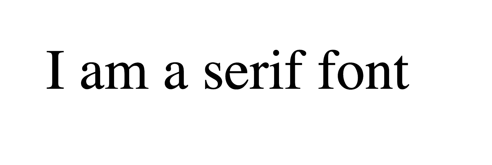
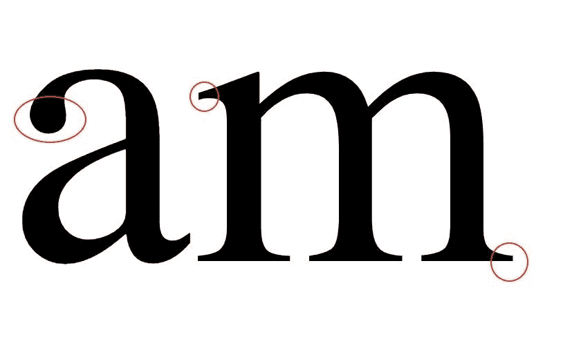
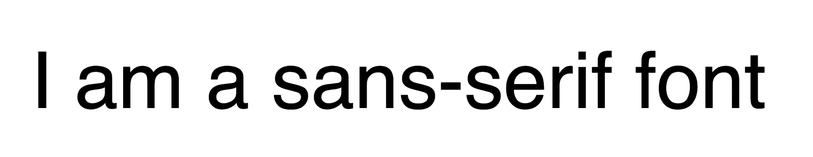
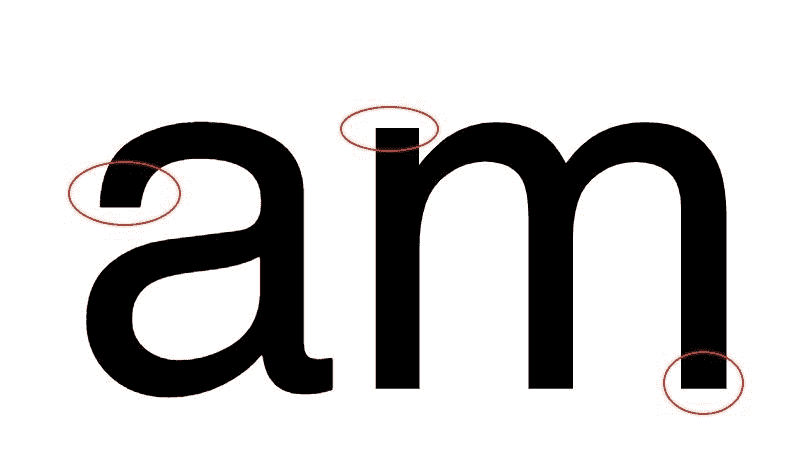
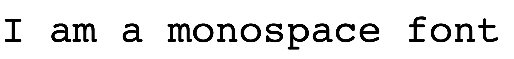
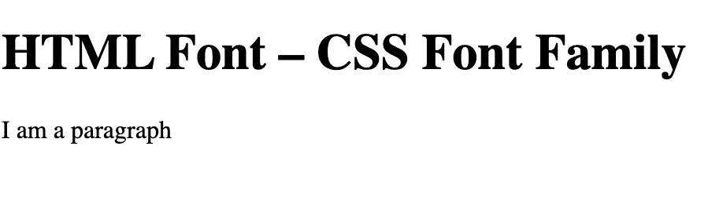

# HTML 字体–CSS 字体系列示例(衬线和无衬线字符)

> 原文：<https://www.freecodecamp.org/news/html-font-css-font-family-example-serif-and-sans-serif-characters/>

选择合适的字体是使你的网站可用和可访问的重要的第一步。

文本的格式会影响设计和网页的可读性。

你可以使用 CSS 以多种方式修改 HTML 文本的显示方式。你可以选择你想要使用的字体类型，是否加粗，字体有多大，你甚至可以改变颜色，添加不同的间距或装饰。

在本文中，我们将讨论两种最流行的字体类型 Serif 和 Sans Serif 之间的区别。

此外，我们将介绍语法以及如何使用`font-family`属性，以便在 CSS 的帮助下，您可以在 web 设计项目中选择并使用不同的字体。

我们开始吧！

## 字体术语

首先，让我们讨论一些现代浏览器支持的最常见和最常用的字体类型。

### 衬线字体类型

衬线字体的特点是字母末端有一些额外的细节。



在汉字主要笔画的末尾，有一些小的花体笔画，叫做*衬线*。



Serif 字体传统上在印刷中广泛使用，因为它们被认为对于冗长的文本段落是可读的。但是它们并不总是在屏幕上显示得很好。

衬线字体被认为是你可以使用的最经典、优雅和传统的字体之一。

### 无衬线字体类型

这种类型的字体创造了一个干净的设计外观，同时非常可读和清晰。



这种字体每个字母的两端都是直的，边缘没有笔画，使字符看起来又尖又平，线条清晰。



无衬线字体被认为是现代的、极简主义的、当代的，对于高分辨率的计算机屏幕来说更具可读性。

### 等宽字体类型

使用这种字体，每个字母都有相同的固定宽度，字母之间的间距相等。

在我们之前讨论过的字体类型中，每个字母都有不同的宽度。

所以，使用等宽字体，所有的字母都有相同的宽度。这使得文字排列整齐，易于理解，给设计一个干净的外观和机械感。



还有两种更通用的字体类型可用，`fantasy`和`cursive`，但是最广泛使用的字体是上面提到的那些。

## 如何为你的网站选择字体——字体名称

现在我们已经介绍了字体术语和描述的基础，是时候看看每个系列中许多不同的字体样式了。

下面列出了每个字体系列中的一些常见样式:

### Serif Fonts

*   格鲁吉亚
*   英国泰晤士报(1785 年创刊)
*   时代新罗马
*   博多尼
*   加拉蒙字体
*   帕拉蒂诺
*   ITC Clearface
*   植物蛋白
*   货运文本
*   狄多
*   美国打字机

### 无衬线字体

*   天线
*   韦尔达纳
*   Helvetica
*   日内瓦
*   前面有突出的护架
*   投石机 MS
*   开启无
*   解放桑斯
*   影响

### 单一空间字体

*   信使
*   Courier New 女士
*   摩纳哥
*   Lucinda 控制台
*   安达莱·莫诺
*   门洛
*   控制台(s)

## 如何使用`font-family`属性

在 CSS 中，`font-family`属性定义了一个元素的特定字体以及它的文本内容的外观和呈现方式。

`font-family`属性的语法是:

```
element {
font-family: value;
} 
```

我们编写属性`font-family`，后跟一个冒号`:`，一个空格，一个`value`，最后以分号`;`结束规范。

我们必须设置我们想要作为目标的属性，并分配我们想要的值。

## 如何设置 CSS 字体

假设我们有下面的 HTML:

```
<!DOCTYPE html>
<html lang="en">
<head>
    <meta charset="UTF-8">
    <meta http-equiv="X-UA-Compatible" content="IE=edge">
    <meta name="viewport" content="width=device-width, initial-scale=1.0">
    <link rel="stylesheet" href="style.css">
    <title>CSS Fonts</title>
</head>
<body>
    <h1>HTML Font – CSS Font Family </h1>
    <p>I am a paragraph</p>
</body>
</html> 
```

没有应用任何样式，也没有显式地为`font-family`属性设置一个值，浏览器以自己选择的字体显示标题和段落。

谷歌 Chrome 使用的默认标准字体是`Times New Roman`，一种衬线字体。

结果看起来像这样:



有几种方法可以设置不同的字样，并指定我们想要的字体。

当选择字体时——这是`value`部分——值得一提的是网站使用有限的字体。他们会抓取已经安装在用户电脑上的字体。

只有当用户的计算机上已经安装了某种字体时，浏览器才会显示这种字体。

所以让我们看看在 CSS 中设置字体的方法。

### 如何使用通用字体系列名称

在这种情况下，名称是关键字，包括前面提到的字体类别之一(serif、sans-serif、monospace)。

它看起来会像这样:

```
p {
 font-family: serif;
 } 
```

这将字体设置为普通衬线字体。

### 如何使用特定的字体系列名称

```
p {
 font-family: Times,serif;
 } 
```

该规则将`Times`设置为所需字体，然后将`serif`设置为通用后备选项，以防第一个选项没有安装在用户的计算机上。

如果名称包含任何空格，您需要用引号将其括起来。

```
p {
font-family: "Courier New",monospace;
} 
```

这将字体设置为`Courier New`，并添加`monospace`作为备份。

如果我们指定一个非通用名称的字体(比如 serif，sans-serif ),我们需要给浏览器一个后备。

### 如何使用字体堆栈

在这种情况下，`font-family`属性有多个值。

这是一个以逗号分隔的优先字体系列名称列表，可以应用于文本，表示所有字体都是可选的。这有助于最大限度地兼容浏览器和操作系统。

该列表按从左到右、从最高到最低的优先级排列。

```
p { 
  font-family: "Lucida Console", Courier, monospace;
} 
```

通过应用多个字体系列名称，您可以创建一个偏好顺序。我们首先从我们想要的字体开始。

如果用户的计算机上没有安装第一种字体，或者浏览器不支持第一种字体，浏览器会转而使用第二种字体。如果该字体也不可用，则移动到第三个字体，依此类推。

我们可以列出尽可能多的字体，但最好的做法是列出三到四种。

如果所有其他方法都失败了，总会有一种通用字体列在最后作为最后的选择-后备机制。

从列出的组中，浏览器必须支持*至少*一个选项，并且通用名称保证所需字体系列中的某些内容将被呈现。

```
p {
 font-family: Georgia, "Times New Roman", Times, serif; 
```

您列出的字体被称为*字体堆栈*。

浏览器会先寻找`Georgia`。如果已安装，浏览器将显示该字体。否则它会寻找`Times New Roman`。如果这也不可用，它将求助于显示通用默认的`serif`家族字体。

## 结论

在本文中，我们讨论了不同的字体系列，并给出了每个系列中不同风格的一些例子。

我们还讨论了`font-family`属性以及在 CSS 中设置字体的三种不同方式。

如果你想了解更多关于 HTML 和 CSS 以及所使用的不同现代技术，freeCodeCamp 有一个关于[响应式网页设计](https://www.freecodecamp.org/learn/responsive-web-design/)的免费认证。

你将从最基本的开始，通过 Flexbox，CSS Grid，以及如何使网站更具响应性。这些都是数字设计和前端网页开发必备的技能。

最后，您将构建 5 个项目，包括一个作品集网站，如果您愿意，您可以在这里展示您已经构建的其他项目。

感谢阅读，快乐学习。