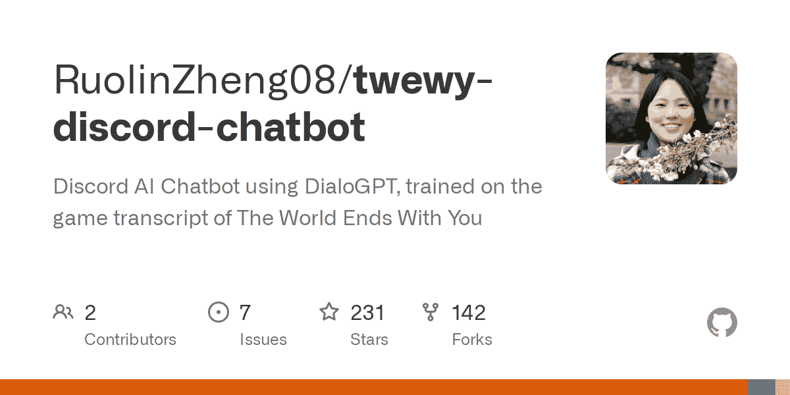
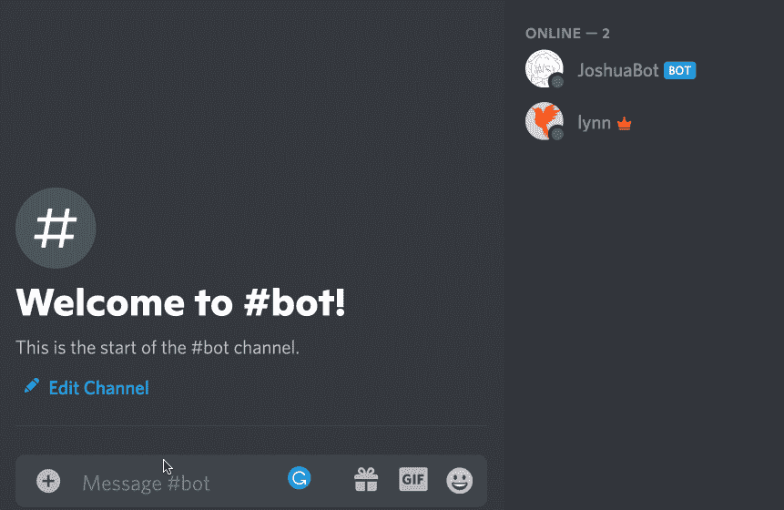
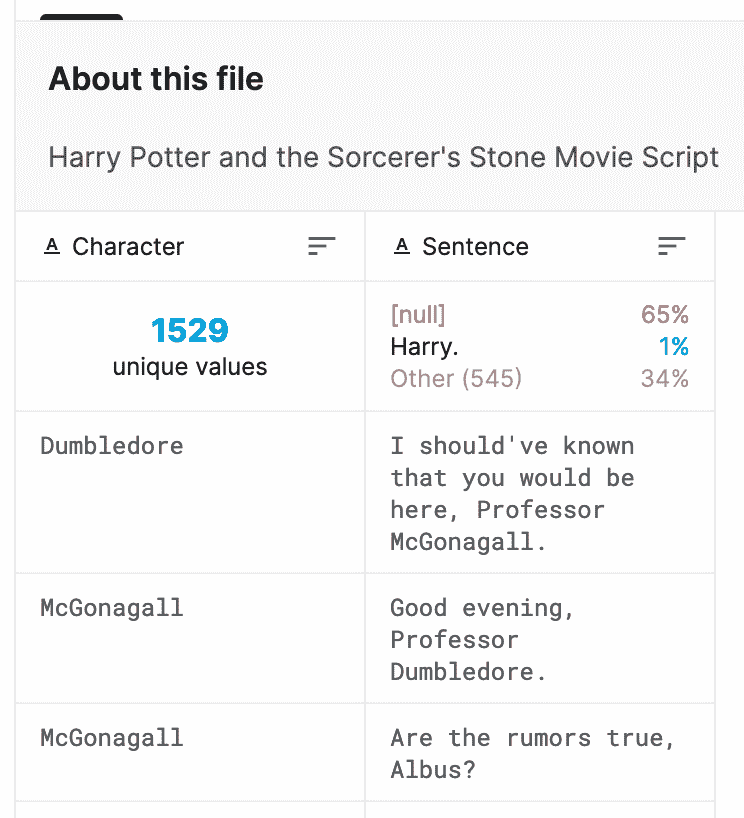
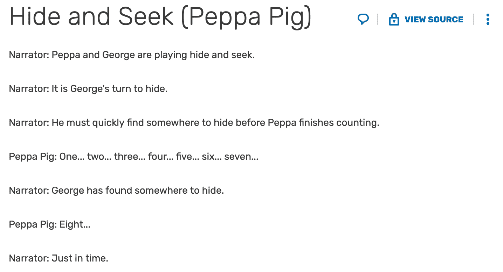
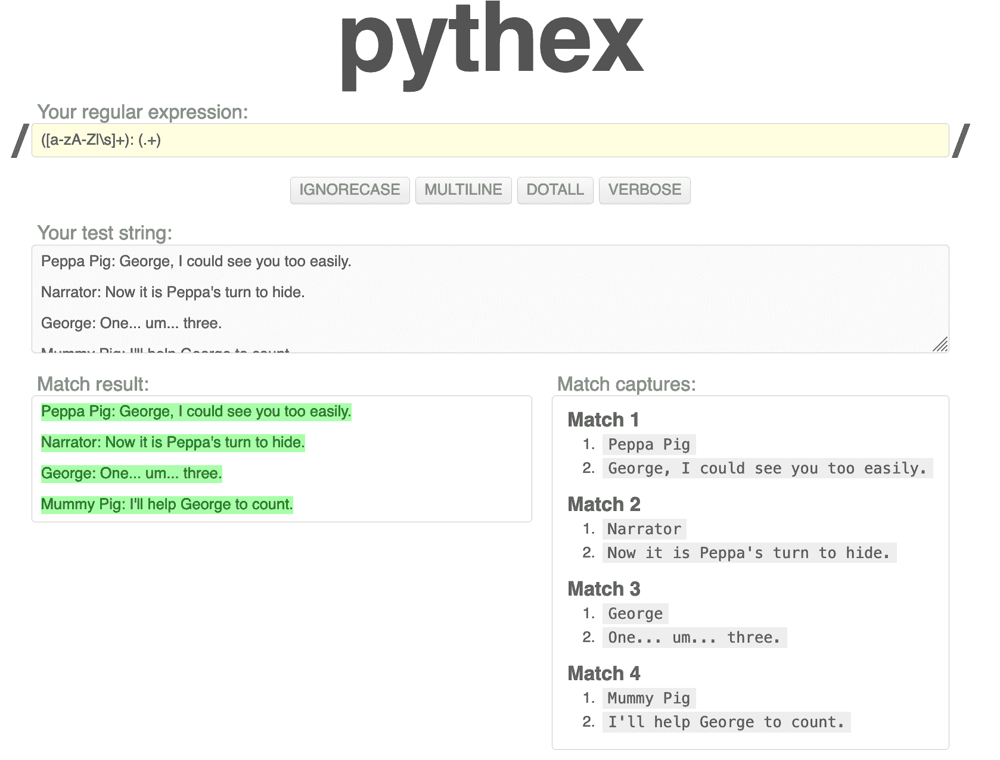
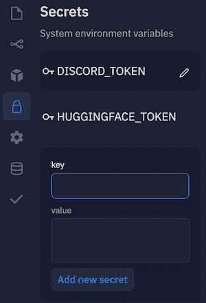
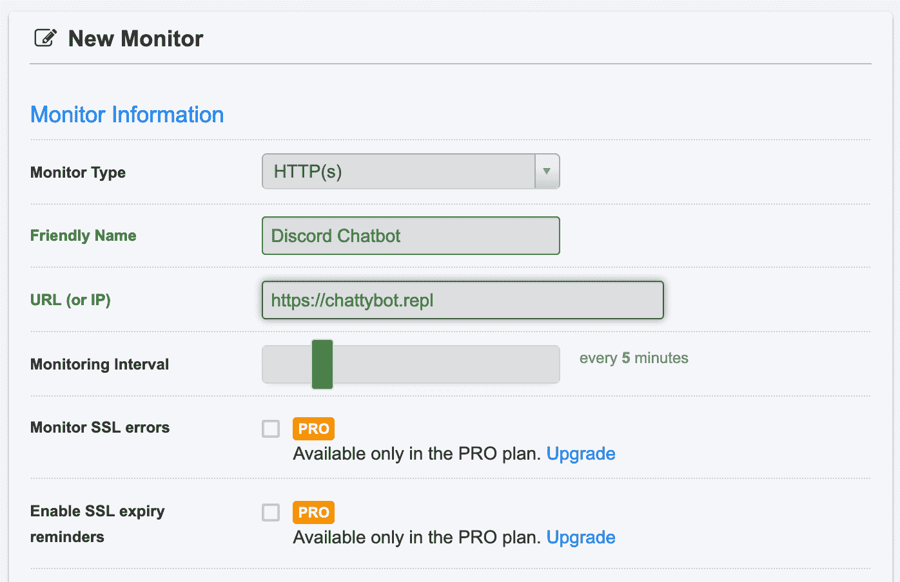
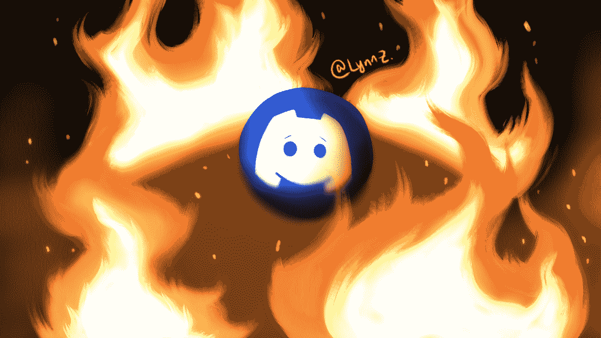

# 如何建立一个不和谐的人工智能聊天机器人，像你最喜欢的角色一样说话

> 原文：<https://www.freecodecamp.org/news/discord-ai-chatbot/>

你愿意和一个说话像你最喜欢的角色的聊天机器人说话吗，不管是虚构的还是非虚构的？我们来造一个吧！

如果你已经看过我之前关于这个主题的教程，请继续关注我，因为这个版本有很多更新。

您可以使用我的 GitHub 上的代码跟随本教程:

[GitHub - RuolinZheng08/twewy-discord-chatbot: Discord AI Chatbot using DialoGPT, trained on the game transcript of The World Ends With YouDiscord AI Chatbot using DialoGPT, trained on the game transcript of The World Ends With You - GitHub - RuolinZheng08/twewy-discord-chatbot: Discord AI Chatbot using DialoGPT, trained on the game t...RuolinZheng08GitHub](https://github.com/RuolinZheng08/twewy-discord-chatbot)

如果你愿意，你可以直接进入我在 YouTube 上的视频教程——或者继续阅读了解更多细节。😎

[https://www.youtube.com/embed/Rk8eM1p_xgM?feature=oembed](https://www.youtube.com/embed/Rk8eM1p_xgM?feature=oembed)

## 从本教程中可以期待什么

这是一个例子，不和谐的人工智能聊天机器人，我们将在本教程结束时建成。



Chat demo with my bot in Discord. I drew the bot's icon 😊

我的聊天机器人项目始于我们玩电子游戏时和一个朋友开的玩笑。

老实说，我对它变得如此受欢迎感到惊讶——我之前的教程有 5.9k 的浏览量，另外，当我将我的机器人部署到 1k+用户服务器时，人们在一小时内用 300 多条消息淹没了它，实际上使机器人崩溃了。😳你可以在这篇文章中读到更多关于我的部署回顾。

由于许多人对基于他们喜欢的角色构建自己的机器人感兴趣，我更新了我的教程，以包括如何收集任何角色(虚构或非虚构)的文本数据的深入解释。

你也可以创建一个自定义的数据集来捕捉你和你的朋友之间的对话，并建立一个像你一样说话的聊天机器人！

本教程中的其他更新解决了 Hugging Face 的模型托管服务中的变化，包括影响我们如何将模型推送到 Hugging Face 的模型库的 API 变化。

## 本教程的大纲

本教程的视频版本共运行一小时，包含以下主题:

1.  使用以下两种方法之一为您的角色收集文本数据:在 **Kaggle** 上找到预先制作的数据集，或者从原始副本中制作自定义数据集。
2.  在 **Google Colab、**一个基于云的 Jupyter 笔记本环境中训练模型，该环境具有免费的 GPU。
3.  将模型部署到**拥抱脸，**一个 AI 模型托管服务。
4.  用 **Python** 或 **JavaScript** 构建一个不和谐机器人，你自己选择！🤩
5.  设置不和谐机器人的权限，这样他们就不会垃圾邮件非机器人频道
6.  在 **Repl.it.** 上托管机器人
7.  使用 **Uptime Robot 保持机器人无限期运行。**

要了解更多关于如何构建 Discord 机器人的信息，你可能也会发现这两篇 freeCodeCamp 的帖子很有用——有一个 [Python 版本](https://www.freecodecamp.org/news/create-a-discord-bot-with-python/)和一个 [JavaScript 版本](https://www.freecodecamp.org/news/create-a-discord-bot-with-javascript-nodejs/)。

## 如何准备数据

为了让我们的聊天机器人学会对话，我们需要对话形式的文本数据。这基本上就是我们的聊天机器人如何应对不同的交流和环境。

### 你最喜欢的角色在 Kaggle 上吗？

Kaggle 上有很多关于流行卡通、电视节目和其他媒体的有趣数据集。例如:

*   瑞克和莫蒂
*   [哈利·波特](https://www.kaggle.com/gulsahdemiryurek/harry-potter-dataset?select=Harry+Potter+1.csv)
*   [生活大爆炸](https://www.kaggle.com/mitramir5/the-big-bang-theory-series-transcript)
*   [权力的游戏](https://www.kaggle.com/anderfj/game-of-thrones-series-scripts-breakdowns)

我们只需要这些数据集中的两列:**角色名**和**对话线**。



Example dataset: Harry Potter movie transcript

### 在 Kaggle 上找不到自己喜欢的角色？

在 Kaggle 上找不到自己喜欢的角色？别担心。我们可以从原始抄本中创建数据集。寻找成绩单的一个好地方是[成绩单维基](https://transcripts.fandom.com/wiki/Transcripts_Wiki)。例如，看看[这篇粉红猪小妹的文字记录。](https://transcripts.fandom.com/wiki/Peppa_Pig)



Example: Peppa Pig transcript

使用像`([a-zA-Z|\s]+): (.+)`这样的正则表达式，我们可以提取出感兴趣的两列，角色名，对话线。

自己在这个 Python regex 网站上试试吧！



## 如何训练模型

在引擎盖下，我们的模型将是一个**生成预训练的转换器(GPT)，**这些天最流行的语言模型。

我们将加载[微软预先训练的 GPT](https://huggingface.co/microsoft/DialoGPT-small) 、`DialoGPT-small`，并使用我们的数据集对其进行微调，而不是从头开始训练。

我的 GitHub repo 包含了[名为`model_train_upload_workflow.ipynb`的笔记本文件](https://github.com/RuolinZheng08/twewy-discord-chatbot/blob/main/model_train_upload_workflow.ipynb)来帮助你入门。所有你需要做的是:(请参考视频的详细演练)

1.  将文件上传到 [Google Colab](https://colab.research.google.com/)
2.  选择 **GPU** 作为运行时，会加快我们的模型训练。
3.  在代码片段中更改数据集和目标字符，如下所示:

```
data = pd.read_csv('MY-DATASET.csv')
CHARACTER_NAME = 'MY-CHARACTER'
```

浏览笔记本的培训部分应该不到半小时。我大概有 700 行，训练不到十分钟。该模型将存储在名为`output-small`的文件夹中。

想要一个更聪明、更雄辩的模型吗？随意训练一个更大的模型比如`DialoGPT-medium`甚至`DialoGPT-large`。这里的模型大小指的是模型中参数的数量。更多的参数将允许模型从数据集中提取更多的复杂性。

您也可以通过在笔记本中搜索`num_train_epochs`来增加训练次数。这是模型将在训练数据集中循环的次数。当模型更多地暴露于数据集时，它通常会变得更智能。

但是，一定要注意不要过度拟合模型:如果模型被训练了太多的历元，它可能会记住数据集，并在我们试图与它对话时背诵数据集中的句子。这并不理想，因为我们希望对话更加有机。

## 如何托管模型

我们将在 Hugging Face 上托管模型，它为我们查询模型提供了一个免费的 API。

注册[拥抱脸](https://huggingface.co/)，点击**新建模型，创建新的模型库。**进入**编辑档案> API 令牌获取您的 API 令牌。当我们建造不和机器人时，我们将需要这个令牌。**

按照我的视频中的这一部分来推动模型。另外，记得在它的型号卡上标记为**对话**(相当于它的`README.md`):

```
---
tags:
- conversational
---

# My Awesome Model 
```

如果你能在浏览器中与模型聊天，你会知道一切都很好。


## 如何构建不和谐机器人

转到 [Discord 开发者页面](https://discord.com/developers/applications)，创建一个应用程序，并向其中添加一个机器人。因为我们的聊天机器人只会回复用户信息，在机器人权限设置中检查**文本权限>发送信息**就足够了。复制 bot 的 API 令牌供以后使用。

注册 [Repl.it](https://repl.it/) 并创建一个新的 Repl、 **Python** 或 **Node.js** for JavaScript，无论你在用哪个。

让我们将**拥抱脸**和**不和谐**的 API 令牌存储为环境变量，分别命名为`HUGGINGFACE_TOKEN`和`DISCORD_TOKEN`。这有助于保密。



为 Python 机器人复制[我的 Python 脚本](https://github.com/RuolinZheng08/twewy-discord-chatbot/blob/main/discord_bot.py)，为 JS 机器人复制[我的 JS 脚本](https://github.com/RuolinZheng08/twewy-discord-chatbot/blob/main/discord_bot.js)。注意，对于 JS bot，由于与 Repl.it 的节点和 NPM 版本不兼容，我们需要在`package.json`中明确指定一个较低版本的 Discord API。

```
"dependencies": {
    "discord.js": "^12.5.3",
}
```

就这样，我们的机器人准备好了！通过点击 **Run** 启动 Repl 脚本，将机器人添加到服务器，在频道中键入一些内容，并享受机器人的机智响应。


## 如何保持机器人在线

我们的 bot 的一个问题是，一旦我们**停止**正在运行的 Repl(相当于，如果我们关闭 Repl.it 浏览器窗口)，它就会停止。

为了解决这个问题并保持我们的机器人无限期运行，我们将建立一个 web 服务器来包含机器人脚本，并使用类似于 [Uptime Robot](https://uptimerobot.com/) 的服务每五分钟锁定我们的服务器，以便我们的服务器保持活动状态。



在我的视频教程中，我复制了这两篇 freeCodeCamp 帖子的服务器代码( [Python 版本](https://www.freecodecamp.org/news/create-a-discord-bot-with-python/)、 [JavaScript 版本](https://www.freecodecamp.org/news/create-a-discord-bot-with-javascript-nodejs/))。然后，我在 Uptime Robot 上设置了监视器。现在，即使我关闭浏览器(或者一起关闭电脑)，我的机器人也会继续回复我的信息。

祝贺您到达本教程的结尾！我希望你喜欢创建机器人，并与你最喜欢的角色聊天愉快！🥳

## 教程视频链接

[https://www.youtube.com/embed/Rk8eM1p_xgM?feature=oembed](https://www.youtube.com/embed/Rk8eM1p_xgM?feature=oembed)

## 更多关于我和我的聊天机器人项目

我是 Lynn，Salesforce 的软件工程师。我于 2021 年从芝加哥大学毕业，获得了计算机科学的联合学士/硕士学位，专业是机器学习。来我的个人网站打个招呼吧！

我在我的 YouTube 频道上发布了这样有趣的项目教程。随时订阅我的最新内容。😃

[Lynn’s DevLabHi, I’m Lynn. I’m a Software Engineer and hobbyist Game Developer. I completed my joint BS/MS degree in Computer Science in four years at the University of Chicago, graduating in 2021.Here at my channel, you can expect to enjoy monthly updates of fun technical project tutorials, my game dev demos, …YouTube](https://www.youtube.com/channel/UCZ2MeG5jTIqgzEMiByrIzsw)

想了解更多关于我的机器人？看看这个 15 分钟的实时聊天演示，其中有我、我的朋友和我的机器人！

[https://www.youtube.com/embed/-n6uWu8PZzo?feature=oembed](https://www.youtube.com/embed/-n6uWu8PZzo?feature=oembed)

对我训练的模型感兴趣？看看拥抱脸:

[](https://huggingface.co/r3dhummingbird/DialoGPT-medium-joshua)[r3dhummingbird/DialoGPT-medium-joshua · Hugging FaceWe’re on a journey to advance and democratize artificial intelligence through open source and open science.](https://huggingface.co/r3dhummingbird/DialoGPT-medium-joshua)

我的聊天机器人在 1k+用户服务器上非常受欢迎...它坠毁了。🤯在这篇文章中阅读我的部署分析:

[How to Recover from Deployment Hell – What I Learned After My Discord Bot Crashed on a 1,000+ User ServerI built a Discord AI Chatbot in my last blog post [/news/discord-ai-chatbot/] and then, to challenge myself, proceeded to stress-test it on a Discord serverwith 1,000+ users. In the first hour, Deployment Hell struck and I had to take the bot down formaintenance. Another hour passed and I manag…Lynn ZhengfreeCodeCamp.org](https://www.freecodecamp.org/news/recovering-from-deployment-hell-what-i-learned-from-deploying-my-discord-bot-to-a-1000-user-server/)

感谢阅读！