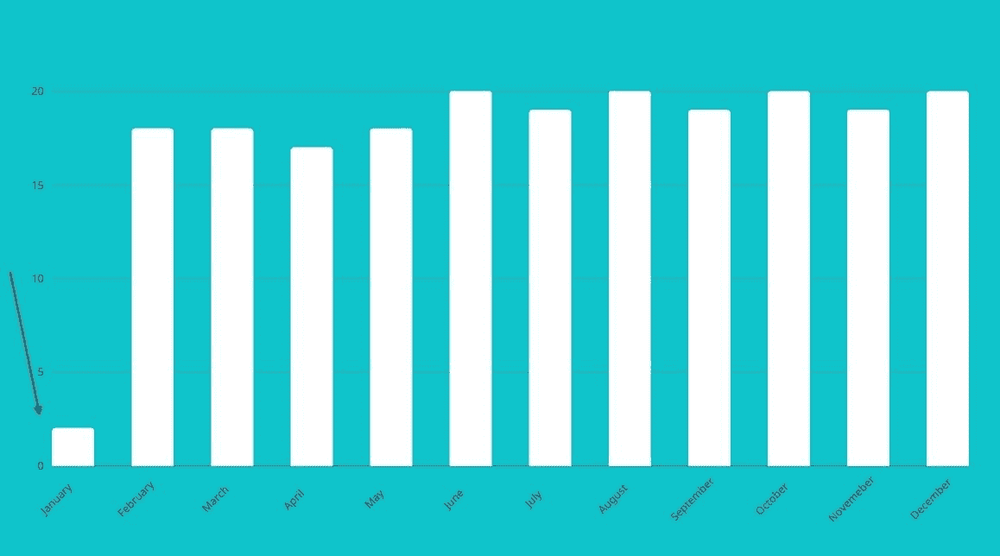

# 什么是离群值？定义和如何发现统计中的异常值

> 原文：<https://www.freecodecamp.org/news/what-is-an-outlier-definition-and-how-to-find-outliers-in-statistics/>

离群值是数据集的重要组成部分。它们可以保存关于您的数据的有用信息。

异常值可以为您正在研究的数据提供有用的见解，并且会对统计结果产生影响。这可能有助于您发现不一致性，并检测统计过程中的任何错误。

因此，知道如何发现数据集中的异常值将有助于您更好地理解您的数据。

有几种不同的方法可以发现统计数据中的异常值。

本文将解释如何通过计算四分位间距来检测数值异常值。

我给出了一个非常简单的数据集的例子，以及如何计算四分位间距，所以如果你愿意，你可以跟着做。

我们开始吧！

## 什么是统计学中的异常值？一个定义

简而言之，异常值是相对于最近的数据点和您正在处理的数据图或数据集中的其余相邻共存值而言的极高或极低的数据点。

异常值是从数据集或图表中的整体值模式中脱颖而出的极端值。

在图的最左边，有一个异常值。

一月份的值明显小于其他月份的值。



## 如何识别数据集中的异常值

好吧，你如何去寻找离群值呢？

异常值必须满足以下两个条件之一:

```
outlier < Q1 - 1.5(IQR) 
```

```
outlier > Q3 + 1.5(IQR) 
```

低异常值的规则是数据集中的数据点必须小于`Q1 - 1.5xIQR`。

这意味着一个数据点需要比第一个四分位数低 1.5 倍以上的四分位数间距*才能被视为低异常值。*

高异常值的规则是，如果数据集中的任何数据点大于`Q3 - 1.5xIQR`，它就是高异常值。

更具体地说，数据点需要落在第三个四分位数之上的四分位数间距*的 1.5 倍以上，才能被视为高异常值。*

如您所见，在数据集中您需要首先计算某些单独的值，比如`IQR`。但是要找到`IQR`，你需要找到所谓的第一和第三个四分位数，分别是`Q1`和`Q3`。

那么，让我们看看它们各自的作用，并分解如何在奇数和偶数数据集中找到它们的值。

## 如何找到奇数数据集中的上下四分位数

首先，假设您有这样一个数据集:

```
25,14,6,5,5,30,11,11,13,4,2 
```

第一步是**按照数字升序排序数值**，从最小到最大。

```
2,4,5,5,6,11,11,13,14,25,30 
```

最低值(**最小值**为`2`，最高值(**最大值**)为`30`。

### 如何计算奇数数据集中的`Q2`

下一步是找到**中位数**或*四分位数 2 (Q2)* 。

这组特定的数据有奇数个值，总共有`11`个分数。

寻找数据集中的中间值意味着寻找中间值——数据集中唯一的中间数。

在奇数数据集中，只有一个中间数。

因为总共有`11`个值，一个简单的方法是将集合分成两个相等的部分，每一边包含`5`个值。

中间值将在一侧有`5`值，在另一侧有`5`值。

`(2,4,5,5,6)`、**、`11`、**、`(11,13,14,25,30)`

中位数是`11`,因为它是区分前半部分和后半部分的数字。

检查你是否正确的另一种方法是这样做:

`(total_number_of_scores + 1) / 2`。

这是`(11 + 1) /2 = 6`，意味着你想要这组数据的`6th`位的数字——也就是`11`。

所以`Q2 = 11`。

### 如何计算奇数数据集中的`Q1`

接下来，为了找到下四分位数*，`Q1`，我们需要找到数据集前半部分的中间值，它在左手边。*

 *提醒一下，初始数据集是:

`(2,4,5,5,6)`、**、`11`、**、`(11,13,14,25,30)`

数据集的前半部分，即*下半部分*，不包括中值:

```
2,4,5,5,6 
```

这一次，又出现了一组奇怪的分数——特别是有`5`个值。

你想再把这一半分成另一半，每一边有两个相同数量的值。您将获得一个唯一的数字，它将是位于`5`值中间的数字。

选择最突出的中间值:

`(2,4)`、**、`5`、**、`(5,6)`

这种情况下是`Q1 = 5`。

为了仔细检查，你也可以做`total_number_of_values + 1 / 2`，类似于前面的例子:

`(5 + 1) /2 = 3`。

这意味着你想要第三位的数字，也就是`5`。

### 如何计算奇数数据集中的`Q3`

为了找到*上四分位数*，Q3，过程与上面的`Q1`相同。但在这种情况下，您取数据集右侧的后一半，高于中位数，但不包括中位数本身:

`(2,4,5,5,6)`、**、`11`、**、`(11,13,14,25,30)`

```
11,13,14,25,30 
```

你把奇数组的这一半分成另一半，找到中间值，然后得到`Q3`的值。

你又想把号码放在第三位，就像你在上半场做的那样。

`(11,13)`、**、`14`、**、`(25,30)`

所以`Q3 = 14`。

### 如何计算奇数数据集中的`IQR`

现在，下一步是计算代表四分位间距的 IQR。

这是上面计算的下四分位数(Q1)和上四分位数(Q3)之间的差异/距离。

提醒一下，这样做的公式如下:

```
IQR = Q3 - Q1 
```

要从上面查找数据集的 IQR:

```
IQR= 14 - 5
IQR = 9 
```

### 如何在奇数数据集中发现异常值

概括一下目前为止的情况，数据集如下:

```
2,4,5,5,6,11,11,13,14,25,30 
```

到目前为止，你已经计算出了五个数字的摘要:

```
MIN = 2
Q1 = 5
MED = 11
Q3 = 14
MAX = 30 
```

最后，让我们看看数据集中是否有异常值。

提醒一下，异常值必须符合以下标准:

```
outlier < Q1 - 1.5(IQR) 
```

或者

```
outlier > Q3 + 1.5(IQR) 
```

要查看是否存在最低值异常值，您需要计算第一部分，并查看集合中是否有满足条件的数字。

```
Outlier < Q1 - 1.5(IQR)
Outlier < 5 - 1.5(9)
Outlier < 5 - 13.5 
outlier < - 8.5 
```

没有更低的异常值，因为数据集中没有小于`-8.5`的数字。

接下来，查看是否有更高的异常值:

```
Outlier > Q3  + 1.5(IQR)=
Outlier > 14 + 1.5(9)
Outlier > 14 + 13.5
Outlier > 27,5 
```

并且数据集中有一个数大于`27,5`:

`2,4,5,5,6,11,11,13,14,25,`**`30`**

在这种情况下，`30`是现有数据集中的异常值。

## 如何找到偶数数据集中的上下四分位数

当数据集由一组偶数数据组成时，会发生什么情况？

不仅有一个突出的中位数(Q2)，也没有突出的上四分位数(Q1)或突出的下四分位数(第三季度)。

所以计算四分位数，然后找到一个异常值的过程有点不同。

### 如何在偶数数据集中计算`Q2`

假设您有一个包含`8`个数字的数据集:

`10,15,20,26,28,30,35,40`

这一次，数字已经从最低值到最高值排序。

要找到偶数数据集中的**中位数**数，您需要找到位于中间的两个数*之间的值。你把它们加在一起，然后除以`2`，就像这样:*

`10,15,20`、**、`26,28`、**、`30,35,40`

```
26 + 28 = 54
54 / 2 = 27 
```

### 如何在偶数数据集中计算`Q1`

要计算偶数数据集中的上四分位数和下四分位数，您需要保留数据集中的所有数字(与奇数数据集中的数字相反，您需要删除中间值)。

这一次，数据集被切成两半。

`10,15,20,26 | 28,30,35,40`

为了找到`Q1`，你将数据集的前半部分分成另一半，剩下一个偶数集:

`10,15 | 20,26`

要找到这一半的中间值，取中间的两个数字，然后除以 2:

```
Q1 = (15 + 20)/2
Q1 =  35 / 2
Q1 = 17,5 
```

### 如何在偶数数据集中计算`Q3`

要找到`Q3`，您需要关注数据集的后一半，并将这一半分成另一半:

`28,30,35,40`->-`28,30 | 35,40`

中间的两个数字是`30`和`35`。

你把它们相加，然后除以 2，结果是:

```
Q3 = (30 + 35)/2
Q3 =  65 / 2
Q3 = 32,5 
```

### 如何计算偶数数据集中的`IQR`

计算 IQR 的公式与我们用于计算奇数数据集的公式完全相同。

```
IQR = Q3 - Q1
IQR = 32,5 - 17,5
IQR = 15 
```

### 如何在偶数数据集中发现异常值

概括一下，迄今为止的五个数字总结如下:

```
MIN = 10
Q1 = 17,5
MED = 27
Q3 = 32,5
MAX = 40 
```

要计算数据集中的任何异常值:

```
outlier < Q1 - 1.5(IQR) 
```

或者

```
outlier > Q3 + 1.5(IQR) 
```

为了找到任何较低的异常值，您计算`Q1 - 1.5(IQR)`并查看是否有任何值小于结果。

```
outlier < 17,5 - 1.5(15)=
outlier < 17,5 - 22,5
outlier < -5 
```

数据集中没有任何小于`-5`的值。

最后，为了找到任何更高的异常值，您计算 `Q3 - 1.5(IQR)`并查看数据集中是否有任何值高于结果

```
outlier > 32.5 + 1.5(15)=
outlier > 32.5 + 22.5
outlier > 55 
```

没有任何高于`55`的值，因此该数据集没有任何异常值。

## 结论

在本文中，您学习了如何找到数据集中的四分位范围，并以此方式计算任何异常值。

如果你有兴趣了解更多关于统计学和数据科学的基础知识，请在 freeCodeCamp 的 YouTube 频道上查看这个免费的 8 小时大学课程。

感谢您的阅读和快乐学习。*