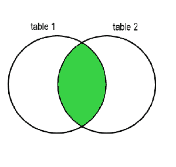
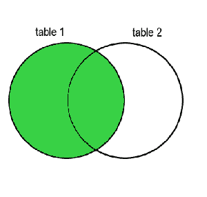
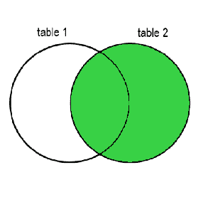
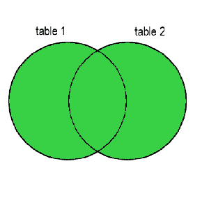

# SQL 联接类型–内部联接与外部联接示例

> 原文：<https://www.freecodecamp.org/news/sql-join-types-inner-join-vs-outer-join-example/>

在关系数据库中，所有信息应该只出现一次。但是您可能会将信息分散到不同的表中，而这些表又相互关联。

你可能想把这些相关的信息放在一起分析它的数据——也就是说，你可能想把所有的数据(或部分数据)结合在一起。在这种情况下，您需要使用 SQL 的`JOIN`语句。让我们了解一下它是如何工作的。

## 什么是 SQL 中的连接？

JOIN 操作符允许您以各种方式组合相关信息，正如我在上面简要解释的那样。联接有多种类型，分为两大类:内部联接和外部联接。

内部连接和外部连接的最大区别在于，内部连接将只保留两个表中彼此相关的信息(在结果表中)。另一方面，外部连接也会在结果表中保留与另一个表无关的信息。

让我们详细看看内部连接和外部连接是如何工作的，以便更好地理解它们。

## 如何在 SQL 中使用内部连接

内部连接将只保留两个连接表中相关的信息。如果您将这两个表想象成一个[维恩图](https://en.wikipedia.org/wiki/Venn_diagram)，那么由内部连接产生的表将是它们重叠处下面的绿色突出显示部分:



Venn diagram representation for Inner Join

下面是内部联接的语法:

```
SELECT * FROM table1
    JOIN table2
    ON relation;
```

INNER JOIN syntax

下面我们将通过一个例子来看看这是如何工作的。

## 如何在 SQL 中使用外部连接

如果希望保留所有数据，而不仅仅是彼此相关的数据，可以使用外部联接。

有三种类型的外部连接:`LEFT JOIN`、`RIGHT JOIN`和`FULL JOIN`。它们之间的区别在于它们保留了哪些不相关的数据——可以来自第一个表，第二个表，或者两者都有。没有数据要填充的单元格将具有值`NULL`。

注意:`LEFT JOIN`是 SQL 所有版本中最普遍实现的。但是对于`RIGHT JOIN`和`FULL JOIN`来说就不是这样了，在各种 SQL 版本中都没有实现。

让我们看看每一个是如何单独工作的。然后我们将通过下面的例子来看看它们是如何工作的。

### SQL 中的左外部联接

左外连接，或简称为左连接，将保留左(第一个)表中不相关的数据。

你可以用一个有两个圆的维恩图来想象它，得到的表格是绿色突出显示的部分，包括公共/重叠部分，以及左圆的其余部分。



Venn diagram representation for Left Outer Join

语法如下所示。您将看到它类似于内部连接语法，但是添加了关键字`LEFT`。

```
SELECT columns
  FROM table1
  LEFT JOIN table2
  ON relation;
```

LEFT OUTER JOIN

### SQL 中的右外连接

右外连接，或简称为右连接，将保留第二个表中与第一个表不相关的数据。

你可以用一个有两个圆的维恩图来想象它，得到的表格是绿色突出显示的部分，包括重叠部分和右圆的其余部分。



Venn diagram representation for Right Outer Join

语法如下，唯一的区别是`RIGHT`关键字。

```
SELECT columns
  FROM table1
  RIGHT JOIN table2
  ON relation;
```

RIGHT OUTER JOIN

### SQL 中的完全外部连接

您可以将完整的外部连接视为左连接和右连接的组合。它将保留两个表中的所有行，缺失的数据将用`NULL`填充。

你可以用一个有两个圆的维恩图来想象它，得到的表格是绿色突出显示的部分，其中包括所有内容:重叠部分、左圆和右圆。



Venn diagram representation for Full Outer Join

语法如下，使用了`FULL`关键字。

```
SELECT columns
  FROM table1
  FULL JOIN table2
  ON relation;
```

FULL OUTER JOIN

## SQL 连接运算符的示例

兽医诊所的数据库可能有一个宠物表和一个主人表。因为一个主人可能有多只宠物，所以 pets 表将有一个指向 owners 表的`owner_id`列。

| 身份证明（identification） | 名字 | 年龄 | 所有者 id |
| --- | --- | --- | --- |
| one | 宠物狗 | seven | one |
| Two | 米茜 | three | one |
| three | 娘娘腔 | Ten | Two |
| four | 铜 | one | three |
| five | 箱 | Two | Zero |

| 身份证明（identification） | 名字 | 电话号码 |
| --- | --- | --- |
| one | 男人 | Four million five hundred and sixty-seven thousand eight hundred and twenty-three |
| Two | 奥利 | Seven million four hundred and eighty-six thousand five hundred and thirteen |
| three | 冬青属植物 | Three million four hundred and eighty-one thousand three hundred and sixty-five |
| four | 路易丝 | One million six hundred and eighty-five thousand three hundred and sixty-four |

您可以使用简单的查询获得一个宠物名和主人名相邻的表。让我们用所有不同的连接操作符来做这件事。

### SQL 内部联接示例

先用`JOIN`来做吧。

在这种情况下，您将从`pets`表中`SELECT`列`name`(并将其重命名为`pet_name`)。然后从`owners`表中选择`name`列，并将其重命名为`owner`。那会是这样的:`SELECT pets.name AS pet_name, owners.name AS owner`。

您可以使用`FROM`来说明这些列来自于`pets`表，而使用`JOIN`来说明您想要将这些列与`owners`表连接起来，语法如下:`FROM pets JOIN owner`。

最后，当`pets`表中的`owner_id`列等于带有`ON pets.owner_id = owners.id`的`owner`表中的`id`列时，您会说您想要将两行连接在一起。

这是所有的一切:

```
SELECT pets.name AS pet_name, owners.name AS owner
  FROM pets
  JOIN owners
  ON pets.owner_id = owners.id;
```

您将得到一个如下的表格，其中只包括与主人有联系的宠物和与宠物有联系的主人。

| 宠物名 | 物主 |
| --- | --- |
| 宠物狗 | 男人 |
| 米茜 | 男人 |
| 娘娘腔 | 奥利 |
| 铜 | 冬青属植物 |

### SQL 左连接示例

让我们使用`LEFT JOIN`进行同样的查询，这样您就可以看到不同之处。除了添加关键字`LEFT`之外，查询是相同的。

```
SELECT pets.name AS pet_name, owners.name AS owner
  FROM pets
  LEFT JOIN owners
  ON pets.owner_id = owners.id;
```

在这种情况下，来自左边表格`pets`的行都被保留，当来自`owners`表格的数据丢失时，用`NULL`填充。

| 宠物名 | 物主 |
| --- | --- |
| 宠物狗 | 男人 |
| 米茜 | 男人 |
| 娘娘腔 | 奥利 |
| 铜 | 冬青属植物 |
| 箱 | 空 |

好像有一只宠物没有登记主人。

### SQL 右连接示例

如果你使用`RIGHT JOIN`做同样的查询，你会得到不同的结果。

```
SELECT pets.name AS pet_name, owners.name AS owner
  FROM pets
  RIGHT JOIN owners
  ON pets.owner_id = owners.id;
```

在这种情况下，保留右表中的所有行`owners`，如果有缺失值，则用`NULL`填充。

| 宠物名 | 物主 |
| --- | --- |
| 宠物狗 | 男人 |
| 米茜 | 男人 |
| 娘娘腔 | 奥利 |
| 铜 | 冬青属植物 |
| 空 | 路易丝 |

似乎有一个主人没有登记宠物。

### SQL 完全连接示例

您可以使用`FULL JOIN`再次执行相同的查询。

```
SELECT pets.name AS pet_name, owners.name AS owner
  FROM pets
  FULL JOIN owners
  ON pets.owner_id = owners.id;
```

得到的表也是不同的——在这种情况下，两个表中的所有行都被保留。

| 宠物名 | 物主 |
| --- | --- |
| 宠物狗 | 男人 |
| 米茜 | 男人 |
| 娘娘腔 | 奥利 |
| 铜 | 冬青属植物 |
| 箱 | 空 |
| 空 | 路易丝 |

好像我们的数据库里有一只没有主人的宠物，也有一只没有宠物的主人。

# 结论

在关系数据库中，所有数据应该只写一次。为了分析这些数据，你需要把相关的数据连接在一起。

在本文中，您已经学习了如何使用连接操作符来实现这一点。希望对你有用，玩得开心！