# freeCodeCamp 致敬页面项目–入门提示

> 原文：<https://www.freecodecamp.org/news/how-to-get-started-with-the-fcc-tribute-page/>

在这篇文章中，我将讨论如何开始你的第一个 freeCodeCamp 项目，并提供一些技巧。

以下是我们将要介绍的内容:

*   [理解指令](#understanding-the-instructions)
*   什么是 CodePen，我如何使用它？
*   我必须使用 CodePen 还是可以使用不同的代码编辑器？
*   [什么是测试套件？](#what-is-the-test-suite)
*   [解决用户故事](#tackling-the-user-stories)
*   [页面样式](#tips-for-styling-your-page)
*   [如何提交您的项目](#how-to-submit-your-project)

## 理解说明

### 我应该复制样品吗？

目标指出:

构建一个 [CodePen.io](https://codepen.io/) app，功能类似于这个:【https://codepen.io/freeCodeCamp/full/zNqgVx】T2。

词语“功能相似”仅仅意味着你需要创建一个通过测试的项目。目标不是复制或重新创建样本。

我们鼓励您创建自己的内容和风格。你应该选择你自己的题材和图像。

### 我需要使用 JavaScript 吗？自举？萨斯？

答案是否定的，唯一的要求就是使用 HTML 和 CSS。

如果您以前使用过 JavaScript、Bootstrap、Sass 等等，那么您可以选择使用它。但是你不需要。

## 什么是 CodePen，我如何使用它？

对于这些项目，您可以选择使用名为 [CodePen](https://codepen.io/) 的在线代码编辑器。

### 如何创建一个免费的 CodePen 帐户

您可以使用下面的选项创建一个帐户。

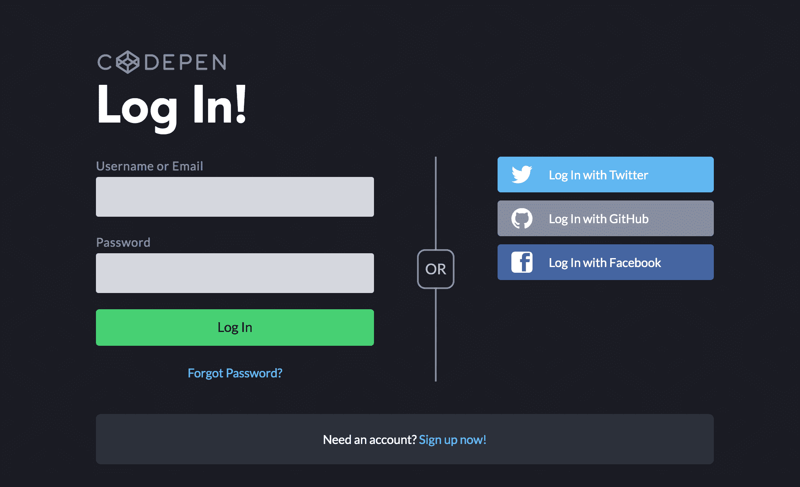

创建帐户后，您应该会收到一封电子邮件，要求您使用 CodePen 验证您的电子邮件地址。

### 钢笔和项目有什么区别？

笔是一个编辑器，只有三个部分，分别用于 HTML、CSS 和 JavaScript。这是您将用于 freeCodeCamp 项目的内容。


您可以直接在这些编辑器中编写代码，并在预览窗口中看到您的结果。

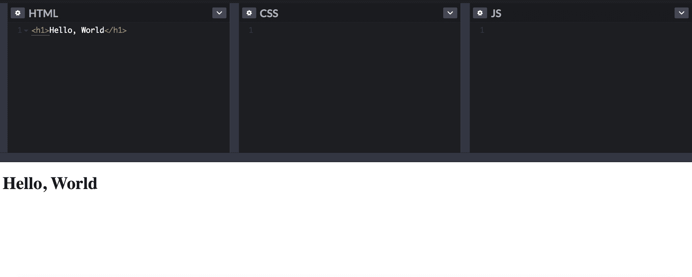

一个项目支持多个 HTML、CSS 和 JavaScript 文件。在免费版本中，你可以创建一个项目和任意多的笔。

### CodePen 的有用特性

一个有用的特性是能够改变编辑器布局的视图。

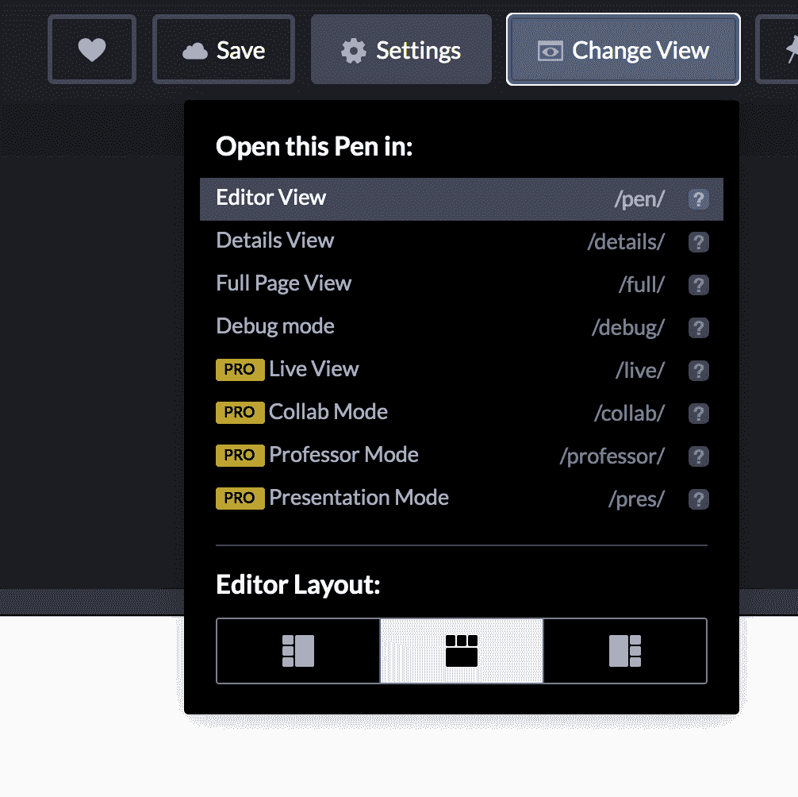

CodePen 还提供了格式化代码的选项。拥有格式正确的代码非常重要，这样其他开发人员就可以轻松阅读。

这是在格式化之前:


这是在格式化之后:

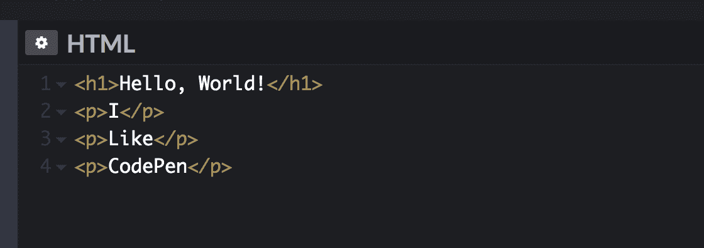

另一个很酷的功能是分析工具。它将帮助您在构建项目时发现代码中的错误。

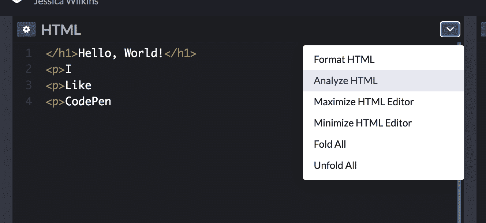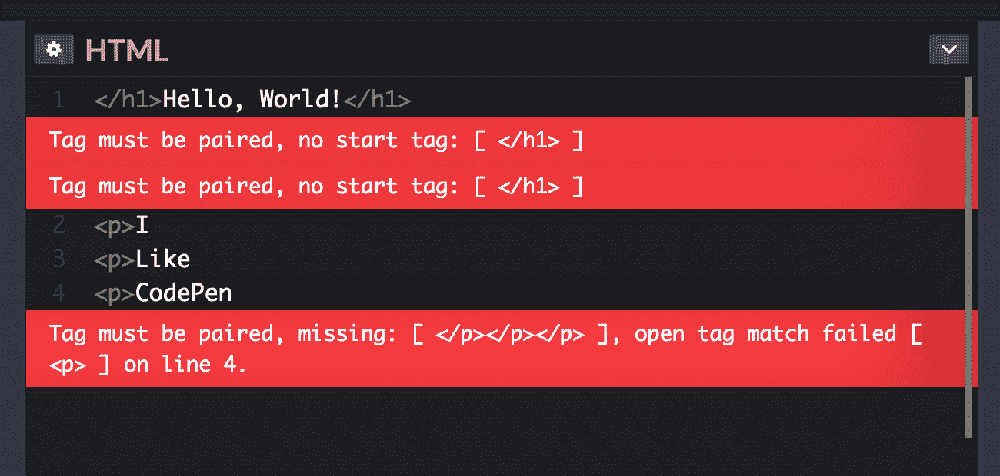

使用 CodePen，您不需要包含`<!DOCTYPE html>`、`<html>`、`<head>`或`<body>`标签，因为它们已经内置在编辑器中。

如果您需要包含 head 部分的链接，您可以在笔编辑器的 HTML 设置中添加。

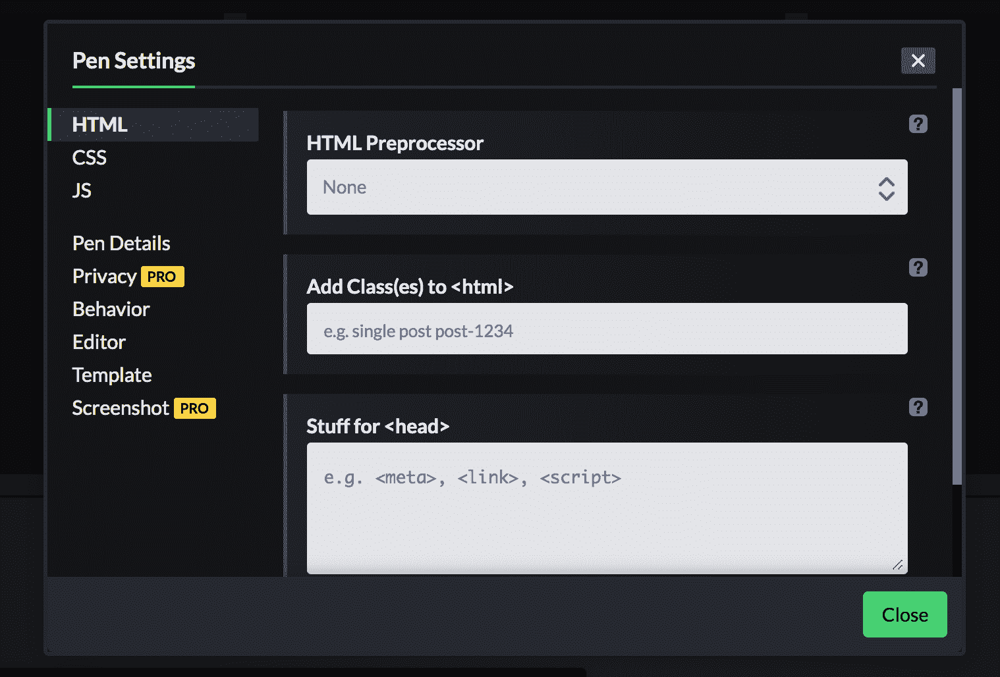

## 我必须使用 CodePen 还是可以使用不同的代码编辑器？

您不必使用 CodePen 来构建您的项目。如果你觉得使用另一个代码编辑器更舒服，你可以随意使用它。

## 什么是测试套件？

为了让 freeCodeCamp 确保您通过所有必需的用户案例，他们已经创建了一个测试套件。

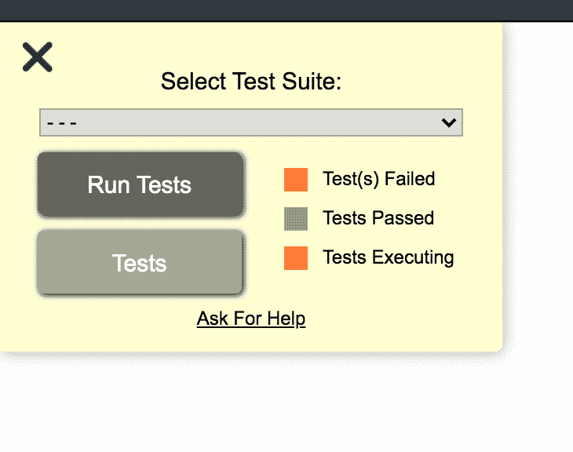

在下拉菜单中，您可以选择您正在处理的项目，然后单击 Run Tests。然后它会显示通过了多少测试。

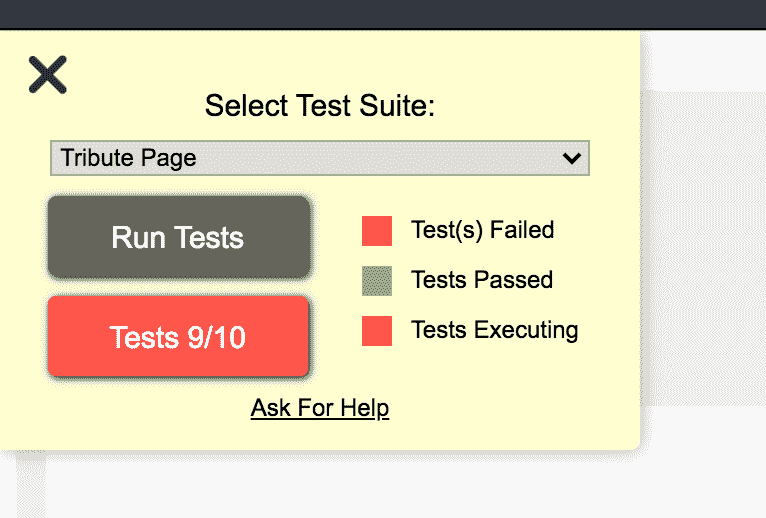

如果你点击红色的测试按钮，它会显示完整的错误信息。请务必阅读完整的错误消息，因为它提供了有关如何解决问题的有用信息。

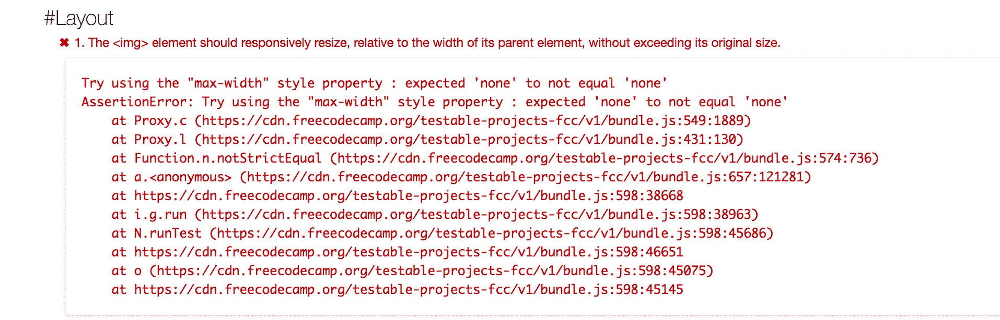

### 如何在 CodePen 中添加测试套件

1.  登录您的帐户
2.  转到这个网址[https://codepen.io/pen?template=MJjpwO](https://codepen.io/pen?template=MJjpwO)
3.  单击保存

你应该看到这个结果，并且 URL 应该包含你的用户名。

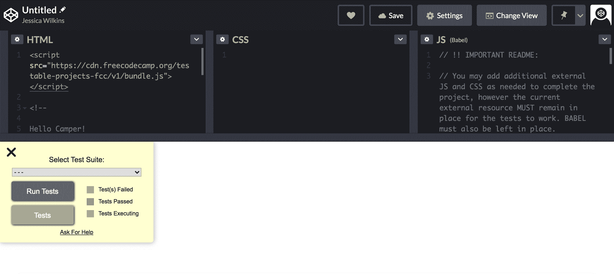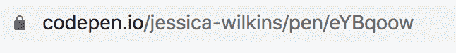

确保页面顶部的 URL 地址包含您的用户名是很重要的。如果您试图提交一个项目与模板相同的网址，那么它将不会被接受。

### 如何在您选择的代码编辑器中添加测试套件

如果您使用另一个编辑器(如 Visual Studio Code)构建项目，那么您将需要使用 CDN 链接。

CDN 代表内容交付网络。您将把这个 CDN 链接`https://cdn.freecodecamp.org/testable-projects-fcc/v1/bundle.js`放在一个脚本标签中，并将该脚本标签放在 body 标签的末尾。

```
<!DOCTYPE html>
<html lang="en">
  <head>
    <meta charset="UTF-8">
    <meta name="viewport" content="width=device-width, initial-scale=1.0">
    <title>Demo Tribute page</title>
  </head>
  <body>
    <p>I just added the test suite in VS code</p>

    <script src="https://cdn.freecodecamp.org/testable-projects-fcc/v1/bundle.js"></script>
  </body>
</html>
```

## 解决用户故事

### 什么是用户故事？

在软件中，用户故事是用户希望看到在项目中实现的特性的描述。对于 tribute 页面，有一个您需要包含在这个项目中的九个用户故事的列表。

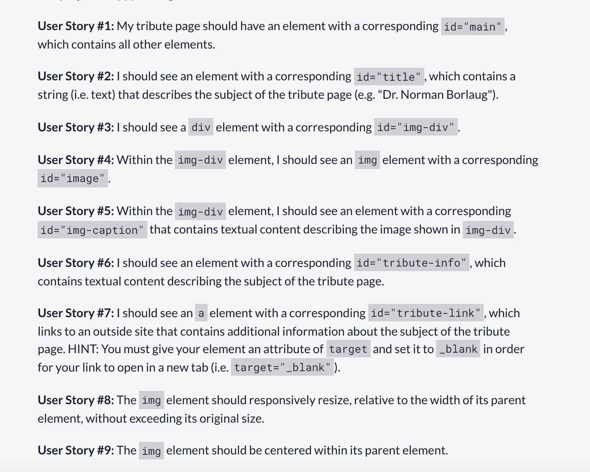

我建议先专注于传递用户故事，然后再考虑页面的样式。

慢慢来，一次经历一个用户故事。如果你不理解其中一个用户故事，那么有一种方法可以找到答案。

例如，如果你对第一个用户故事有困难，那么你可以去 [freeCodeCamp 论坛](https://forum.freecodecamp.org/)并使用搜索栏。使用搜索功能不需要论坛帐户。

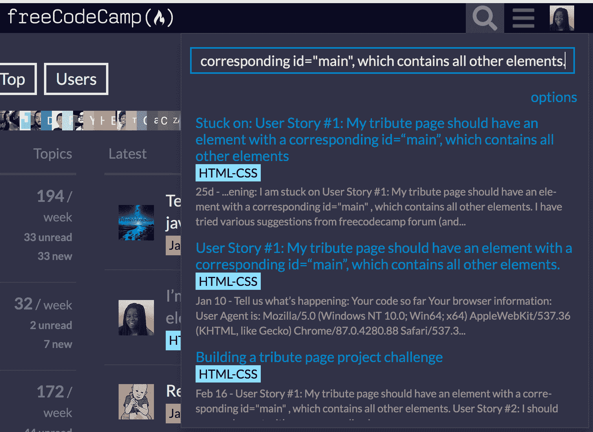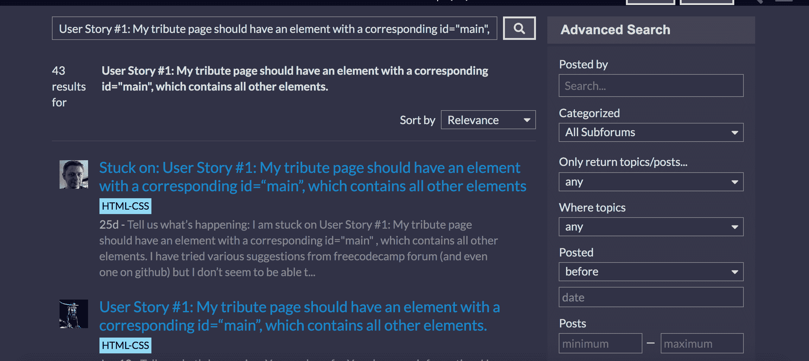

如你所见，很多人都经历过同样的问题。你可以点击任何帖子，通读讨论，以更好地理解说明。

你也可以在论坛上创建一个账号，在那里寻求帮助。有很多知识渊博的人会很乐意帮助你。

### 谷歌是你的朋友

开发人员的一项重要技能是知道如何使用谷歌。

比如你可以用 Google 帮你过最后两个用户故事。

****用户故事# 8:****`img`元素应该根据其父元素的宽度相应地调整大小，而不超过其原始大小。

****用户故事# 9:****`img`元素应该在其父元素内居中。

如果你在谷歌上搜索“如何让一张图片具有响应性”，会有很多结果可供选择。

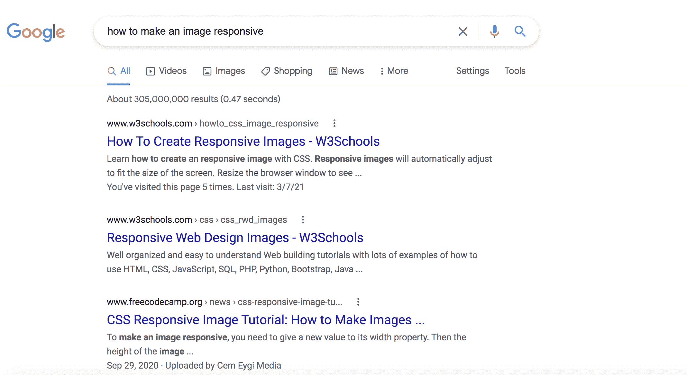

你也可以用谷歌搜索“如何使一个 css 图像居中”来帮助你了解上一个用户故事。

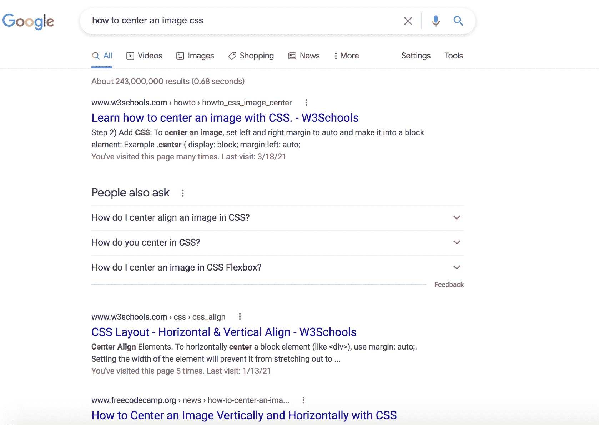

## 设计页面样式的技巧

一旦你通过了所有的用户故事，你就可以专注于设计你的页面了。

目标不是为你的第一个项目重新创建一个专业质量的设计。尽你所能，保持简单。

确保你的页面易于阅读，不要有两种互相冲突的颜色或动画，否则用户体验会很差。

这些项目让你有机会体验 CSS 中的不同特性。请记住，您可以使用 Google 来学习如何用 CSS 做事。

这里有一些你可能想谷歌一下的东西:

*   如何在 CSS 中创建圆形图像
*   如何在 CSS 中使用谷歌字体
*   如何在 CSS 中添加背景图片
*   如何使用 CSS 动画
*   如何用 CSS 网格制作图片库

使用这些建议时，你不必感到有压力。这完全取决于你的设计有多复杂。

## 如何提交您的项目

一旦你完成并通过了所有的测试，你将需要提交它来获得该项目的学分。

1.  复制项目的 URL。

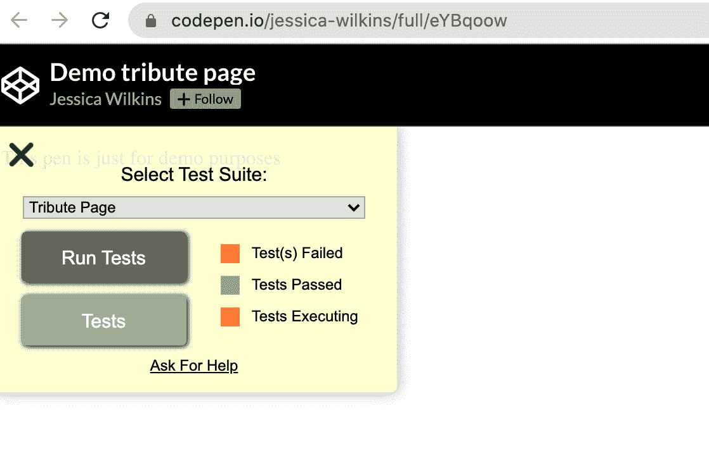

2.前往致敬页面说明[https://www . freecodecamp . org/learn/responsive-web-design/responsive-web-design-projects/build-a-Tribute-page](https://www.freecodecamp.org/learn/responsive-web-design/responsive-web-design-projects/build-a-tribute-page)

3.将您的项目 URL 粘贴到显示解决方案链接的位置

4.点击“我已完成这项挑战”

5.点击提交，进入下一个挑战

如果您使用另一个编辑器(如 Visual Studio Code)构建项目，那么您需要将代码复制并粘贴到 CodePen 中。然后，您可以复制 URL 来提交项目。

如果你有使用 Git 和 GitHub 的经验，你也可以选择使用 Github 页面。只要你提交了一个活的工作网站的网址，那就足够了。

希望这个指南能帮到你。

编码快乐！