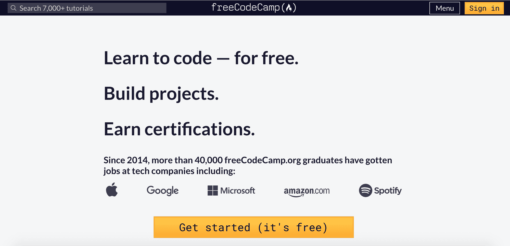
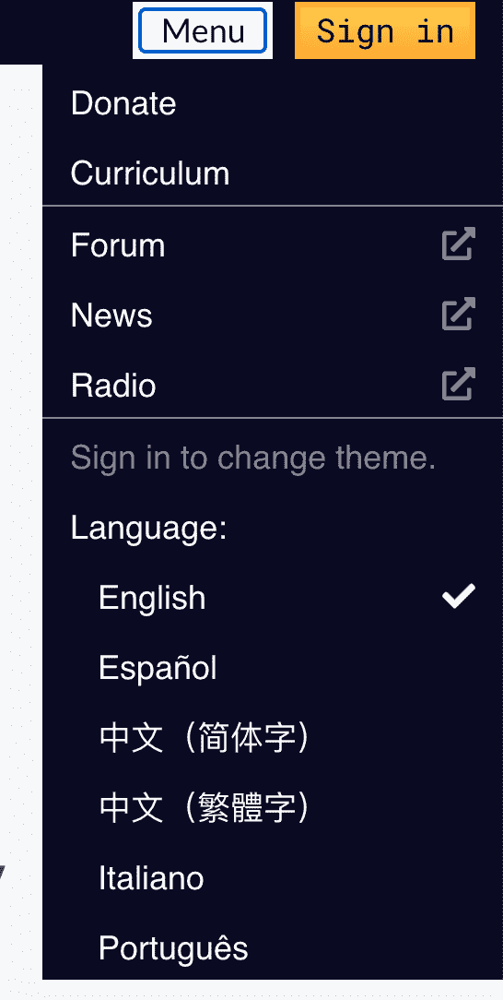

# 前端开发人员-什么是前端开发，用简单的英语解释

> 原文：<https://www.freecodecamp.org/news/front-end-developer-what-is-front-end-development-explained-in-plain-english/>

如果你是编程新手，你可能听说过前端开发这个术语。但这意味着什么呢？

在这篇文章中，我将解释什么是前端开发，成为前端开发人员需要什么技能，以及找到工作的技巧。

## 什么是前端开发？

你在网站上看到的所有东西，像按钮、链接、动画等等，都是由前端 web 开发人员创建的。前端开发人员的工作是从客户端获取愿景和设计概念，并通过代码实现它。

我们来看看 [freeCodeCamp 主页](https://www.freecodecamp.org/)。

页面上的一切，从徽标到搜索栏、按钮、整体布局以及用户如何与页面交互，都是由前端开发人员创建的。前端开发者负责网站的外观和感觉。

前端开发人员还必须确保网站在所有设备(手机、平板电脑和电脑屏幕)上都看起来不错。

## 成为前端开发人员需要哪些技能？

你需要熟知的三种主要语言是 HTML、CSS 和 JavaScript。从那里，您可以专注于框架、库和其他有用的工具。

### 超文本标记语言

HTML 代表超文本标记语言。HTML 显示页面上的内容，如按钮、链接、标题、段落和列表。

你不应该使用 HTML 来设计样式。这就是 CSS 的用途。

我建议通过 [freeCodeCamp HTML 挑战](https://www.freecodecamp.org/learn/responsive-web-design/#basic-html-and-html5)开始学习基础知识。

### 半铸钢ˌ钢性铸铁(Cast Semi-Steel)

CSS 代表级联样式表。CSS 负责网页的风格，包括颜色、布局和动画。

[freeCodeCamp 的响应式网页设计课程](https://www.freecodecamp.org/learn/responsive-web-design/)将教你 CSS、响应式设计和可访问性的基础知识。响应式设计对于创建在各种设备上都好看的网站至关重要。

可访问性是确保每个人都能轻松使用你的网站的实践。您不希望创建那些使用辅助技术(如屏幕阅读器)的人无法使用的网站。

完成本课程后，您将能够开始构建小型网页。

### Java Script 语言

JavaScript 允许用户与网页交互。JavaScript 的例子几乎可以在任何网页上找到，包括 freeCodeCamp 主页。

例如，当我点击页面顶部的菜单按钮时，它会打开一个下拉选项列表。每次我点击那个按钮，它就会在打开和关闭菜单之间来回切换。

JavaScript 可以用于网络游戏、网页、移动应用等等。

要开始学习 JavaScript，可以上 [freeCodeCamp 的 JavaScript 算法和数据结构课程](https://www.freecodecamp.org/learn/javascript-algorithms-and-data-structures/)。从那里，你可以从我的 [40 个面向初学者的 JavaScript 项目](https://www.freecodecamp.org/news/javascript-projects-for-beginners/)开始构建项目。

### CSS 框架、库和预处理程序

一旦你学会了 CSS 的基础知识，你就可以开始使用不同的框架和库了。创建这些工具是为了帮助加速开发过程。

像 [Bootstrap](https://getbootstrap.com/) 和 [Tailwind CSS](https://tailwindcss.com/) 这样的框架允许你将类的目录添加到你的网页中。因此，您最终将获得专业且适合移动设备的设计。

市场上有几十种选择，你不需要全部学会。查看你所在地区的工作，了解他们使用的技术通常会有所帮助。然后你可以专注于最常见/最受欢迎的技能。

以下是几个选项的列表:

*   [自举](https://getbootstrap.com/)
*   [顺风 CSS](https://tailwindcss.com/)
*   [布尔玛](https://bulma.io/)
*   [物化](https://materializecss.com/)
*   [语义界面](https://semantic-ui.com/)

像 [Sass](https://sass-lang.com/) 和 [Less](https://lesscss.org/) 这样的 CSS 预处理程序允许你给你的 CSS 添加逻辑和功能。这些工具使你的 CSS 变得简洁并且易于使用。

### JavaScript 库和框架

就像 CSS 库和框架一样，JavaScript 有许多选项。

没有必要全部都学。同上，研究你所在地区的招聘信息，看看正在使用什么库和框架。

以下是一些受欢迎的选项:

*   [反应](https://reactjs.org/)
*   [角度](https://angular.io/)
*   视图

这些框架和库允许您节省时间，用更少的代码做更多的事情。有可能找一份专门做 React，Vue，或者 Angular 的工作。

以下是一些建议的学习资源。

*   [freeCodeCamp 的 React YouTube 课程](https://www.youtube.com/watch?v=nTeuhbP7wdE)
*   [布拉德·特拉弗斯的棱角分明的 YouTube 课程](https://www.youtube.com/watch?v=Fdf5aTYRW0E)
*   [布拉德·特拉弗斯的 Vue YouTube 课程](https://www.youtube.com/watch?v=qZXt1Aom3Cs)

### 测试和调试技能

在开发应用程序时，代码中会有需要修复的错误。调试是识别那些错误(“bug”)并修复它们的行为。

测试是另一个需要学习的重要技能。为您的代码编写测试是确保您的代码做它应该做的事情的一种方式。

关于不同类型测试的更深入的解释，我建议阅读这篇文章。

### 版本控制

版本控制是跟踪和管理项目代码更改的一种方式。Git 是一个流行的软件，用来跟踪你的代码。

如果你在代码中弄乱了很多东西，你可以使用 Git 回到代码的前一个版本，而不是手动重写所有东西。

学习 Git 还允许您与团队中的其他人协作，并从不同的位置对相同的代码库进行更改。

我建议开始学习 Git T1，并使用像 T2 GitHub T3 这样的服务来托管你的个人项目。

### 问题解决

对于任何开发人员来说，最重要的技能是知道如何解决问题。公司和客户都在找你提供解决方案。

重要的是要学会如何解决一个问题，将它分解成更小的可管理的部分，并在这些 web 应用程序中解决问题。

## 如何找到一份前端开发人员的工作？

一旦你学会了前端开发的技术方面，你就必须专注于把你的工作申请材料放在一起。有许多令人难以置信的资源可以帮助你学习如何获得一份开发人员的工作。

### **简历构建资源**

*   [如何获得你的第一份开发工作——从查看职业转换者的简历中得到的启示](https://www.freecodecamp.org/news/how-to-get-your-first-dev-job/)
*   [如何写一份招聘人员会看的开发人员简历](https://www.freecodecamp.org/news/how-to-write-a-developer-resume-recruiters-will-read/)
*   [如何用几个简单的步骤写出一份出色的初级开发人员简历](https://www.freecodecamp.org/news/how-to-write-an-awesome-junior-developer-resume-in-a-few-simple-steps-316010db80ec/)

### **技术面试资源**

*   如何准备技术面试
*   [如何回答任何技术面试问题–示例包括](https://www.freecodecamp.org/news/how-to-answer-any-technical-interview-question-with-example/)
*   [我在 30 天内做了 60 多次技术访谈后学到了什么](https://www.freecodecamp.org/news/what-i-learned-from-doing-60-technical-interviews-in-30-days/)
*   [技术编码面试准备最佳书籍](https://www.freecodecamp.org/news/is-this-the-best-book-for-coding-interview-preparation/)
*   [如何准备技术面试——帮助你发挥最佳水平的技巧和诀窍](https://www.freecodecamp.org/news/interviewing-prep-tips-and-tricks/)

### **找工作的小技巧**

*   [如何通过智能、真正的社交网络获得第一份开发人员工作](https://www.freecodecamp.org/news/networking-for-aspiring-developers/)
*   [2021 年求职技巧](https://www.youtube.com/watch?v=K3B5AltcCTY)
*   [如何掌握求职技巧](https://www.youtube.com/watch?v=KPzFCZ_u_sY)
*   [如何使用 LINKEDIN 作为一名开发人员获得一份技术领域的工作！如何联网！](https://www.youtube.com/watch?v=SG5Sb5WTV_g)

此外，如果你有兴趣从事自由职业，这里有一些关于如何开始自由职业的资源。

*   什么是自由职业者？如何在网上找到自由职业者和你所在城市的客户
*   [如何撰写赢得客户的自由职业建议书+免费模板](https://www.freecodecamp.org/news/free-web-design-proposal-template/)
*   [自由网络开发者指南:如何通过自由编程工作赚钱](https://www.freecodecamp.org/news/freelance-web-developer-guide/)

我希望您喜欢这篇文章，并祝您在成为前端开发人员的道路上好运。