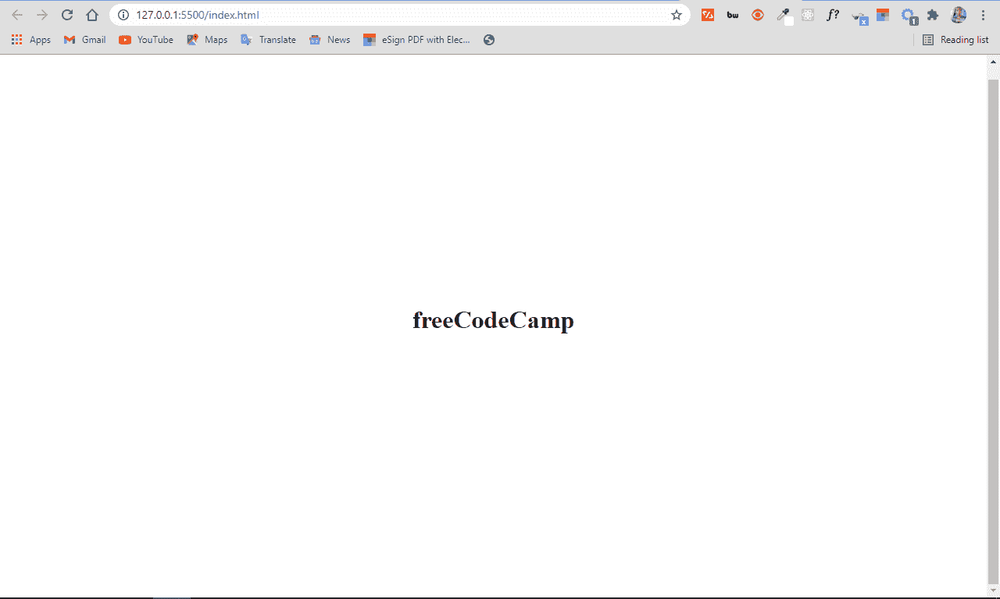
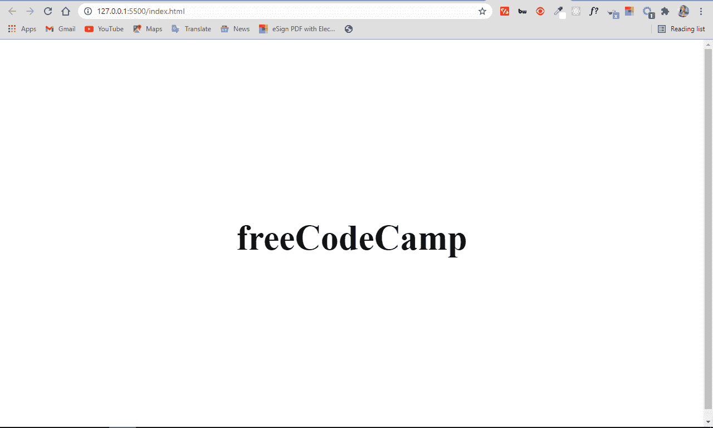
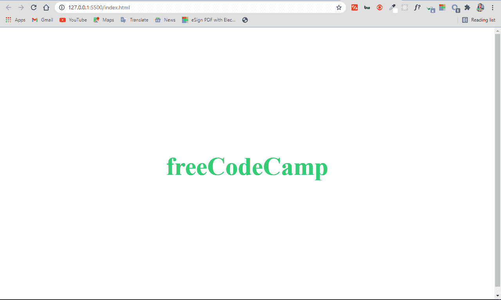

# HTML 字体样式–如何用 HTML 标签改变文本的颜色和大小

> 原文：<https://www.freecodecamp.org/news/html-font-style-how-to-change-text-color-and-size-with-an-html-tag/>

当你用 HTML 编码并添加一些文本时，你不想让它保持原样。你想让文本看起来更好。

为此，您需要通过 CSS 的`color`和`font-size`属性来改变它们的外观。

在本教程中，我将向你展示两种不同的方法来让你的 HTML 文本看起来更好。

## 基本`font-size`语法

```
selector {
     font-size: value;
     color: value;
} 
```

## 如何改变 HTML 标签中的文本大小和颜色

您可以使用颜色和字体大小属性在标签内更改文本的颜色和大小。这被称为内联 CSS。您可以用 HTML 中的 style 属性来实现。

在下面的 HTML 代码中，我们将更改 freeCodeCamp 文本的颜色和大小。

```
<h1>freeCodeCamp</h1> 
```

```
body {
    display: flex;
    align-items: center;
    justify-content: center;
    height: 100vh;
} 
```

在浏览器里是这样的:


要更改文本的大小，您将使用 style 属性，然后用`font-size`属性设置一个值，如下所示:

```
<h1 style="font-size: 4rem">freeCodeCamp</h1> 
```

现在，浏览器中的文本如下所示:


如果你想知道 4rem 是什么，它是一个测量单位。和 64 像素是一样的，因为 16px 就是 1rem，除非你把根`font-size` ( `html`)改成另一个值。

若要更改文本的颜色，可以使用 style 属性，然后用 color 属性设置一个值:

```
<h1 style="color: #2ecc71">freeCodeCamp</h1> 
```

这就是我们现在在浏览器中拥有的:


结合`font-size`和`color`属性在浏览器中给出了这样的结果:


代码如下:

```
<h1 style="font-size: 4rem; color: #2ecc71">freeCodeCamp</h1> 
```

## 如何更改外部 CSS 文件中的文本大小和颜色

您还可以更改外部样式表中文本的颜色和大小。最重要的是，您必须在 HTML 的 head 部分链接外部 CSS。

执行此操作的基本语法如下:

```
<link rel="stylesheet" href="path-to-css-file"> 
```

现在，要更改 freeCodeCamp 文本的文本大小和颜色，需要在样式表中选择它，并对它应用适当的属性和值。

记住这是我们简单的 HTML 代码:

```
<h1>freeCodeCamp</h1> 
```

通过选择元素(h1)并为颜色和字体大小属性赋值，可以更改文本的颜色和大小:

```
 h1 {
    color: #2ecc71;
    font-size: 4rem;
} 
```

我们在浏览器中得到同样的结果:


## 结论

我希望这篇教程能给你知识来改变你的 HTML 文本的大小和颜色，让它们看起来更好。

感谢阅读，继续编码。