# CSS 显示属性–不显示，显示表格，内嵌块等等

> 原文：<https://www.freecodecamp.org/news/the-css-display-property-display-none-display-table-inline-block-and-more/>

在 CSS 中，display 属性决定了元素的外观。它也是 HTML 代码表现的一个重要部分，因为它对布局有很大的影响。

事实上，要使用现代的 Flexbox 和 Grid 模型，您需要在访问它们的各种属性和值之前使用 display 属性。这就是为什么显示属性在 CSS 中如此重要的一个原因。

让我们深入学习如何使用`display`属性及其所有不同的值。

## 基本`display`属性语法

```
element {
        display: value;
     } 
```

## 在 CSS 中显示属性值

CSS 中有内联和块级元素。两者的区别在于行内元素不会占据整个空间——也就是说，它们不会从新行开始——但是块元素会。

display 属性有许多不同的值，比如`inline`、`inline-block`、`block`、`table`等等，这些值都会影响元素在 web 页面上的布局和呈现。此外，要实现 flex 和 grid 布局，您需要使用 display 属性。

您可以使用这个显示属性将一个`inline`元素更改为`block`、`block`元素更改为`inline`、`block`和`inline`元素更改为`inline-block`等等。

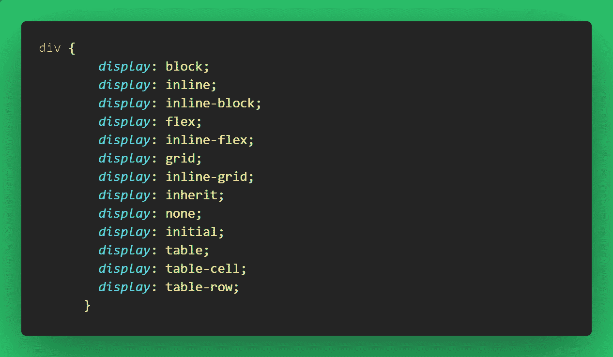

### `display: inline`

显示属性设置为`inline`的元素不会从新行开始，它将占用剩余的/可用的屏幕宽度。它只是占据了这样一个元素通常会占据的空间。

因此，你不能设置一个有`inline`显示的元素的`width`和`height`，因为它不会占据整个屏幕宽度。

默认情况下，有些元素是内联的，比如`<span>`、`<a>`、`<i>`和``。

```
<div>
      Lorem ipsum dolor sit amet consectetur adipisicing elit.
      <span>This is an inline lement</span> Modi eaque debitis eos quod labore
      maiores delectus asperiores voluptatem voluptas soluta!
</div> 
```

```
 body {
        display: flex;
        align-items: center;
        justify-content: center;
        height: 100vh;
        font-size: 2rem;
      }
div {
        max-width: 600px;
      }
span {
        background-color: #006100;
      } 
```

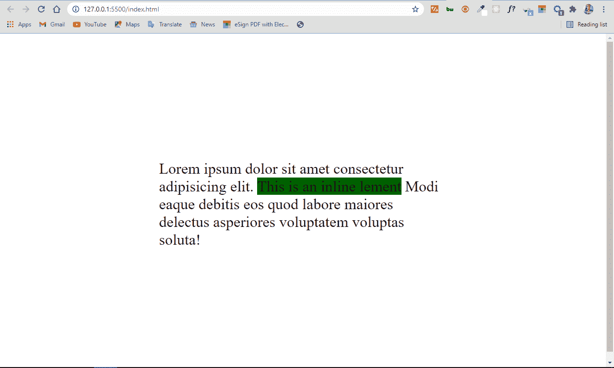

### `display: block`

display 属性设置为`block`的元素从新行开始，占据可用的屏幕宽度。

您可以为这些元素指定`width`和`height`属性。默认情况下，块级元素的例子有`<div>`、`<section>`、`<p>`等等。

您可以将前面 HTML 代码中的`span`设置为`block`显示，它将像块级元素一样工作。

```
span {
        display: block;
        background-color: #006100;
      } 
```

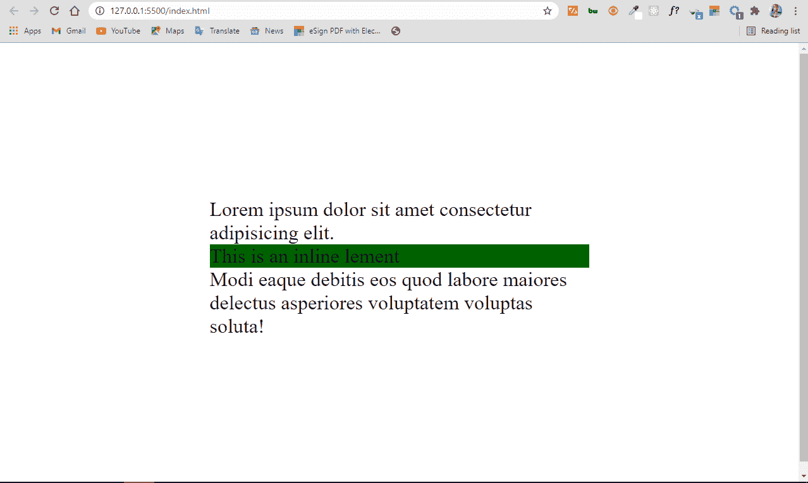

你可以看到`<span>`占据了整个宽度。这是因为它的显示属性设置为 block。

### `display: inline-block`

除了块和内联显示，还有内联块。

一个你指定显示为`inline-block`的元素被表示为内联。但是它有一个额外的好处，你可以对它应用`width`和`height`，当元素被分配了`inline`的 dispaly 时，你就不能这样做了。

因此，您可以将`inline-block`显示视为一个包中的内联元素和块元素。

```
 span {
        display: inline-block;
        background-color: #006100;
        width: 140px;
        height: 140px;
      } 
```

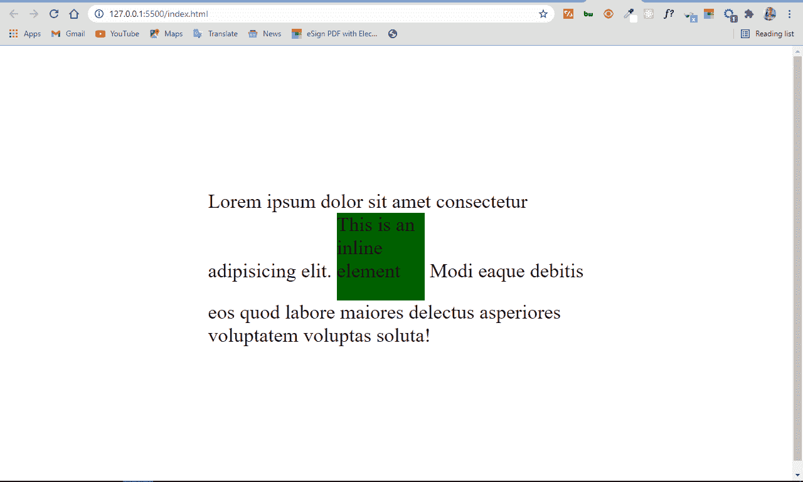

### `display: none`

当您将某个元素的 display 属性设置为`none`时，该元素将完全从页面中移除，并且不会对布局产生影响。

这也意味着像屏幕阅读器这样让盲人也能访问网站的设备将无法访问该元素。

不要混淆`display: none`和`visibility: hidden`。后者也隐藏了元素，但是留出了它通常占据的空间。

```
span {
        display: none;
        background-color: #006100;
        width: 140px;
        height: 140px;
      } 
```

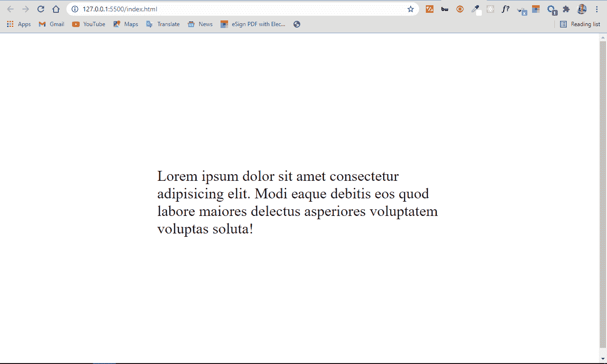

可见性隐藏使跨度元素占据的空间保持开放，如下所示:

```
 span {
        visibility: hidden;
        background-color: #006100;
        width: 140px;
        height: 140px;
      } 
```

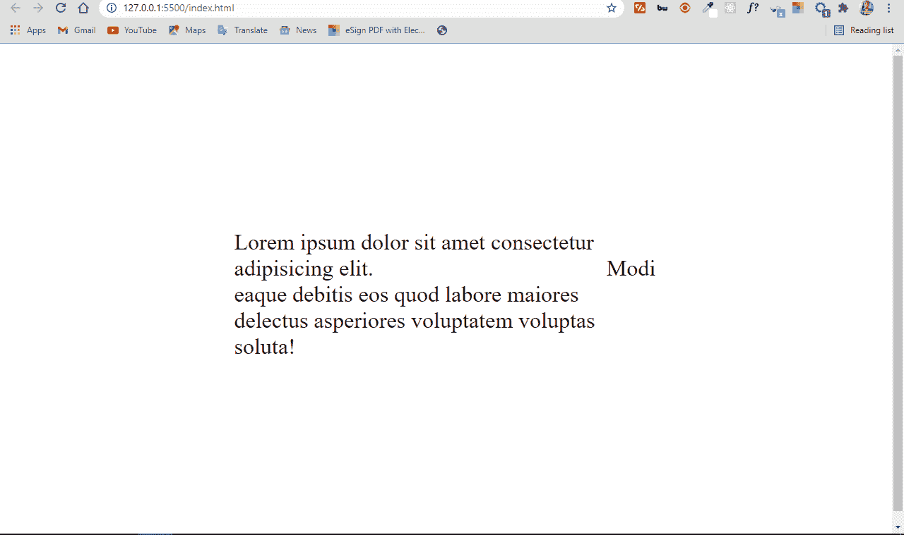

### `display: table`

现在很少使用显示值`table`,但是知道这一点还是很重要的。在过去，它更有用，因为在 floats、Flex 和 Grid 出现之前，您会将它用于布局。

将 display 设置为`table`会使元素表现得像一个表格。因此，您可以复制一个 HTML 表格，而无需使用 table 元素和相应的元素，如`tr`和`td`。

例如，在 HTML 中，您可以用`<table>`元素和一个`<div>`或者您选择的任何容器制作一个表格。

您使用 HTML `<table>`元素制作一个表格，如下所示:

```
<table>
      <tr>
        <td>Fruits</td>
        <td>Lemurs</td>
        <td>Pets</td>
      </tr>
      <tr>
        <td>Cashew</td>
        <td>Hua hua</td>
        <td>Dog</td>
      </tr>
      <tr>
        <td>Apple</td>
        <td>Diadem Sifaka</td>
        <td>Cat</td>
      </tr>
      <tr>
        <td>Mango</td>
        <td>Rig-tailed</td>
        <td>Chicken</td>
      </tr>
</table> 
```

```
body {
    display: flex;
    align-items: center;
    justify-content: center;
    height: 100vh;
    font-size: 2rem;
}

div {
    max-width: 600px;
}

span {
    display: inline-block;
    background-color: #006100;
    width: 140px;
    height: 140px;
}

tr,
td {
    padding: 10px;
} 
```

上面的 HTML 和 CSS 代码片段的结果如下所示:

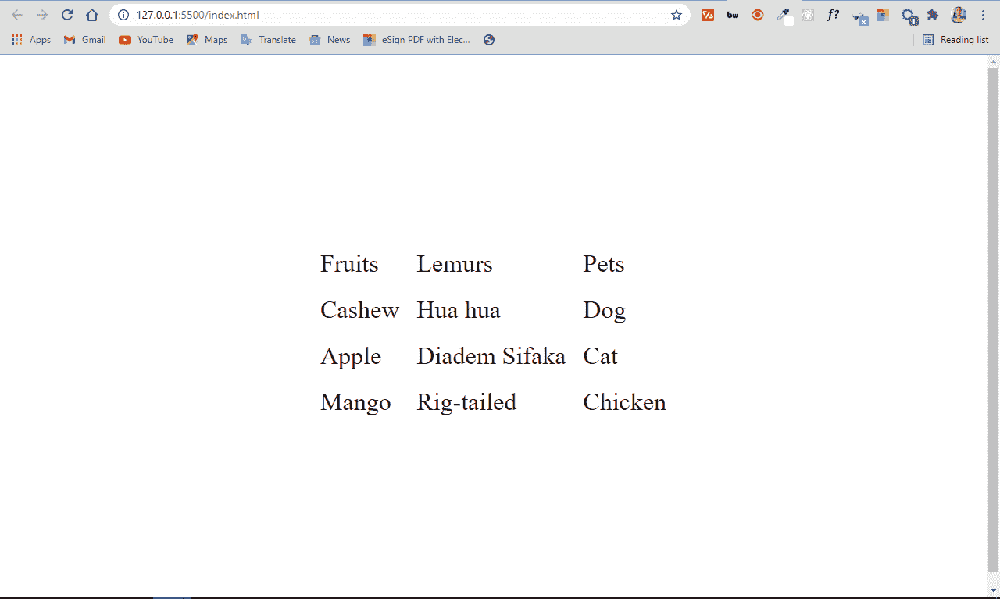

但是您可以通过将各自的显示设置为`table`、`table-row`和`table-cell`来制作带有`<div>`元素的相同表格。您将得到如下所示的相同结果:

```
 <div class="table">
      <div class="row">
        <div class="cell">Fruits</div>
        <div class="cell">Lemurs</div>
        <div class="cell">Pets</div>
      </div>
      <div class="row">
        <div class="cell">Cashew</div>
        <div class="cell">Hua hua</div>
        <div class="cell">Dog</div>
      </div>
      <div class="row">
        <div class="cell">Apple</div>
        <div class="cell">Diadem Sifaka</div>
        <div class="cell">Cat</div>
      </div>
      <div class="row">
        <div class="cell">Mango</div>
        <div class="cell">Ring-tailed</div>
        <div class="cell">Chicken</div>
      </div>
</div> 
```

```
body {
    display: flex;
    align-items: center;
    justify-content: center;
    height: 100vh;
    font-size: 2rem;
}

div {
    max-width: 600px;
}

span {
    display: inline-block;
    background-color: #006100;
    width: 140px;
    height: 140px;
}

.table {
   display: table;
}

.row {
   display: table-row;
}

.cell {
   display: table-cell;
}

.row,
.cell {
  padding: 10px;
} 
```

你仍然有你的桌子:

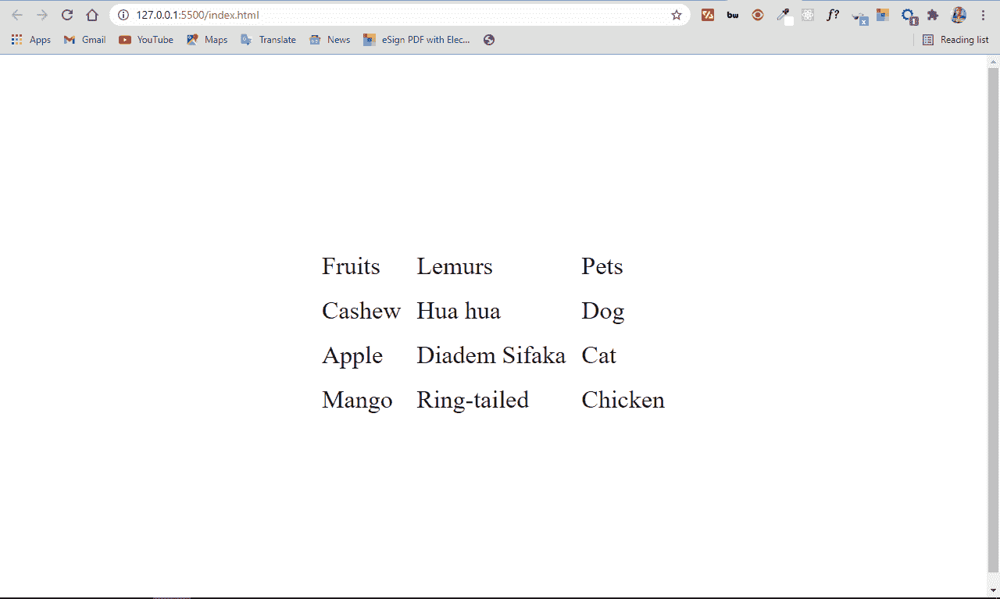

## 显示属性的其他值

除了`inline`、`block`、`none`和`table`这些非常重要的属性，因为它们显著地影响了网页的外观，还有其他一些`display`属性的值值得您注意。

有些你会一直使用，却没有真正意识到它们也是展示属性的一部分。还有一些你根本不会经常用的。

现在让我们来看看其中的一些。

### `display: flex`

显示`flex`可让您访问 Flex 布局系统，这简化了我们设计和布局网页的方式。

```
<div class="container">
      <div class="child">
        Lorem ipsum dolor sit amet consectetur adipisicing elit.
        <span>This is an inline element</span> Modi eaque debitis eos quod
        labore maiores delectus asperiores voluptatem voluptas soluta!
      </div>
      <div class="child">
        Lorem ipsum dolor sit amet consectetur adipisicing elit.
        <span>This is an inline element</span> Modi eaque debitis eos quod
        labore maiores delectus asperiores voluptatem voluptas soluta!
      </div>
</div> 
```

```
.container {
        display: flex;
        align-items: center;
        justify-content: center;
        height: 100vh;
        font-size: 2rem;
}

span {
       visibility: hidden;
       background-color: #006100;
       width: 140px;
       height: 140px;
}

.child {
       border: 2px solid crimson;
       margin: 4px;
} 
```

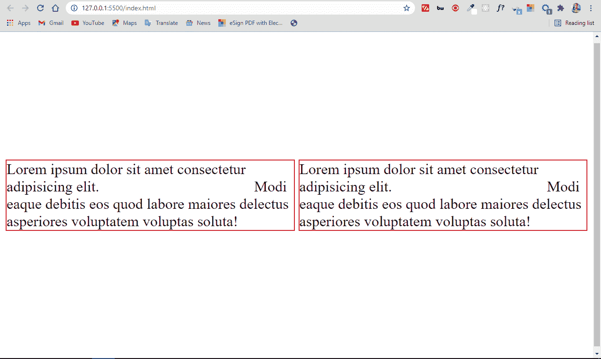

### `display: grid`

设置为`grid`的显示允许您使用网格系统构建布局，这就像是 flex 的高级形式。

```
<div class="container">
      <div class="child">
        Lorem ipsum dolor sit amet consectetur adipisicing elit.
        <span>This is an inline element</span> Modi eaque debitis eos quod
        labore maiores delectus asperiores voluptatem voluptas soluta!
      </div>
      <div class="child">
        Lorem ipsum dolor sit amet consectetur adipisicing elit.
        <span>This is an inline element</span> Modi eaque debitis eos quod
        labore maiores delectus asperiores voluptatem voluptas soluta!
      </div>
</div> 
```

```
.container {
        display: grid;
        place-items: center;
        height: 100vh;
        font-size: 2rem;
      }

span {
       visibility: hidden;
       background-color: #006100;
       width: 140px;
        height: 140px;
}

.child {
       border: 2px solid crimson;
       margin: 4px;
} 
```

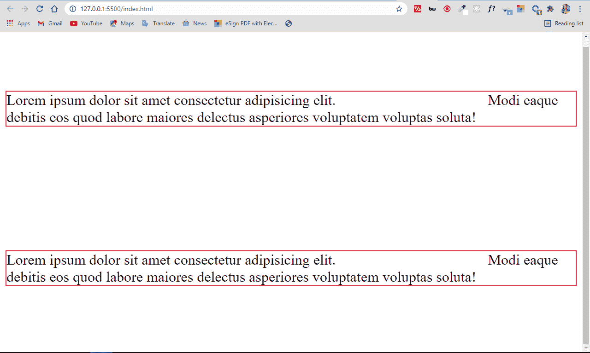

### `display: inherit`

这使得元素继承其父元素的显示属性。因此，如果您在 div 中有一个`<span>`标记，并且您给 span 标记一个显示`inherit`，它会将其从 inline 转换为 block 元素。

```
<div>
      Lorem ipsum dolor sit amet consectetur
      <span>Inline element</span> adipisicing elit. Cumque cupiditate harum
      consectetur a exercitationem laboriosam nobis eos pariatur expedita iure.
</div> 
```

```
body {
     display: flex;
     align-items: center;
     justify-content: center;
     height: 100vh;
     font-size: 2rem;
}

span {
     display: inherit;
     background-color: crimson;
} 
```

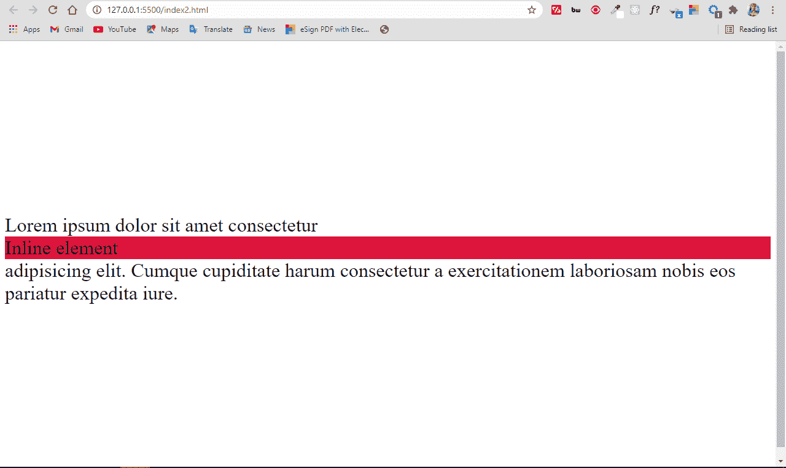

### `display: initial`

这会将元素的 display 属性设置为其默认值。因此，如果将 span 的 display 属性设置为 initial，它将保持内联，如果为 div 设置相同的值，它将保持 block。

```
<div>
      Lorem ipsum dolor sit amet consectetur
      <span>Inline element</span> adipisicing elit. Cumque cupiditate harum
      consectetur a exercitationem laboriosam nobis eos pariatur expedita iure.
</div> 
```

```
body {
    display: flex;
    align-items: center;
    justify-content: center;
    height: 100vh;
    font-size: 2rem;
}

span {
    display: initial;
    background-color: crimson;
} 
```


## 结论

很好地掌握显示属性将有助于您的页面布局看起来很棒。它还让您在使用 CSS 时对元素的呈现方式有了更多的控制。

您也可以继续回到本文进行参考，因为 display 属性在开始时总是令人困惑，直到您充分使用它来完全理解它。

我希望这篇文章已经为您提供了所需的背景知识，以便很好地使用显示属性。

感谢阅读，继续编码。