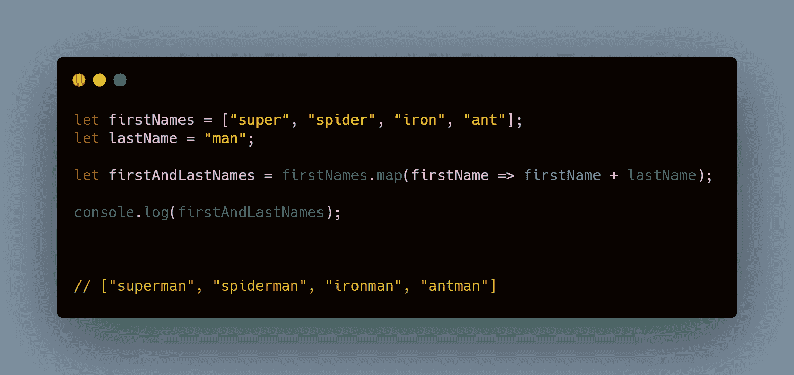
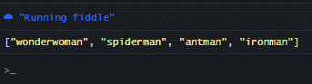
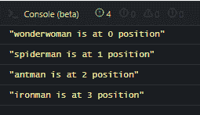
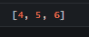
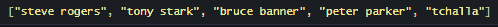
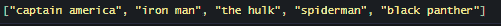

# JavaScript Array.map()教程——如何使用 map()遍历数组中的元素

> 原文：<https://www.freecodecamp.org/news/array-map-tutorial/>

当 ES6 (EmcaScript 2015)问世时，它引入了一套全新的方法来迭代数组。其中最有用的是`map()`方法。

`Array.prototype.map()`是一个内置的数组方法，用于在 JavaScript 中遍历数组集合中的元素。可以把循环看作是从列表中的一个元素前进到另一个元素的一种方式，同时仍然保持每个元素的顺序和位置。

这个方法[接受一个回调函数](https://www.freecodecamp.org/news/what-is-a-callback-function-in-javascript/),它迭代的每个新元素都会调用这个函数。

回调函数接受三个参数:

*   当前值
*   这是索引
*   目标数组

如果你是一个初学者，正在努力理解如何使用`map()`方法或者它到底能做什么，那么这篇文章就是为你准备的。

在本文中，我将解释`map()`方法，并用一些简单的例子说明它是如何工作的。

## JavaScript 中 map()方法的工作原理

想象一下:医院外面有一队人在等着接种疫苗。这意味着他们还没有接种疫苗。

一个接一个，医生给他们注射疫苗。医生通过遍历该行来实现这一点。在一端，有一群人还没有接种疫苗。医生把他们每一个人都带走，给他们注射疫苗，然后把他们放回新的接种人群中。

在一端，有一个您想要操作的数组(A)。接收数组(A)中的所有元素，对每个元素执行一致的操作，并将它们返回到一个新的数组(B)中。

## 如何使用 map()方法–复仇者联盟示例

为了说明`map()`在 JavaScript 中是如何工作的，让我们考虑一些我们最喜欢的复仇者的名字列表。问题是这个列表中的名字并不完整——它们缺少了一个重要的后缀。

使用`map()`，我们可以获取数组中的所有名字，并在每个名字后面加上“man”后缀:

```
let firstNames = ["super", "spider", "ant", "iron"]
let lastName = "man";

let fullNames = firstNames.map(firstName => firstName + lastName);

console.log(fullNames);

// ["superman", "spiderman", "antman", "ironman"]
```



VISUAL CODE

### 那些女人呢？

对不起，我的错。我意识到自己的错误，决定在数组的第一个位置**加入一个女性角色。数组中的每一项都由一个唯一的值标识，即它的**索引**(或在数组中的位置)。第一个项目的索引为`0`，第二个项目的索引为`1`，依此类推。**

由于现在名单上出现了一位女性超级英雄，我们希望确保给合适的超级英雄加上正确的后缀。

由于`map()`还接受我们当前迭代的项目的索引，我们可以通过检查我们的英雄的索引并确保我们对数组中的第一个项目使用“woman”后缀来做到这一点:

```
let firstNames = ["wonder", "spider", "ant", "iron"]
let male = "man";
let female = "woman";

let fullNames = firstNames.map(function(firstName, index) {
    return (index == 0) ? firstName + female : firstName + male;
 });

console.log(fullNames);

["wonderwoman", "spiderman", "antman", "ironman"]
```



### 如何使用索引参数

除了被迭代的值之外，map 还接受它的索引位置。如果您想根据项目的索引位置执行不同种类的操作，这非常有用。

在前面的例子中，我们通过检查索引附加了一个不同的后缀。

要找出数组中每一项的索引位置，我们可以这样做:

```
let fullNames = ["wonderwoman", "spiderman", "antman", "ironman"]

fullNames.map(function(firstName, index) {
    console.log(${firstName} is at ${index} position)
});

/*
"wonderwoman is at 0 position"
"spiderman is at 1 position"
"antman is at 2 position"
"ironman is at 3 position"
*/
```



RESULT

### 如何将数组中的所有项乘以 2

现在让我们来研究一下数字。在本例中，我们只想将目标数组中的每个数字乘以 2，然后将它们的乘积返回到一个新数组中:

```
let numbers = [10, 20, 30, 40]
let multiplier = 2;

let products = numbers.map(number => number * multiplier);

console.log(products);

// [20, 40, 60, 80]
```

### 如何四舍五入到最接近的整数

如果我们有一个小数数组，但是我们希望每个小数都四舍五入到最接近的整数，该怎么办？

```
let numbers = [3.7, 4.9, 6.2]
let rounded = numbers.map(function(number) {
    return Math.round(number);
})

console.log(rounded);

// [4, 5, 6]
```



### 如何将字符串转换为数字

我们有一个字符串类型的数字列表。但是，我们希望将每一个都转换为数字类型:

```
let strings = ["10","20","30"]

let numbers = strings.map(function(string) {
    return Number(string);
})

console.log(numbers);

// [10, 20, 30]
```

### 如何获得复仇者的真实姓名

在这个例子中，我们正在处理对象。我们在阵列中有五个复仇者，每个都有一个真实的名字和一个英雄的名字。然而，我们只想将它们的真实名称检索到新数组中。

```
let avengers = [
    {name: "steve rogers", heroName: "captain america"},
    {name: "tony stark", heroName: "iron man"},
    {name: "bruce banner", heroName: "the hulk"},
    {name: "peter parker", heroName: "spiderman"},
    {name: "tchalla", heroName: "black panther"}
]

let realNames = avengers.map(avenger => avenger.name);

console.log(realNames);

// ["steve rogers", "tony stark", "bruce banner", "peter parker", "tchalla"]
```



### 如何获得复仇者联盟的英雄名

为了只获得他们的英雄名字，我们做了几乎完全相同的事情，只是在这种情况下我们访问了`heroName`属性:

```
let avengers = [
    {name: "steve rogers", heroName: "captain america"},
    {name: "tony stark", heroName: "iron man"},
    {name: "bruce banner", heroName: "the hulk"},
    {name: "peter parker", heroName: "spiderman"},
    {name: "tchalla", heroName: "black panther"}
]

let heroNames = avengers.map(avenger => avenger.heroName);

console.log(heroNames);

// ["captain america", "iron man", "the hulk", "spiderman", "black panther"]
```



### 如何分离出一个函数

我们可以在外部定义函数，然后在我们的`map()`函数内部调用它，而不是直接在`map()`内部定义函数:

```
let avengers = [
    {name: "steve rogers", heroName: "captain america"},
    {name: "tony stark", heroName: "iron man"},
    {name: "bruce banner", heroName: "the hulk"},
    {name: "peter parker", heroName: "spiderman"},
    {name: "tchalla", heroName: "black panther"}
]

let getName = avenger =>avenger.name;

let realNames = avengers.map(getName);

console.log(realNames);

// ["steve rogers", "tony stark", "bruce banner", "peter parker", "tchalla"]
```

### 数组参数的工作原理

前面我说过，在每次迭代中，`map()`方法接受被迭代的值及其索引位置。除了这两个参数之外，还有另一个参数，即`Array`参数。

`arr`参数表示被循环的目标数组及其全部内容。有了这个参数，您就可以从整个数组中找到一些东西。

在这个例子中，我们将访问`arr`参数来查看并检查当前项目是否是列表中的最后一个项目。如果不是，我们访问下一项并从当前项中减去它。如果是最后一次，我们就退回去。

```
const oldArray = [33, 20, 10, 5];
const newArray = oldArray.map((currentVal, index, arr) => {
    let nextItem = index + 1 < arr.length ? arr[index + 1] : 0
    return currentVal - nextItem;
	});

console.log(newArray);

// [13, 10, 5, 5]
```

## 包扎

在 ES6 中引入了`map()`方法。通过这种方法，我们可以访问数组集合中的每一项并对其执行一致的操作。

它接受一个回调函数，为迭代的每个新元素调用这个函数。

在本教程中，我介绍了 map()方法，用类比说明了它是如何工作的，并给出了一些在 JavaScript 代码中使用它的实际例子。

我希望你能从这篇文章中得到一些有用的东西。如果你喜欢这样的编程相关教程，你应该[看看我的博客](https://ubahthebuilder.tech)。我经常在那里发表关于软件开发的文章。

感谢您的阅读，再见。

****************P/S****************:如果你正在学习 JavaScript，我创作了一本电子书，用手绘数字笔记教授 JavaScript 中的 50 个主题。[点击这里查看](https://ubahthebuilder.gumroad.com/l/js-50)。