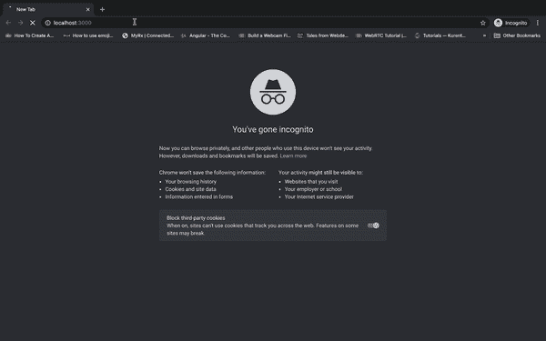
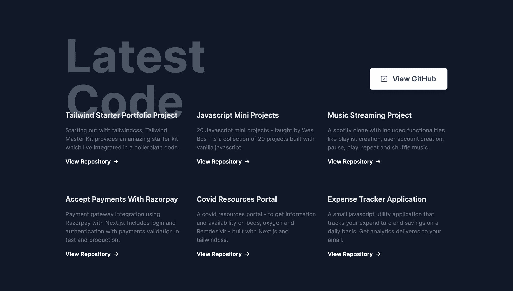
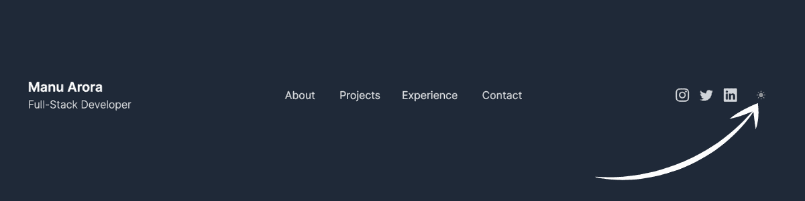
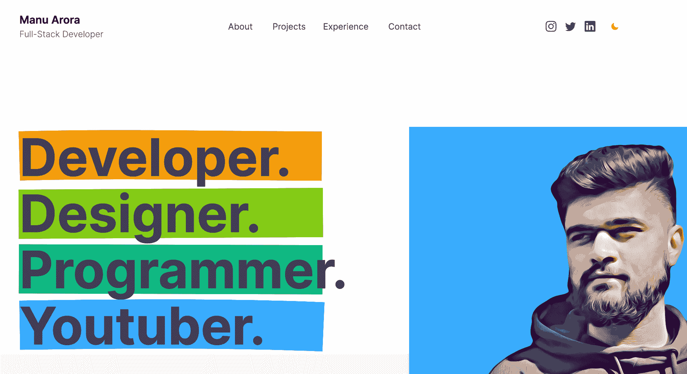
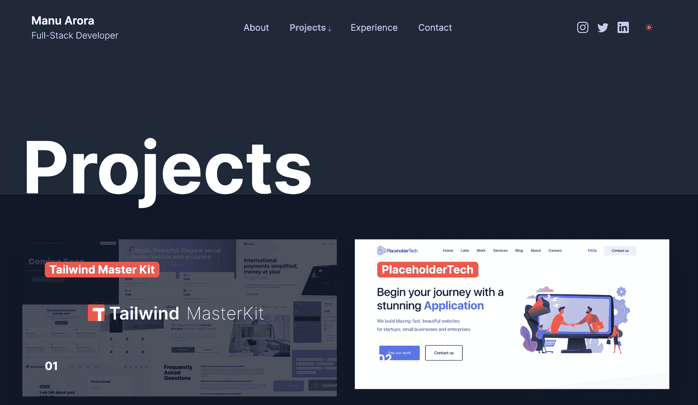
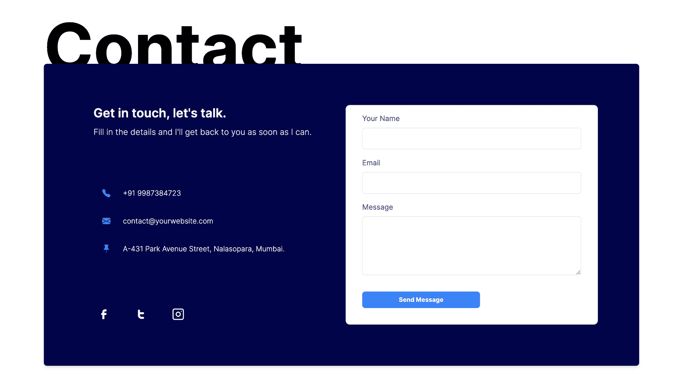
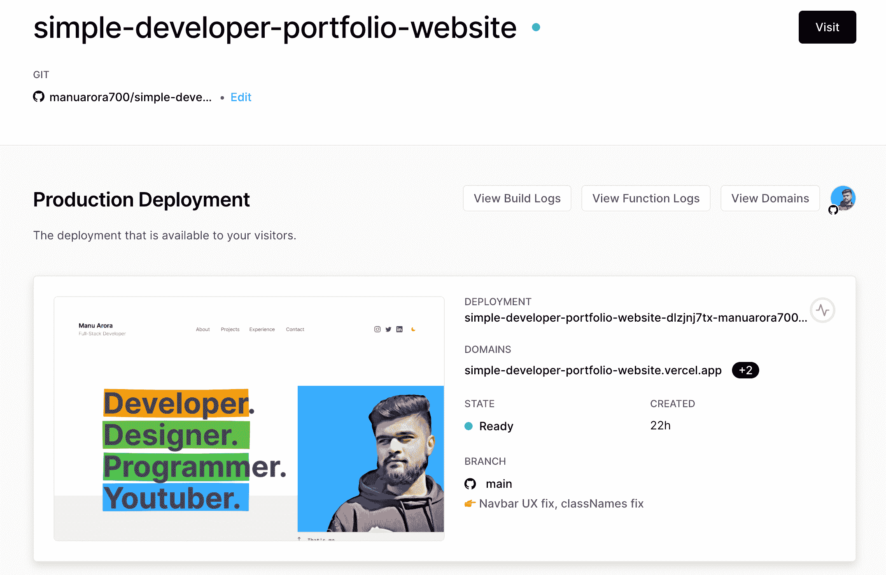

# 如何用 Next.js 和 TailwindCSS 构建作品集网站

> 原文：<https://www.freecodecamp.org/news/how-to-build-a-portfolio-site-with-nextjs-tailwindcss/>

如果你是一名网站开发人员，拥有一个个人作品集网站对你来说很重要——尤其是在你申请工作的时候。

如果你有一个不错的在线作品集网站，你会比没有网站更有机会得到招聘人员的关注。

投资组合网站可以通过直接展示你的技能、项目、教育和个人品牌来帮助你脱颖而出，而不是发送你的简历并让招聘人员看一看。

您可以使用您的作品集来展示您的项目、您的教育、与世界分享可重用的代码片段、提供有用的资源以及撰写您自己的博客。你可以用自己的网站做无数的事情。

我建立了一个模板，你可以用它来创建、编辑和部署你自己的作品集网站，而且是免费的。如果您想从头开始构建自己的版本，我将在本文中向您展示。

让我们开始吧，我将向你们展示我使用了什么技术，我是如何构建投资组合的，我将按部分进行分解，这样你们就可以看到每个部分是如何工作的。

## 技术堆栈

让我们来谈谈我用来构建这个模板的技术:

*   Next.js -一个 React 框架，用于构建高速网站和服务器端渲染，让人们更容易在互联网上找到你的网站。
*   这是一个 css 框架，可以让你快速原型化和样式化你的网络应用。
*   一个在英雄部分使用的样式库，非常适合在你的网页上突出重要的文本。

为什么是`Next.js`？因为它是一个带`Server-Side Rendering`的 React 框架，对 SEO 有好处(如果在 Google 上被找到对我们有好处，对吧？).

此外，Next.js 还能帮助我们建立速度极快的网站，并带来图像优化等好处。

为什么是`tailwindcss`？因为 TailwindCSS 是一个减少了大量样式工作的框架。它有低级别的 CSS 类，可以直接嵌入到 HTML 代码中。

不仅如此，它还提供了惊人的响应支持。例如，`<div className="text-sm md:text-xl"></div>`表示文本将在较小的屏幕上显示为`small`,而在中等或较大的屏幕上显示为`xl`。

最后，我们将在 **Vercel** 上部署应用程序。Vercel 为我们提供了一种使用 CI/CD 部署应用程序的简单方法。代码被推送到一个远程 GitHub 存储库，每次推送都会部署好。

## 投资组合网站功能



该网站包括我认为你应该在你的投资组合网站中拥有的绝对最低要求，以及一些很酷的额外功能。

*   `Dark Mode` -自带黑暗模式支持。切换模式按钮，在暗模式和亮模式之间切换。
*   这个网站是用 Next.js 构建的，它提供了一些很棒的开箱即用的功能，比如图像优化和 SEO 支持。
*   使用 TailwindCSS，我以这样一种方式建立了这个网站，你可以定制原色，并根据你的需要改变网站的外观。
*   每个页面都包装了一个元组件标签，你可以用它来为你创建的每个单独的页面提供元信息。
*   页面在所有设备上看起来都很漂亮——台式机、平板电脑和移动设备。

## 我们将建立的投资组合页面

我们将在您的投资组合网站中包含所有必要的页面，例如:

*   访问者的登陆页面。这是他们登陆你的网站时看到的内容。
*   一个简短的介绍，包括你做什么，你的技术技能和你的社会联系。
*   你的工作历史，你承担的个人项目，以及你的相关项目。
*   你已经建立的所有项目的表格。
*   `Contact` -招聘人员/最终用户可以联系您的表格。

## 组件和布局

整个网站被分成几个部分——你可以在网页的任何地方使用的小块可重复使用的代码。文件夹结构非常简单，不言自明:

*   是所有组件的所在，比如英雄部分、导航条和布局。
*   是所有静态资产的去处，比如图像、字体和/或任何用于生成动态站点地图的外部脚本。
*   你的全球时尚生活就在这里。我们将在这里集成 Tailwind 的基础库。
*   `pages`是您所有路线所在的位置，这是 Next.js 的最佳功能之一。只需在`pages`文件夹中创建一个新文件，它将作为一条新路线。

### 集装箱街区

`<ContainerBlock />`是所有组件的父级。它为用户提供了一种为每个页面定制 meta 标签的方法。我设计了布局，以便它接受道具作为`children`，并为每个页面提供一个`Navbar`、`<meta>`标签和`Footer`。

```
import React from "react";
import Head from "next/head";
import { useRouter } from "next/router";
import Navbar from "./Navbar";
import Footer from "./Footer";

export default function ContainerBlock({ children, ...customMeta }) {
  const router = useRouter();

  const meta = {
    title: "Manu Arora - Developer, Writer, Creator and YouTuber",
    description: `I've been developing websites for 5 years straight. Get in touch with me to know more.`,
    image: "/avatar.png",
    type: "website",
    ...customMeta,
  };
  return (
    <div>
      <Head>
        <title>{meta.title}</title>
        <meta name="robots" content="follow, index" />
        <meta content={meta.description} name="description" />
        <meta
          property="og:url"
          content={`https://yourwebsite.com${router.asPath}`}
        />
        <link
          rel="canonical"
          href={`https://yourwebsite.com${router.asPath}`}
        />
        <meta property="og:type" content={meta.type} />
        <meta property="og:site_name" content="Manu Arora" />
        <meta property="og:description" content={meta.description} />
        <meta property="og:title" content={meta.title} />
        <meta property="og:image" content={meta.image} />
        <meta name="twitter:card" content="summary_large_image" />
        <meta name="twitter:site" content="@mannupaaji" />
        <meta name="twitter:title" content={meta.title} />
        <meta name="twitter:description" content={meta.description} />
        <meta name="twitter:image" content={meta.image} />
        {meta.date && (
          <meta property="article:published_time" content={meta.date} />
        )}
      </Head>
      <main className="dark:bg-gray-800 w-full">
        <Navbar />
        <div>{children}</div>
        <Footer />
      </main>
    </div>
  );
} 
```

在创建了`ContainerBlock.js`之后，您可以简单地将页面组件包装在一个`ContainerBlock`标签中，为`title`、`description`和`image`提供元标签:

```
import Head from "next/head";
import styles from "../styles/Home.module.css";
import ContainerBlock from "../components/ContainerBlock";
import FavouriteProjects from "../components/FavouriteProjects";
import LatestCode from "../components/LatestCode";
import Hero from "../components/Hero";

export default function Home() {
  return (
    <ContainerBlock
      title="Manu Arora - Developer, Writer, Creator"
      description="Building a template with Next.js and Tailwindcss - for FreeCodeCamp users."
    >
      <Hero />
      <FavouriteProjects />
      <LatestCode />
    </ContainerBlock>
  );
} 
```

## 如何启用黑暗模式



黑暗模式支持由名为`next-themes`的`npm`包提供。目的是用一个提供者`ThemeProvider`包装父容器，通过这个提供者`theme`在任何时候都可用于子容器。

**_app.js**

```
import "../styles/globals.css";
import { ThemeProvider } from "next-themes";

function MyApp({ Component, pageProps }) {
  return (
    <ThemeProvider defaultTheme="light" attribute="class">
      <Component {...pageProps} />
    </ThemeProvider>
  );
}

export default MyApp; 
```



为了在亮暗模式之间切换主题，我们需要一个按钮。您可以在应用程序的任何地方重用这个按钮，但是我们将把它集成到`Navbar`中，这样终端用户就可以随时使用它。

**Navbar.js**

```
import React, { useEffect, useState } from "react";
import Link from "next/link";
import { useTheme } from "next-themes";
import { useRouter } from "next/router";

export default function Navbar() {
  const router = useRouter();
  console.log(router.asPath);
  const { theme, setTheme } = useTheme();
  const [mounted, setMounted] = useState(false);

  useEffect(() => {
    setMounted(true);
  }, []);

  return (
    <div className="max-w-6xl  mx-auto px-4 py-10 md:py-20">
      <div className="flex  md:flex-row justify-between items-center">
        {/* Logo / Home / Text */}
		 // Rest of the code
          <button
            aria-label="Toggle Dark Mode"
            type="button"
            className="w-10 h-10 p-3 rounded focus:outline-none"
            onClick={() => setTheme(theme === "dark" ? "light" : "dark")}
          >
            {mounted && (
              <svg

                viewBox="0 0 24 24"
                fill="currentColor"
                stroke="currentColor"
                className="w-4 h-4 text-yellow-500 dark:text-yellow-500"
              >
                {theme === "dark" ? (
                  <path
                    strokeLinecap="round"
                    strokeLinejoin="round"
                    strokeWidth={2}
                    d="M12 3v1m0 16v1m9-9h-1M4 12H3m15.364 6.364l-.707-.707M6.343 6.343l-.707-.707m12.728 0l-.707.707M6.343 17.657l-.707.707M16 12a4 4 0 11-8 0 4 4 0 018 0z"
                  />
                ) : (
                  <path
                    strokeLinecap="round"
                    strokeLinejoin="round"
                    strokeWidth={2}
                    d="M20.354 15.354A9 9 0 018.646 3.646 9.003 9.003 0 0012 21a9.003 9.003 0 008.354-5.646z"
                  />
                )}
              </svg>
            )}
          </button>
        </div>
      </div>
     //Rest of the code
  );
}
```

一旦点击按钮，主题就会改变。很酷，对吧？😍

## 如何建立英雄版块



英雄区让你抓住人们的注意力。如果你做得好，它能帮你找到第一份工作。

我用过`react-rough-notation`，一个用不同颜色和延迟动态高亮显示文本的库。

这种效果的好处是最终用户会立即注意到突出显示的文本。你可以在这里展示你最好的一面，告诉他们你是世卫组织，你是做什么的。

`rough-notation`的代码很简单:我们在`<RoughNotationGroup>`和`<RoughNotation>`标签中用额外的参数，比如颜色和延迟，包装要突出显示的文本。

在这里，我将创建一个名为`RainbowHighlight`的定制组件，它接受一种颜色并突出显示所包含的文本，可以在任何地方使用。

**RainbowHighlight.js**

```
import React from "react";
import { RoughNotation } from "react-rough-notation";

export const RainbowHighlight = ({ color, children }) => {
  // Change the animation duration depending on length of text we're animating (speed = distance / time)
  const animationDuration = Math.floor(30 * children.length);

  return (
    <RoughNotation
      type="highlight"
      multiline={true}
      padding={[0, 2]}
      iterations={1}
      animationDuration={animationDuration}
      color={color}
    >
      {children}
    </RoughNotation>
  );
}; 
```

**Hero.js**

```
import React from "react";
import { RoughNotation, RoughNotationGroup } from "react-rough-notation";
import { RainbowHighlight } from "./RainbowHighlight";

export default function Hero() {
  const colors = ["#F59E0B", "#84CC16", "#10B981", "#3B82F6"];
  return (
    <div className="flex flex-row justify-center items-start overflow-hidden">
      {/* Text container */}

      <div className="w-full md:w-1/2 mx-auto text-center md:text-left lg:p-20">
        <RoughNotationGroup show={true}>
          <RainbowHighlight color={colors[0]}>
            <h1 className="text-4xl md:text-8xl font-bold text-gray-700 dark:text-gray-200 my-2">
              Developer.
            </h1>
          </RainbowHighlight>
       <RoughNotationGroup>
     </div>
     ....
     ....
     ....
   ); 
```

## 如何从 GitHub 获取最新的库


用 [GitHub API](https://docs.github.com/en/rest) 获取存储库非常容易。

GitHub API 附带了一个用降序的`updated_time`字段获取存储库的规定，这样我们就可以获得最新的存储库。

```
 const res = await axios.get(
      `https://api.github.com/search/repositories?q=user:${username}+sort:author-date-asc`
    );
```

一旦我们获取了最新的存储库，我们`splice`数组只考虑最近的 6 个存储库。

```
let repos = res.data.items;
    let latestSixRepos = repos.splice(0, 6);
    return latestSixRepos;
```

所以整个函数看起来像这样:

**getLatestRepos.js**

```
import axios from "axios";

const getLatestRepos = async (data) => {
  console.log("data", data);
  try {
    const username = data.githubUsername;

    const res = await axios.get(
      `https://api.github.com/search/repositories?q=user:${username}+sort:author-date-asc`
    );

    let repos = res.data.items;
    let latestSixRepos = repos.splice(0, 6);
    return latestSixRepos;
  } catch (err) {
    console.log(err);
  }
};

export default getLatestRepos; 
```

一旦从函数中获取了数据，我们就可以在 React 组件`<GetReposCard />`中使用它，并相应地传递参数。

```
<div className="grid grid-cols-1 md:grid-cols-2 lg:grid-cols-3 gap-8 max-w-6xl mx-auto px-10 lg:-mt-10 gap-y-20">
        {/* Single github Repo */}

        {repos &&
          repos.map((latestRepo, idx) => (
            <GithubRepoCard latestRepo={latestRepo} key="idx" />
          ))}
      </div>
```

```
const GithubRepoCard = ({ latestRepo }) => {
  return (
    <div className="github-repo">
      <h1 className="font-semibold text-xl dark:text-gray-200 text-gray-700">
        {latestRepo.name}
      </h1>
      <p className="text-base font-normal my-4 text-gray-500">
        {latestRepo.description}
      </p>
      <a
        href={latestRepo.clone_url}
        className="font-semibold group flex flex-row space-x-2 w-full items-center"
      >
        <p>View Repository </p>
        <div className="transform  group-hover:translate-x-2 transition duration-300">
          &rarr;
        </div>
      </a>
    </div>
  );
}; 
```

这里有一个小问题 GitHub API 只为每个 IP 地址提供有限的调用次数。

要解决这个问题，可以创建一个 GitHub 应用程序并生成`Auth Tokens`，我们可以将它嵌入 GitHub API 请求中，这样每个 IP 地址就会收到更多的请求。你可以[阅读这里的文档](https://docs.github.com/en/rest/overview/resources-in-the-rest-api#rate-limiting)了解更多信息。

## 如何在你的投资组合中包含项目



我用一个巨大的图片区域尽可能保持项目部分的简单，因为招聘人员/最终用户最感兴趣的是看到你做了什么。如果看起来不错，你已经有优势了。

我将页面分成两栏的顺风`grids`，在手机屏幕上分成一栏。

图像容器包含一个标题文本，它在底部显示项目的名称和一个数字。

图像上的悬停动画很微妙。图像缓慢缩放以吸引用户的注意力。点击后，它会将用户带到项目的实时网站/ GitHub 存储库。

```
 import React from "react";

export default function Projects() {
  return (
    <section className="bg-white dark:bg-gray-800">
      <div className="max-w-6xl mx-auto h-48 bg-white dark:bg-gray-800">
        <h1 className=" text-5xl md:text-9xl font-bold py-20 text-center md:text-left">
          Projects
        </h1>
      </div>
      {/* Grid starts here */}
      <div className="bg-[#F1F1F1] dark:bg-gray-900">
        <div className="max-w-6xl mx-auto grid grid-cols-1 md:grid-cols-2 gap-8 py-20 pb-40">
          {/* Single card */}
          <a
            href="https://tailwindmasterkit.com"
            className="w-full block shadow-2xl"
          >
            <div className="relative overflow-hidden">
              
              <h1 className="absolute top-10 left-10 text-gray-50 font-bold text-xl bg-red-500 rounded-md px-2">
                Tailwind Master Kit
              </h1>
              <h1 className="absolute bottom-10 left-10 text-gray-50 font-bold text-xl">
                01
              </h1>
            </div>
          </a>
        </div>
      </div>
    </section>
    ...
    ...
    ...
  ); 
```

## 如何建立联系页面



我直接从 [Tailwind Master Kit](http://tailwindmasterkit.com) 获取了 contact 部分，这是一个用于 Tailwind web app 项目的组件和模板市场。我不想花更多的时间来设计自己的联系方式，所以使用了一些帮助。

该组件是完全免费的，你可以很容易地将其嵌入到与顺风相关的网站中。

**Contact.js**

```
import React from "react";

export default function Contact() {
  return (
    <section>
      <div className="max-w-6xl mx-auto h-48 bg-white dark:bg-gray-800 antialiased">
        <h1 className=" text-5xl md:text-9xl font-bold py-20 text-center md:text-left">
          Contact
        </h1>
      </div>
      <div className="relative z-10 rounded-md shadow-md bg-[#02044A] p-4 md:p-10 lg:p-20 max-w-6xl mx-auto mb-20 -mt-4">
        <div className="grid grid-cols-1 md:grid-cols-2 gap-4">
          <div className="md:ml-4">
            <header className="">
              <h1 className="text-gray-50 font-semibold text-2xl">
                Get in touch, let's talk.
              </h1>
              <p className="font-light text-base text-gray-200 mt-2">
                Fill in the details and I'll get back to you as soon as I can.
              </p>
            </header>
            <div className="icons-container inline-flex flex-col my-20">
              <div className="flex flex-row items-center space-x-6 rounded-md border border-[#02044A] hover:border hover:border-blue-500 p-4">

                <p className="text-gray-50 font-light text-sm">
                  +91 9987384723
                </p>
              </div>
              <div className="flex flex-row items-center space-x-6 rounded-md border border-[#02044A] hover:border hover:border-blue-500 p-4">
                ....
                ....
                <p className="text-gray-50 font-light text-sm">
                  contact@yourwebsite.com
                </p>
              </div>
              <div className="flex flex-row items-center space-x-6 rounded-md border border-[#02044A] hover:border hover:border-blue-500 p-4">
                ....
                ....
          <form className="form rounded-lg bg-white p-4 flex flex-col">
            <label htmlFor="name" className="text-sm text-gray-600 mx-4">
              {" "}
              Your Name
            </label>
            <input
              type="text"
              className="font-light rounded-md border focus:outline-none py-2 mt-2 px-1 mx-4 focus:ring-2 focus:border-none ring-blue-500"
              name="name"
            />
            <label htmlFor="email" className="text-sm text-gray-600 mx-4 mt-4">
              Email
            </label>
            <input
              type="text"
              className="font-light rounded-md border focus:outline-none py-2 mt-2 px-1 mx-4 focus:ring-2 focus:border-none ring-blue-500"
              name="email"
            />
            <button
              type="submit"
              className="bg-blue-500 rounded-md w-1/2 mx-4 mt-8 py-2 text-gray-50 text-xs font-bold"
            >
              Send Message
            </button>
          </form>
        </div>
      </div>
    </section>
  );
} 
```

## 如何部署投资组合

部署应用程序相当简单，只需 8 个简单的步骤。

1.  克隆存储库

```
git clone https://github.com/manuarora700/simple-developer-portfolio-website 
```

2.  安装依赖项

```
npm install 
```

3.  启动本地开发服务器

```
npm run dev 
```

4.  对网站进行修改。你应该包括你所有的项目，教育，社会联系和元信息。

5.  将代码推送到您的远程存储库

```
git add *
git commit -m "add changes to the cloned repo"
git push 
```

6.  创建一个 Vercel 帐户(或登录到您的 Vercel 帐户)

7.  添加新创建的 GitHub 存储库和推送的更改，Vercel 会自动将它部署到一个链接上。



8.  一旦网站上线，与你的朋友分享测试链接或将其添加到你的简历中。你也可以继续下去，连接一个自定义域，使其更加专业。

## 结论

如果招聘人员或访问者想更多地了解你和你的工作，这个作品集网站将提供他们所需要的一切。你的作品集的目标应该是尽可能最好地展示你的技能。

此外，我们已经用`Next.js`构建了站点，这表明您对 React 及其框架已经很熟悉了。(招聘人员找你！😍)

该网站使用`tailwindcss`进行造型，这表明你可以使用 CSS 框架工作，并减少造型时间。

组件是细粒度的，每个组件都有自己的用途。文件夹结构简单易懂。

你可以用你喜欢的任何方式定制网站——我已经开源了，代码链接到下面的 GitHub repo。

我的[个人网站](https://manuarora.in)帮助我获得了大型科技公司的面试机会，这也是我能够找到工作的主要原因之一(此外还有在免费代码营的实践和学习如何编码)。

我真的很喜欢建立这个网站。如果你喜欢它，在 GitHub 回购上留下一颗星，并帮助传播消息。⭐️

#### 源代码和现场演示

[源代码](https://github.com/manuarora700/simple-developer-portfolio-website)
[现场演示](https://simple-developer-portfolio-website.vercel.app/)