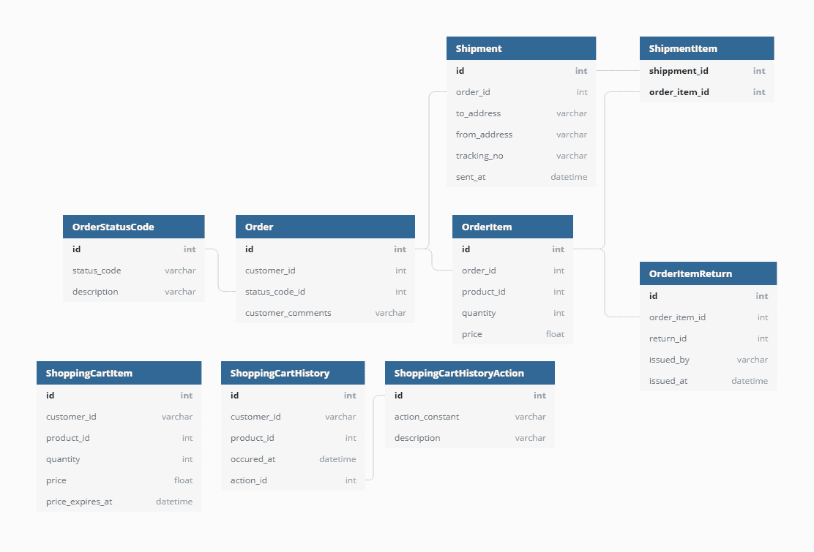
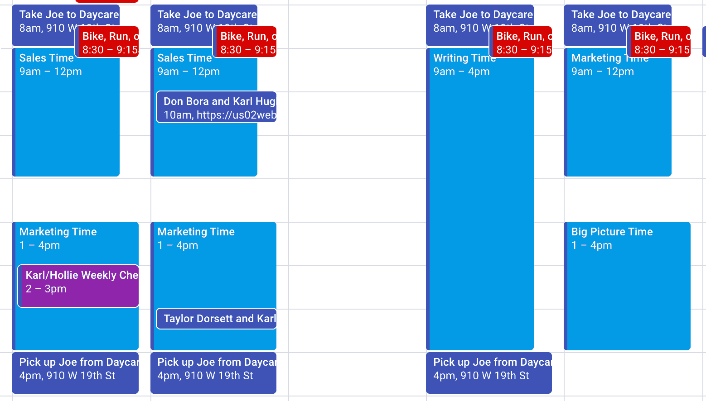

# 软件开发人员的写作技巧——如何成为一名更好的科技作家

> 原文：<https://www.freecodecamp.org/news/writing-tips-software-developers/>

你可能认为软件开发就是写代码，但这不是真的。这项工作的很大一部分是与他人交流。随着我们都转向更远程的工作，书面交流变得越来越重要。

> “在工作的最初几年，工程师大约用 30%的工作日时间写作，而中层管理人员用 50%到 70%的时间写作；据报道，高层管理人员每天有超过 70%甚至高达 95%的时间用于写作。乔恩·莱登斯

去年，我辞去了软件工程经理和 CTO 的工作，开始全职写作。在工程领域工作了 10 年后，我准备转行了，所以有了 6 个月的银行存款，我决定冒险一试。

我很高兴地说，进展非常顺利，我的公司最近因我们的技术写作作品而在 TechCrunch 上被[特别报道。](https://techcrunch.com/2021/07/29/draft-dev-ceo-karl-hughes-on-the-importance-of-using-experts-in-developer-marketing/)

在开始使用 Draft.dev 之前，我已经写了很多年的博客文章和教程，所以我对自己的写作技巧很有信心。但是自从自己出去以后，我学到了很多东西。我也遇到了许多优秀的导师和同行，他们给了我写作的建议。

Photo by [Brad Neathery](https://unsplash.com/@bradneathery?utm_source=unsplash&utm_medium=referral&utm_content=creditCopyText) on [Unsplash](https://unsplash.com/s/photos/write?utm_source=unsplash&utm_medium=referral&utm_content=creditCopyText)

在这篇文章中，我想分享一些我经常与其他软件开发人员分享的写作技巧。这些将帮助你克服所有新作家面临的阻力)*，并有希望给你信心尽早开始写作。*

## *1.从写下你所知道的开始*

> *“没有人一开始就是伟大的作家。开始写你目前知道的事情，并与社区分享。你会惊讶你会影响多少人的生活。”- Eze Sunday，软件开发人员和技术作家*

*为了成为一个更好的作家，你必须经常这样做。这适用于任何技能，但是对于写作来说尤其困难，因为你不能在一页纸上把随机的单词串在一起。你必须写一些关于的东西。*

*克服这一障碍最常见的建议是**开始写你已经知道的事情**。*

*丹尼尔·菲里在 Strapi 负责开发者关系，他告诉我，“从一个你刚刚解决的问题开始，不管你认为它有多微不足道。”*

*他接着指出，即使这个话题已经被广泛地讨论过，你的文章也可以有所不同。“写作是关于视角的，我们每个人都是独一无二的，我们的视角也是如此。”*

*eze 20:10 星期日重申这一点，说，是的，有许多文章。但是，如果你刚刚起步，没有多少好文章能像你希望的那样解释事情。”*

## *2.专注于一些高质量的作品*

*“质量胜于数量，”詹姆斯·希基告诉我。“专注于写高质量的文章，而不是一堆 *ok* 的文章...当你的内容仅仅是 *ok* 的时候，没有人会被打动*

*詹姆斯是高三学生。NET 开发人员、微软 MVP、作者和演讲者，家里有八个年幼的孩子，所以找时间写作总是一个挑战。他的解决办法是对他所写的东西非常有选择性，但是当他进入一个话题时，他会深入下去。*

*你可以在他的作品中看到这一点，比如登上黑客新闻头版的关于电子商务数据模型的。*

*

Diagrams from James Hickey's post on e-commerce data models* 

*我同样发现，我的一些最受欢迎的博客帖子是那些真正深入某个主题的帖子。*

*例如，我的个人博客上最受欢迎的一篇文章是[这篇 4500 字的 API 开发指南](https://www.karllhughes.com/posts/api-development)。我承认，我写了很多短小的作品，但是要说的是，我写得很透彻。*

## *3.完美是足够好的敌人*

*另一方面，不要让你制作最好内容的动力阻止你点击“发布”按钮。*

*在 FusionAuth 负责给新开发者和开发者关系的 Dan Moore 提出了这样的建议:*

> *“完美是足够好的敌人。为了克服这一点，我喜欢设定时间框，然后发表，即使这篇文章并不完美...也许你的帖子不会上黑客新闻的头版，但我保证，如果你不发表，就没有人会看。”*

*许多新作家太专注于他们想法的结构和组织，而不是机制。老实说，读者更容易原谅拼写和语法错误，只要他们能遵循你的逻辑。*

*Alpha Particle 的首席技术官 Keanan Koppenhaver 告诉我，过度依赖完美的语法甚至可能会让你的作品听起来太机械，从而伤害你的作品:*

> *“人们很容易陷入努力使自己的写作尽可能做到最好的境地:拥有完美的语法、出色的句子结构等等。我使用过像[海明威编辑器](https://hemingwayapp.com/)这样的工具来使我的作品“技术上正确”，当我重读我的作品时，它听起来很陈旧，就像是人工智能创作的一样。”*

*

Photo by [Rock'n Roll Monkey](https://unsplash.com/@rocknrollmonkey?utm_source=unsplash&utm_medium=referral&utm_content=creditCopyText) on [Unsplash](https://unsplash.com/s/photos/robot?utm_source=unsplash&utm_medium=referral&utm_content=creditCopyText)* 

## *4.留出时间定期写作*

> *“你会想把(写作)当成任何习惯，并留出时间。我发现有一件事很有用，那就是早上第一件事就是写作，甚至可以早一点起床。我不是一个“早起的人”，但仍然发现这是我写作精力最充沛的时候。在那一点上，没有任何其他事情占据了我的精神能量。”- Adam DuVander，EveryDeveloper 的创始人*

*我以前说过，但我会继续重申这一点:**为了成为一名更好的作家，你必须更经常地这样做**。虽然每个人看起来都不一样。*

*就我个人而言，[我每周都会在日历上划出写作时间](https://draft.dev/learn/technical-content)。我发现，当我专注于写作 4-8 个小时，而不是试图把它塞进一天中的小间隙时，我的工作做得最好。*

**

*当然，不是每个人的工作方式都一样。技术交流专家斯蒂芬妮·莫里洛(Stephanie Morillo)让写作适应更短的时间。*

> *“我使用时间盒:如果我知道我必须写一篇演讲或一篇博客，我会在一天或几天内留出多个 30 分钟的时间段，然后坐下来写。”*

*她指出，这些更小的时间块对她的时间表来说更现实，它允许她取得进展并增加她的产出:“如果你一天写 10 个词或 100 个词或 1000 个词，你仍在朝着你的目标前进。”*

*另一个策略是让写作成为日常习惯。亚历克斯·拉卡托斯(Alex Lakatos)负责开发人员鳄梨时事通讯，他在去年的一段时间里做了一项每日写作挑战:*

> *💡平均来说，养成一个新习惯需要 66 天。离 2021 年还有 65 年，所以我们早点开始这些新年计划怎么样？我将开始:我正试图持续不断地发布内容，所以在今年剩下的时间里，我将尝试每天至少写 100 字。pic.twitter.com/M0dHrJ36ef*
> 
> *— Alex Lakatos 👨‍💻🥑 (@lakatos88) [October 28, 2020](https://twitter.com/lakatos88/status/1321423080095469568?ref_src=twsrc%5Etfw)*