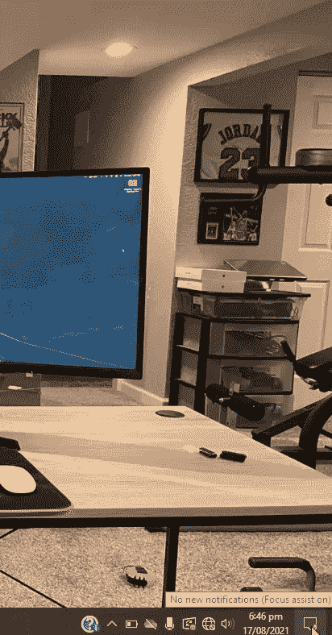
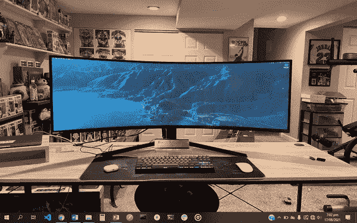
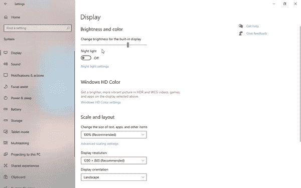
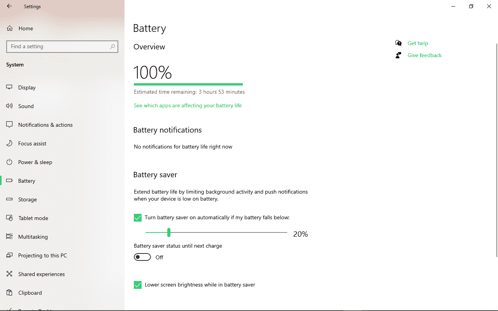

# 如何在 Windows 10 上更改屏幕亮度–亮度设置以及如何调低亮度

> 原文：<https://www.freecodecamp.org/news/how-to-change-screen-brightness-on-windows-10/>

如果你的屏幕太亮，会给你的眼睛带来问题——尤其是如果你整天坐在电脑前编码的话。

这是因为太亮的屏幕会导致眼睛疲劳，进而导致头痛和其他疾病。

如果你经常使用电脑，眼睛健康对最佳性能至关重要。所以在这篇文章中，我将向你展示 5 种不同的方法来改变 Windows 10 电脑的屏幕亮度。

## 如何在 Windows 10 操作中心更改亮度设置

调低或调整屏幕亮度的最快方法是在操作中心。

要更改屏幕亮度，请单击任务栏最右侧的通知图标。你可以使用一个滑块来增加或减少屏幕亮度。

如果您没有看到滑块立即出现，请单击“展开”以显示它。

## 如何更改 Windows 移动中心的亮度设置

另一种快速更改屏幕亮度的方法是在 Windows 移动中心进行更改。

有几种方法可以到达那里。一种方法是右键单击电池电量计，然后选择“Windows 移动中心”。另一种方法是右键单击开始菜单(Windows 徽标)，然后选择“移动中心”。

您将看到的第一个选项卡是一个滑块，用于将屏幕亮度调节到您想要的任何水平。

## 如何在 Windows 10 设置中更改亮度设置

您也可以在设置菜单中调整亮度。

**第一步:**点击开始菜单(Windows 图标)

**第二步:**点击设置

**第三步:**打开系统，然后点击显示

**第四步:**在亮度和颜色的正下方，使用滑块将屏幕亮度调整到适合您的水平。向左滑动可调低屏幕亮度，向右滑动可调高屏幕亮度。

如果您喜欢使用键盘快捷键，请按住 Windows + I 启动“设置”,然后点按“显示”来访问用于增加和降低屏幕亮度的滑块。

## 如何根据电池寿命自动更改亮度设置

这对你的眼睛和电脑都是一个好主意。Windows 10 有一个功能，当你的电池寿命达到/低于某个百分比时，你可以调低屏幕亮度。

为此，请按照以下步骤操作:

**第一步:**点击开始，设置，然后系统。或者直接按住 Win + I。

**第二步:**点击电池

**步骤 3:** 在“电池节电”下，选中“如果我的电池电量低于以下，自动打开电池节电”

**步骤 4:** 使用滑块选择您希望打开节电模式的百分比

**步骤 5:** 在省电模式下检查较低的屏幕亮度

## 如何使用键盘快捷键更改屏幕亮度

大多数键盘都有降低或提高屏幕亮度的快捷键，尤其是当你使用笔记本电脑时。

这两个键通常有一个太阳图标，一个向下的箭头表示调低亮度，另一个向上的箭头表示调高亮度。有些根本没有箭头，只有太阳图标。

最常见的键盘快捷键组合是功能键(fn) +用于调低或调高亮度的指定键。

除了上面我分享的 5 种方法，你可以根据环境(周围)亮度自动调节亮度，但并不是所有的 Windows 10 电脑都能做到这一点。

要访问此功能，请打开设置，单击系统，然后显示。如果您能够看到“当光线变化时自动改变亮度”，则您的电脑具有可以检测环境光线的传感器。如果您看不到它，则您的电脑无法使用此功能。

## 包扎

我希望这篇文章能帮助你熟悉降低 Windows 10 电脑亮度的各种方法。这将帮助你保护你的眼睛，在工作中表现得更好。

感谢您的阅读，祝您愉快。