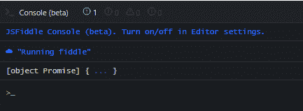
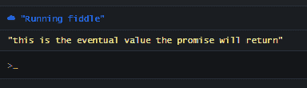
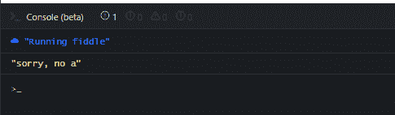

# 什么是承诺？JavaScript 向初学者承诺

> 原文：<https://www.freecodecamp.org/news/what-is-promise-in-javascript-for-beginners/>

如果你是 JavaScript 初学者，你可能很难理解承诺到底是什么。

我最近在 Twitter 上发表了这个帖子，并被回复震惊了。所以我决定将这篇文章扩展成 JavaScript promises 的入门教程。

我读了很多关于承诺的文章，问题是这些指南中有很多没有以一种相关的方式解释它们。人们不理解 JavaScript 中的承诺是什么，因为他们不知道它是关于什么的，以及它如何以简单和相关的方式表现。

所以在这篇文章中，我将告诉你一个小故事，解释什么是承诺，以及它们是如何运作的。我还将通过一些例子向您展示如何在 JavaScript 中使用承诺。

## JavaScript 中的承诺是什么？

想象一下，你正在为你公司的一个职位面试求职者。

一个年轻人疯狂地进来面试。当他的面试即将开始时，他意识到自己忘记带简历了。

扫兴，对吧？

不过，他并没有被吓倒。他很幸运，他有一个室友，当时还在家里。

他很快打电话给他的室友，请他帮忙。他恳求他的室友帮忙找到他的简历。他的室友承诺一旦他有事情要报告，他就会回短信。

假设简历最终被找到，他可以回复:

> “成功了，我找到你的简历了！”

但如果他没有找到，他应该回一条失败信息，说明他找不到简历的原因。例如，他可能会把这条信息发给正在面试的朋友:

> "对不起，我找不到你的简历，因为你保险箱的钥匙不见了。"

与此同时，面试继续按计划进行，面试官坚持要找到简历，而不是实际的简历。此时，面试官将简历发送的状态设置为待定。

受访者回答了他被问到的所有问题。但最终，他的就业仍然取决于他简历的最终状态。

他的室友终于回了短信。正如我们之前讨论过的，如果他没有找到简历，他会和你一起分享这次失败以及他没有找到的原因。

当这种情况发生时，面试将会结束，被面试者将会被拒绝。

另一方面，如果室友发现了简历，他会很高兴地告诉他的朋友他成功了，他会继续前进，实现他得到工作的希望。

## 那么这如何转化为 JS 代码呢？

室友承诺找到简历并回复，这与我们在 JavaScript 中定义承诺的方式是同义词。代码不会直接或立即返回值。相反，它返回一个承诺，即它最终将在以后提供该值。

JavaScript 中的承诺是异步的，这意味着需要时间来解决或完成。就像搜索求职者的简历需要时间来完成一样。

出于这个原因，面试官决定不坐以待毙，所以他们开始面试候选人，并承诺会投递简历。我们承诺会返还一份简历，而不是实际的简历。

JS 引擎也不会无所事事地等待——它开始执行代码的其他部分，等待承诺的返回值。

消息文本包含简历搜索的状态消息。对于 JavaScript 承诺，这也称为返回值。

如果消息是“成功的”，我们将继续签署候选人，并授予他的职位。如果失败，我们就拒绝他的申请。

对于 JavaScript 承诺，我们通过使用回调函数(承诺处理程序)来完成[。这些函数在嵌套的`then()`方法中定义。](https://www.freecodecamp.org/news/javascript-callback-functions-what-are-callbacks-in-js-and-how-to-use-them/)

要指定要调用的回调，可以使用以下两个函数:

*   `resolve(value)`:表示异步任务成功。这将调用`then()`处理程序中的实现回调。
*   `reject(error)`:这表示试图运行异步任务时出错。这将调用`then()`处理程序中的拒绝回调。

如果承诺成功，将调用实现回调。如果承诺被拒绝，则被拒绝的回叫将被调用。

承诺只是尚未完成的异步任务的占位符。当您在脚本中定义 promise 对象时，它不是立即返回值，而是返回一个 promise。

## 如何用 JavaScript 写承诺

您可以在 JavaScript 中定义一个承诺，方法是调用`Promise`类并像这样构造一个对象:

```
const myPromise = new Promise((resolve, reject) => {
  setTimeout(() => {
    resolve('this is the eventual value the promise will return');
  }, 300);
});

console.log(myPromise);
```

Code sample one

在控制台中运行它将返回一个`Promise`对象:



然而，构造一个对象并不是定义承诺的唯一方式。您也可以使用内置的`Promise` API 来实现同样的事情:

```
const anotherPromise = Promise.resolve("this is the eventual value the promise will return")

console.log(anotherPromise);
```

Code sample two

虽然第一个代码示例中的承诺将在使用`this is the eventual...`消息履行承诺之前等待 3 秒钟，但是第二个代码示例中的承诺将使用相同的消息立即履行承诺。

## JavaScript 中拒绝的承诺

承诺也可以被拒绝。大多数情况下，拒绝的发生是因为 JS 在运行异步代码时遇到了某种错误。在这种情况下，它会调用`reject()`函数。

下面是一个简单而做作的例子，说明承诺如何被拒绝:

```
const myPromise = new Promise((resolve, reject) => {
  let a = false;
  setTimeout(() => {
    return (a) ? resolve('a is found!'): reject('sorry, no a');
  }, 300);
}); 
```

Code example three

你能想到这个承诺被拒绝的原因吗？如果你说“因为`a`不是假的”，恭喜你！

第三个代码示例中的承诺将在三秒钟的超时后解析为拒绝，因为`(a)?`语句解析为 false，这将触发`reject`。

## 如何将承诺与`then()`连锁

当承诺最终返回一个值时，您通常会希望用这个返回值做一些事情。

例如，如果您正在发出一个网络请求，您可能希望访问该值并在页面上为用户显示它。

您可以定义两个回调函数，希望在承诺被履行或拒绝时调用这两个函数。这些函数在嵌套的`then()`方法中定义:

```
const anotherPromise = new Promise((resolve, reject) => {
  setTimeout(() => {
    resolve('this is the eventual value the promise will return');
  }, 300);
});

// CONTINUATION
anotherPromise
.then(value => { console.log(value) }) 
```

Code example four

运行此代码将在三秒钟后在控制台中显示实现消息:



请注意，您可以嵌套任意多的承诺。每一步都将在前一步之后执行，接受前一步的返回值:

```
const anotherPromise = new Promise((resolve, reject) => {
  setTimeout(() => {
    resolve('this is the eventual value the promise will return');
  }, 300);
});

anotherPromise
.then(fulfillFn, rejectFn)
.then(fulfilFn, rejectFn)
.then(value => { console.log(value) })
```

Code example five

但是我们错过了一些重要的东西。

永远记住,`then()`方法必须同时接受实现处理程序和拒绝处理程序。这样，如果承诺得到履行，则调用第一个，如果承诺被错误拒绝，则调用第二个。

代码示例 4 和 5 中的承诺不包括第二个处理程序。因此，假设遇到了错误，将没有拒绝处理程序来处理该错误。

如果您只打算在`then()`中定义一个回调函数(也称为实现处理程序)，那么您将需要在承诺链的底部嵌套一个`catch()`方法来捕捉任何可能的错误。

### 如何在 JS 中使用`catch()`方法

无论何时在承诺链的任何一点遇到错误，都会调用`catch()`方法:

```
const myPromise = new Promise((resolve, reject) => {
  let a = false;
  setTimeout(() => {
    return (a) ? resolve('a is found!'): reject('sorry, no a');
  }, 300);
}); 

myPromise
.then(value => { console.log(value) })
.catch(err => { console.log(err) }); 
```

Code example six

由于`myPromise`最终会被拒绝，嵌套`then()`中定义的函数将被忽略。相反，`catch()`中的错误处理程序将会运行，它会将以下错误消息记录到控制台:



## 包扎

JavaScript 承诺是一个非常强大的特性，可以帮助您在 JavaScript 中运行异步代码。在大多数使用 JavaScript 的职位面试中，你的面试官可能会问一个关于承诺的问题。

在本文中，我用简单的术语解释了什么是承诺，并通过一些代码示例展示了它的基本实际用法。

我希望你能从这篇文章中得到一些有用的东西。如果你喜欢这样的编程相关教程，你应该[看看我的博客](https://ubahthebuilder.tech/user-authentication-vs-user-authorization-what-do-they-mean-in-back-end-web-development)。我经常在那里发表关于软件开发的文章。

感谢您的阅读，再见。

********P/S********:如果你正在学习 JavaScript，我创作了一本电子书，用手绘数字笔记教授 50 个 JavaScript 主题。[点击这里查看](https://ubahthebuilder.gumroad.com/l/js-50)。