# 如何使用 GitHub Actions 自动化 Android 应用程序开发

> 原文：<https://www.freecodecamp.org/news/use-github-actions-to-automate-android-development/>

我们每天都要做许多重复性的工作。它们可能有点无聊、困难和单调。

但是你可以把这些日常任务委派给别人，让别人替你做，而不是埋头苦干。这样，你可以有更多的时间去做你想做的事情。你可以有时间放松一下。

如果你曾经开发过 Android 应用程序，你就会知道有些任务有多乏味:

*   运行测试
*   确保应用程序在合并新代码时编译
*   构建和发布应用程序。

那么，我们应该把这些任务交给谁呢？另一个同事？他们可以把它传递给其他人，不会占用任何人的时间。另外，我们不想让我们的同事筋疲力尽。解决办法？

向 GitHub Actions 问好。👐

## 什么是 GitHub 动作？

GitHub 动作是当我们的存储库中发生事情时我们可以触发的命令。动作的核心是一个配置文件，其中包含一系列命令，这些命令描述了:

*   需要发生什么
*   该发生的时候

该配置文件采用 YAML 格式(。yml ),下面是一个例子:

```
name: My GitHub Action

on: pull_request

jobs:
  build:

    runs-on: ubuntu-latest

    steps:
      - uses: actions/checkout@v1
```

我们来分解一下上面的例子:

1.  我们给我们的动作命名(我的 GitHub 动作)[ **可选]**
2.  我们表示这个动作应该何时运行(当一个拉请求被打开时)
3.  我们开始一个任务(作业)列表，一旦这个动作被触发，这些任务就应该发生
4.  第一个是**构建**动作
5.  **runs-on** 命令告诉 GitHub 哪个运行程序将执行这个任务(这是一个虚拟服务器，你可以在 Windows/Mac/Linux 之间选择)
6.  每个作业可以有许多阶段，这些阶段由关键字**步骤**组合在一起
7.  **使用**关键字告诉脚本要执行什么动作

这是一个很短的例子，没有展示 GitHub 动作的所有特性，但是它提供了配置文件的结构。

在接下来的部分中，我们将创建有助于保持开发周期高效和有效的行动。

注意，所有的 GitHub Actions 文件都需要驻留在项目主文件夹下的 **路径中。github/工作流**:

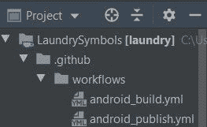

## 如何为拉请求创建 GitHub 动作

无论您是单独从事一个项目还是作为团队的一员，确保您的应用程序是稳定的都是至关重要的。因此，无论何时您考虑合并一个 pull 请求，确保您的应用程序正确编译并且所有测试都通过是完全有意义的。

我们已经在示例中展示了如何在我们的存储库中签出代码。在此操作中，我们将包括以下步骤:

1.  设置 JDK 版本
2.  更改虚拟环境的权限
3.  运行测试(如果我们有)
4.  构建应用程序

```
name: Android Build

on: pull_request

jobs:
  build:

    runs-on: ubuntu-latest

    steps:
      - uses: actions/checkout@v1

      - name: Set Up JDK              // 1
        uses: actions/setup-java@v1
        with:
          java-version: 1.8

      - name: Change wrapper permissions  // 2
        run: chmod +x ./gradlew

      - name: Run Tests                   // 3
        run: ./gradlew test

      - name: Build Project               // 4
        run: ./gradlew assemble
```

从上面可以看出，每一步都有自己特定的属性。

我不会逐一介绍它们，因为您可以通过文档自行完成。大多数步骤的共同点是 **run** 关键字。此属性说明要执行什么命令。

✋:我们需要第二步，让虚拟环境可以运行 gradle 命令。没有它，它就不能。

## 如何进行 GitHub 操作来发布应用程序

一旦你第一次发布了你的应用程序，重新发布它就变得有点像一件苦差事。

你必须确保版本升级，构建 APK，通过 Google Play 控制台提交，以及其他繁琐的任务。

我们可以用另一个 GitHub 动作来自动化这个过程。这个动作比前一次稍微复杂一点，因为它需要使用 [GitHub 秘密](https://docs.github.com/en/actions/reference/encrypted-secrets)。

简而言之，GitHub Secrets 是一种将敏感信息存储为存储库环境变量的方式。我们将需要使用它们，因为:

1.  我们需要在申请表上签名
2.  我们将允许此操作向谷歌 Play 商店提交我们构建的应用程序

我们先来了解一下如何创建 GitHub Secrets。

*   在存储库的主页中，点击**设置**选项卡


*   在左侧菜单上，会有一个名为**秘密**的选项

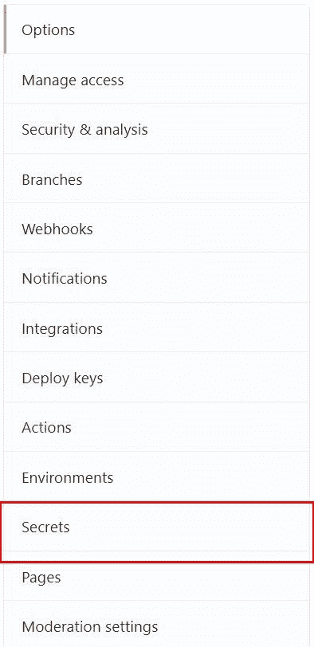

*   要创建密码，请按下**新建存储库密码**按钮

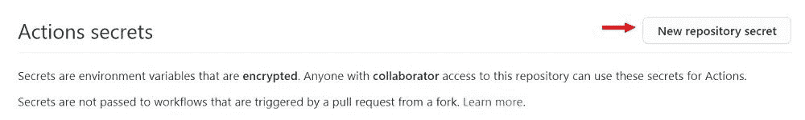

既然我们已经解决了这个问题，让我们来看看发布应用程序的脚本:

```
name: Android Publish

on:
  workflow_dispatch:

jobs:
  build:

    runs-on: ubuntu-latest

    steps:
      - uses: actions/checkout@v1

      - name: Set Up JDK
        uses: actions/setup-java@v1
        with:
          java-version: 1.8

      - name: Change wrapper permissions
        run: chmod +x ./gradlew

      - name: Run Tests
        run: ./gradlew test

      - name: Build Project
        run: ./gradlew build

      - name: Build Release AAB      // 1
        run: ./gradlew bundleRelease

      - name: Sign AAB               // 2
        uses: r0adkll/sign-android-release@v1
        with:
          releaseDirectory: app/build/outputs/bundle/release
          signingKeyBase64: ${{ secrets.SIGN_KEY }}
          alias: ${{ secrets.ALIAS }}
          keyStorePassword: ${{ secrets.STORE_KEY_PASSWORD }}
          keyPassword: ${{ secrets.KEY_PASSWORD }}

      - name: Deploy to Play Store   // 3
        uses: r0adkll/upload-google-play@v1
        with:
          serviceAccountJsonPlainText: ${{secrets.SERVICE_ACCOUNT}}
          packageName: com.tomerpacific.laundry
          releaseFiles: app/build/outputs/bundle/release/app-release.aab
          track: production
```

您可能已经注意到，这个操作将在 workflow_dispatch 上运行**。那是什么意思？基本上，它允许从 GitHub 本身手动触发这个动作。**

当然，您可以决定在主分支上发生推送时运行这个操作(例如)。

上面代码片段中标有 1 的步骤触发构建一个。我们申请的 aab。然后，就像我们在 Android Studio 中构建它一样，我们必须签署这个。aab 文件。

这是 GitHub 秘密第一次发挥作用。我们需要为以下方面创造秘密:

*   签名密钥(秘密。SIGN_KEY)
*   密钥别名(机密。别名)
*   存储密钥密码(秘密。存储密钥密码)
*   密钥密码(秘密。密钥 _ 密码)

一旦我们签署了。我们可以将它部署到谷歌 Play 商店。在这一步还有一点工作要做，因为我们需要允许这个 GitHub 动作在 Google Play 上为我们部署应用程序。但是，等等，我们该怎么做？我们使用[服务账户](https://cloud.google.com/compute/docs/access/service-accounts)。

### 如何创建服务帐户

> 服务帐户是您创建的一个实体，它告诉与之交互的服务或应用程序它代表您进行操作。

在我们的例子中，我们的 GitHub 动作将与谷歌 Play 商店交互，这样它就可以上传我们应用程序的新版本。

要创建服务帐户，请转到 Google Cloud 控制台。如果您在那里没有帐户，请确保创建一个。然后，在主页面的左侧菜单中，会有一个名为“服务帐户”的列表项。

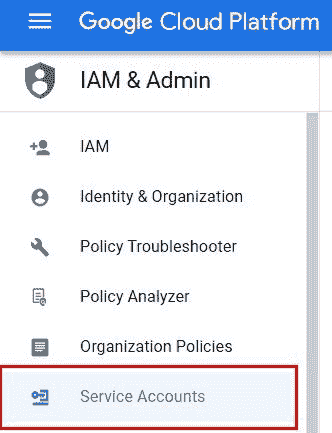

一旦你点击它，在窗口的右边你会看到你已经拥有的任何服务帐户。

我们想要创建一个新的，在窗口的顶部有一个按钮来完成这个任务。


在打开的窗口中，您必须输入服务的名称，也可以输入描述。

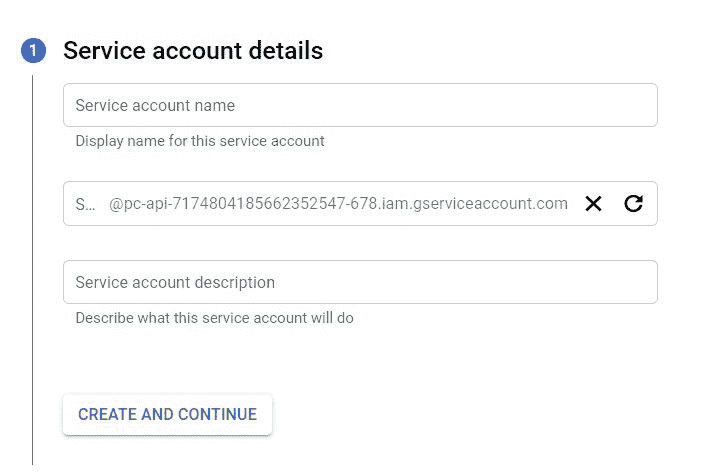

此处给出的名称将是该服务帐户的唯一标识符。

在第二步中，将要求您为该服务帐户赋予一个角色。从**下拉菜单中选择一个角色**，选择基本→编辑器。

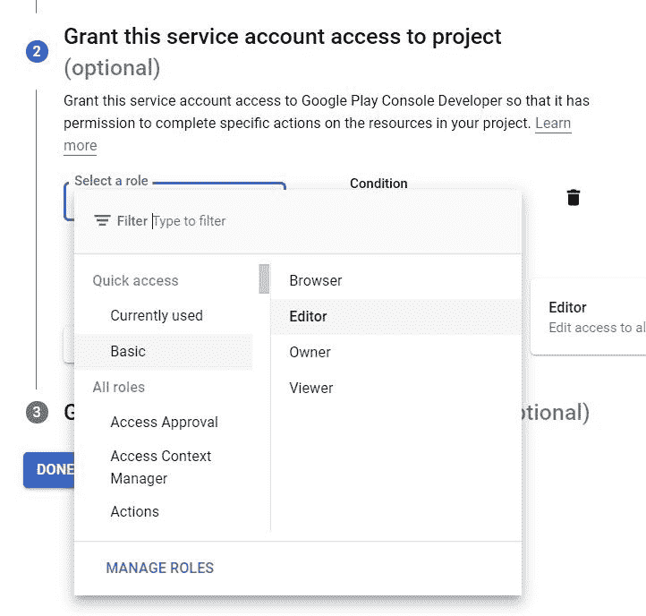

最后，在第三步中，在“授予用户对此服务帐户的访问权限”部分的两个位置填写您的电子邮件:

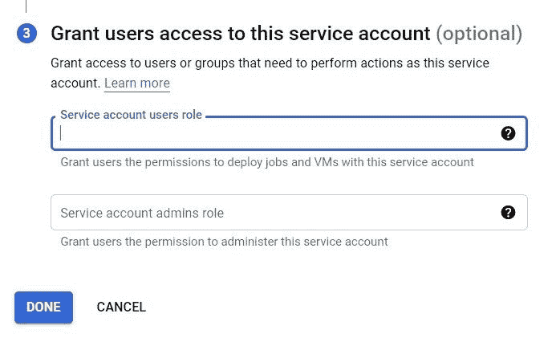

按下“完成”按钮后，您需要为此服务帐户创建一个密钥。该操作将使用此密钥由 Google Play 识别。

要创建密钥，请在主服务帐户屏幕中单击操作标签下的三个水平点。在出现的菜单中，选择**管理密钥**。

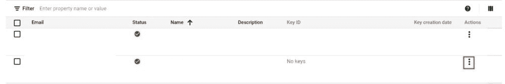

在此窗口中，我们将通过选择**新密钥**按钮并从出现的菜单中选择“创建新密钥”来创建密钥。

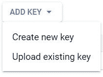

现在我们可以选择新密钥的格式——默认格式是 JSON，我们将保持选中状态。单击创建。

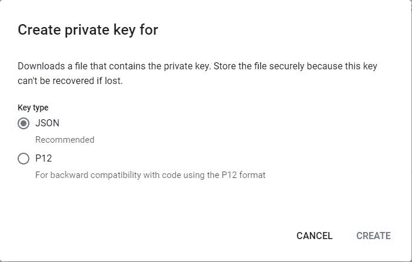

完成后，一个文件将被下载到您的计算机上。请确保保留此文件，因为它包含与您的服务帐户相关的所有数据，您将无法再次下载它。

我们将获取这个文件的内容，然后用它创建一个 GitHub secret(**secrets)。服务 _ 账户**。

最后但同样重要的是，我们需要让 Google Play 知道这个服务帐户。这样做需要我们登录我们的 Google Play 控制台帐户，并前往**设置→API 访问**。

如果您向下滚动页面，您会看到一个标题为“服务帐户”的部分。您应该能够看到您之前创建的服务帐户。单击授权访问链接

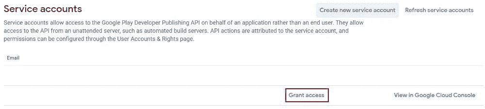

在打开的设置中，转到应用程序权限。在这里，您将选择此服务帐户与哪个应用程序交互。

在帐户权限下，应该检查**发布**部分下的所有内容。我强烈建议你看看所有其他的设置，自己决定什么是你想要的，什么是你想要的。

完成后，点击右下角的**邀请用户**按钮。


发送邀请后，我们可以运行发布到商店操作。

## 如何在 GitHub 中监控我们的行动

要查看为您的存储库定义了哪些操作，请单击 actions 选项卡。该选项卡显示所有已定义的和已经运行的工作流。

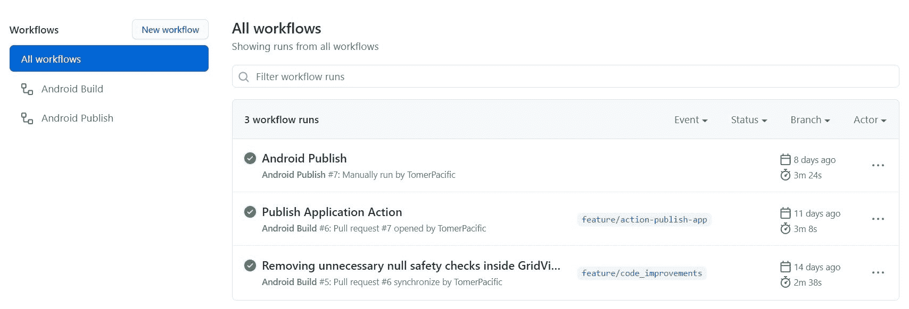

在左侧，您可以看到所有已定义的操作，在右侧，您可以看到所有已运行的操作。如果你想看一个特定的动作，你可以点击它。

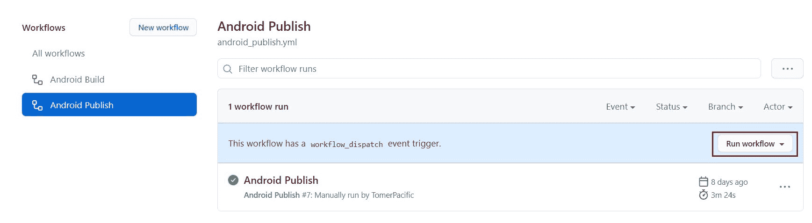

如果动作被定义为在 **workflow_dispatch** 上运行，您将看到一个按钮，允许您运行它(如上图所示)。

如果您想查看某个工作流的特定运行，也可以在主工作流页面中单击其中一个运行来查看。如果其中一个操作运行失败，这将是调查和查看哪里出错的地方。

我们的第一个动作应该是在打开一个拉请求时被触发。如果工作正常，您应该会看到以下内容:

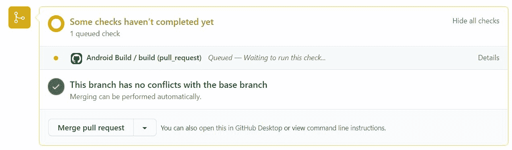

现在你知道了！

## 包扎

到目前为止，我们已经阅读了很长时间，但是我们已经完成了您开始为您的应用程序创建持续集成和持续部署管道所需的所有内容。

如果您有兴趣了解 GitHub 操作是如何设置的，您可以在我这里的一个资源库中查看它们:

[Actions · TomerPacific/LaundrySymbolsAn application written in Kotlin showing the different laundry symbols with an explanation :cyclone: - Actions · TomerPacific/LaundrySymbolsTomerPacificGitHub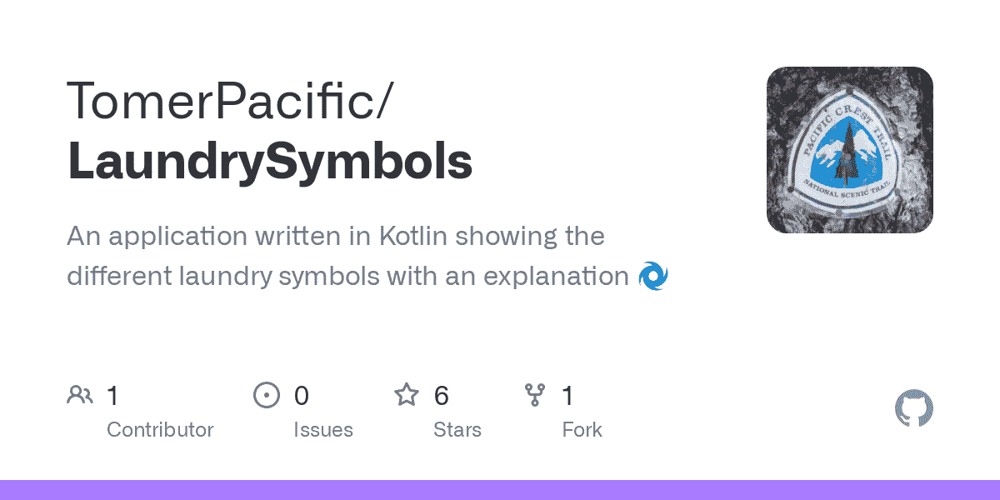](https://github.com/TomerPacific/LaundrySymbols/actions)

要阅读更多关于 GitHub 动作的内容，请点击这里:

[GitHub Actions Documentation - GitHub DocsAutomate, customize, and execute your software development workflows right in your repository with GitHub Actions. You can discover, create, and share actions to perform any job you’d like, including CI/CD, and combine actions in a completely customized workflow.GitHub Docs](https://docs.github.com/en/actions)