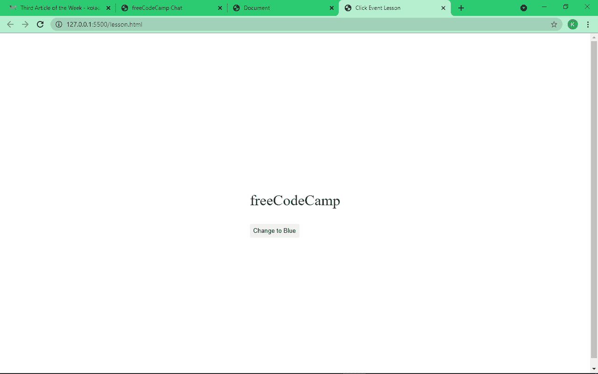
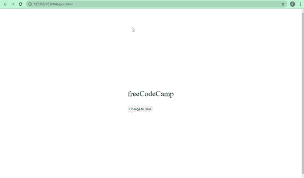
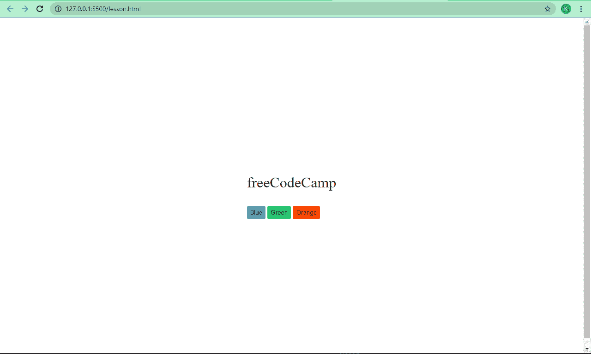
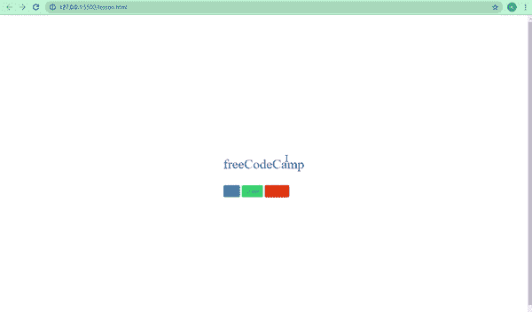
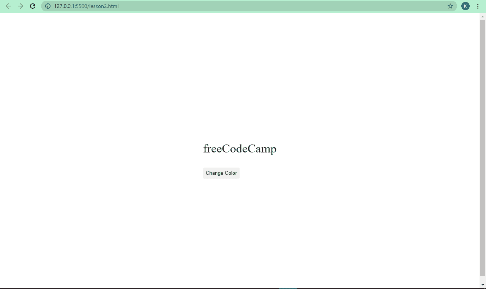
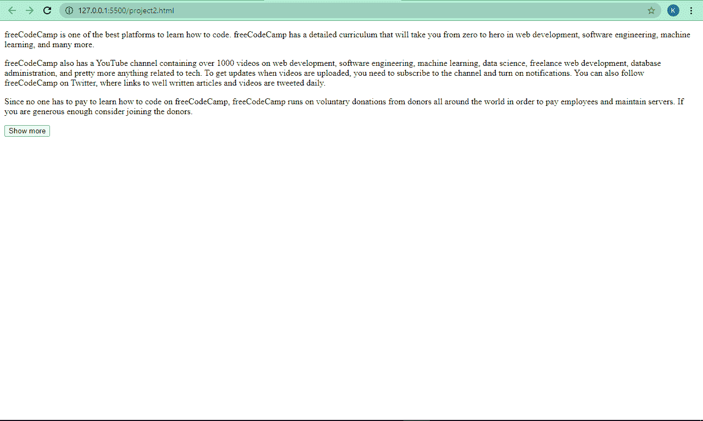
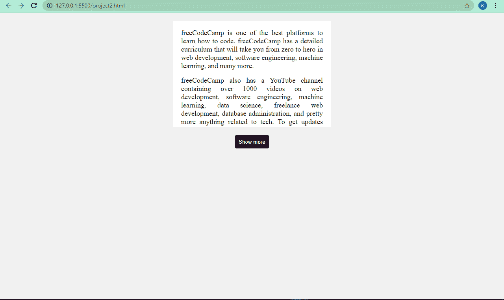
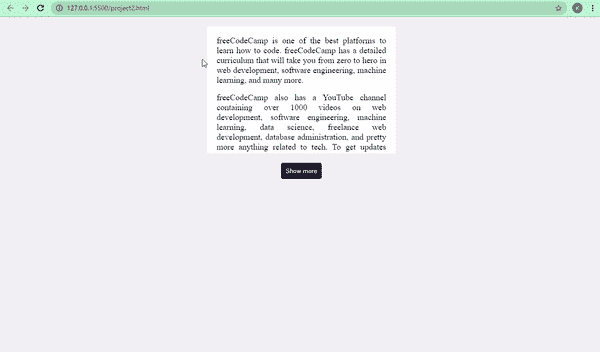

# HTML 按钮 onclick–JavaScript Click 事件教程

> 原文：<https://www.freecodecamp.org/news/html-button-onclick-javascript-click-event-tutorial/>

每当你访问一个网站，你可能会点击一些像链接或按钮。

链接将您带到页面的某个部分、网站的另一个页面或整个另一个网站。另一方面，按钮通常由 JavaScript 事件操纵，因此它们可以触发某些功能。

在本教程中，我们将使用两种不同的方法来探索在 JavaScript 中执行 click 事件的两种不同方式。

首先，我们来看看传统的`onclick`样式，你可以直接从 HTML 页面开始。然后我们将看到更现代的“click”`eventListner`是如何工作的，它可以让你把 HTML 和 JavaScript 分开。

## 如何在 JavaScript 中使用`onclick`事件

当点击按钮时，`onclick`事件执行特定的功能。这可能是当用户提交表单时，当您更改网页上的某些内容时，以及类似的其他情况。

您将想要执行的 JavaScript 函数放在按钮的开始标记中。

### 基本`onclick`语法

```
<element onclick="functionToExecute()">Click</element> 
```

例如

```
<button onclick="functionToExecute()">Click</button> 
```

注意，`onclick`属性纯粹是 JavaScript。它所取的值，也就是您想要执行的函数，说明了一切，因为它就在开始标记中被调用。

在 JavaScript 中，通过调用函数名来调用函数，然后在函数标识符(名称)后加上一个括号。

## `onclick`事件示例

我已经准备了一些带有一点点样式的基本 HTML，所以我们可以将`onclick`事件投入到现实世界的实践中。

```
<div>
  <p class="name">freeCodeCamp</p>
  <button>Change to Blue</button>
</div> 
```

下面是使它看起来更好的 CSS，以及所有其余的示例代码:

```
 body {
   display: flex;
   align-items: center;
   justify-content: center;
   height: 100vh;
      }
p {
   font-size: 2rem;
}

button {
    padding: 7px;
    border: none;
    border-radius: 4px;
    cursor: pointer;
}

button.blue {
    background-color: #3498db;
}

button.green {
    background-color: #2ecc71;
}

button.orange {
   background-color: orangered;
} 
```

所以，在网页上，这是我们有的:


我们的目标是在单击按钮时将文本的颜色改为蓝色。所以我们需要给按钮添加一个`onclick`属性，然后编写 JavaScript 函数来改变颜色。

所以我们需要对我们的 HTML 做一点小小的改变:

```
<div>
  <p class="name">freeCodeCamp</p>
  <button onclick="changeColor()">Change to Blue</button>
</div> 
```

我们要执行的函数是`changeColor()`。所以我们需要将它写在 JavaScript 文件中，或者 HTML 文件中的一个`<script>`标签中。

如果您想在 JavaScript 文件中编写脚本，您需要使用下面的语法在 HTML 中链接它:

```
<script src="path-to-javascript-file"></script> 
```

如果您想在 HTML 文件中编写脚本，只需将它放在 script 标记中:

```
<script>
  // Your Scripts
</script> 
```

现在，让我们编写我们的`changeColor()`函数。

首先，我们需要选择我们想要操作的元素，也就是`<p>`标签里面的 freeCodeCamp 文本。

在 JavaScript 中，你可以用 DOM 的`getElementById()`、`getElementsByClassName()`或`querySelector()`方法来实现。然后将值存储在一个变量中。

在本教程中，我将使用`querySelector()`，因为它更现代，也更快。我也将使用`const`来声明我们的变量，而不是`let`和`var`，因为使用`const`，当变量变成只读时，事情会更安全。

```
const name = document.querySelector(".name"); 
```

现在我们已经选择了文本，让我们写我们的函数。在 JavaScript 中，基本的函数语法如下所示:

```
function funcctionName () {
    // What to do
} 
```

所以让我们写我们的函数:

```
function changeColor() {
    name.style.color = "blue";
} 
```

这是怎么回事？

记住 HTML 中的`changeColor()`是我们将要执行的函数。这就是为什么我们的函数标识符(名称)设置为`changeColor`。如果名称与 HTML 中的内容不相关，它就不起作用。

在 DOM(文档对象模型，指所有的 HTML)中，要改变任何与样式有关的东西，你需要写“style”然后点(。).接下来是您想要更改的内容，可能是颜色、背景色、字体大小等等。

因此，在我们的函数中，我们使用我们声明的 name 变量来获取 freeCodeCamp 文本，然后我们将颜色改为蓝色。

每次单击按钮时，文本的颜色都会变成蓝色:



我们的代码起作用了！

我们可以更进一步，将文本改为更多颜色:

```
<div>
      <p class="name">freeCodeCamp</p>
      <button onclick="changeColor('blue')" class="blue">Blue</button>
      <button onclick="changeColor('green')" class="green">Green</button>
      <button onclick="changeColor('orangered')" class="orange">Orange</button>
</div> 
```

因此，我们要做的是将文本更改为蓝色、绿色和橙红色。

这一次，HTML 中的`onclick`函数接受我们想要将文本更改为的颜色值。这些在 JavaScript 中被称为参数。我们要写的函数也有它自己的，我们称之为“颜色”。

我们的网页有一点改变:



因此，让我们选择我们的 freeCodeCamp 文本，并编写函数将其颜色更改为蓝色、绿色和橙红色:

```
const name = document.querySelector(".name");

function changeColor(color) {
   name.style.color = color;
} 
```

函数中的代码块接受 name 变量(我们存储 freeCodeCamp 文本的地方)，然后将颜色设置为我们传递给 HTML 按钮中的`changeColor()`函数的颜色。


## 如何在 JavaScript 中使用 click `eventListener`

在 JavaScript 中，有多种方法可以做同样的事情。随着 JavaScript 本身的不断发展，我们开始需要分离 HTML、CSS 和 JavaScript 代码，以符合最佳实践。

事件侦听器使这成为可能，因为它们允许您将 JavaScript 与 HTML 分开。您也可以用 onclick 做到这一点，但是这里我们采用另一种方法。

### 基本`eventListener`语法

```
 element.addEventListener("type-of-event", functionToExecute) 
```

现在，让我们使用 click eventListner 将 freeCodeCampt 文本更改为蓝色

这是我们的新 HTML:

```
 <div>
      <p class="name">freeCodeCamp</p>
      <button>Change Color</button>
 </div> 
```

这是它看起来的样子:



这一次在我们的脚本中，我们也需要选择按钮(不仅仅是 freeCodeCamp 文本)。这是因为在我们按钮的开始标签中没有 JavaScript，这很酷。

所以，我们的脚本看起来像这样:

```
const name = document.querySelector(".name");
const btn = document.querySelector("button");

      btn.addEventListener("click", function () {
        name.style.color = "blue";
 }); 
```

我们也可以将我们的功能从`eventListener`中完全分离出来，我们的功能仍然保持不变:

```
btn.addEventListener("click", changeColor);
      function changeColor() {
        name.style.color = "blue";
} 
```


## 如何用 JavaScrpit 构建一个“显示更多”和“显示更少”的按钮

最好的学习方法之一是制作项目，所以让我们利用我们所学的`onclick`和【点击】`eventListner`来做些事情。

当你访问一个博客时，你经常首先看到文章的摘录。然后，您可以点击“阅读更多”按钮来显示其余内容。让我们试着那样做。

这是我们正在处理的 HTML:

```
 <article id="content">
      <p>
        freeCodeCamp is one of the best platforms to learn how to code.
        freeCodeCamp has a detailed curriculum that will take you from zero to
        hero in web development, software engineering, machine learning, and
        more.
      </p>

      <p>
        freeCodeCamp also has a YouTube channel containing over 1000 videos on
        web development, software engineering, machine learning, data science,
        freelance web development, database administration, and pretty much
        anything related to tech. To get updates when videos are uploaded, you
        need to subscribe to the channel and turn on notifications. You can also
        follow freeCodeCamp on Twitter, where links to well written articles and
        videos are tweeted daily.
      </p>

      <p>
        Since no one has to pay to learn how to code on freeCodeCamp,
        freeCodeCamp runs on voluntary donations from donors all around the
        world in order to pay employees and maintain servers. If you are
        generous enough consider joining the donors.
      </p>
    </article>

<button onclick="showMore()">Show more</button> 
```

这是一个简单的 HTML，包含一些关于 freeCodeCamp 的事实。还有一个我们已经附加了`onclick`的按钮。我们要执行的函数是`showMore()`，马上就要写了。

没有 CSS，这是我们有的:


它不是超级丑，但我们可以让它看起来更好，并按照我们想要的方式行事。所以我们有一些 CSS，我将在下面解释:

```
<style>
      * {
        margin: 0;
        padding: 0;
        box-sizing: border-box;
      }

      body {
        background: #f1f1f1;
        display: flex;
        align-items: center;
        justify-content: center;
        flex-direction: column;
      }

      article {
        width: 400px;
        background: #fff;
        padding: 20px 20px 0;
        font-size: 18px;
        max-height: 270px;
        overflow: hidden;
        transition: max-height 1s;
        text-align: justify;
        margin-top: 20px;
      }

      p {
        margin-bottom: 16px;
      }

      article.open {
        max-height: 1000px;
      }

      button {
        background: #0e0b22;
        color: #fff;
        padding: 0.6rem;
        margin-top: 20px;
        border: none;
        border-radius: 4px;
      }

      button:hover {
        cursor: pointer;
        background: #1e1d25;
      }
</style> 
```

CSS 在做什么？

使用通用选择器(`*`)，我们正在移除分配给元素的默认边距和填充，这样我们可以添加我们自己的边距和填充。

我们还将框大小设置为 border-box，这样我们就可以在元素的总宽度和高度中包含填充和边框。

我们用 Flexbox 将主体中的所有东西居中，并给它一个浅灰色的背景。

我们的`<article>`元素，包含文本，宽度为`400px`，白色背景(#fff)，顶部填充 20px，左右 20，底部 0。

里面的段落标签的字体大小是 18px，然后我们给了它们最大的高度`270px`。由于文章元素的最大高度，所有的文本将不会被包含并且会溢出。为了解决这个问题，我们将溢出设置为隐藏，以便一开始不显示文本。

transition 属性确保每次更改都在 1 秒钟后发生。`article`中的所有文本都是两端对齐的，顶部有 20 个像素的空白，所以它不会太贴在页面顶部。

因为我们去掉了默认的页边空白，所以我们的段落被放在了一起。因此，我们设置了 16 个像素的底部边距，以便将它们彼此分开。

我们的选择器`article.open`的属性`max-height`被设置为`1000px`。这意味着任何时候文章元素有一个附加的类`open`，最大高度将从`270px`变为`1000px`以显示文章的其余部分。JavaScript——我们的游戏规则改变者——让这成为可能。

我们设计了一个深色背景的按钮，并把它变成了白色。我们将它的边框设置为 none 来移除按钮上 HTML 的默认边框，我们给它一个边框半径`4px`，所以它有一个稍微圆的边框。

最后，我们使用 CSS 中的`hover`伪类将按钮光标改为指针。当用户将光标悬停在背景上时，背景颜色会略有变化。

好了，这就是 CSS。

我们的页面现在看起来更好了:



我们需要做的下一件事是编写我们的 JavaScript，这样我们就可以看到隐藏的文章的其余部分。

我们的按钮开始标记中有一个`onclick`属性，准备执行一个`showMore()`函数，所以让我们编写这个函数。

我们需要首先选择我们的文章，因为我们必须展示它的其余部分:

```
const article = document.querySelector("#content"); 
```

我们需要做的下一件事是编写函数`showMore()`,这样我们可以在看到文章的其余部分和隐藏它之间切换。

```
function showMore() {
     if (article.className == "open") {
       // read less
       article.className = "";
       button.innerHTML = "Show more";
     } else {
       //read more
       article.className = "open";
       button.innerHTML = "Show less";
     }
  } 
```

这个函数在做什么？

我们在这里使用一个`if…else`语句。这是 JavaScript 的一个关键部分，如果满足某个条件，它可以帮助您在代码中做出决定。

基本语法如下所示:

```
if (condition == "something") {
  // Do something
} else {
  // Do something else
} 
```

在这里，如果文章的类名等于 open(也就是说，我们希望向它添加 open 的类，它在 CSS 中被设置为最大高度 1000px)，那么我们希望看到文章的其余部分。否则，我们希望文章返回到初始状态，其中一部分是隐藏的。

我们通过在 else 块中为它分配一个 open 类来实现这一点，这使它能够显示文章的其余部分。然后我们在 if 块中设置类为空字符串(none)，使其返回初始状态。

我们的代码运行良好，平稳过渡:


我们可以将 HTML 和 JavaScript 分开，但仍然使用`onclick`，因为 onclick 是 JavaScript。因此，可以在 JavaScript 文件中编写，而不是从 HTML 开始。

```
 button.onclick = function () {
     if (article.className == "open") {
       // read less
       article.className = "";
       button.innerHTML = "Show more";
     } else {
       //read more
       article.className = "open";
       button.innerHTML = "Show less";
     }
  }; 
```



我们也可以使用 eventListner 来完成这项工作:

```
<article id="content">
      <p>
        freeCodeCamp is one of the best platforms to learn how to code.
        freeCodeCamp has a detailed curriculum that will take you from zero to
        hero in web development, software engineering, machine learning, and
        many more.
      </p>

      <p>
        freeCodeCamp also has a YouTube channel containing over 1000 videos on
        web development, software engineering, machine learning, data science,
        freelance web development, database administration, and pretty more
        anything related to tech. To get updates when videos are uploaded, you
        need to subscribe to the channel and turn on notifications. You can also
        follow freeCodeCamp on Twitter, where links to well written articles and
        videos are tweeted daily.
      </p>

      <p>
        Since no one has to pay to learn how to code on freeCodeCamp,
        freeCodeCamp runs on voluntary donations from donors all around the
        world in order to pay employees and maintain servers. If you are
        generous enough consider joining the donors.
      </p>
</article>

<button id="read-more">Show more</button> 
```

```
 const article = document.querySelector("#content");
 const button = document.querySelector("#read-more");

button.addEventListener("click", readMore);

function readMore() {
     if (article.className == "open") {
       // Read less
     article.className = "";
     button.innerHTML = "Show more";
   } else {
     article.className = "open";
     button.innerHTML = "Show less";
   }
} 
```

我们的功能保持不变！

## HTML 按钮 onclick 的视频说明

[https://scrimba.com/scrim/cob064720ad708e33a795aefa?pl=pz9wDSk?embed=freecodecamp,mini-header](https://scrimba.com/scrim/cob064720ad708e33a795aefa?pl=pz9wDSk?embed=freecodecamp,mini-header)

[https://scrimba.com/scrim/cof804618b5a4eff5ca0b3dff?pl=pz9wDSk?embed=freecodecamp,mini-header](https://scrimba.com/scrim/cof804618b5a4eff5ca0b3dff?pl=pz9wDSk?embed=freecodecamp,mini-header)

## 结论

我希望这篇教程能帮助你理解点击事件在 JavaScript 中是如何工作的。我们在这里探索了两种不同的方法，所以现在您可以开始在您的编码项目中使用它们了。

感谢阅读，继续编码。