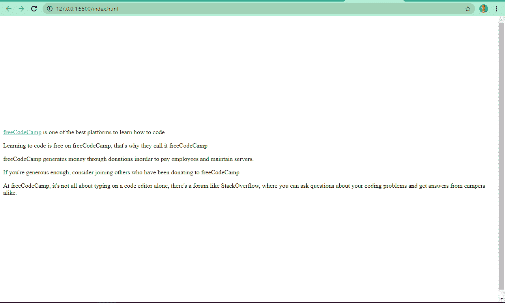
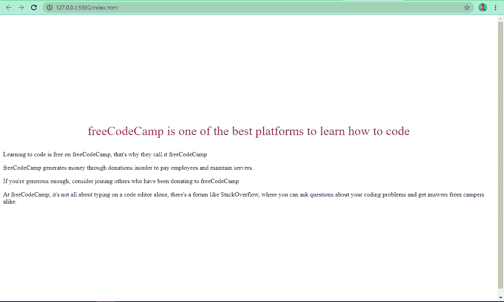
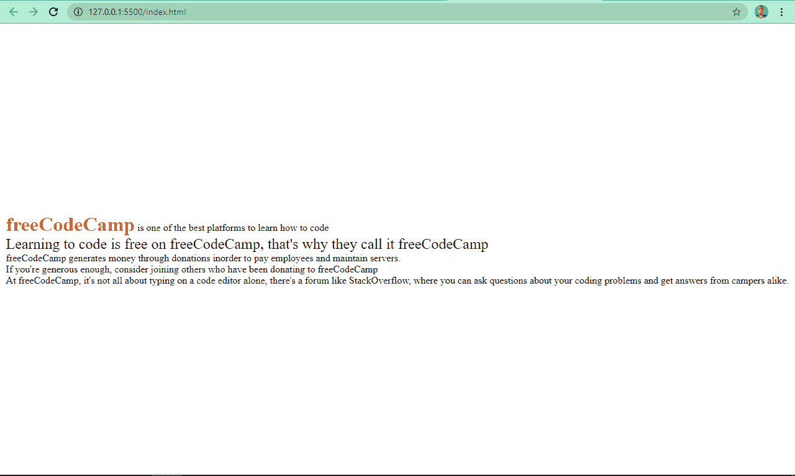

# HTML 和 CSS–内嵌样式、外部样式表、CSS 代码示例

> 原文：<https://www.freecodecamp.org/news/html-and-css-inline-style-external-stylesheet-css-code-examples/>

当你学习 web 开发时，你可能很快就会听说 HTML 和 CSS。那么，这些工具是什么，你如何使用它们？

你可以把 HTML 想象成房子的结构和框架。当你想让建筑看起来更好时，你可以添加油漆、装饰和其他特征。这个装饰就是 CSS。

## 你如何设计 HTML 代码的样式？

HTML 代表超文本标记语言。它是一个基于文本的文档，设计用于在浏览器中显示。为了使 HTML 中包含的文本和其他嵌入元素看起来更好，您需要添加 CSS 或级联样式表。

有 3 种不同的方法可以设置 HTML 的样式:

*   内嵌样式，
*   内部样式(也称为嵌入式 CSS)，以及
*   外部样式表。

在本教程中，我们将尽可能深入地探索这三种样式方法。我们还会看看它们的优缺点，这样你就可以开始在你的编码项目中使用它们，并选择哪一个最适合你。

## HTML 模板

为了使本教程更简单，我准备了一个简单的 HTML 模板，我们将对其进行样式化:

```
<article>
    <p class="paragraph-one">
      freeCodeCamp is one of the best platforms to learn how to code
    </p>
    <p class="paragraph-two">
      Learning to code is free on freeCodeCamp, that's why they call it
      freeCodeCamp
    </p>
    <p class="paragraph-three">
      freeCodeCamp generates money through donations inorder to pay employees
      and maintain servers.
    </p>
    <p id="paragraph-four">
      If you're generous enough, consider joining others who have been
      donating to freeCodeCamp
    </p>
    <p class="paragraph-five">
      At freeCodeCamp, it's not all about typing on a code editor alone,
      there's a forum like StackOverflow, where you can ask questions about
      your coding problems and get answers from campers alike.
    </p>
</article> 
```



## HTML 中的内联样式

当您使用内联样式时，您可以使用 style 属性将它们直接添加到 HTML 标记中。

例如，在我们的 HTML 代码中，我们可以通过在开始标记中编写 CSS 来为任何段落分配颜色。

通常还会删除分配给链接的默认下划线和颜色，所以我们也可以在开始的`<a>`标签中这样做。

```
<article>
   <p
     class="paragraph-one"
     style="color: darkmagenta; font-size: 2rem; text-align: center"
   >
     <a href="freecodecamp.org" style="text-decoration: none; color: crimson"
       >freeCodeCamp</a
     >
     is one of the best platforms to learn how to code
   </p>
   <p class="paragraph-two">
     Learning to code is free on freeCodeCamp, that's why they call it
     freeCodeCamp
   </p>
   <p class="paragraph-three">
     freeCodeCamp generates money through donations inorder to pay employees
     and maintain servers.
   </p>
   <p id="paragraph-four">
     If you're generous enough, consider joining others who have been
     donating to freeCodeCamp
   </p>
   <p class="paragraph-five">
     At freeCodeCamp, it's not all about typing on a code editor alone,
     there's a forum like StackOverflow, where you can ask questions about
     your coding problems and get answers from campers alike.
   </p>
 </article> 
```

你能看到第一段现在可读性更差了吗？这是使用内联样式的缺点之一，我们将在下面看到。

我们的网页现在看起来像下面的截图:



### 内嵌样式的优点

*   适合快速修复。
*   采用最高的特异性，因此它覆盖任何具有内联样式或外部样式表的样式集。
*   您不需要在文件之间切换或滚动到 head 部分来修改 CSS
*   浏览器总是在显示网页之前下载 HTML、CSS 和 JavaScript 文件，所以使用内联 CSS 下载的文件更少。

### 内嵌样式的缺点

*   使 HTML 变得混乱，更难维护，可读性更差。
*   不能在多个 HTML 文件中重复使用
*   您最终可能会覆盖内部样式或外部样式表
*   您的造型选择有限

## HTML 中的内部样式

当使用内部样式时，将样式嵌入到 HTML 文件的样式标记中。您通常将它们放在头部，但是它在任何地方都有效，甚至在开始和结束 HTML 标记之外(但是不要这样做，因为这是一个坏习惯)。

我们可以对 HTML 代码应用一些内部样式，如下所示:

```
<style>
   * {
     padding: 0;
     margin: 0;
     box-sizing: border-box;
 }
 body {
      display: flex;
      align-items: center;
      justify-content: center;
      height: 100vh;
   }

 .paragraph-two {
     font-size: 1.5rem;
      }

 .paragraph-one a {
      text-decoration: none;
      color: crimson;
      font-size: 2rem;
      font-weight: bolder;
     }
 </style>
</head>
 <body>
 <article>
   <p class="paragraph-one">
     <a href="freecodecamp.org">freeCodeCamp</a>
     is one of the best platforms to learn how to code
   </p>
   <p class="paragraph-two">
     Learning to code is free on freeCodeCamp, that's why they call it
     freeCodeCamp
   </p>
   <p class="paragraph-three">
     freeCodeCamp generates money through donations inorder to pay employees
     and maintain servers.
  </p>
   <p id="paragraph-four">
     If you're generous enough, consider joining others who have been
     donating to freeCodeCamp
   </p>
   <p class="paragraph-five">
     At freeCodeCamp, it's not all about typing on a code editor alone,
     there's a forum like StackOverflow, where you can ask questions about
     your coding problems and get answers from campers alike.
   </p>
 </article> 
```

您可以看到，当我们使用内部样式时，现在有了更多的样式选择。

### 内部风格的优点

*   减少浏览器需要下载的文件数量
*   没有文件之间的切换来修改 CSS
*   更多的样式选项，因为您可以使用组合子、类选择器和 id 选择器

如果你想知道什么是组合子，它们是用来连接不同选择器的符号。一个例子是空格()，用于选择元素的下一个后代，比如跟在`div`后面的任何段落(`p`)。

类选择器用点(`.`)表示，id 选择器用 a `#`表示。

### 内部风格的缺点

*   它们不能在多个 HTML 文件中重用。要将相同的样式添加到另一个 HTML 文件中，您需要再次将它包含在文件头中
*   它增加了 HTML 文件的大小，这可能会导致较慢的加载速度。

我们的网页现在看起来是这样的:


## HTML 中的外部样式表

这被认为是样式化 HTML 代码的最佳方式。外部样式表完全独立于 HTML，您将它们放在一个 CSS 文件中(扩展名为`.css`)。

要在 HTML 中使用外部样式表，可以在头部用 link 标签将它们链接起来。

链接标记的基本语法如下所示:

```
<link rel="stylesheet" href="path-to-css-file"> 
```

为了设计我们的 HTML 代码，我们需要创建一个 CSS 文件并链接它。链接后，我们的完整 HTML 文件现在看起来像这样:

```
<!DOCTYPE html>
<html lang="en">
  <head>
    <meta charset="UTF-8" />
    <meta http-equiv="X-UA-Compatible" content="IE=edge" />
    <meta name="viewport" content="width=device-width, initial-scale=1.0" />
    <title>How to Style HTML</title>
    <link rel="stylesheet" href="styles.css" />
  </head>
  <body>
    <article>
      <p class="paragraph-one">
        <a href="freecodecamp.org">freeCodeCamp</a>
        is one of the best platforms to learn how to code
      </p>
      <p class="paragraph-two">
        Learning to code is free on freeCodeCamp, that's why they call it
        freeCodeCamp
      </p>
      <p class="paragraph-three">
        freeCodeCamp generates money through donations inorder to pay employees
        and maintain servers.
      </p>
      <p id="paragraph-four">
        If you're generous enough, consider joining others who have been
        donating to freeCodeCamp
      </p>
      <p class="paragraph-five">
        At freeCodeCamp, it's not all about typing on a code editor alone,
        there's a forum like StackOverflow, where you can ask questions about
        your coding problems and get answers from campers alike.
      </p>
    </article> 
</body>
</html> 
```

您可能想知道为什么 CSS 文件的路径只有`style.css`，它也是文件名。这是因为 HTML 和 CSS 文件在同一个目录中。如果样式表在另一个文件夹中，则必须在文件名前包含文件夹名称。

让我们在外部样式表中对 HTML 应用一些样式:


### 外部样式表的优点

*   使样式可在多个 HTML 文件中重用
*   更容易维护
*   它在初始加载时由浏览器缓存，使得页面呈现更容易，并且在后续页面加载后耗时更少
*   它可以托管在 CDN 上，因此带宽变得最小，并且可以很容易地在世界各地传输。

### 外部样式表的缺点

*   它增加了浏览器需要下载的文件数量
*   浏览器必须为每个文件发出额外的 HTTP 请求

## 结论

我希望这篇教程能帮助你学习各种风格化 HTML 的方法。

而且现在你也知道了每种方法的利弊，所以你可以挑一个最适合你的。

感谢阅读，继续编码。