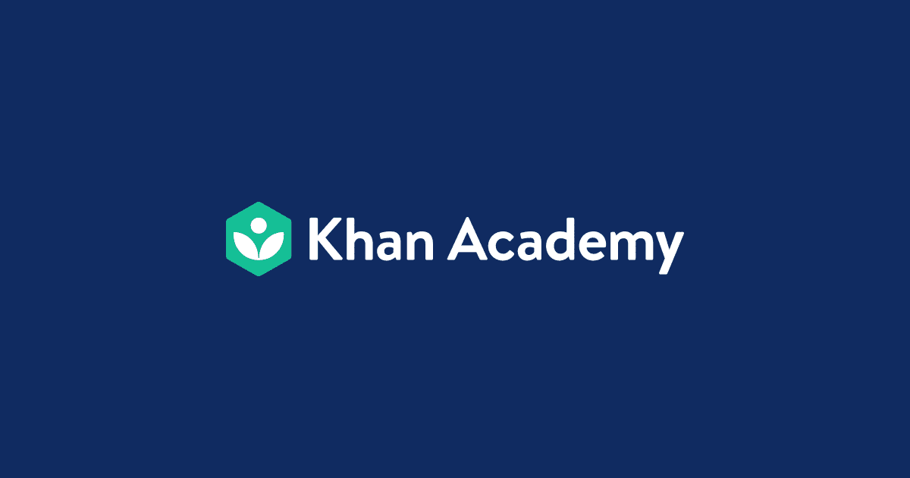
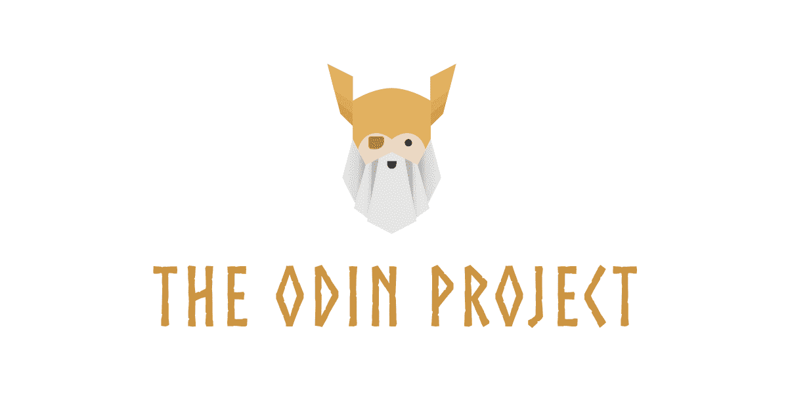
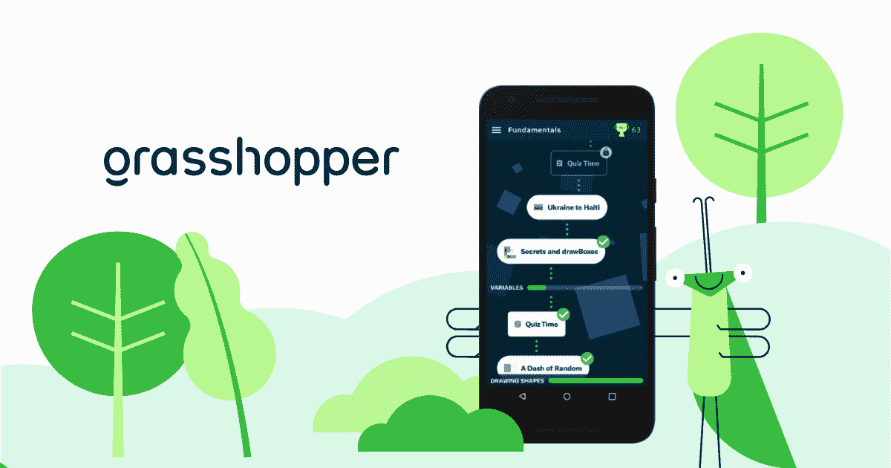
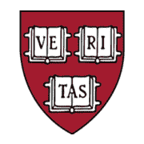
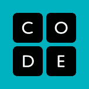
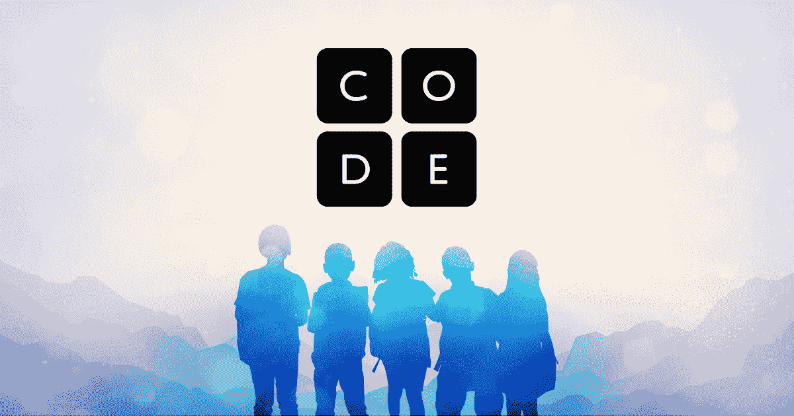

# 你可以免费学习如何编码的编码网站

> 原文：<https://www.freecodecamp.org/news/coding-websites-where-you-can-learn-how-to-code-for-free/>

在这个时代，似乎每个人都在学习编码。也许你想知道网站是如何工作的，或者你深情地回想起旧的博客平台，在那里你可以拼凑一些 HTML 来使它们个性化。

或者，你可能很想知道这种编码热潮是关于什么的，这样你就可以开始自己开发应用程序和网站了。

如果是这样的话，那么这篇文章可以帮助你弄清楚从哪里开始。

## 为什么——以及如何——你应该自学编码？

编码是一个每个人都可以进入的领域。要获得一份技术工作，你不一定需要一个昂贵大学的学位。只要你能证明你擅长编码，你就能得到一份工作。

科技之所以如此容易获取，部分是因为你可以利用所有免费资源自学编程。但这也可能是一个挑战:你如何浏览所有这些课程、文章、训练营和讨论线程？

选择一个主要资源开始学习通常是个好主意。它可以是一门课程，也可以是一个有序的主题列表，只要适合你就行。然后按照计划去做。

当你陷入困境时，可以走一些简单的弯路，使用其他可能帮助你的材料，但只有在你的资源不够时才尝试这样做。

当你完成一门课程或一门功课时，你可能很想马上开始同一主题的另一门功课。但你应该用你刚刚学到的东西来构建项目，而不是那样做，以便更好地学习它。

你可能有足够的基础知识来构建简单的项目，在这个过程中，你会弄清楚你知道什么和不知道什么。

为了帮助你找到一些适合你的学习资源，在这篇文章中我将分享一些你可以免费学习编码的网站。

在学习编码时，我自己使用过这些工具中的大部分，甚至现在我还在使用其中的一些。如果我没有亲自使用它们，我会确保选择那些有正面反馈的资源。

# freeCodeCamp.org

如果你在这里，你可能已经注意到这是 freeCodeCamp 的出版物。在[freecodecamp.org/news](https://www.freecodecamp.org/news/)这里有数以千计的关于编程和相关主题的文章，你可能会发现在你的学习道路上非常有用。

您可以将这些文章加入书签，以帮助您学习新的主题，或者为您正在纠结的主题找到不同的解释。

此外， [freeCodeCamp 学习平台](https://www.freecodecamp.org/)拥有基于 MERN 栈(Mongo、Express、React、NodeJS)的全栈 web 开发课程，以及关于 Python 和数据科学的扩展课程。

freeCodeCamp 论坛也是一个非常友好的获得课程和编程帮助的地方。

最后， [FreeCodeCamp YouTube 频道](https://www.youtube.com/channel/UC8butISFwT-Wl7EV0hUK0BQ)有数千小时关于各种编程主题的视频教程。它的主题比课程更广泛，所以如果你对 web 开发不感兴趣，或者想更详细地了解其他特定主题，一定要查看 YouTube 频道。

[freeCodeCamp.orgLearn to Code — For Free](https://www.freecodecamp.org/)

# 可汗学院

汗学院提供许多学科的课程，包括编程和计算机科学的入门课程。

它通过交互式演练教授 JavaScript、HTML、CSS 和 SQL 基础知识，并以可视化方式呈现代码更改。如果你完全是初学者，这是一个很好的起点。

[Khan Academy | Free Online Courses, Lessons & PracticeLearn for free about math, art, computer programming, economics, physics, chemistry, biology, medicine, finance, history, and more. Khan Academy is a nonprofit with the mission of providing a free, world-class education for anyone, anywhere.Khan Academy](https://www.khanacademy.org/)

# 奥丁计划

Odin 项目的全部课程都是免费的，由开源社区提供支持。它教你如何建立你自己的环境，重点是 Ruby、Ruby on Rails、HTML、CSS、JavaScript 和 NodeJS。

课程包含几十个作业，可以帮助你建立有价值的项目组合。您可以与新手和有经验的开发人员友好的社区联系。

[Your Career in Web Development Starts Here | The Odin ProjectThe Odin Project empowers aspiring web developers to learn togetherThe Odin Project The Odin Project The Odin Project](https://www.theodinproject.com/)

# 蝗虫

[Grasshopper](https://grasshopper.app/) 是一款面向初学者的编码 app。这是一个手机应用程序，它使用有趣的难度递增的快速课程来教你编写真正的 JavaScript。

蚱蜢可以是一个永远存在的伴侣，总是在你的口袋里，当你建立你的基本面。它可以帮助你为学习 web 开发的下一步做好准备。

[Learn to Code for Free – GrasshopperGrasshopper is the coding app for beginners. With fun, quick lessons on your phone, the app teaches adult learners to write real JavaScript.Grasshopper](https://grasshopper.app/)

# 麻省理工学院开放式课程

关于[计算机科学和电气工程](https://ocw.mit.edu/courses/audio-video-courses/#electrical-engineering-and-computer-science)的 MitOpenCourseware 视频课程部分提供了许多研究生和本科生级别的视频课程，以提高您对计算机科学主题的理论知识。

它涵盖了数据结构、算法、人工智能等领域。

[Audio/Video Lectures | MIT OpenCourseWare | Free Online Course MaterialsUnlocking knowledge, empowering minds. Free course notes, videos, instructor insights and more from MIT.Free Online Course Materials](https://ocw.mit.edu/courses/audio-video-courses/#electrical-engineering-and-computer-science)

# 开源社会大学

开源社会大学是一个在线课程和书籍的集合，加在一起，你可以获得相当于计算机科学学位的证书。但是一切都是完全自学和自定进度的——而且是免费或费用很低的。

在这所大学，你不需要考试。但是对于你完成的每一门课程，你必须建立一个项目，这个项目将会被同行评审，展示你从这门课程中学到了什么。

看看他们的[关于页面](https://ossu.firebaseapp.com/#/about)，那里有很多关于如何以最有效的方式使用他们的课程的额外信息。

[OSSU - Open Source Society UniversityOSSU](https://ossu.firebaseapp.com/)

# 哈佛大学的免费在线课程

[哈佛大学的免费在线课程目录](https://online-learning.harvard.edu/catalog/free)有许多有趣的计算机科学课程，涉及许多学科。

有计算机科学和使用 Scratch 编程的介绍性课程，一般技术的介绍性课程，机器学习的课程，以及其他主题。

你可以点击链接查看[计算机科学课程。](https://online-learning.harvard.edu/catalog?keywords=&subject%5B%5D=3&paid%5B1%5D=1)

[Free Online CoursesBrowse the latest free online courses from Harvard University, including “CS50′s Introduction to Game Development” and “CS50′s Web Programming with Python and JavaScript.”Harvard Online Courses](https://online-learning.harvard.edu/catalog/free)

# Code.org

Code.org 有适合所有年龄段的课程，但主要面向年轻学生(以及想教学生编程的老师)。

它提供了各种小时的代码项目(你可以在一个小时内完成的项目)，并为自学者、教师和学生提供了许多不同语言的材料。

[Learn today, build a brighter tomorrow.CS is more important than ever. Let’s build the future we want. #CSforGoodCode.org](https://code.org/)

# 黑客科学

[HackInScience](https://www.hackinscience.org/) 是一个互动的 Python 练习平台，在这里你可以学习 Python，强化你的 Python 技能。

每个练习都有一些链接，指向你需要在练习中应用的语言特性的指南，这些特性是你在之前的练习中不需要的，所以它有助于你建立在你所学的基础上。

[HackInScience — Python Exercises](https://www.hackinscience.org/)

# GitHub 指南

[GitHub 指南](https://guides.github.com/)是 GitHub 的官方指南集，帮助你学习如何使用 Git 和 GitHub。

这些指南包括 GitHub 问题的详细解释，图片和 gif，GitHub 页面，如何派生项目，Git 手册等等。

[GitHub Guides](https://guides.github.com/)

# MDN 学习 Web 开发和教程

[MDN Learn Web Development](https://developer.mozilla.org/en-US/docs/Learn) 的目标是让学习者从绝对的初学者达到熟悉编程基础的水平。他们的目的是帮助你到达一个点，在那里你能够从其他来源学习。

在 MDN 网站的这一区域，还有一个[前端 web 开发人员学习路径](https://developer.mozilla.org/en-US/docs/Learn/Front-end_web_developer)，其中包含数百小时的学习材料。

[Learn web development | MDNWelcome to the MDN learning area. This set of articles aims to provide complete beginners to web development with all that they need to start coding websites.MDN](https://developer.mozilla.org/en-US/docs/Learn)

[MDN 教程](https://developer.mozilla.org/en-US/docs/Web/Tutorials)是 HTML、CSS 和 JavaScript 教程的集合，分为三个复杂级别:入门、中级和高级。

这是对你正在学习的关于这些主题的课程的一个很好的补充。

[Tutorials | MDNThe links on this page lead to a variety of tutorials and training materials. Whether you are just starting out, learning the basics, or are an old hand at web development, you can find helpful resources here for best practices.MDN](https://developer.mozilla.org/en-US/docs/Web/Tutorials)

### 感谢您的阅读！

现在你有了一个很棒的初学者友好资源的集合，它将帮助你开始学习编码。祝你好运！