# 如何在 Ubuntu 16.04+上安装和设置 Flutter

> 原文：<https://www.freecodecamp.org/news/how-to-install-and-setup-flutter-on-ubuntu/>

Flutter 是一个基于 Dart 的工具包，可以帮助你构建应用的前端。它在跨平台移动应用程序开发中大放异彩，并致力于成为 web 和桌面的可行选择。

在其移动应用风格中，Flutter 提供了许多 UI 抽象来构建界面。您可以在 Dart 中实现逻辑，或者直接使用 Kotlin 或 Swift，如果您需要与您选择的操作系统进行更具体的交互。

虽然跨平台应用程序开发并不新鲜，但早期的策略，如 PhoneGap 和 Ionic，都使用了可用的 WebView 实现，而不是直接与系统交互。这不仅有很大的局限性，而且有很大的性能成本。

*原生*跨平台应用开发的黄金标准尚未建立。但是 Flutter 本身提供了很多功能，并且当你需要使用任何你需要使用的官方语言与操作系统直接交互时，它优雅地提供了一种方式。

这使得 Flutter 成为了一个游戏改变者，甚至在它实现与应用程序的 web 和桌面版本共享相同代码库的潜力之前。

在本教程中，我们将开始设置一个 Ubuntu 16.04+机器，用于使用 Flutter 开发 Android 应用程序。你也可以直接从 Android Studio 编辑 Swift 代码，但遗憾的是，由于苹果的政策，你将无法获得官方支持，无法在 iOS 设备或模拟器中测试该应用。

为此，我们需要安装和配置 Java 作为 Android Studio 的依赖项，设置 Android Studio 使用硬件加速和运行 Flutter 应用程序，当然，还要安装和配置 Flutter 本身。那么，我们开始吧。

## 如何安装和配置 Flutter

首先:让我们通过 snap store 安装 Flutter。如果你使用的是 Ubuntu 16.04 以上版本，你可能已经安装了`snap`命令。

如果你不是，你可以按照这个页面上的“在你的 Linux 发行版上安装 Snap Store”部分的说明来做。

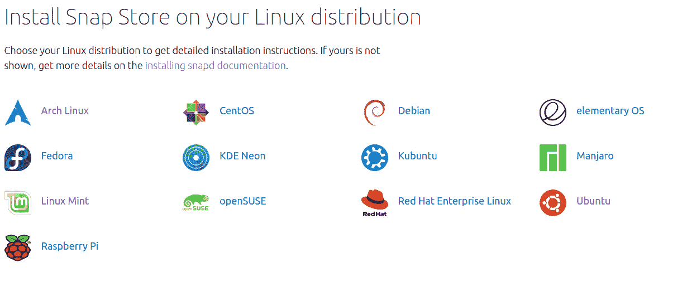

在`snap`命令可用的情况下，像这样安装 Flutter:

```
sudo snap install flutter --classic 
```

在 Flutter 完成安装后，运行一个基本的检查，这也将做一些自动配置:

```
flutter doctor -v 
```

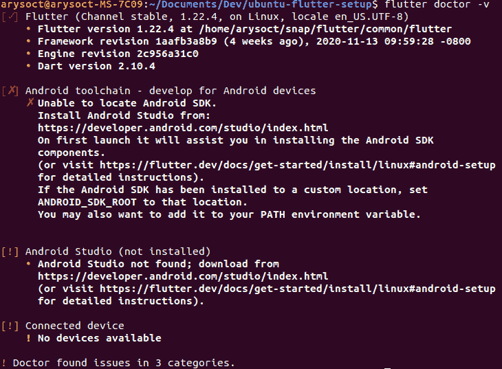

颤振已经装好了，好看！

## 如何安装和配置 Java

首先，在能够使用 Android Studio 之前，我们需要获得(社区支持的)开放 Java 开发工具包。

要获得 Java 8 的最新稳定版本，请打开您的终端并运行:

```
sudo apt-get update && sudo apt-get install openjdk-8-jdk 
```

截至 2021 年 5 月，其他版本在与 Flutter 一起工作时有时会出现一些不可预测的问题，所以我建议安装 OpenJDK 8。不要担心，OpenJDK 8 将至少在 2024 年之前获得支持。

成功安装后，就该设置`$JAVA_HOME`环境变量了。默认情况下，许多与本地 Java 安装交互的应用程序都使用它，Android Studio 就是其中之一。

使用以下命令获取系统中当前安装的 JDK 列表:

```
sudo update-alternatives --config java 
```

从本地安装的版本列表中选择(记住 Java 8 是最容易与 Flutter 一起使用的版本),并将您想要的版本设置为系统的默认版本。

将`$JAVA_HOME`设置为它的路径**，不包括路径**的`/bin`部分(例如，在我的例子中，正确的路径是`/usr/lib/jvm/java-8-openjdk-amd64`):

```
#JAVA_HOME=<your_java_installation_path>, same as below if you followed instructions
JAVA_HOME="/usr/lib/jvm/java-8-openjdk-amd64" # my local path after installing openjdk-8
echo "JAVA_HOME=\"$JAVA_HOME\"" >> ~/.bashrc # sets JAVA_HOME env var for current user
echo 'export PATH=$PATH:$JAVA_HOME/bin' >> .zshrc # adds java's binaries to your path
source ~/.bashrc && echo $JAVA_HOME # verifies that the variable was perenially set 
```

## 如何安装和配置 Android Studio 运行 Flutter

这里可以下载 Android Studio [。](https://developer.android.com/studio)

下载完成后，将 Android Studio 包解压到`/usr/local/`目录:

```
sudo tar -C /usr/local -zxvf ~/Downloads/<android_studio_package>.tar.gz 
```

成功提取之后，运行 Android Studio 的安装脚本:

```
bash /usr/local/android-studio/bin/studio.sh 
```

这应该会弹出安装向导。按照向导的说明进行标准安装，您最终会看到启动屏幕。

选择右下角的配置，然后单击“插件”:

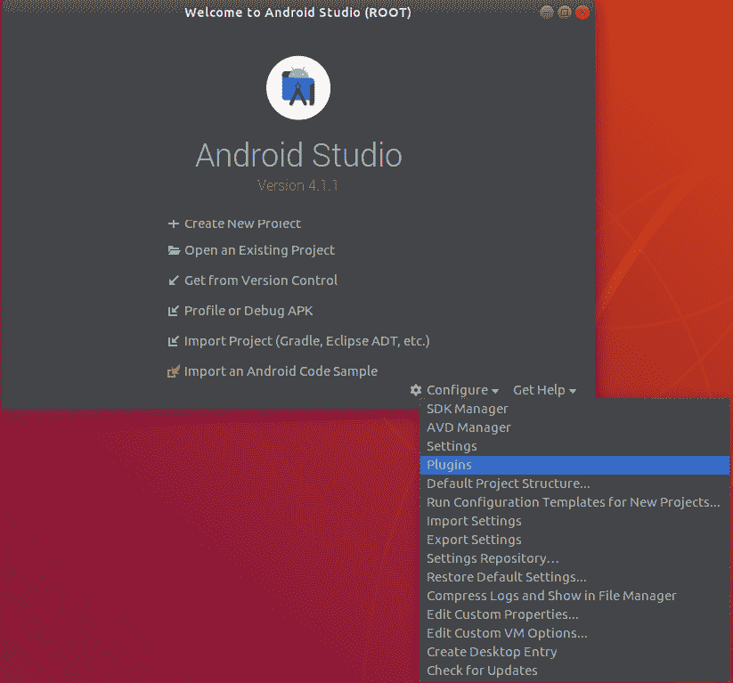

安装 **flutter.dev** 发布的“Flutter”官方插件:

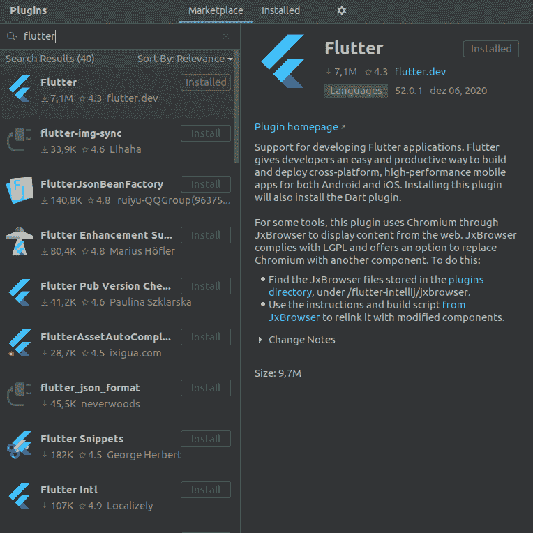

在继续之前，系统会提示您安装 Dart 插件(Flutter 的基础编程语言)。点击“确定”并重启 Android Studio IDE。

开始一个颤振项目的选项现在应该是可见的。点击它，然后选择“颤振应用”，并点击“下一步”。

您应该会看到项目配置屏幕。根据需要配置项目的名称、位置和描述，并将字段“Flutter SDK”指向`/home/<your_user_name>/snap/flutter/common/flutter`:

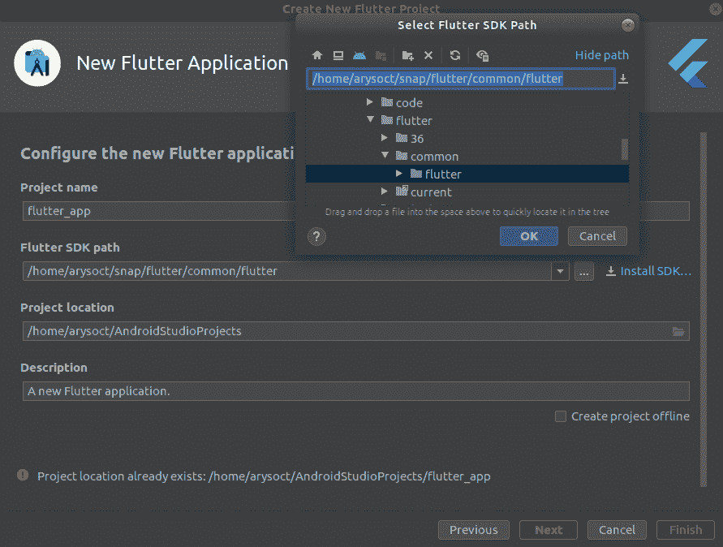

如果上述路径不可用，请打开终端并运行:

```
flutter doctor -v 
```

然后，您应该会看到启动项目屏幕:

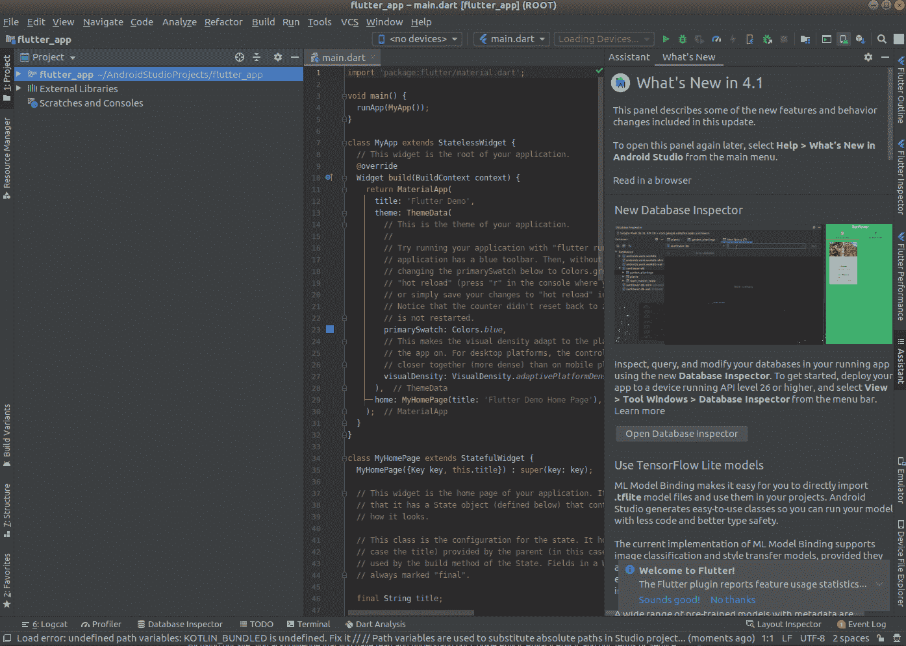

快好了。现在，您需要接受 Android 许可，并仔细检查您的 Flutter 安装的所有权，以避免未来由于 Android Studio 的资源被拒绝而导致的意外构建错误。

打开您的终端并运行:

```
flutter doctor --android-licenses # accept Google's licenses, necessary to build the app
sudo chown -R $USER:$USER /home/$USER/snap/flutter # confirm you are the owner of local flutter 
```

现在 Android Studio 终于可以运行 Flutter 项目了。不错！

您还应该为 Android Studio 启用桌面条目。在项目屏幕中，单击“工具”，然后单击“创建桌面条目”:

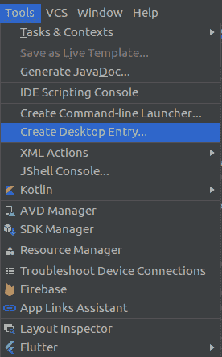

Android Studio 快捷方式现在应该可以从“活动”菜单中获得。

## 如何为 Android 模拟器启用硬件虚拟化

为了运行模拟器，我们必须首先设置 CPU 的硬件虚拟化功能。

在您的终端上运行`kvm-ok`,您的输出应该会显示您是否可以使用 KVM 加速。如果你有一个 AMD 或英特尔 CPU，最有可能它可以。

简而言之，内核虚拟机是内核与虚拟设备之间的桥梁，它允许虚拟设备直接从主机的硬件模拟自己的硬件。你可以看一下[这里](https://www.linux-kvm.org/page/FAQ#Preparing_to_use_KVM)了解更多详细信息。

如果您确实能够使用 KVM 加速，那么是时候设置 KVM 并授权当前用户使用它了:

```
sudo apt update # update repositories
sudo apt install qemu-kvm libvirt-daemon-system libvirt-clients bridge-utils # base packages
sudo addgroup kvm && sudo addgroup libvirtd # create user authorization groups
sudo adduser $USER kvm && sudo adduser $USER libvirtd # add current user to auth groups
sudo virsh -c qemu:///system list # checks if virtualization is ok
# if everything went fine, your output will be something like:
#
#  Id    Name                           State
#---------------------------------------------------- 
```

并重新启动您的用户会话。在电脑里，不仅仅是终端。注销系统，然后登录或重启电脑，我会等待。

## 如何使用 Android 模拟器测试应用程序

现在，打开一个 Android Studio 项目，点击位于窗口右上角的“AVD 管理器”(Android 虚拟设备)选项:

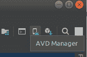

点击“创建虚拟设备”按钮，一个带有设备列表的窗口将弹出，并预先选择“电话”类别。我建议您选择一个启用了 Play Store 的设备，以防以后在您的仿真设备中使用它。我的是 Nexus 5。

单击“下一步”按钮，系统映像列表(Android 操作系统版本)应该会出现:

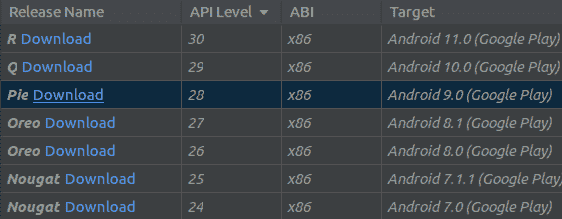

首先，下载您的目标映像(只需点击发布名称旁边的“下载”)，选择一个本地下载的映像，然后点击“下一步”。只有在成功下载图像后，它才会突出显示。

然后会出现一个窗口，让您定制虚拟设备的属性，如启动时的屏幕方向、RAM 使用等。如果你愿意的话，可以根据自己的喜好调整设备，否则你可以放心地点击“完成”。

如果一切顺利，您现在应该可以在 Android 虚拟设备管理器窗口中看到您的设备:

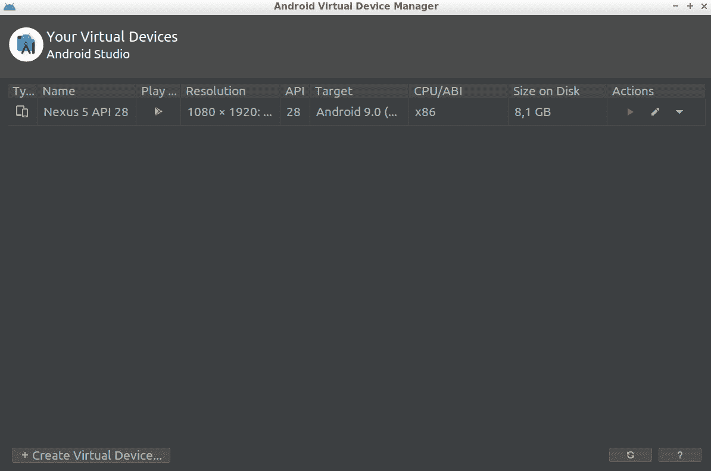

回到你的 Android Studio 项目视图。在“AVD Manager”按钮所在的同一行，“main.dart”的左侧有一个可用设备的下拉列表。选择您刚刚设置的模拟器，然后单击“main.dart”右侧的绿色“play”按钮。

如果模拟器没有列出，请再次打开 AVD 管理器窗口，并单击为您的虚拟设备列出的“操作”标签下的绿色“播放”按钮。这将在运行 Flutter 代码之前加载并打开模拟器。

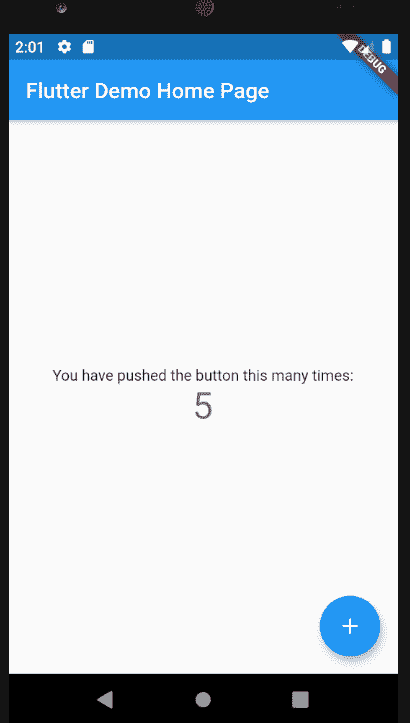

注意右上角的“调试”功能区吗？如果你想去掉它，添加`debugShowCheckedModeBanner: false`作为`MaterialApp`的一个字段。

## 如何使用 Android 物理设备测试应用程序

你需要在本地安装 Android Debug Bridge，这样你的电脑才能和任何连接的 Android 设备交换信息(比如 APK 版本),不管是虚拟的还是其他的。

ADB 由一个客户端(运行命令的界面，在本教程中，它是安装在您计算机上的 ADB 二进制文件)、一个守护程序(在 Android 设备上执行最初从客户端发送的命令)和一个服务器(在 PC 上本地运行，默认监听位置在 tcp://localhost:5037，作为客户端和守护程序之间的通信媒介)组成。

非常方便的是，Android Studio 目前附带了一个 ADB，所以如果你按照上面的说明安装 Android Studio，你的电脑上已经有一个了。

可以从 Ubuntu 的库和 Android Studio 的库一起安装 ADB，但是如果你的电脑最终混淆了本地安装的版本，这就很麻烦了。因此，让我们设置我们的 Linux 用户访问 Android Studio 的 ADB，然后运行 ADB:

```
echo 'export PATH=$PATH:$HOME"/Android/Sdk/platform-tools"' >> .bashrc # adds adb to path
adb start-server # launches adb server
adb devices # lists connected devices 
```

在运行`adb devices`之后，您很可能得到一个错误。该错误注册了包含当前用户名的`$LOGNAME`变量。您将使用它将您的用户插入到`plugdev`组，以防您不在那里。

你也很可能没有一套针对 Android 设备的`udev`规则。UDEV 规则文件指定了 Ubuntu 与插入设备的交互，Ubuntu 将拒绝与您的 Android 设备进行某些交互，除非它事先在 UDEV 规则文件中得到授权。

所以，让我们纠正这些错误:

```
# add user to plugdev group
sudo usermod -aG plugdev $LOGNAME
# downloads a very thorough UDEV rules file into the appropriate directory
sudo wget -O /etc/udev/rules.d/51-android.rules https://raw.githubusercontent.com/NicolasBernaerts/ubuntu-scripts/master/android/51-android.rules
# gives reading permission to the UDEV android file
sudo chmod a+r /etc/udev/rules.d/51-android.rules 
```

重启当前的 Linux 用户会话以应用这些更改，然后打开终端并再次运行`adb devices`。

如果您仍然遇到与 UDEV 相关的错误，您的设备的制造商 ID 可能没有在`/etc/udev/rules.d/51-android.rules`中列出。在这种情况下，在互联网上搜索设备制造商 UDEV id，并手动将其添加到规则列表中，格式与其他规则相同。

请注意，行中唯一具有唯一值的字段是`ATTR{idVendor}`。如果您没有收到任何错误，您会注意到您的设备被列为“未授权”。让我们解锁设备进行 USB 调试。

## 如何解锁开发者模式和 USB 调试

在你的 Android 设备中，打开“设置”，然后打开“关于手机”。点击你的“构建号”5-6 次，直到出现提示“你现在是开发人员了！”突然出现。

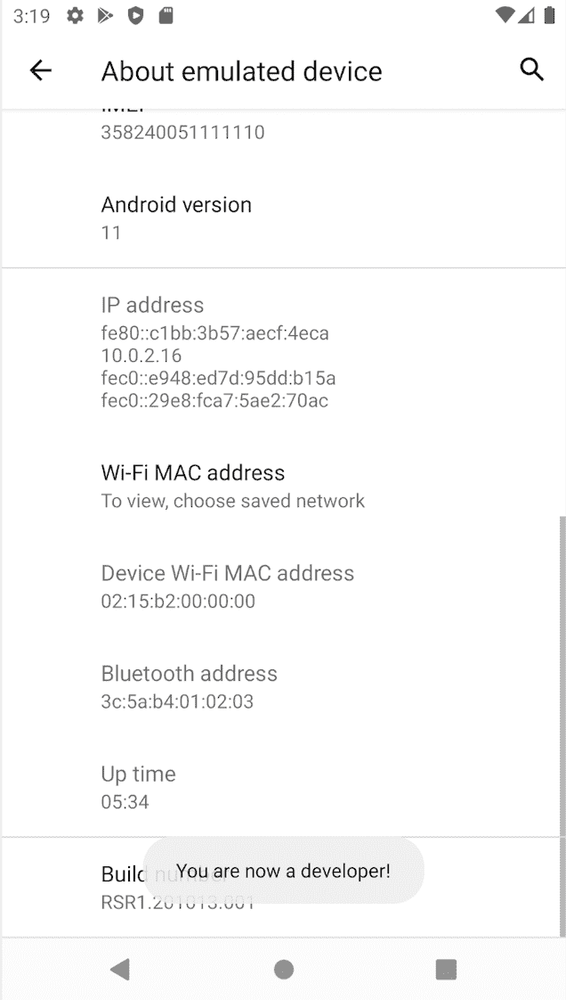

回到“设置”，打开系统，你应该看到“开发者选项”被解锁。


点击这个新条目，并检查“调试”部分下的“USB 调试”。

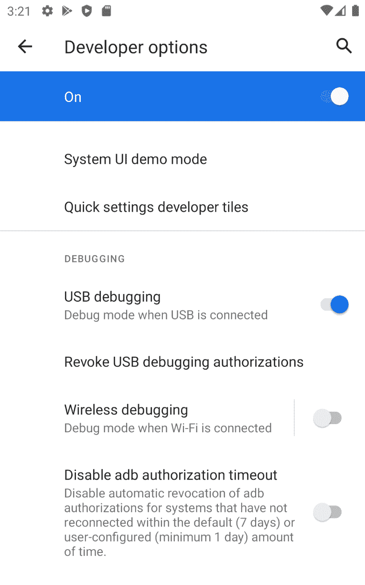

通过 USB 将您的 Android 设备插入 PC，然后在终端上运行`adb devices`。输出应该列出您的设备，并指出它已被解锁以进行调试。

现在，返回 Android Studio，单击设备下拉列表(之前您选择虚拟设备的列表)，您的物理设备现在应该会列出。选择它。

最后，点击“运行”按钮，你应该会在你的设备中看到应用程序，准备好进行互动。

恭喜你！你现在是一名 Flutter 开发者。祝您在发展之旅中好运！

*来自 flutter.dev 的封面图片*