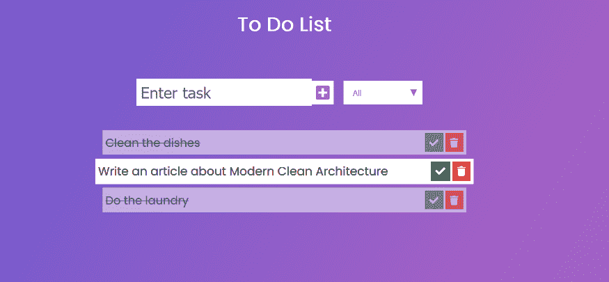

# 如何建造现代洁净建筑

> 原文：<https://www.freecodecamp.org/news/modern-clean-architecture/>

干净的建筑是罗伯特·c·马丁创造的一个术语。主要思想是实体和用例独立于框架、UI、数据库和外部服务。

干净的架构风格对可维护性有积极的影响，因为:

*   我们可以在没有框架、UI 或基础设施的情况下测试领域实体和用例。
*   技术决策可以在不影响领域代码的情况下改变，反之亦然。甚至有可能不费吹灰之力就切换到新的框架。

我的目标是使学习曲线变平，并减少您实现一个干净的架构的努力。这就是为什么我创建了[现代清洁建筑](https://github.com/bertilmuth/modern-clean-architecture) 图书馆。

在本文中，我将向您展示如何创建一个具有现代清晰架构的应用程序，从 HTML/JavaScript 前端到 Spring Boot 后端。重点将放在后端。

让我们从示例应用程序的概述开始——一个永恒的经典，TODO 应用程序。

## 待办事项列表应用程序示例

一个*待办事项列表*是一个*任务*的集合。一个任务有一个*名*，并且要么*完成，要么*未完成。作为用户，您可以:

*   创建一个单一的待办事项列表，并坚持下去
*   添加任务
*   完成一项任务，或“不完成”它
*   删除任务
*   列出所有任务
*   过滤已完成/未完成的任务

下面是包含 1 个未完成任务和 2 个已完成任务的待办事项列表:



我们将从应用程序的核心领域实体开始。然后我们将向外工作到前端。

## 域实体

中心域实体是[任务](https://github.com/bertilmuth/modern-clean-architecture/blob/main/samples/todolist/src/main/java/com/example/todolist/domain/TodoList.java)和[任务](https://github.com/bertilmuth/modern-clean-architecture/blob/main/samples/todolist/src/main/java/com/example/todolist/domain/Task.java)。

*TodoList* 实体包含:

*   唯一的 id，
*   任务列表，
*   添加、完成和删除任务的域方法

`TodoList`实体不包含公共设置器。Setters 会破坏正确的封装。

这是 [TodoList](https://github.com/bertilmuth/modern-clean-architecture/blob/main/samples/todolist/src/main/java/com/example/todolist/domain/TodoList.java) 实体的一部分。[龙目岛](https://projectlombok.org/)标注缩短代码。

```
public class TodoList implements AggregateRoot<TodoList, TodoListId> {
	private final TodoListId id;
	private final List<Task> tasks;

	@Value(staticConstructor = "of")
	public static class TodoListId implements Identifier {
		@NonNull
		UUID uuid;
	}

	@Override
	public TodoListId getId() {
		return id;
	}
	...
	public TaskId addTask(String taskName) {
		if (taskName == null || isWhitespaceName(taskName)) {
			throw new IllegalTaskName("Please specify a non-null, non-whitespace task name!");
		}
		TaskId taskId = add(TaskId.of(UUID.randomUUID()), taskName, false);
		return taskId;
	}
  	...
	public void deleteTask(TaskId task) {
		Optional<Task> foundTask = findTask(task);
		foundTask.ifPresent(tasks::remove);
	}
 	...
} 
```

`AggregateRoot` 界面有什么用？聚合根是 Eric Evans 在领域驱动设计(DDD)中提出的一个术语:

> 聚合是一组相关联的对象，出于数据更改的目的，我们将它们视为一个单元。每个集合都有一个根和一个边界。边界定义了集合内部的内容。根是聚合中包含的单个特定实体。

我们只能通过聚合根来更改聚合的状态。在我们的例子中，这意味着:我们总是必须使用`TodoList`来添加、删除或更改任务。

允许`TodoList` 来强制约束。例如，我们不能将名称为空的任务添加到列表中。

`AggregateRoot` 接口是 [jMolecules](https://github.com/xmolecules/jmolecules) 库的一部分。这个库使得 DDD 概念在域代码中显而易见。在构建期间，[byte buddy 插件](https://github.com/xmolecules/jmolecules-integrations/tree/main/jmolecules-bytebuddy)将注释映射到 Spring 数据注释。

所以我们只有一个单一的模型，用于表示领域概念和持久性。尽管如此，我们在域代码中没有任何特定于持久性的注释。我们不把自己绑在任何框架上。

任务[](https://github.com/bertilmuth/modern-clean-architecture/blob/main/samples/todolist/src/main/java/com/example/todolist/domain/Task.java)**类类似，但它实现了 jMolecules *实体*接口代替:**

```
**`public class Task implements Entity<TodoList, TaskId> {
	private final TaskId id;
	private final String name;
	private final boolean completed;

	@Value(staticConstructor = "of")
	public static class TaskId implements Identifier {
		@NonNull
		UUID uuid;
	}

	Task(@NonNull TaskId id, @NonNull String name, boolean completed) {
		this.id = id;
		this.name = name;
		this.completed = completed;
	}
}`** 
```

 **任务的构造函数是包私有的。所以我们不能从[域包](https://github.com/bertilmuth/modern-clean-architecture/tree/main/samples/todolist/src/main/java/com/example/todolist/domain)之外创建*任务*的实例。并且*任务*类是不可变的。在聚合的边界之外，不可能对其状态进行任何更改。

我们需要一个存储库来存储 TodoList。坚守领域代码中的领域术语，称为[](https://github.com/bertilmuth/modern-clean-architecture/blob/main/samples/todolist/src/main/java/com/example/todolist/domain/TodoLists.java)*:*

```
*`public interface TodoLists extends Repository<TodoList, TodoListId> {
	TodoList save(TodoList entity);
	Optional<TodoList> findById(TodoListId id);
	Iterable<TodoList> findAll();
}`* 
```

 *同样，代码使用了 jMolecues 注释: *Repository* 。在构建过程中，ByteBuddy 插件将其翻译成 Spring 数据存储库。

我们将跳过域异常，因为它们没有什么特别的。那就是完整的[域包](https://github.com/bertilmuth/modern-clean-architecture/tree/main/samples/todolist/src/main/java/com/example/todolist/domain)。

## 应用的行为(和用例)

接下来，我们定义对最终用户可见的应用程序的行为。用户与应用程序的任何交互如下进行:

1.  用户界面发送*请求*。
2.  后端通过执行一个*请求处理程序来做出反应。*请求处理器做所有必要的事情来完成请求:
    -访问数据库
    -调用外部服务
    -调用域实体方法
3.  请求处理器**可以**返回一个*响应*。

我们用 Java 8 函数接口实现了一个*请求处理器*。

返回*响应*的处理程序实现了`java.util.Function`接口。下面是 [*AddTask*](https://github.com/bertilmuth/modern-clean-architecture/blob/main/samples/todolist/src/main/java/com/example/todolist/behavior/AddTask.java) 处理程序的代码。这个处理程序

*   从[*AddTaskRequest*](https://github.com/bertilmuth/modern-clean-architecture/blob/main/samples/todolist/src/main/java/com/example/todolist/behavior/request/AddTaskRequest.java)*，*中提取待办事项列表 id 和任务名称
*   在存储库中查找待办事项列表(或者抛出异常)，
*   将请求中名称为的任务添加到列表中，
*   返回一个带有添加任务 id 的[*AddTaskResponse*](https://github.com/bertilmuth/modern-clean-architecture/blob/main/samples/todolist/src/main/java/com/example/todolist/behavior/response/AddTaskResponse.java)*。*

```
*`@AllArgsConstructor
class AddTask implements Function<AddTaskRequest, AddTaskResponse> {
	@NonNull
	private final TodoLists repository;

	@Override
	public AddTaskResponse apply(@NonNull AddTaskRequest request) {
		final UUID todoListUuid = request.getTodoListUuid();
		final String taskName = request.getTaskName();

		final TodoList todoList = repository.findById(TodoListId.of(todoListUuid))
			.orElseThrow(() -> new TodoListNotFound("Repository doesn't contain a TodoList of id " + todoListUuid));

		TaskId taskId = todoList.addTask(taskName);
		repository.save(todoList);

		return new AddTaskResponse(taskId.getUuid());
	}
}`* 
```

 *Lombok 创建一个构造函数，将*to dolist*repository 接口作为构造函数参数。我们将任何外部依赖作为接口传递给处理程序的构造函数。

请求和响应是不可变的对象:

```
@Value
public class AddTaskRequest {
	@NonNull
	UUID todoListUuid;

	@NonNull
	String taskName;
} 
```

现代的 Clean Architecture 库将它们从 JSON 序列化到 JSON。

接下来，是一个不返回响应的处理程序的例子。 [*删除任务*](https://github.com/bertilmuth/modern-clean-architecture/blob/main/samples/todolist/src/main/java/com/example/todolist/behavior/DeleteTask.java) 处理器接收一个 [*删除任务请求*](https://github.com/bertilmuth/modern-clean-architecture/blob/main/samples/todolist/src/main/java/com/example/todolist/behavior/request/DeleteTaskRequest.java) 。因为处理程序没有返回响应，所以它实现了*消费者*接口。

```
@AllArgsConstructor
class DeleteTask implements Consumer<DeleteTaskRequest> {
	@NonNull
	private final TodoLists repository;

	@Override
	public void accept(@NonNull DeleteTaskRequest request) {
		final UUID todoListUuid = request.getTodoListUuid();
		final UUID taskUuid = request.getTaskUuid();

		final TodoList todoList = repository.findById(TodoListId.of(todoListUuid))
			.orElseThrow(() -> new TodoListNotFound("Repository doesn't contain a TodoList of id " + todoListUuid));

		todoList.deleteTask(TaskId.of(taskUuid));
		repository.save(todoList);
	}
} 
```

还有一个问题:谁创建了这些处理程序？

答案是:实现了 [*行为模型*](https://github.com/bertilmuth/requirementsascode/blob/master/requirementsascodecore/src/main/java/org/requirementsascode/BehaviorModel.java) 接口的类。对于这种请求，行为模型将每个*请求*类映射到*请求处理程序*。

下面是[*TodoListBehaviorModel*](https://github.com/bertilmuth/modern-clean-architecture/blob/main/samples/todolist/src/main/java/com/example/todolist/behavior/TodoListBehaviorModel.java)的一部分:

```
@AllArgsConstructor
public class TodoListBehaviorModel implements BehaviorModel {
	@NonNull
	private final TodoLists todoLists;
	...
	@Override
	public Model model() {
		return Model.builder()
			.user(FindOrCreateListRequest.class).systemPublish(findOrCreateList())
			.user(AddTaskRequest.class).systemPublish(addTask())
			.user(ToggleTaskCompletionRequest.class).system(toggleTaskCompletion())
			...
			.build();
	}

	private Function<FindOrCreateListRequest, FindOrCreateListResponse> findOrCreateList() {
		return new FindOrCreateList(todoLists);
	}

	private Function<AddTaskRequest, AddTaskResponse> addTask() {
		return new AddTask(todoLists);
	}

	private Consumer<ToggleTaskCompletionRequest> toggleTaskCompletion() {
		return new ToggleTaskCompletion(todoLists);
	}
	...
} 
```

`user(...)`语句定义了请求类别。我们将`systemPublish(...)`用于返回*响应*的处理程序，将`system(...)`用于不返回响应的处理程序。

*行为模型*有一个带有外部依赖的构造函数作为接口传入。它创建所有的处理程序，并将适当的依赖项注入其中。

通过配置*行为模型*的依赖关系，我们配置了所有的处理程序。这正是我们想要的:一个我们可以改变或转换对技术的依赖的中心。这就是技术决策如何在不影响领域代码的情况下改变。

## 应用程序的 Web 层(适配器)

现代清洁架构中的 web 层可能非常薄。在其最简单的形式中，它只包含两个类:

*   一个用于依赖项配置的类
*   一个用于异常处理的类

下面是[*TodoListConfiguration*](https://github.com/bertilmuth/modern-clean-architecture/blob/main/samples/todolist/src/main/java/com/example/todolist/adapter/spring/TodoListConfiguration.java)*类:*

```
*`@Configuration
class TodoListConfiguration {
	@Bean
	TodoListBehaviorModel behaviorModel(TodoLists repository) {
		return new TodoListBehaviorModel(repository);
	}
}`* 
```

 *Spring 将 *TodoLists* 存储库接口的实现注入到 *behaviorModel(…)* 方法中。该方法创建了一个作为 bean 的*行为模型*实现。

如果应用程序使用外部服务，configuration 类是将具体实例创建为 beans 的地方。并将它们注入到*行为模型*中。

那么，控制器都去哪了？

嗯，没有什么是你必须创造的。至少如果你只处理 POST 请求的话。(关于 GET 请求的处理，请参见后面的问答。)

[*spring-behavior-web*](https://github.com/bertilmuth/modern-clean-architecture/tree/main/spring-behavior-web)*图书馆是*现代洁净建筑*图书馆的一部分。我们为请求定义了一个端点。我们在 [*应用程序中指定该端点的 URL。*](https://github.com/bertilmuth/modern-clean-architecture/blob/main/samples/todolist/src/main/resources/application.properties)*

*`behavior.endpoint = /todolist`*

*如果该属性存在，spring-behavior-web 将在后台为端点设置一个控制器。该控制器接收 POST 请求。*

*我们不需要编写特定于 Spring 的代码来添加新的行为。我们不需要添加或更换控制器。*

*当端点接收到 POST 请求时，会发生以下情况:*

1.  *spring-behavior-web 反序列化请求，*
2.  *spring-behavior-web 将请求传递给由行为模型配置的行为，*
3.  *该行为将请求传递给适当的请求处理器(如果有的话)，*
4.  *spring-behavior-web 序列化响应并将其传递回端点(如果有端点的话)。*

*默认情况下，spring-behavior-web 将每个对请求处理程序的调用包装在一个事务中。*

### *如何发送帖子请求*

*一旦我们启动了 Spring Boot 应用程序，我们就可以向端点发送 POST 请求。*

*我们在 JSON 内容中包含了一个`@type`属性，以便 spring-behavior-web 可以在反序列化期间确定正确的请求类。*

*例如，这是待办事项应用程序的有效`curl`命令。它向端点发送一个[*FindOrCreateListRequest*](https://github.com/bertilmuth/modern-clean-architecture/blob/main/samples/todolist/src/main/java/com/example/todolist/behavior/request/FindOrCreateListRequest.java)*。**

**`curl -H "Content-Type: application/json" -X POST -d '{"@type": "FindOrCreateListRequest"}' [http://localhost:8080/todolist](http://localhost:8080/todolist)`**

**这是在 Windows PowerShell 中使用的相应语法:**

**`iwr http://localhost:8080/todolist -Method 'POST' -Headers @{'Content-Type' = 'application/json'} -Body '{"@type": "FindOrCreateListRequest"}'`**

### **异常处理**

**spring-behavior-web 的异常处理与“普通”spring 应用程序没有什么不同。我们创建一个用`@ControllerAdvice`注释的类。我们将带有`@ExceptionHandler`的方法注释放在其中。**

**参见[*TodoListExceptionHandling*](https://github.com/bertilmuth/modern-clean-architecture/blob/main/samples/todolist/src/main/java/com/example/todolist/adapter/spring/TodoListExceptionHandling.java)举例:**

```
**`@ControllerAdvice
class TodoListExceptionHandling {
	@ExceptionHandler({ Exception.class })
	public ResponseEntity<ExceptionResponse> handle(Exception e) {
		return responseOf(e, BAD_REQUEST);
	}
	...
}`** 
```

 **注意，在实际应用中，不同的异常类型需要不同的处理。

## 应用程序的前端

待办事项列表应用程序的前端包括:

*   一个 [HTML 页面](https://github.com/bertilmuth/modern-clean-architecture/blob/main/samples/todolist/src/main/resources/static/index.html)，
*   一个 [CSS 文件](https://github.com/bertilmuth/modern-clean-architecture/blob/main/samples/todolist/src/main/resources/static/styles.css) 用于格式化、
*   和一个 [main.js JavaScript 文件](https://github.com/bertilmuth/modern-clean-architecture/blob/main/samples/todolist/src/main/resources/static/main.js)

我们这里重点关注 main.js。它发送请求并更新网页。

以下是它的部分内容:

```
// URL for posting all requests,
// Must be the same as the one in application.properties
// (See https://github.com/bertilmuth/modern-clean-architecture/blob/main/samples/todolist/src/main/resources/application.properties)
const BEHAVIOR_ENDPOINT = "/todolist";

//variables
var todoListUuid;
...

// functions
function restoreList(){
	const request = {"@type":"FindOrCreateListRequest"};

	post(request, function(response){
		todoListUuid = response.todoListUuid;
		restoreTasksOf(todoListUuid);
	});
}

function restoreTasksOf(todoListUuid) {
	const request = {"@type":"ListTasksRequest", "todoListUuid":todoListUuid};

	post(request, function(response){	
		showTasks(response.tasks);
	});
}
...
function post(jsonObject, responseHandler) {	
	const xhr = new XMLHttpRequest();
	xhr.open("POST", BEHAVIOR_ENDPOINT);

	xhr.setRequestHeader("Accept", "application/json");
	xhr.setRequestHeader("Content-Type", "application/json");

	xhr.onreadystatechange = function() {
		if (xhr.readyState === 4) {
			response = xhr.responseText.length > 0? JSON.parse(xhr.response) : "";
			if(response.error){
				alert('Status ' + response.status + ' "' + response.message + '"');
			} else{
				responseHandler(response);
			}
		}	
	};

	const jsonString = JSON.stringify(jsonObject);
	xhr.send(jsonString);
} 
```

例如，这是一个 [*列表任务请求*](https://github.com/bertilmuth/modern-clean-architecture/blob/main/samples/todolist/src/main/java/com/example/todolist/behavior/request/ListTasksRequest.java) 的 JSON 对象:

```
const request = {“@type”:”ListTasksRequest”, “todoListUuid”:todoListUuid}; 
```

`post(…)`方法将请求发送到后端，并将响应传递给响应处理程序(您作为第二个参数传入的回调函数)。

这就是待办事项列表应用程序的全部内容。

# 问题与答案

如果…会怎样

…我想发送 GET 请求而不是 POST 请求？

…我希望 web 层与行为分开发展？

…我想使用不同于 Spring 的框架？

…我有一个比待办事项列表示例大得多的应用程序。我如何构建它？

[这里](https://github.com/bertilmuth/modern-clean-architecture/wiki/Questions-&-Answers)是答案。

# 结论

在本文中，我向您展示了一种实现干净架构的特殊方法。还有很多其他的方法。

我的目标是减少构建一个干净的架构的工作量，并使学习曲线变平。

为了实现这一点，现代干净架构库提供了以下特性:

*   **不可变请求和响应的序列化**没有序列化特定注释。
*   不需要 dto。您可以在 web 层和用例中为请求/响应使用相同的不可变对象..
*   **接收和转发 POST 请求的通用端点**。可以添加和使用新的行为和域逻辑，而无需编写特定于框架的代码。

在我的下一篇文章中，我将描述如何测试一个现代的干净的架构。

我邀请你访问[现代清洁建筑](https://github.com/bertilmuth/modern-clean-architecture/) GitHub 页面。

参见[待办事项清单示例应用](https://github.com/bertilmuth/modern-clean-architecture/tree/main/samples/todolist)。

请与我分享您的任何反馈。你怎么想？

如果你想了解我正在做的事情或给我留言，请在 LinkedIn 或 T2 Twitter 上关注我。

# 承认

感谢 Surya Shakti 发布原创前端仅[待办事项代码](https://suryashakti1999.medium.com/to-do-list-app-using-javascript-for-absolute-beginners-13ea9e38a033)。

感谢 Oliver Drotbohm 为我指出了令人敬畏的 jMolecules 图书馆。*******