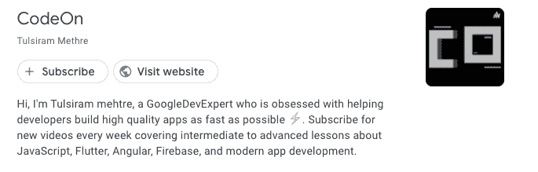

# Flutter 开发者的最佳播客

> 原文：<https://www.freecodecamp.org/news/best-podcasts-for-flutter-developers/>

播客是消费数字信息的好方法。它们变得非常受欢迎，因为你可以随时随地听它们。

播客提供各种主题的教育、娱乐和引人入胜的内容，包括技术主题。主持人和他们的嘉宾以他们自己的方式交谈和分享想法，这使得每一个播客都不同而且有趣。

这篇文章是一些最好的免费播客频道的汇编，集中在 Flutter 框架上。

Flutter 是一个流行的跨平台移动应用程序开发框架，它帮助您构建由 Dart 编程语言支持的像素级完美 ui。

它的社区正在快速发展，这意味着每天都有更多关于这个框架的资源，比如文章、播客、库和其他工具。

我在本文中收集的播客提供了各种与颤振相关的内容，包括一些顶尖颤振专家的旅程。你一定要订阅并收听它们。

## 颤振 101 播客

颤振 101 播客是颤振上最受欢迎的播客频道之一。大量积极参与 Flutter 社区的开发人员都在收听它。

这是一个由文斯·沃尔高主持的每周播客系列，它专注于 Flutter 开发及其框架的进展。

如果你想获得关于 Flutter 开发的最新消息和更新，以及学习技术本身，那么这是一个很好的选择。

## 都是小部件

[It's all Widgets](https://itsallwidgets.com/podcast) 是一个受欢迎的播客频道，由来自 Flutter 社区的 Flutter 开发者创建。

除了来自 Flutter 生态系统的所有最新消息和更新，它还提供了来自 Flutter 贡献者和从业者的故事。

主要的焦点在于分享 Flutter 开发者鼓舞人心的故事，以及他们是如何进入这个领域的。该播客由谷歌 FlutterDev 开发专家 Hillel Coren 主持。

## 振翅高飞

[Flying High with Flutter](https://www.youtube.com/watch?v=zknqsZ9c7cI) 是一个每周播客频道，提供关于 Flutter 开发生态系统的剧集。它讨论任何与颤振有关的事情。

主要的焦点是你在使用 Flutter 时可能面临的现实世界的问题，但也包括在 Flutter 社区上的白日梦启发和挑战性的想法。

播客还邀请颤振领域的专家嘉宾分享他们的背景、经验、想法和对迷人的颤振世界的见解。

## 学习颤动

顾名思义，[学习 Flutter](https://player.fm/series/learning-flutter) 播客频道帮助你学习 Flutter/Dart 编程。

在这个由 Wilfried Mbouenda Mbogne 主持的播客中，他分享了他作为开发人员的颤振冒险故事。播客还邀请了其他颤振领域的专家来分享他们在颤振世界的旅程。

这个播客可以成为许多移动应用程序开发人员的灵感来源。

## CodeOn

CodeOn 是一个由谷歌专家 Tulsiram Mehtre 主持的每周播客频道。他的主要目标是帮助开发人员快速高效地构建高质量的应用程序。

这个播客频道不仅提供关于 Flutter 的知识，还涵盖了关于 JavaScript、Angular、Firebase 和现代应用程序开发的中高级课程。所以你每周都会收到完整的包裹。

## 包扎

本文的主要目标是向您介绍一些适用于 Flutter 开发生态系统的最佳播客频道。

我希望它是任何移动应用程序开发者的无价资源。我推荐每个人订阅并收听这些令人惊叹的基于颤振的播客，以获得关于颤振世界的最新知识和理解。

最后，你可以从已经存在的其他人那里获得你的 [Flutter 应用](http://instaflutter.com/)的灵感。

**快乐编码！**