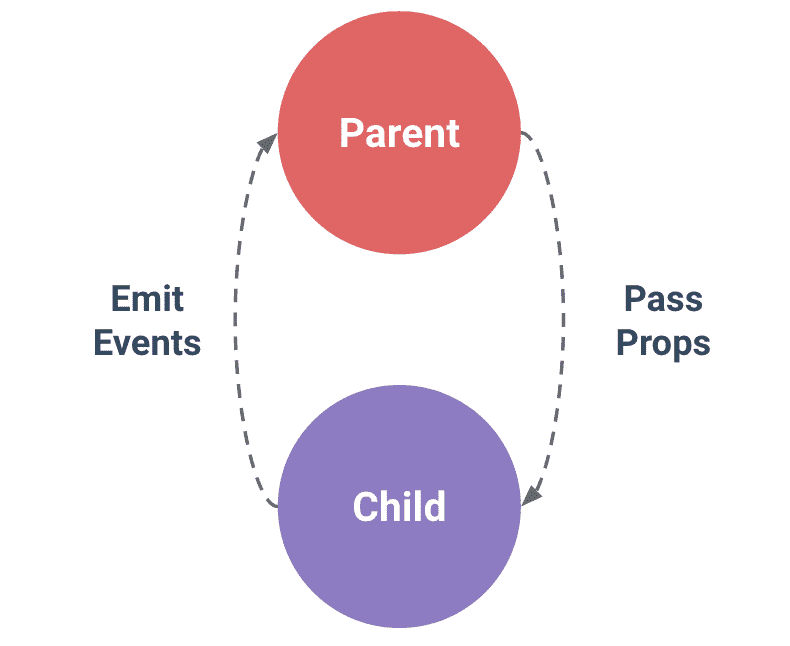

# 如何在 Vue.js 中使用道具

> 原文：<https://www.freecodecamp.org/news/how-to-use-props-in-vuejs/>

我们使用 props 将信息/数据从父组件传递到子组件。在这篇文章中，我将解释你需要知道的关于道具的一切，以及为什么你应该在 Vue.js 中使用道具。

以下是我们将在本指南中涵盖的内容的简要概述:

*   Vue.js 里有哪些道具？
*   如何在组件中注册道具
*   如何使用多个道具
*   vue . js prop types 检视. js prop 类型
*   如何将数据传递给道具
*   如何将功能传递给道具
*   如何验证道具
*   如何设置道具的默认值

## Vue.js 里有哪些道具？

“道具”是一个特殊的关键字，代表属性。它可以在组件上注册，以便将数据从父组件传递到它的一个子组件。

与使用 Vue.js 应用程序的 vuex 等状态管理库相比，这要容易得多。

props 中的数据只能单向流动——从顶层或父组件流向底层或子组件。这仅仅意味着您不能将数据从子代传递给父代。

另一件要记住的事情是，Props 是只读的，不能被子组件修改，因为父组件“拥有”那个值。

现在让我们平衡一下——父组件将属性传递给子组件，而子组件将事件发送给父组件。

## 如何在组件中注册道具

现在让我们看看如何在组件中注册道具。

```
Vue.component('user-detail', {
  props: ['name'],
  template: '<p>Hi {{ name }}</p>'
})
.js
```

或者，在 Vue 单个文件组件中:

```
<template>
  <p>{{ name }}</p>
</template>

<script>
export default {
  props: ['name']
}
</script>
```

在上面的代码中，我们注册了一个名为`name`的道具，我们可以在应用程序的模板部分调用它。

注意:这是子组件，这个道具将从父组件接收数据。稍后我会详细解释这一点。

## 如何使用多个道具

通过将它们附加到 props 数组中，可以拥有多个道具，如下所示:

```
Vue.component('user-detail', {
  props: ['firstName', 'lastName'],
  template: '<p>Hi {{ firstName }} {{ lastName }}</p>'
})
```

或者，在 Vue 单个文件组件中:

```
<template>
  <p>Hi {{ firstName }} {{ lastName }}</p>
</template>

<script>
export default {
  props: [
    'firstName', 
    'lastName'
  ],
}
</script>
```

## vue . js Prop types 检视. js prop 类型

要指定您想在 Vue 中使用的道具类型，您将使用一个对象而不是一个数组。您将使用属性的名称作为每个属性的键，使用类型作为值。

如果传递的数据类型与 prop 类型不匹配，Vue 会在控制台中发送一个带有警告的警报(在开发模式下)。您可以使用的有效类型有:

*   线
*   数字
*   布尔代数学体系的
*   排列
*   目标
*   日期
*   功能
*   标志

```
Vue.component('user-detail', {
  props: {
    firstName: String,
    lastName: String
  },
  template: '<p>Hi {{ firstName }} {{ lastName }}</p>'
})
```

或者，在 Vue 单个文件组件中:

```
<template>
  <p>Hi {{ firstName }} {{ lastName }}</p>
</template>

<script>
export default {
  props: {
    firstName: String,
    lastName: String
  },
}
</script>
```

## 如何在 Vue 中将数据传递给 Props

使用 props 的主要目的是传递数据/信息。您可以使用 v-bind 将值作为数据属性传递，如以下代码所示:

```
<template>
  <ComponentName :title=title />
</template>

<script>
export default {
  //...
  data() {
    return {
      title: 'Understanding Props in vuejs'
    }
  },
  //...
}
</script>
```

或者作为静态值，如下所示:

```
<ComponentName title="Understanding Props in vuejs" />
```

假设我们正在构建一个应用程序，它有这么多不同文本/背景颜色的按钮。与其在我们所有的文件中重复按钮语法，不如创建一个按钮组件，然后将文本/背景色作为道具传递。

这是父组件:

```
<template>
  <div id="app">
    <Button :name='btnName' bgColor='red' />
    <Button :name='btnName' bgColor='green' />
    <Button :name='btnName' bgColor='blue' />
  </div>
</template>

<script>
import Button from './components/Button'

export default {
  name: 'App',
  data(){
    return{
      btnName:"Joel",
    }
  },
  components: {
    Button
  }
}
</script>
```

这是子组件:

```
<template>
  <button class="btn" :style="{backgroundColor:bgColor}">{{name}}</button>
</template>
<script>
export default {
  name: 'Button',
  props:{
    name:String,
    bgColor:String
  }
}
</script>
```

上面的代码向您展示了当您从父组件获取数据并在子组件中使用该数据时，如何使用数据属性和静态值。

**注意:**您也可以在 prop 值中使用三元运算符来检查真值条件并传递依赖于它的值。

```
<template>
  <div id="app">
    <Button :tagUser="signedUp ? 'Logout' : 'Login'" bgColor='red' />
  </div>
</template>
<script>
import Button from './components/Button'
export default {
  name: 'App',
  data(){
    return{
      signedUp: true,
    }
  },
  components: {
    Button
  }
}
</script>
```

在上面的代码中，我们正在检查`signedUp`数据属性。如果是真的，发送的数据应该是**注销**、**、**否则应该是**登录。**

## 如何将功能传递给道具

将函数或方法作为道具传递给子组件相对简单。这和传递其他变量的过程基本相同。

但是有理由说明为什么不应该使用 props 作为函数——而应该使用 emit。这篇文章恰当地解释了[为什么是](https://michaelnthiessen.com/pass-function-as-prop/)。

```
<template>
  <ChildComponent :function="newFunction" />
</template>
```

```
<script>
export default {
  methods: {
    newFunction() {
      // ...
    }
  }
};
</script>
```

## 如何在 Vue 中验证道具

Vue 使得验证道具变得非常容易。您所要做的就是将所需的键及其值添加到道具中。我们可以使用道具类型和`required`进行验证:

```
props: {
  name: {
    type: String,
    required: true
  }
}
```

## 如何设置默认属性值

在结束本文之前，让我们看看如何为我们的道具设置默认值。如果子组件无法从父组件获取数据，则会呈现默认值。

Vue 允许您指定一个默认值，就像我们之前指定的`required`一样。

```
props: {
  name: {
    type: String,
    required: true,
    default: 'John Doe'
  },
  img: {
    type: String,
    default: '../image-path/image-name.jpg',
   },
}
```

您也可以将默认值定义为对象。并且它可以是返回适当值的函数，而不是实际值。

## 结论

在这篇文章中，我们学习了 props 在 Vue.js 中的作用和工作原理。

总之，我们使用 props 将数据从父组件传递到子组件。如果您需要从子组件向父组件发送数据/事件，子组件也会向父组件发出事件。



感谢您的阅读！

**有用的链接**

*   [vista . js component props-flaviacops](https://flaviocopes.com/vue-props/)
*   [Props - Vue 文档](https://vuejs.org/v2/guide/components-props.html)