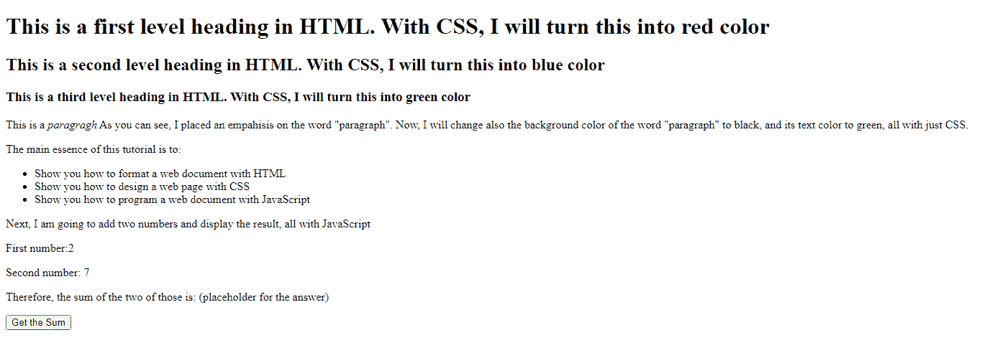
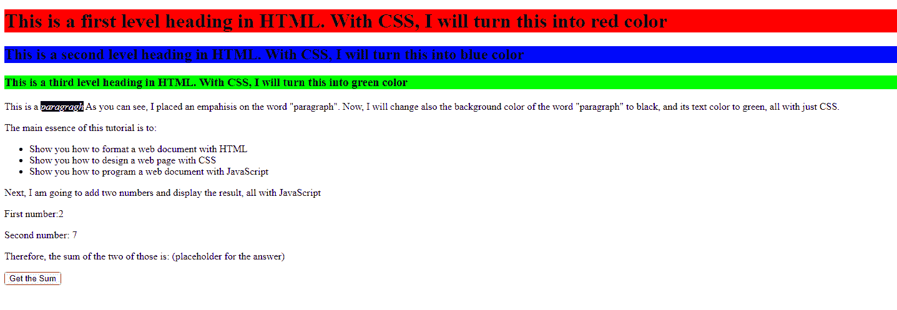
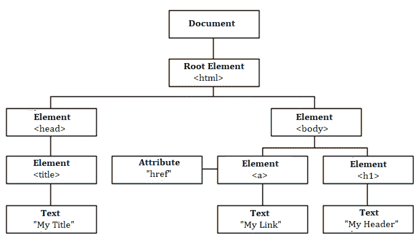
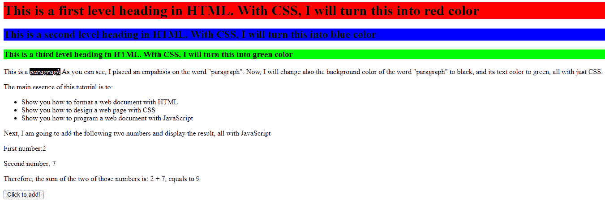

# 学习 Web 开发基础知识——为初学者讲解 HTML、CSS 和 JavaScript

> 原文：<https://www.freecodecamp.org/news/html-css-and-javascript-explained-for-beginners/>

如果你正在学习 web 开发，你会遇到像 HTML、CSS 和 JavaScript 这样的术语。这些通常被称为网络的构建模块。

这三种工具主导着 web 开发。每个库或工具似乎都以 HTML、CSS 和 JS 为中心。所以如果你想成为一名网页开发者，你需要学好它们。

你还会发现网站大多是由这三种语言构建的。

但是你可能想知道每一个是什么，它真正的用途是什么。是什么让这些语言如此特别和重要？又是什么让它们无处不在，让你忍不住在每一个基于 web 开发的教程和主题中看到它们？

好吧，现在你不需要再怀疑了。

在这篇文章中，我将解释什么是 HTML、CSS 和 JavaScript 的基础知识，它们如何使 Web 工作，以及它们自己做什么。

## 什么是互联网？

互联网只是一个相互通信以发送和接收数据(信息)的计算机网络。

互联网上的每一台计算机都可以通过一个名为 **IP 地址的唯一号码来区分和定位。**一个 IP 地址大概是这样的:`168.212.226.204`

### 什么是网络？

网络是互联网的一个子集。

像其他计算机网络一样，web 由两个主要部分组成:web 浏览器客户端和 Web 服务器。

客户端请求数据，服务器**共享**或**提供**其数据。为了实现这一点，双方必须达成协议。该协议被称为**应用编程接口**，或者简称为 **API。**

但是，这些数据必须经过整理和格式化，使之成为具有广泛技术经验和能力的最终用户可以理解的形式。

这就是 HTML、CSS、JavaScript 和整个 web 开发概念发挥作用的地方。

## 什么是 HTML？

HTML 代表**超文本标记语言。**

[Dictionary.com](https://www.dictionary.com/browse/markup)将加价定义为:

> 一套详细的说明，通常写在要排版的原稿上，涉及字体、版面编排等。

因此，你可以把 HTML 看作是一种语言，在网页打印出来(展示给你)之前，用来创建关于风格、类型、格式、结构和组成的详细说明。

但是在 web 开发的上下文中，我们可以用“呈现”来代替“打印”这个术语，这样会更准确。

HTML 帮助您将页面组织成诸如段落、章节、标题、导航栏等元素。

为了说明页面的外观，让我们创建一个基本的 HTML 文档:

```
<!DOCTYPE html>
<html lang="en">
<head>
  <meta charset="UTF-8">
  <meta name="viewport" content="width=device-width, initial-scale=1.0">
  <meta http-equiv="X-UA-Compatible" content="ie=edge">
  <link rel="stylesheet" href="./styles.css">
  <title>Document</title>
</head>
<body>
  <h1>This is a first level heading in HTML. With CSS, I will turn this into red color</h1>
  <h2>This is a second level heading in HTML. With CSS, I will turn this into blue color</h2>
  <h3>This is a third level heading in HTML. With CSS, I will turn this into green color</h3>
  <p>This is a <em>paragragh</em> As you can see, I placed an empahisis on the word "paragraph". Now, I will change also
    the background color of the word "paragraph" to black, and its text color  to green, all with just CSS.</p>
  <p>The main essence of this tutorial is to:</p>
    <ul>
       <li>Show you how to format a web document with HTML</li>
       <li>Show you how to design a web page with CSS</li>
       <li>Show you how to program a web document with JavaScript</li>
    </ul>

  <p>Next, I am going to add the following two numbers and display the result, all with JavaScript<p/>
    <p>First number:<span id= "firstNum">2</span> <br></p>
    <p>Second number: <span id= "secondNum">7</span> </p>
    <p>Therefore, the sum of the two of those numbers is: <span id= "answer">(placeholder for the answer)</span></p>
    <input type="button" id="sumButton" value="Click to add!">
</body>
</html> 
```

index.html

这就是你如何只用 HTML 来格式化和组织一个文档。如您所见，该标记包含一些 web 元素，如:

*   一级标题`h1`
*   二级标题`h2`
*   三级标题`h3`
*   一段话`p`
*   带有项目符号点`ul` `li`的无序列表
*   一个按钮输入`input`
*   以及整个页面的正文`body`

这是上面的标记在 web 浏览器上呈现的内容:



localhost:3000/index.html

您还可以向这些元素添加属性，您可以使用这些属性来标识元素并从站点中的其他位置访问它们。

在我们的例子中，我们为所有三个`span`元素设置了`id`属性。这将帮助我们从 JavaScript 中访问它们，稍后您将会看到。

把这个属性想象成你的社交媒体用户名。有了这个名字，其他人可以在社交媒体上找到你。有人也可以用这个名字提到你(你可以在帖子中被标记，等等)。

不过，这个页面非常简单，也不吸引人。如果您正在构建除演示之外的任何东西，您将需要添加一些基本的样式，使它更像样。我们可以用 CSS 做到这一点。

想了解更多关于 HTML 的知识吗？你可以从 freeCodeCamp 的响应式网页设计认证和 Beau Carnes 的全新 HTML 课程开始。

## 什么是 CSS？

HTML 是一种用于格式化/构建网页的标记语言，而 CSS 是一种 T2 设计语言，可以让你的网页看起来更好看。

CSS 代表**层叠样式表**，你用它来改善网页的外观。通过添加深思熟虑的 CSS 样式，您可以使您的页面对最终用户来说更具吸引力，更易于查看和使用。

想象一下，如果人类只剩下骨架和裸露的骨头，那会是什么样子？如果你问我，我会说不好。所以 CSS 就像我们的皮肤、头发和一般的身体外观。

您还可以通过将元素放置在页面的指定区域来使用 CSS 布局元素。

要访问这些元素，您必须“选择”它们。您可以选择一个或多个 web 元素，并指定它们的外观或位置。

管理这个过程的规则被称为 [CSS **选择器**](https://www.freecodecamp.org/news/use-css-selectors-to-style-webpage/) **。**

使用 CSS，你可以设置元素的颜色和背景，字体，边距，间距，填充等等。

如果您还记得我们的 HTML 页面示例，我们有一些不言自明的元素。例如，我声明我将把一级标题`h1`的颜色改为红色。

为了说明 CSS 是如何工作的，我将分享将三级标题的背景色分别设置为红色、蓝色和绿色的代码:

```
h1 {
  background-color: #ff0000;
}

h2 {
  background-color: #0000FF;
}

h3 {
  background-color: #00FF00;
}

em {
  background-color: #000000;
  color: #ffffff;
}
```

localhost:3000/styles.css

应用上述样式后，我们的网页外观将变成这样:



很酷，对吧？

我们通过“选择”它们来访问我们想要处理的每个元素。`h1`选择页面中所有的 1 级标题，`h2`选择 2 级元素，依此类推。您可以选择所需的任何单个 HTML 元素，并指定它的外观或位置。

想了解更多关于 CSS 的知识？你可以查看 freeCodeCamp 的响应式网页设计认证的第二部分[来开始。](https://www.freecodecamp.org/learn/responsive-web-design/)

## JavaScript 是什么？

现在，如果 HTML 是**标记语言**，CSS 是**设计语言**，那么 JavaScript 就是**编程语言。**

如果你不知道什么是编程，想想你在日常生活中采取的某些行动:

当你感觉到危险时，你就跑。当你饿了，你就吃东西。累了就睡。当你冷的时候，你寻找温暖。穿过繁忙的道路时，你要计算车辆与你的距离。

每当有事情发生，你的大脑就会以某种方式做出反应或做某些事情。同样，您可以对您的 web 页面或单个元素进行编程，以便在其他事情(事件)发生时以某种方式做出反应并做一些事情。

您可以编写动作、条件、计算、网络请求、并发任务和许多其他种类的指令。

您可以通过[文档对象模型 API (DOM)](https://www.freecodecamp.org/news/how-to-manipulate-the-dom-beginners-guide/) 访问任何元素，并让它们按照您希望的方式进行更改。

DOM 是加载到浏览器中的网页的树状表示。



Each element on the web page is represented on the DOM

多亏了 DOM，我们可以使用像`getElementById()`这样的方法来访问网页中的元素。

JavaScript 可以让你的网页**“思考并行动”**，这就是编程的全部。

如果您还记得我们的 HTML 页面示例，我提到过我将对页面上显示的两个数字求和，然后在占位符文本的位置显示结果。单击按钮后，计算就会运行。


Clicking the "Get the sum" button will display the sum of 2 and 7

这段代码演示了如何使用 JavaScript 进行计算:

```
function displaySum() {
  let firstNum = Number(document.getElementById('firstNum').innerHTML)
  let secondNum = Number(document.getElementById('secondNum').innerHTML)

  let total = firstNum + secondNum;
  document.getElementById("answer").innerHTML = ` ${firstNum} + ${secondNum}, equals to ${total}` ;
}

document.getElementById('sumButton').addEventListener("click", displaySum); 
```

还记得我告诉你的关于 HTML 属性和它们的用途吗？这段代码正好显示了这一点。

`displaySum`是一个函数，它从 web 页面中获取这两个条目，将它们转换成数字(使用 Number 方法)，对它们求和，并将它们作为内部值传递给另一个元素。

我们之所以能够在 JavaScript 中访问这些元素，是因为我们为它们设置了独特的属性，以帮助我们识别它们。

多亏了这个:

```
// id attribute has been set in all three

<span id= "firstNum">2</span> <br> 
    ...<span id= "secondNum">7</span> 
    ...... <span id= "answer">(placeholder for the answer)</span>
```

我们能够做到这一点:

```
//getElementById will get all HTML elements by a specific "id" attribute
...
let firstNum = Number(document.getElementById('firstNum').innerHTML)
  let secondNum = Number(document.getElementById('secondNum').innerHTML)

  let total = firstNum + secondNum;
  document.getElementById("answer").innerHTML = ` ${firstNum} + ${secondNum}, equals to ${total}` ; 
```

最后，单击按钮后，您将在新更新的页面上看到两个数字的总和:



2 plus 7 is equals to 9

如果想入门 JavaScript，可以去看看 freeCodeCamp 的 [JavaScript 算法和数据结构](https://www.freecodecamp.org/learn/javascript-algorithms-and-data-structures/)认证。你可以利用这个[很棒的 JS 入门课程](https://www.freecodecamp.org/news/learn-javascript-full-course/)来补充你的学习。

## 如何将 HTML、CSS 和 JavaScript 放在一起

我们一起使用这三种语言来格式化、设计和编程网页。

当你用超链接将一些网页链接在一起，连同它们所有的资产，如服务器计算机上的图像、视频等等，它被渲染成一个**网站**。

这种呈现通常发生在前端，用户可以看到正在显示的内容并与之交互。

另一方面，数据，尤其是像密码这样的敏感信息，是从网站的后端部分存储和提供的。这是网站的一部分，只存在于服务器计算机上，不显示在前端浏览器上。在那里，用户不能看到或容易地访问该信息。

## 包扎

作为一名 web 开发人员，我们用来构建网站的三种主要语言是 HTML、CSS 和 JavaScript。

JavaScript 是编程语言，我们使用 HTML 来构建网站，我们使用 CSS 来设计和布局网页。

然而，如今 CSS 已经不仅仅是一种设计语言。你实际上可以只用 CSS 实现动画和平滑过渡。

事实上，你也可以用 CSS 做一些基本的编程。例如，当您使用媒体查询时，您可以为不同种类的屏幕(分辨率)定义不同的样式规则。

JavaScript 的发展也不仅仅局限于在浏览器中使用。多亏了 **Node.js** ，我们现在可以在服务器上使用它了。

但是基本事实仍然是:HTML、CSS 和 JavaScript 是网络的主要语言。

原来如此。用基本术语解释网络语言。我真的希望你能从这篇文章中得到一些有用的东西。

为了结束这篇文章，我有一些东西要分享。我最近开始了一个**每周编码挑战系列**，旨在教初学者如何用 JavaScript 编程。请登录[我的博客](https://ubahthebuilder.tech/day-1-who-likes-it)查看。

感谢您的阅读，再见。

> ****P/S**** :如果你正在学习 JavaScript，我创建了一本电子书，用手绘数字笔记教授 50 个 JavaScript 主题。[点击这里查看](https://ubahthebuilder.gumroad.com/l/js-50)。