# 学习 Python 的最佳方式——面向初学者的 Python 编程教程

> 原文：<https://www.freecodecamp.org/news/the-best-way-to-learn-python-python-programming-tutorial-for-beginners/>

Python 是一门很好的编程语言，你可以在软件开发的许多领域使用它。你可以使用 Python 进行 web 开发、数据分析、机器学习、人工智能等等。

有大量的资源可供选择，有时很难知道什么是最好的选择。

我为初学者整理了 16 个 Python 教程。这个列表将包括免费和付费资源。

这是完整的清单。一旦你找到一个你感兴趣的资源，点击那个链接，它会跳转到那个资源的更详细的描述。除非另有说明，否则资源都是免费的。

## 初学者的最佳 Python 教程

1.  [学习 Python -初学者全教程(freeCodeCamp)](#learn-python-full-course-for-beginners)
2.  [Python 手册(Flavio Copes)](#the-python-handbook)
3.  [Python 绝对初学者教程(CS Dojo)](#python-tutorials-for-absolute-beginners-by-cs-dojo)
4.  [面向所有人的编程(Python 入门)(密歇根大学)](#programming-for-everybody-getting-started-with-python-)
5.  [今晚学习(studytonight.com/python/)](#studytonight)
6.  [Python 核心(SoloLearn)](#python-core)
7.  [真正的蟒蛇(realpython.com)](#real-python)
8.  [使用 Sam 的 Python 基础知识(freeCodeCamp)](#python-basics-with-sam-freecodecamp-)
9.  [Python 初学者教程(Pythonspot)](#python-beginner-tutorials)
10.  [Python 教程(PythonForBeginners)](#python-tutorial)
11.  [用 Python 自动化枯燥的东西(在线书籍)](#automate-the-boring-stuff-with-python)
12.  [学习 Python 2 (Codecademy)](#learn-python-2)
13.  [艰难地学 Python(书)](#learn-python-the-hard-way)
14.  [Python 初学者速成班(Traversy Media)](#python-crash-course-for-beginners)
15.  [Python 教程- Python 初学者(用 Mosh 编程)](#python-tutorial-python-for-beginners)
16.  [用 Python 进行科学计算(freeCodeCamp)](#scientific-computing-with-python)

## 学习 Python -初学者的完整课程

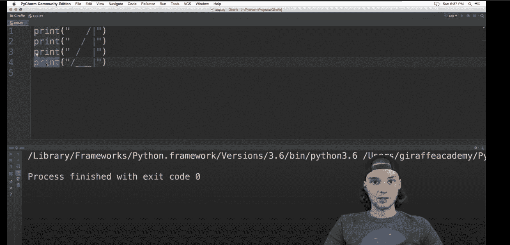

在这个 [freeCodeCamp YouTube 课程](https://www.youtube.com/watch?v=rfscVS0vtbw)中，你将学习列表、条件、字符串、元组、函数、类等编程基础知识。

你也将建立几个小项目，如一个基本的计算器，疯狂的 libs 游戏，翻译应用程序和猜谜游戏。

## Python 手册

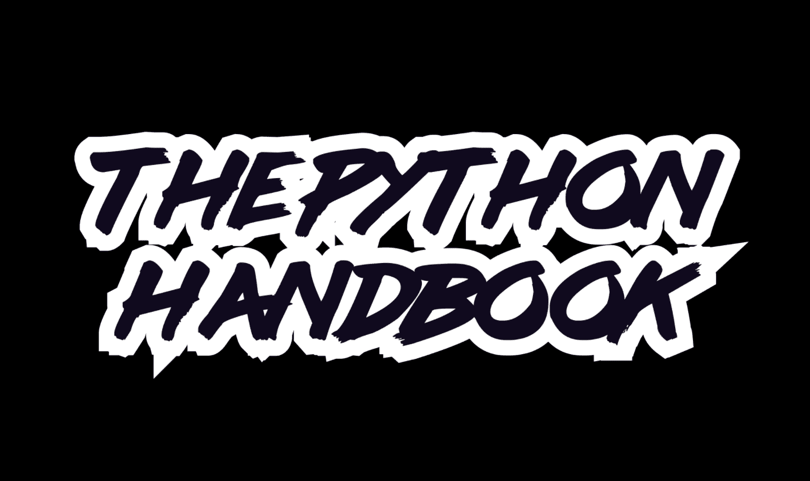

在这篇 Flavio 应付的文章中，你将学习字符串、列表、元组、递归等等。

您还将了解如何安装第三方软件包以及如何使用虚拟环境。

# CS Dojo 为绝对初学者提供的 Python 教程

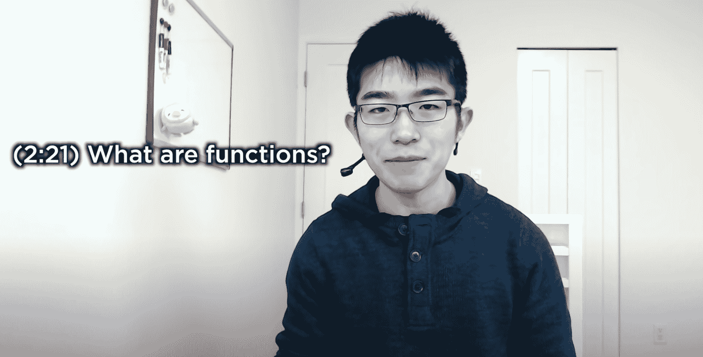

在这一系列由 CS Dojo 制作的[初级 Python YouTube 视频中，你将了解字典、循环、函数、对象等等。](https://www.youtube.com/playlist?list=PLBZBJbE_rGRWeh5mIBhD-hhDwSEDxogDg)

您还将学习如何使用 Python 构建一个 Twitter 机器人。

## 面向所有人的编程(Python 入门)

在这个[密歇根大学的课程](https://www.freecodecamp.org/news/python-for-everybody/)中，你会从著名的“查克博士”那里学到函数、循环、条件、变量等等。

一旦你学会了基础知识，你就可以继续完成剩下的[专业](https://www.coursera.org/specializations/python)并参加 [Python 数据结构课程](https://www.coursera.org/learn/python-data?specialization=python)、[使用 Python 访问 Web 数据课程](https://www.coursera.org/learn/python-network-data?specialization=python)，以及[使用数据库和 Python 课程](https://www.coursera.org/learn/python-databases?specialization=python)。

## 今晚学习

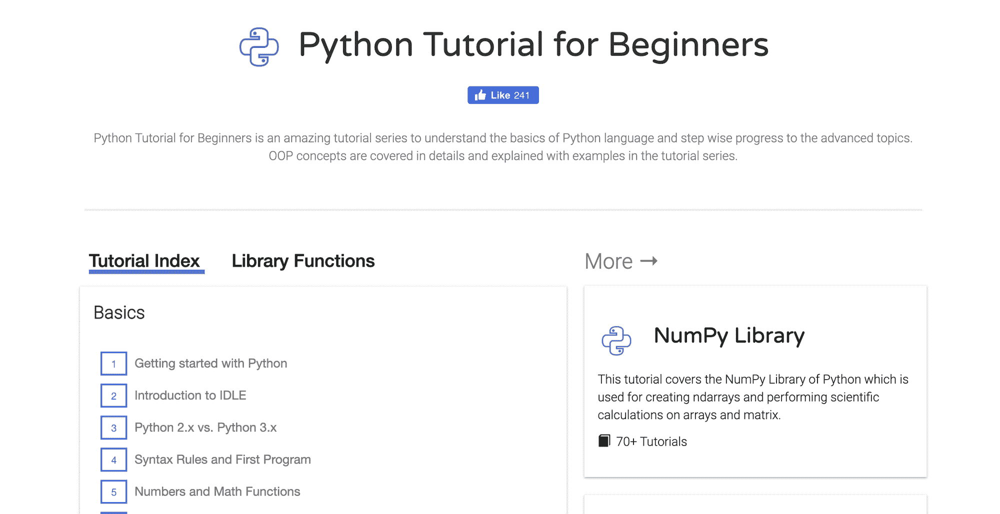

在今晚的学习中，你将学习 Python 基础知识、错误处理、OOP、文件处理、复杂数据类型、多线程等等。

一旦你学会了基础知识，你就可以进入他们的其他模块，包括 [NumPy 库](https://www.studytonight.com/numpy)、 [Matplotlib](https://www.studytonight.com/matplotlib) 、 [Tkinter](https://www.studytonight.com/tkinter) 、[Python 中的网络编程](https://www.studytonight.com/network-programming-in-python/)和[使用 Beautiful Soup 的网络抓取](https://www.studytonight.com/python/web-scraping/)。

## Python 核心

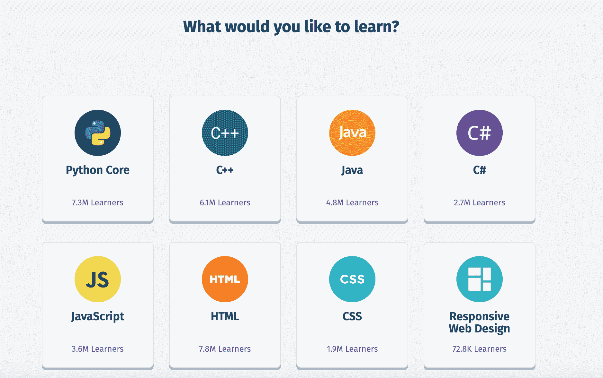

在 [SoloLearn 的 Python 课程](https://www.sololearn.com/learning/1073)中，你会学到字符串、变量、OOP、函数式编程等等。在这个过程中，你可以进行大量的测验、挑战和项目。

为了开始，你需要创建一个免费帐户。

## 真正的 Python

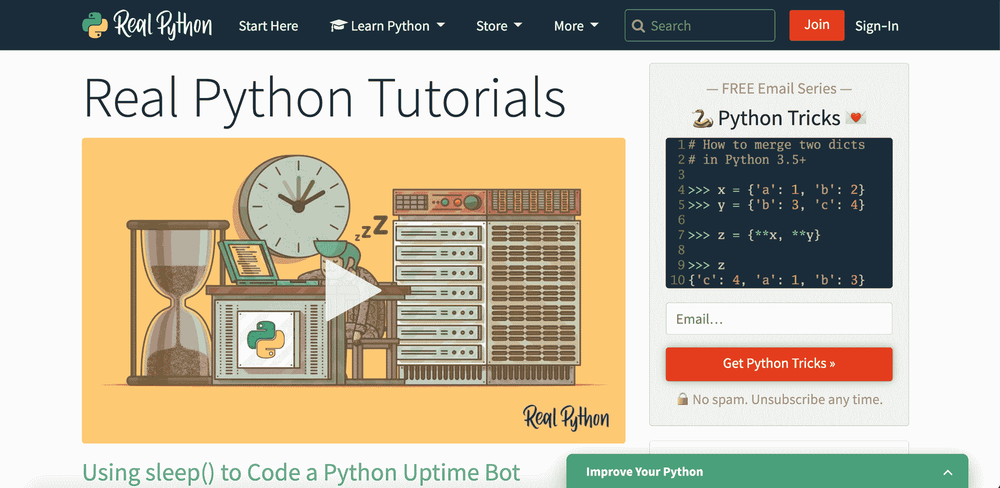

[真正的 Python 教程](https://realpython.com/)提供各种资源，通过文章、视频、项目和测验帮助你学习 Python。你可以从关于数据类型、循环、函数、字符串和数据结构的[基础课程](https://realpython.com/search?level=basics&q=basics)开始。

然后，你可以进入一个广泛的[项目列表](https://realpython.com/search?level=basics&q=projects)，其中包括建立一个个人日记、一个投资组合应用和一个比特币价格通知服务。

为了获得完整的内容，你必须成为付费的[用户](https://realpython.com/account/join/)。

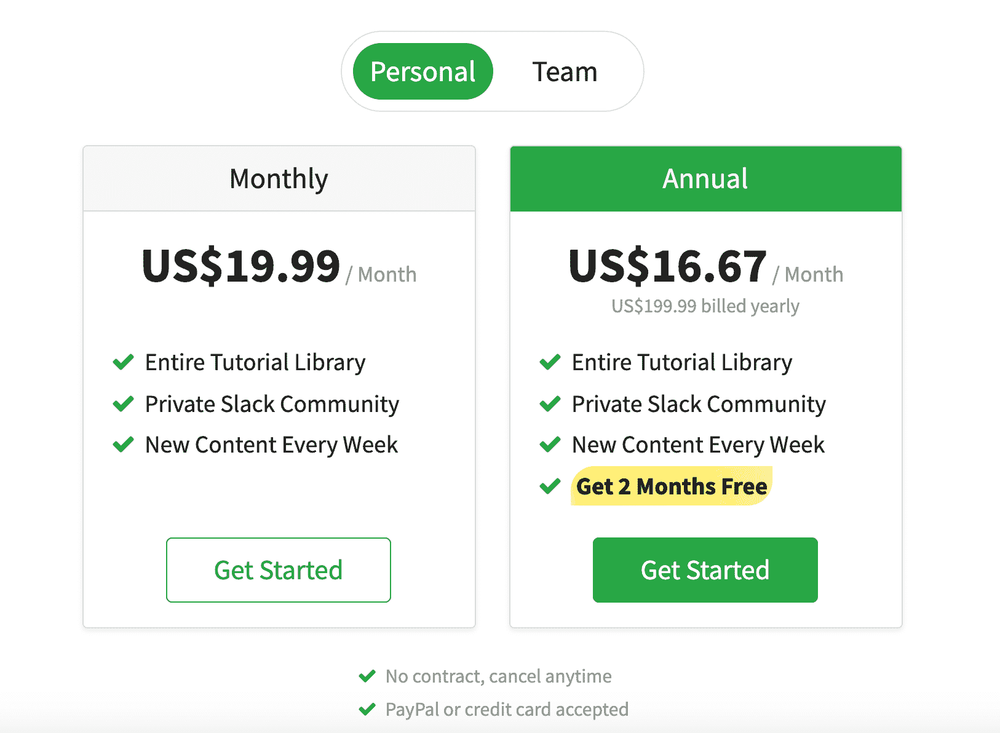

## Python 基础(freeCodeCamp)

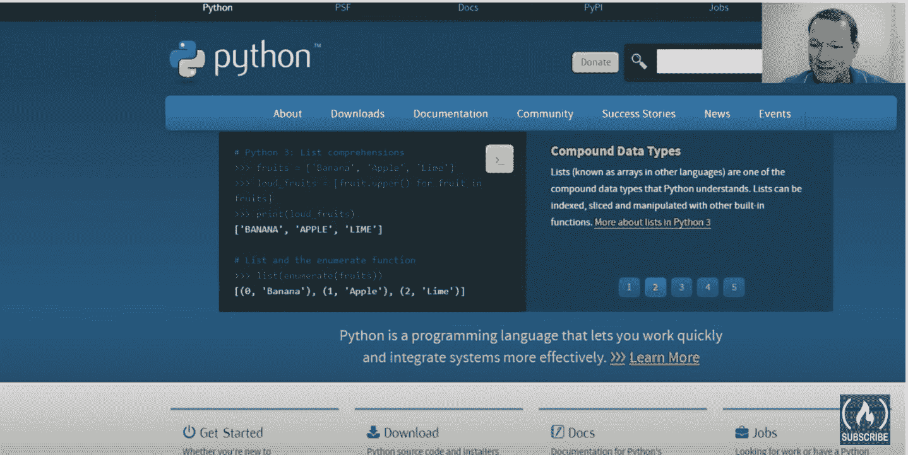

在这个 Sam Focht YouTube 系列中，你将学习循环、函数、字符串、递归等等。

您还将构建几个项目，包括猜谜游戏、购物清单、棋盘游戏和随机密码生成器。

## Python 初学者教程

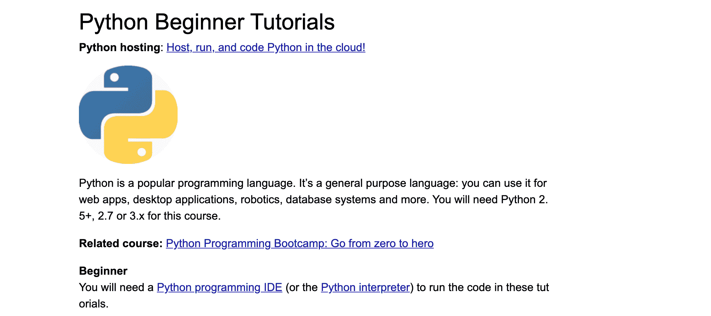

在这个[系列的 Pythonspot 初学者教程](https://pythonspot.com/beginner/)中，您将了解数据类型、元组、对象、类、字典等等。您还将了解递归、lambda 和线程等高级概念。

一旦你掌握了基础知识，你就可以进入[机器学习](https://pythonspot.com/machine-learning/)、[数据库](https://pythonspot.com/python-database/)和 [GUI 的](https://pythonspot.com/gui/)。

## Python 教程

在这个 [PythonForBeginners 教程](https://www.pythonforbeginners.com/python-tutorial)中，你将学习函数、循环、列表、条件、错误处理等等。

一旦你学会了基础知识，你就可以探索网站上的其他模块，包括使用 BeautifulSoup 的[网页抓取](https://www.pythonforbeginners.com/python-on-the-web/web-scraping-with-beautifulsoup)和使用 Python 中的 YouTube API 的[。](https://www.pythonforbeginners.com/api/using-the-youtube-api)

## 用 Python 自动化枯燥的东西

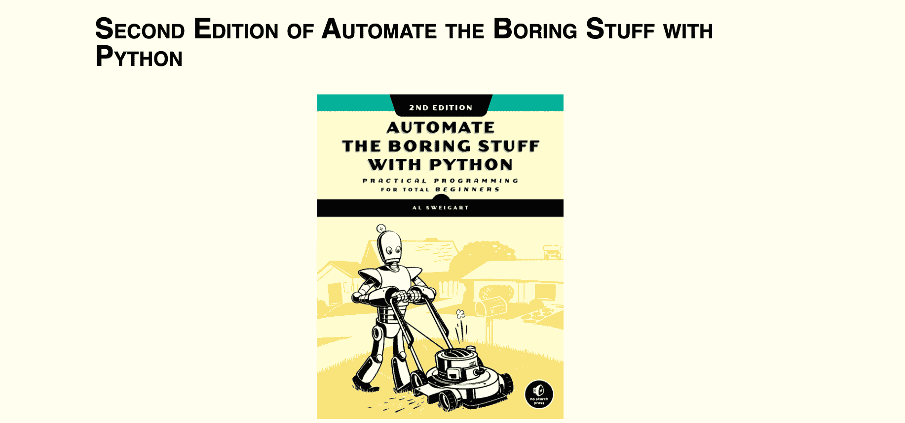

在[用 Python 在线书](https://automatetheboringstuff.com/)自动化枯燥的东西中，你将了解字典、字符串、调试、正则表达式等等。

如果你喜欢视频格式，那么你可以浏览一下 Al Sweigart 整理的 YouTube 系列视频。

## 学习 Python 2

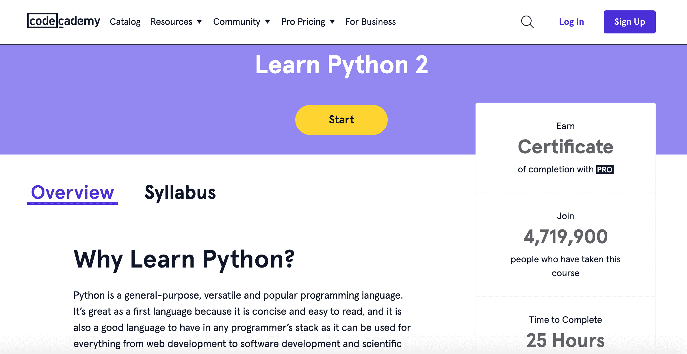

在这个 [Codecademy 课程](https://www.codecademy.com/learn/learn-python)中，你将学习基本语法、字符串、函数、列表、条件等等。本课程还将涵盖更高级的主题，如列表切片和 lambda 表达式。

为了参加该课程，您需要创建一个帐户。

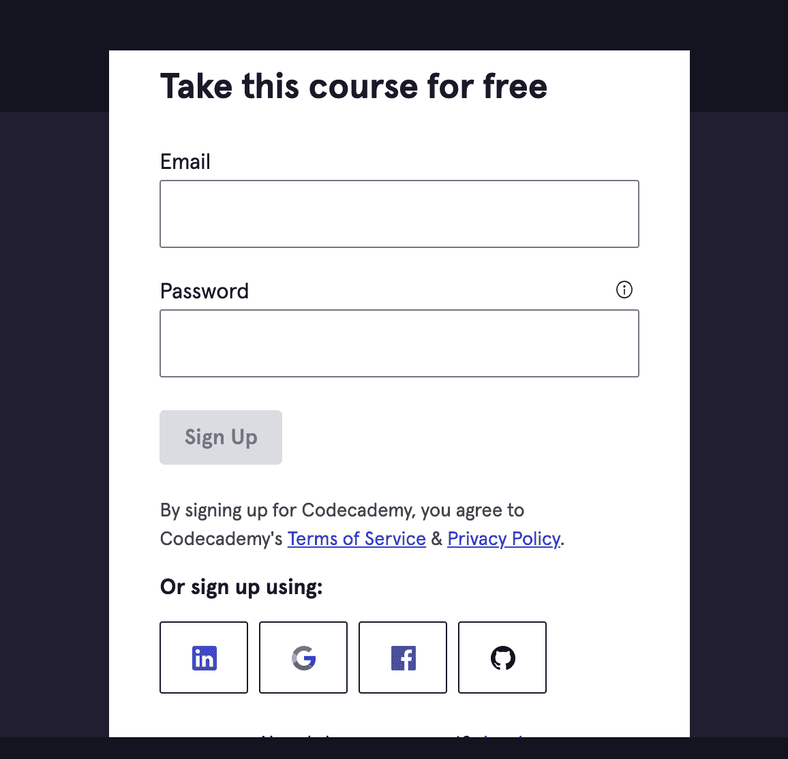

## 艰难地学习 Python

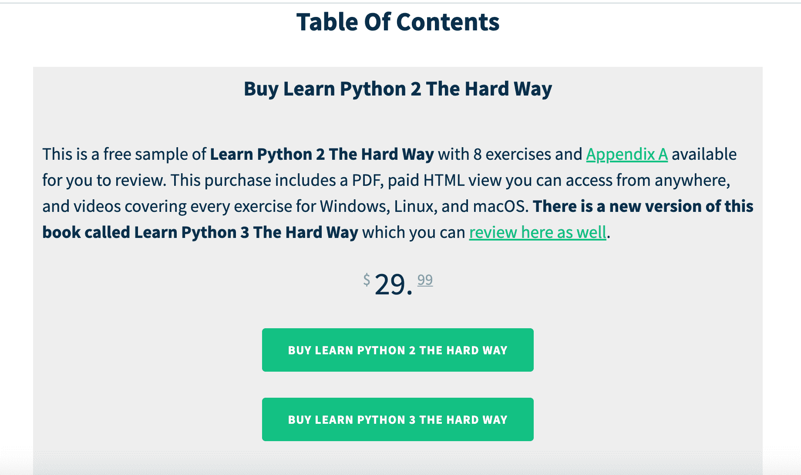

在 [艰难地学习 Python 2](https://shop.learncodethehardway.org/access/buy/2/)，你将学习变量、条件、函数、类、对象等等。你还将学习如何建立一个网站和一个游戏。

你也可以选择这本书的更新版本，即[艰难地学习 Python 3](https://shop.learncodethehardway.org/access/buy/9/)。这两本书都是付费选项。

## Python 初学者速成班

在这个 [Brad Traversy YouTube 课程](https://www.youtube.com/watch?v=JJmcL1N2KQs)中，你将了解列表、元组、字典、函数、类等等。Brad 还将向您展示如何处理文件和 JSON 数据。

## Python 教程——Python 初学者教程

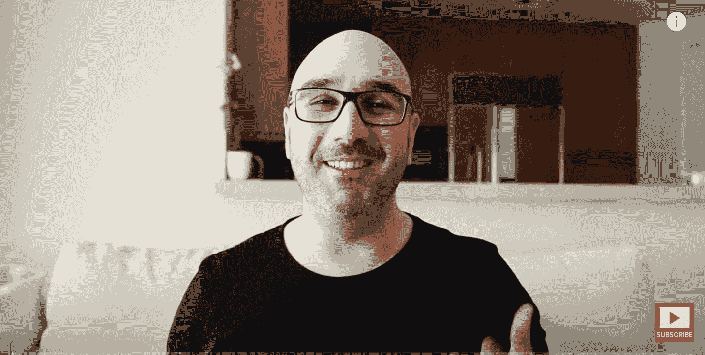

在这个[用 Mosh YouTube 编程的课程中，](https://www.youtube.com/watch?v=_uQrJ0TkZlc)你将学到编程的基础知识，比如变量、循环、字符串、元组、函数、类等等。

您还将构建三个项目:一个关于自动化，一个关于机器学习，一个关于用 Django 构建网站。

对于额外的练习，你可以浏览 Mosh 的 [53 Python 初学者练习](https://programmingwithmosh.com/python/python-exercises-and-questions-for-beginners/)。

## 使用 Python 进行科学计算

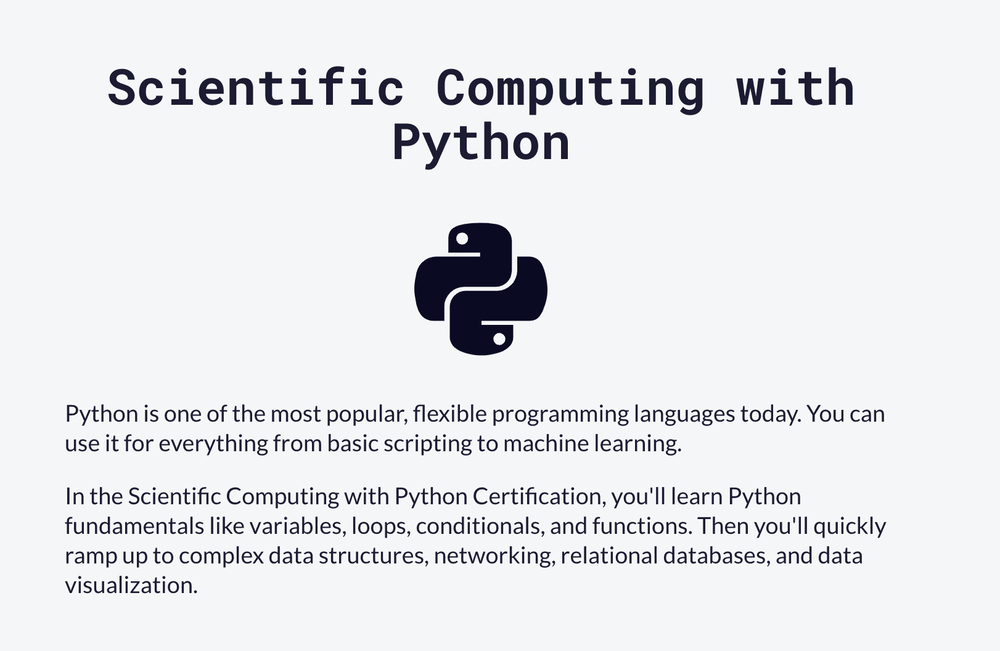

在[这门 freeCodeCamp 认证课程](https://www.freecodecamp.org/learn/scientific-computing-with-python/)中，你将会学到循环、列表、字典、网络、网络服务等等。

你还将有机会搭建五个项目:[算术格式化器](https://www.freecodecamp.org/learn/scientific-computing-with-python/scientific-computing-with-python-projects/arithmetic-formatter)、[时间计算器、](https://www.freecodecamp.org/learn/scientific-computing-with-python/scientific-computing-with-python-projects/time-calculator)、[预算 App、](https://www.freecodecamp.org/learn/scientific-computing-with-python/scientific-computing-with-python-projects/budget-app)、[多边形面积计算器](https://www.freecodecamp.org/learn/scientific-computing-with-python/scientific-computing-with-python-projects/polygon-area-calculator)、[概率计算器](https://www.freecodecamp.org/learn/scientific-computing-with-python/scientific-computing-with-python-projects/probability-calculator)。