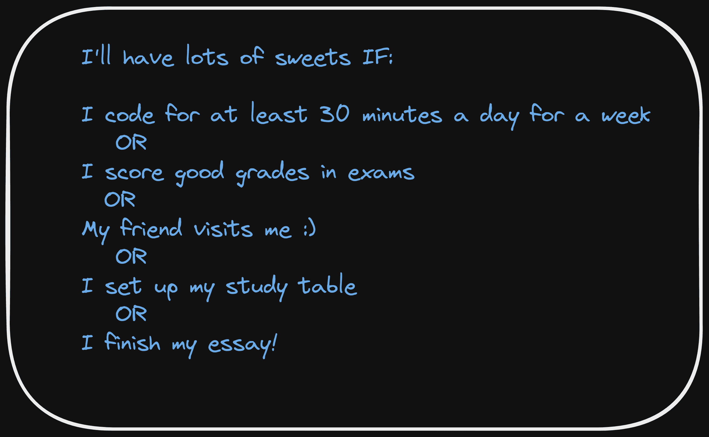

# Python any()和 all()函数——举例说明

> 原文：<https://www.freecodecamp.org/news/python-any-and-all-functions-explained-with-examples/>

在用 Python 编码时，你是否曾经不得不检查一个 iterable 中的*任何*项或*所有*项是否都等于`True`？下次你需要这样做的时候，一定要使用漂亮的函数`any()`和`all()`。

在本教程中，我们将学习 Python 的`any()`和`all()`函数，并用简单的例子来理解它们是如何工作的。

## Python 中的布尔数据类型

在我们进入`any()`和`all()`之前，让我们快速回顾一下 Python 中的布尔数据类型。你可以在任何 Python 对象上调用`bool()`来获得它的真值。您可以在您喜欢的 IDE 中运行下面的代码示例。

```
# truth value of None is False
print(bool(None))
# Output
False

# truth value of an empty string ("") is False
print(bool(""))
# Output
False

# truth value of an empty list (or any iterable) is False
print(bool([]))
# Output
False

# truth value of 0 {int (0), float (0.0) and complex (0j)} is False
print(bool(0))
# Output
False
```

如上面的代码片段所示，

*   `None`的真值为`False`，
*   数字零(`0`)——整数、浮点和复数表示`0`——都有一个真值`False`，并且
*   所有像列表、元组和字符串这样的空可迭代对象都有一个真值`False`。

也就是说，非常直观的是，所有的*非零的*值，以及*非空的*项都有一个真值`True`。

## 如何在 Python 中使用 any()函数

让我们先了解一下`any()`函数的语法，看看一些简单的例子，然后再看更有用的例子。

**👉语法** : `any(iterable)`

*   如果`bool(x)`对于 iterable 中的任何`x`都是`True`，则返回`True`。
*   如果 iterable 为空，则返回`False`。

因此，`any()`函数将 iterable 作为参数，只要 iterable 中至少有一项是`True`，就返回`True`。

这里有几个简单的例子来验证`any()`函数是如何工作的:

```
list_1 = [0,0,0,1,0,0,0,0]
# any(a list with at least one non-zero entry) returns True
print(any(list_1))
# Output
True

list_2 = [0j,0,0,0.0,0,0,0.0,0]
# any(a list of zeros) returns False
print(any(list_2))
# Output
False

list_3 = [True, False, False]
# any(a list with at least one True value) returns True
print(any(list_3))
# Output
True

list_4 = ["","","code more"]
# any(a list with at least one non-empty string) returns True
print(any(list_4))
# Output
True

list_5 = ["","",""]
# any(a list of empty strings) returns False
print(any(list_5))
# Output
False 
```

### 如何使用 Python 的 any()函数检查字符串中的数字

现在让我们使用`any()`函数来检查字符串中是否有*个*位。让我们把步骤写下来。

*   检查:字符串中有数字吗？
*   遍历字符串以访问字符串中的每个字符。
*   通过调用`isdigit()`方法检查每个字符是否是一个数字。
*   如果被测字符是数字，则`isdigit()`返回`True`，否则返回`False`。

列表理解对于在一个列表中收集所有这些真值非常有帮助。这里有一个快速回顾:

```
 # List Comprehension

 [output_expression for every_item in an_iterable]
     |
     |
     V
    result of doing something on each item in the iterable

 # In essence, Loop through the iterable, do something on each item and
 return the result of the operation. 
```

如下面的代码片段所示，我们的示例字符串`coding**is**cool**345`包含数字。

所以在字符串上调用`any()`函数应该会返回`True`。根据字符是否是数字，我们使用列表理解来获得一个包含`True`和`False`值的列表。

```
my_string = "coding**is**cool**345"
are_there_digits = [char.isdigit() for char in my_string]
print(any(are_there_digits))

# Output
True
```

注意`are_there_digits`是一个条目数与字符串长度一样多的列表。

对于字符串中的每个字符，都有一个对应的真值——`True`(如果字符是数字),如果字符不是数字,`False`,如下所示。

```
print(are_there_digits)

# Output
[False, False, False, False, False, False, False, False, False, False, False,
False, False, False, False, False, False, False, True, True, True]
```

### 如何使用 Python 的 any()函数检查字符串中的字母

我们再举一个类似的例子。这一次，让我们检查字符串中字母的出现。

被测试的字符串是不包含字母的`***456278)))`——调用`any()`会像预期的那样返回`False`。对于字符串中的每个字符，调用`isalpha()`方法检查它是否是一个字母。

```
my_string = "***456278)))"
num = [char.isalpha() for char in my_string]
print(any(num))

# Output
False
```

`is_letter`是一列`False`值，验证如下:

```
print(is_letter)

# Output
[False, False, False, False, False, False, False, False, False, False, False, False]
```

### 如何使用 Python 的 any()函数用逻辑 OR 组合多个条件

假设你决定提高效率，写下下面的清单。然而，你选择不苛求自己，决定只要清单上的一项发生，你就可以吃很多糖果！😀



注意我们如何有多个条件要考虑，但选择吃甜食，即使其中一个评估为`True`。

这是不是非常类似于一个`if`语句，在那里你需要检查由逻辑`or`操作符链接的多个条件是否评估为`True`？是的，它是，而且`any()`函数在这样做时非常方便。

假设你有`N`个条件`c1`、`c2`、`c3`，...，`cN`。考虑下面的伪代码:

```
if c1 or c2 or ... c_(N-1) or CN:
	# DO THIS

else:
	# DO THIS
```

您现在可以在一个 iterable 中收集所有这些条件，比方说，一个 list 或一个 tuple，然后在那个 iterable 上调用`any()`来检查是否有一个或多个条件是`True`，如下所示。这不是很简单吗？😀

```
conditions = [c1,c2,..., c_N]

if any(conditions):
	# DO THIS
else:
	# DO THIS
```

## 如何在 Python 中使用 all()函数

让我们从`all()`函数的语法开始。

👉**语法** : `all(iterable)`

*   如果对于 iterable 中的所有值`x``bool(x)`都是`True`，则返回`True`。
*   如果 iterable 为空，则返回`True`。

`all()`函数将一个 iterable 作为参数，仅当 iterable 中的所有项都计算为`True`或者 iterable 为空时，才返回`True`。在所有其他情况下，`all()`函数返回`False`。

### 如何使用 Python 的 all()函数检查字符串中的字母

让我们举类似的例子来检查字符串的某些特征。

测试字符串`coding**is**cool`除了包含字母外，还包含特殊字符`*`。所以，当我们使用`all()`函数检查字符串中的所有字符是否都是字母时，我们应该得到`False`。

```
my_string = "coding**is**cool"
are_all_letters = [char.isalpha() for char in my_string]
print(all(are_all_letters))
# Output
False

print(are_all_letters)
# Output
[True, True, True, True, True, True, False, False, True, True, False, False,
True, True, True, True]
```

注意列表`are_all_letters`在字符串中所有有`*`的位置都有`False`值。

### 如何使用 Python 的 all()函数检查字符串中的数字

现在让我们通过使用`all()`函数来检查字符串中的所有字符是否都是数字。测试字符串`56456278`只包含数字，因此，调用`all()`应该返回`True`，因为列表理解给了我们一个`True`值的列表。

```
my_string = "56456278"
are_all_digits = [char.isdigit() for char in my_string]
print(all(are_all_digits))
# Output
True

print(are_all_digits)
# Output
[True, True, True, True, True, True, True, True]
```

### 如何使用 Python 的 all()函数用逻辑 AND 组合多个条件

让我们考虑下面的例子。这一次，你在争夺一台 iPad，而且条件更加严格。你必须完成列表中的所有任务才能从你的表弟那里得到一台 iPad。😀


现在，这非常类似于使用一个`if`语句来检查由逻辑`and`操作符链接的多个条件是否评估为`True`，如下所示:

```
if c1 and c2 and ... c_(N-1) and CN:
	# DO THIS

else:
	# DO THIS
```

您可以使用`all()`函数，通过收集 iterable 中的条件，然后在 iterable 上调用`all()`函数，使这变得更加简洁。

```
conditions = [c1,c2,..., c_N]

if all(conditions):
	# DO THIS
else:
	# DO THIS
```

## 结论

希望这篇教程能帮助你理解 Python 中的`any()`和`all()`函数。

很快在另一篇文章中再见。直到那时，快乐学习！