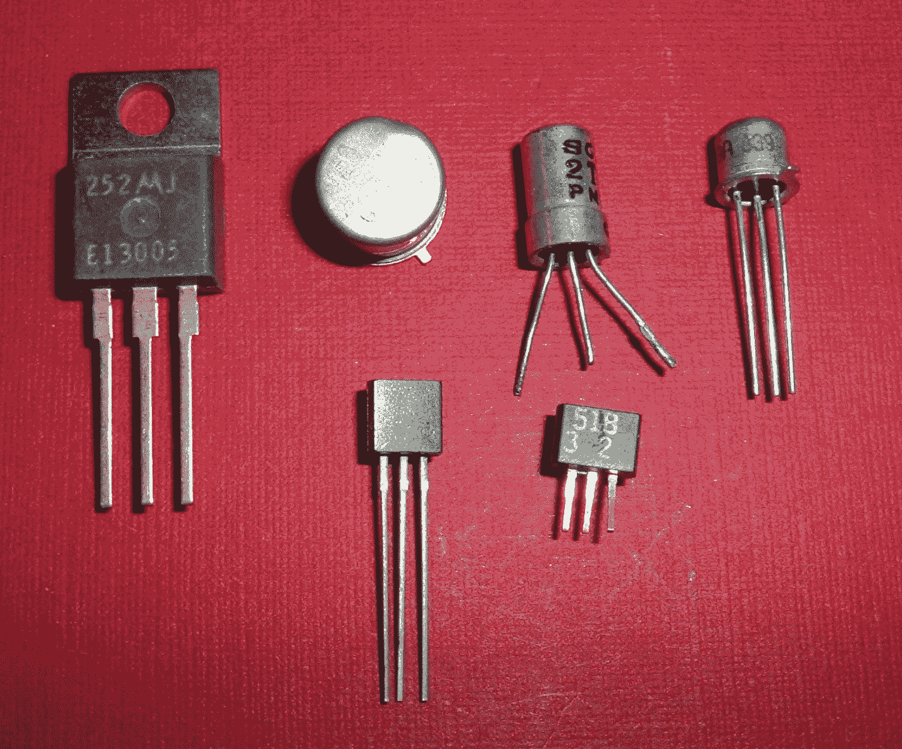
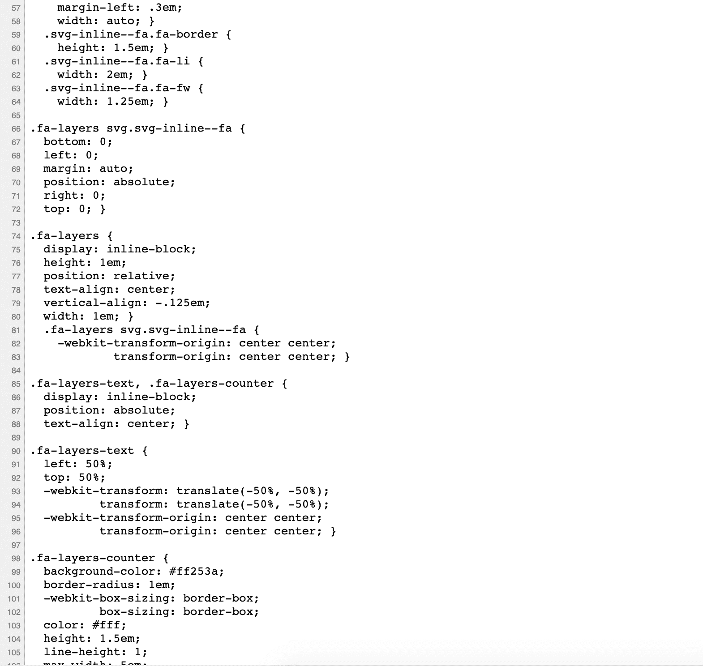

# 什么是编码？计算机编码定义

> 原文：<https://www.freecodecamp.org/news/what-is-coding/>

当你开始你的编码之旅时，最令人兴奋的——有时是压倒性的——事情就是有多少东西要学。

你会发现不同的语言、框架、库、发明和惯例。

一种技术往往需要另一种技术的知识，一切似乎都是相互联系和交织的。

在这样一个快节奏和不断变化的行业中，新技术经常出现，这很快会让初学者感到困惑。

当学习如何编码时，不要只专注于学习特定的技术，它还可以帮助学习基础——构建块——并剥离抽象层，以了解所有这些技术共有的基本原则。

理解什么是基本级别的编码将使解决问题变得更容易，并将使您更好地理解这些技术是如何工作的。

在这篇文章中，我们将学习什么是编码，这样你就有了一个坚实的基础。

## 电脑是如何工作的？

电脑关机后，只是昂贵的电子机器。它们是由一堆金属、塑料和其他材料组成的物体。

然而，一旦你按下电源按钮，他们已经完成了他们的加电过程，称为*启动*，他们来生活。

你的电脑变成了这台极其强大的机器。这种电子设备能够以令人难以置信的速度完成复杂的任务，这对人类来说即使不是不可能，也是很困难的。

他们的屏幕充满活力，有各种按钮和图标可供点击。

### 电脑和电力

计算机是在电的帮助下运转的。

电只有两种状态——要么打开，要么关闭。

电被打开并且流动代表真实，它有‘开’的状态。另一方面，当它关闭且不流动时，这代表假和“关闭”状态。

它在每个时间点只能有一种状态。

电的两种状态被称为*二进制状态*，前缀 bi-意为二。

### 什么是二进制代码？

电荷的概念和两种可能状态的存在与计算机硬件中使用的数字系统非常吻合。他们用它来完成交给他们的每一项任务。它被称为二进制代码，由`0`和`1`的序列组成。

根据设计，二进制代码直接对应于特定的机器指令、命令和计算机内存中的位置。然后，计算机读取并解释这些指令，然后执行特定的任务。

计算机由成千上万个充当电气开关的微小物理设备组合而成，这些设备被称为**晶体管。**

这些小小的电子硬件元件，晶体管，可以启动或关闭电流。

它们可以带正电，也可以带负电，这取决于它们的状态——也就是说，它们是否带电。

那些成千上万的小开关可以开也可以关。

### 二进制如何工作

你可能听说过*‘计算机以 1 和 0 工作’*，但那实际上是什么意思呢？我们可能不再直接处理二进制代码，但它是计算机 CPU 唯一能理解的东西。

真的有 0 和 1 存储在我们流动的物理设备中吗？不完全是。

然而，我们的 CPU 由许多携带信息的微型数字电路组成。

借助于聚集在一起形成这些电路的晶体管及其微小的电信号序列，这些电信号可以打开(`1`)或关闭(`0`)，因此只能有两种类型的电压——高电压和低电压。这导致不同值的表示，即执行不同的指令或计算。

当这些来自晶体管电路和其他电子元件的电信号以某种方式链接、组合/修改时，它们可以创建计算机可以执行和看穿的各种可能的任务和操作。

## 计算机及其与人类的关系

这种机器编程语言是唯一一种计算机可以直接理解并且能够理解的语言。

二进制代码可能因计算机和机器的不同而不同。当涉及到计算机编程的这个层面时，就没有可移植性了。这意味着程序和软件不能转移到不同的系统。

### 机器语言的局限性

机器语言可以根据实现它们的操作系统而变化。

当然，这是非常有限的。

机器代码或二进制代码可能运行得非常快，它们可能是计算机的本机语言，它们可能效率极高，因为指令是由 CPU 直接执行的。但这是一种非常单调乏味的使用电脑的方式，更不用说这种方式非常容易出错。

试图通过为每个中转器手动键入二进制代码来使用计算机是一个麻烦的过程。

在直接管理计算机的数据存储和操作时出错是很难修复的。

机器语言对人类来说很难读、写、学和理解。因此，程序员和计算机科学家找到了一种更好、也更容易解决问题的方法。

计算机自己能做的事情处于非常原始的水平，并且范围有限。

他们擅长进行算术运算，如加法或检查数字是否等于零。

### 计算中的人的因素

人类创造了这些机器，这些机器彻底改变了我们的生活方式，但归根结底，计算机真的没有那么聪明，它们自身的能力有限。

他们只做他们被告知要做的事情。他们不像人类那样做假设或有任何常识。

计算机的核心是执行数学运算的机器。但他们也擅长在屏幕上显示一些文本或一遍又一遍地重复一项任务。

这些操作是基本的，除此之外就没什么了。它们被称为计算机的**指令集**。

尽管它们的核心计算机只能完成非常基本的任务，但它们能够执行极其复杂的动作，并遵循和执行程序给出的指令。这要归功于它们的许多抽象层。

然而，真正的力量掌握在人类手中。无论我们想要实现什么，无论我们想象什么，我们都可以使用这台机器作为工具来进行复杂的计算，进行研究以在数十亿份其他文件中找到并提取一份文件，或者与远方的朋友和家人保持联系。

无论我们能想到什么，我们现在都可以通过编写程序来创造它。

计算机和程序可以在全世界范围内共同改善我们的生活。但是我们如何让他们做我们想要的呢？

## 什么是计算机编程？

计算机编码和计算机编程是经常互换使用的术语。尽管他们确实有一些不同。

### 编程与编码

编程意味着告诉计算机做什么以及如何做你告诉它做的事情。

它包括为你的计算机提供深思熟虑的、方法上的指令来阅读和执行。

你必须把大任务分解成小任务。你不断重复这个过程，将事情分解成更小的任务，直到你不再需要告诉计算机做什么——它已经知道如何完成任务。

编程的本质是解决问题、复杂思考、关注细节和推理的过程——所有这些都使用计算机。

编程包括考虑用户可能采取的所有不同步骤，以及可能出错的所有不同事情。一旦你想到了用户可能遇到的所有潜在问题，你就必须在编码之前找到解决方案。

我们可以把解决问题想象成获取输入(我们想要解决的问题的信息和细节)并生成输出(最终目标或问题的解决方案)。

输出可能很复杂，每秒可能运行数百万次。

### 用算法解决问题

当你使用计算机解决问题时，你需要根据计算机的指令集来表达问题的解决方案。

为此，我们使用**算法**——一种解决问题的系统方法。

算法是一种思想或方法，用一套非常简洁精确的规则和一步一步的指令来表达。计算机需要遵循这些指令来解决问题。

当我们想到算法时，它们不仅仅适用于计算机。它们也是机器独立的。

我们人类也遵循算法——在日常生活中完成任务的指令集。

一些例子可能是:

*   清点房间里的人数
*   做算术计算
*   试图找出到达特定目的地的正确路线
*   遵循烹饪食谱

在最后一个例子中，我们可以把菜谱想象成我们使用的指令，我们是必须读取并正确执行它们的计算机。

算法是一个计划，它给出了为了得到想要的结果你需要遵循的步骤。

### 计算机如何使用算法

当涉及到计算机时，算法需要精确，因为计算机从字面上理解一切。他们不去揣摩言外之意，也不做任何假设。

没有含糊不清的空间，因此算法不仅需要精确，还需要有条理、正确、没有错误、高效和设计良好。所有这些都有助于最大限度地减少计算机完成任务所需的时间和精力。

计算机以机械的方式执行算法，每一步都不用花太多心思。它们应该按照我们期望的方式工作。

计算机程序是这些指令或算法在一个文本文件中的集合，该文本文件用作指令手册。

它描述了计算机要遵循的一系列非常精确的步骤。计算机执行特定的任务，它的硬盘执行指令，最后你得到最终想要的结果。

除了思考、研究、设计和深入规划，编程还涉及测试、调试、部署和维护最终结果。

当你开发一个程序来解决一个特定的问题时，你通常会用算法来表达解决方案的想法。然后，开发人员通过实现该算法来编写程序。你使用一种语言，它有特定的语法，人类和计算机都能理解。

这是实际编码的地方。

## 什么是计算机编码？简单的定义。

编码是将想法、解决方案和指令转换成计算机可以理解的语言的过程，即二进制机器代码。

编码是人类与计算机交流的方式。

编码包括使用计算机编程语言交流和给出我们希望计算机执行的不同动作的指令。

**编程语言**，像 JavaSctipt，Java，C/C++，或者 Python，充当了人和机器之间的翻译器。

这些语言通过表示、表达和将算法付诸实践，弥合了计算机和人类之间的沟通鸿沟。它们使用机器能够理解和遵循的特定语句序列来实现这一点。

编程语言类似于人类语言，因为它们是由基本的语法元素组成的，如名词、动词和短语。你把这些元素组合在一起，形成类似句子的东西来创造意义。

这些语言实际上很像英语。但它们提供了一种更短、更精确、更简洁的方式来创建计算机可以理解的指令。

另一方面，像英语这样的口语/自然语言给歧义和不同人的不同解释留下了很大的空间。

编程语言是一套定义你如何编写计算机代码的规则。

我们使用计算机代码来创建所有的网络应用程序、网站、游戏、操作系统以及我们日常使用的所有其他软件程序和技术。

你可以点击`Control and clicking your touchpad/mouse` ，然后从弹出的菜单中选择`View Page Source`(或`inspect`)来查看组成你最喜欢的网站的代码(或者你可以使用快捷键`Option Command U`):

然后，您会看到构成您正在使用的网站的前端代码的 HTML、CSS 和 JavaScript:

简而言之，编码是将问题从自然的人类语言翻译成机器可读语言的行为。而这种翻译的发生要归功于编程语言和编码。

编码要求你理解组成编程语言的复杂性、特定的语法和特定的关键字。一旦你知道了语言的这些特性，你就可以开始开发应用程序了。

## 结论

在这篇文章中，我们学习了计算机在高层次上是如何工作的。然后我们定义了什么是编程，什么是编码，以及它们之间的区别。

记住编码只是写代码开发程序和应用的过程。

编码是编程的一个子集，它需要逻辑推理、分析，并在进行任何编码之前为计算机程序或应用程序规划出一系列指令。

编程是这个过程中更大的画面。编码是这个过程的一部分，但是应该总是在编程，或者解决问题和计划阶段之后。

我希望这能帮助你理解编程和编码的基础知识。感谢阅读！