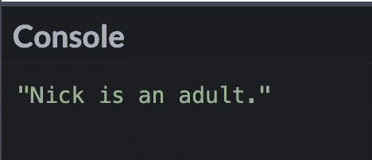
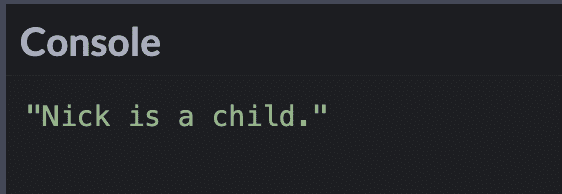
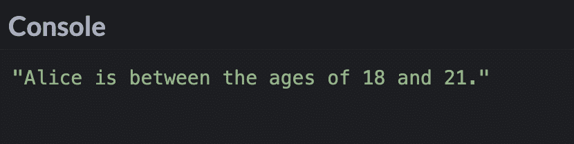
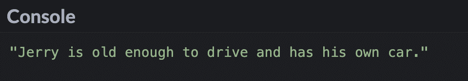
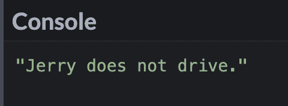
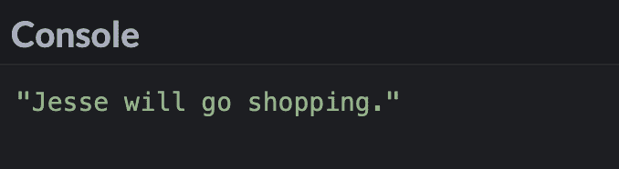
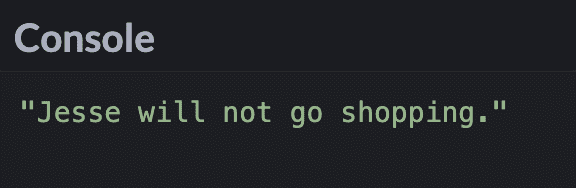
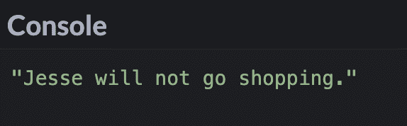
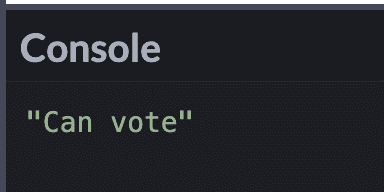

# JavaScript If-Else 和 If-Then-JS 条件语句

> 原文：<https://www.freecodecamp.org/news/javascript-if-else-and-if-then-js-conditional-statements/>

有时，您会希望在代码中编写处理不同决策的命令。

例如，如果您正在编写一个机器人，您可以让它根据它接收到的一组命令用不同的消息进行响应。

在本文中，我将解释什么是`if...else`语句，并提供代码示例。我们还将看到条件(三元)操作符，它可以作为`if...else`语句的简写。

## 什么是如果...JavaScript 中的 else 语句？

`if...else`是一种条件语句，当`if`语句中的条件为`truthy`时，它将执行一段代码。如果条件是`falsy`，那么`else`程序块将被执行。

`Truthy`和`falsy`值被转换成`if`语句中的`true`或`false`。

```
if (condition is true) {
   // code is executed
} else {
   // code is executed
}
```

在 JavaScript 中，任何未定义为`falsy`的值都将被视为`truthy`。

以下是`falsy`值的列表:

*   错误的
*   0(零)
*   -0(负零)
*   0n (BigInt 零)
*   `""`、`''`、````(空字符串)
*   空
*   不明确的
*   NaN(非数字)

## if 的例子...JavaScript 中的 else 语句

在本例中，`if`语句的条件是`true`，因此打印到控制台的消息应该是“Nick 是成年人”

```
const age = 18;

if (age >= 18) {
  console.log("Nick is an adult.");
} else {
  console.log("Nick is a child.");
}
```



但是如果我把`age`变量改为小于 18，那么条件将是`false`，代码将执行`else`块。

```
const age = 12;

if (age >= 18) {
  console.log("Nick is an adult.");
} else {
  console.log("Nick is a child.");
}
```



## 多个条件的示例(如果...否则如果...else 语句)

有时，您需要测试多个条件。这就是`else if`块出现的地方。

```
if (condition 1 is true) {
   // code is executed
} else if (condition 2 is true) {
  // code is executed
} else {
   // code is executed
}
```

当`if`语句为`false`时，计算机将进入`else if`语句。如果那也是`false`，那么它将移动到`else`块上。

在这个例子中，`else if`块将被执行，因为 Alice 的年龄在 18 到 21 岁之间。

```
const age = 18;

if (age < 18) {
  console.log("Alice is under 18 years old.");
} else if (age >= 18 && age <= 21) {
  console.log("Alice is between the ages of 18 and 21.");
} else {
  console.log("Alice is over 21 years old.");
}
```



## 何时在 if 上使用 switch 语句...else 语句？

在 JavaScript 中，有时你[可能会考虑使用`switch`语句](https://www.freecodecamp.org/news/javascript-switch-case-js-switch-statement-example/)而不是`if else`语句。

`switch`语句可以比复杂的`if else`语句有更清晰的语法。

看看下面的例子——不要使用这个长的`if else`语句，你可以选择一个更容易阅读的`switch`语句。

```
const pet = "dog";

if (pet === "lizard") {
  console.log("I own a lizard");
} else if (pet === "dog") {
  console.log("I own a dog");
} else if (pet === "cat") {
  console.log("I own a cat");
} else if (pet === "snake") {
  console.log("I own a snake");
} else if (pet === "parrot") {
  console.log("I own a parrot");
} else {
  console.log("I don't own a pet");
}
```

```
const pet = "dog";

switch (pet) {
  case "lizard":
    console.log("I own a lizard");
    break;
  case "dog":
    console.log("I own a dog");
    break;
  case "cat":
    console.log("I own a cat");
    break;
  case "snake":
    console.log("I own a snake");
    break;
  case "parrot":
    console.log("I own a parrot");
    break;
  default:
    console.log("I don't own a pet");
    break;
}
```

陈述并不适合在所有情况下使用。但是如果你觉得`if else`语句又长又复杂，那么`switch`语句可能是一个替代选择。

## 逻辑 AND (&&)运算符和 if...JavaScript 中的 else 语句

在逻辑 AND ( `&&`)运算符中，如果两个条件都是`true`，那么`if`块将被执行。如果一个或两个条件都是`false`，那么`else`程序块将被执行。

在这个例子中，由于年龄大于 16，并且`ownsCar`变量是`true`，那么`if`块将会运行。打印到控制台上的信息将是“杰里已经到了开车的年龄，他有自己的车了。”

```
const age = 17;
const ownsCar = true;

if (age >= 16 && ownsCar) {
  console.log("Jerry is old enough to drive and has his own car.");
} else {
  console.log("Jerry does not drive.");
}
```



如果我将`age`变量改为小于 16，那么两个条件都不再是`true`，而是执行`else`块。

```
const age = 13;
const ownsCar = true;

if (age >= 16 && ownsCar) {
  console.log("Jerry is old enough to drive and has his own car.");
} else {
  console.log("Jerry does not drive.");
}
```



## 逻辑 OR (||)运算符和 if...JavaScript 中的 else 语句

在逻辑 OR ( `||`)运算符中，如果一个或两个条件都是`true`，那么`if`语句中的代码将会执行。

在这个例子中，即使`isSale`变量被设置为`false`，因为`boyfriendIsPaying`变量被设置为`true`，所以`if`块中的代码仍然会执行。

```
const boyfriendIsPaying = true;
const isSale = false;

if (boyfriendIsPaying || isSale) {
  console.log("Jesse will go shopping.");
} else {
  console.log("Jesse will not go shopping.");
}
```



如果我将变量`boyfriendIsPaying`的值改为`false`，那么`else`块将会执行，因为两个条件都是`false`。

```
const boyfriendIsPaying = false;
const isSale = false;

if (boyfriendIsPaying || isSale) {
  console.log("Jesse will go shopping.");
} else {
  console.log("Jesse will not go shopping.");
}
```



## 逻辑非(！)运算符和 if...JavaScript 中的 else 语句

逻辑 NOT ( `!`)运算符将把某个为`true`的东西变成`false`。它还会将某个为`false`的东西变成`true`。

我们可以修改前面的例子，使用`!`操作符来生成`boyfriendIsPaying`变量`false`。由于两个条件都是`false`，将执行`else`程序块。

```
const boyfriendIsPaying = true;
const isSale = false;

if (!boyfriendIsPaying || isSale) {
  console.log("Jesse will go shopping.");
} else {
  console.log("Jesse will not go shopping.");
}
```



## JavaScript 中的条件(三元)运算符

如果您有一个简短的`if else`语句，那么您可以选择使用三元运算符。三元这个词的意思是由三部分组成的东西。

这是三元运算符的基本语法:

```
condition ? if condition is true : if condition is false 
```

条件在`?`标记之前，如果是`true`，那么`?`标记和`:`之间的代码将执行。如果条件是`false`，那么`:`之后的代码将执行。

在本例中，由于年龄大于 18 岁，因此发送到控制台的消息将是“可以投票”。

```
const age = 32;
const citizen = age >= 18 ? "Can vote" : "Cannot vote";
console.log(citizen); 
```



下面是使用`if else`语句的代码:

```
const age = 32;
let citizen;

if (age >= 18) {
  citizen = "Can vote";
} else {
  citizen = "Cannot vote";
}

console.log(citizen);
```

## 结论

当`if`语句中的条件为`truthy`时，`if else`语句将执行一段代码。如果条件是`falsy`，那么`else`程序块将被执行。

有时候你想测试多个条件，你可以使用一个`if...else if...else`语句。

如果您觉得`if else`语句又长又复杂，那么`switch`语句可能是一个替代选项。

使用逻辑运算符测试多个条件可以取代嵌套的`if else`语句。

三元运算符可用于为简单的`if else`语句编写较短的代码。