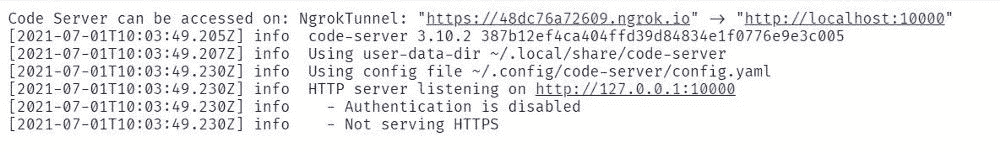
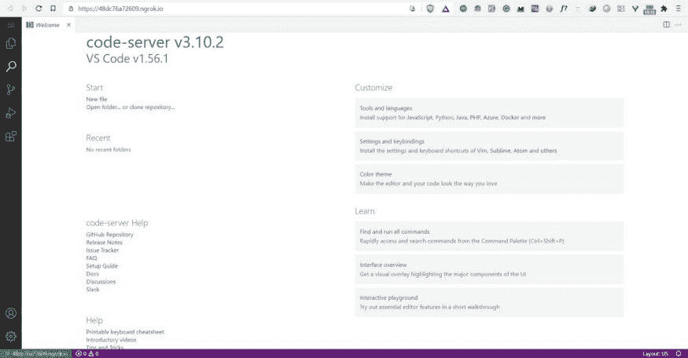
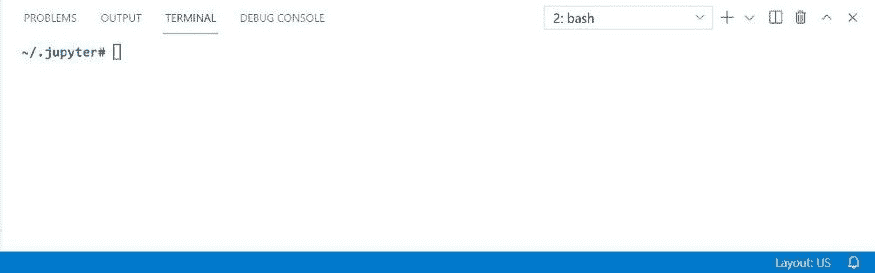
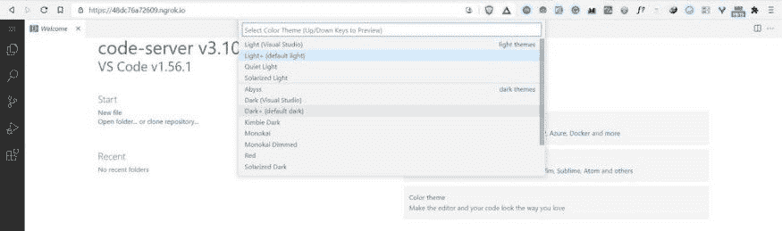
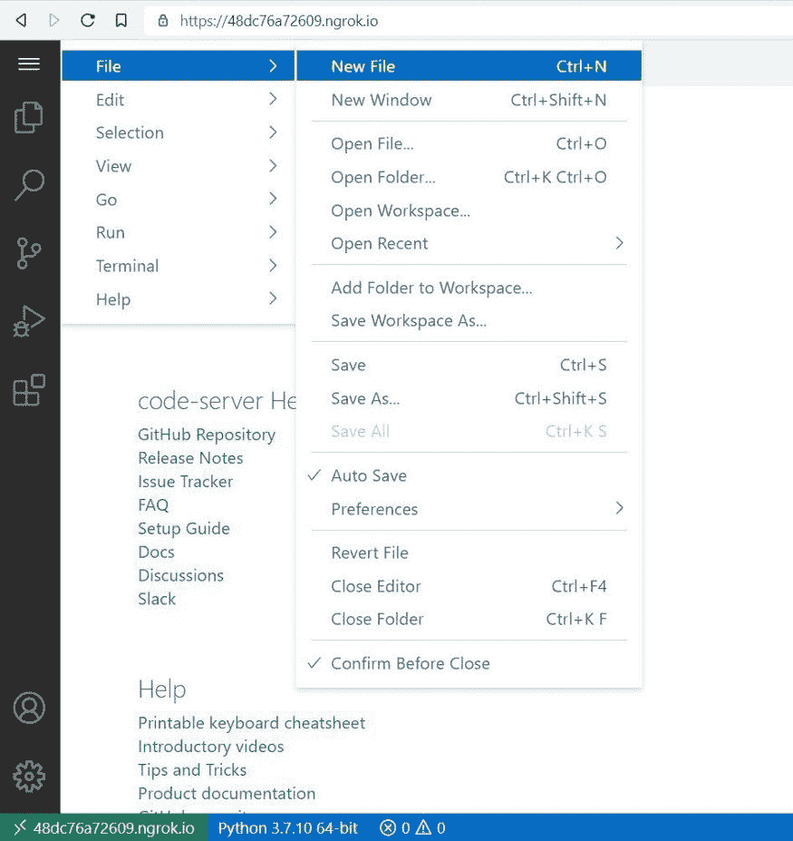

# 如何用 VS 代码使用 Google Colab

> 原文：<https://www.freecodecamp.org/news/how-to-use-google-colab-with-vs-code/>

Google Colab 和 VS Code 是许多 Python 开发人员使用的两个流行的编辑器工具。它们非常适合开发高效的技术解决方案或系统，尤其是在机器学习和数据科学领域。

如果您是 Python 开发人员或数据科学家，您可能已经知道如何使用 Google Colab。但是你知道吗，你可以在 Google Colab 上设置 VS 代码，并像在本地机器上一样作为编辑器使用它。

**在这篇文章中，你将学到:**

1.  如何安装 colabcode Python 包？
2.  如何启动 VS 代码(代码服务器)。
3.  如何访问在线 VS 代码？
4.  如何打开终端？
5.  如何运行 Python 文件？

## 如何用 VS 代码使用 Google Colab

### 打开 Colab 笔记本

第一步是在你的 Google colab 中推出一款新的 Colab 笔记本。您可以根据需要重命名该文件。

比如 **`run_vscode.ipynb`。**

### 安装 colabcode Python 包。

要将 Google Colab 与 VS Code(代码服务器)一起使用，需要安装 colabcode Python 包。这是一个很棒的开源 Python 包，由 Abhishek Thakur 开发。

要安装该软件包，请在笔记本单元中运行以下命令:

```
 !pip install colabcode
```

### 导入 ColabCode 代码

下一步是从包中导入 ColabCode 类。

```
from colabcode import ColabCode
```

### 创建 ColabCode 的实例

导入 ColabCode 后，您需要创建 ColabCode 的实例并设置以下参数:

*   **端口**–您想要运行代码服务器的端口。例如，端口=10000
*   **密码**–您可以设置密码来保护您的代码服务器免受未经授权的访问。这是一个可选参数。
*   **mount _ drive**–如果你想使用你的 Google drive。这是一个布尔参数，意味着你可以设置它为真或假。这是一个可选参数。

```
ColabCode(port=10000)
```

### 启动代码服务器

运行 ColabCode 实例后，它将启动服务器并显示访问代码服务器的链接。



你需要点击链接，它会在一个新的标签中打开。



现在，您可以利用成熟的代码编辑器，在 Colab VM 上运行不同的实验。

**注意:**如果您检查您的 Colab 笔记本，您将看到运行 ColabCode 实例的单元正在持续运行。除非你想关闭运行 VS 代码的代码服务器，否则不要关闭你的 Colab 笔记本。

## 在 Google Colab 上使用 VS 代码的技巧

启动代码服务器后，使用以下提示帮助您开始在 Google Colab 上使用 VS 代码。

### 步骤 1:打开终端

要在 Google Colab 上运行的 VS 代码上打开终端，请使用以下快捷命令:

```
Ctrl + Shift + `
```



### 第二步:如果你愿意，改变主题

您可以通过单击设置图标(左下角)然后单击“颜色主题”来更改编辑器的主题。它将打开一个弹出窗口，您可以选择不同的主题选项。



### 步骤 3:运行 Python 文件

您可以通过点击侧边栏上的**“文件”**部分，然后选择一个**“新文件”**选项卡来创建一个 Python 文件。



在下面的示例中，您将看到如何运行一个简单的 Python 文件，该文件训练机器学习算法将鸢尾花分为三个种类(setosa、versicolor 或 virginica ),然后进行预测。


## 对 VS 代码使用 Google Colab 的最终想法

恭喜👏👏，你已经做到这篇文章的结尾了！我希望你学到了新的东西。你可以在 Google Colab 上设置 VS 代码，让你的编码更上一层楼。

也可以使用 **Kaggle** 平台上的 colabcode Python 包来运行 VS 代码。你只需要遵循上面提到的相同步骤。

如果你学到了新的东西或者喜欢阅读这篇文章，请分享给其他人看。在那之前，下期帖子再见！

你也可以在 Twitter 上找到我 [@Davis_McDavid](https://twitter.com/Davis_McDavid) 。

而且你可以在这里阅读更多类似这样的文章[。](https://hackernoon.com/u/davisdavid)