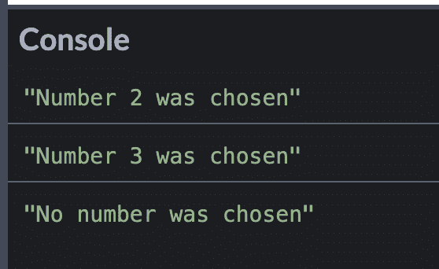
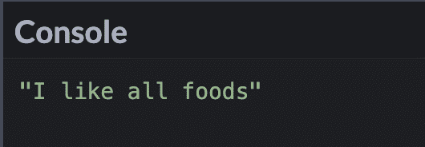
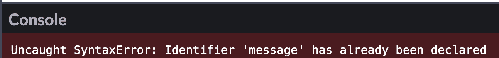
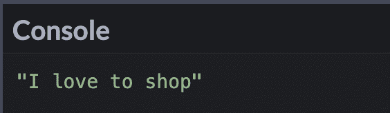

# JavaScript Switch Case–JS Switch 语句示例

> 原文：<https://www.freecodecamp.org/news/javascript-switch-case-js-switch-statement-example/>

在 JavaScript 中，有时您可能会考虑使用`switch`语句来代替`if else`语句。

`switch`语句可以比复杂的`if else`语句有更清晰的语法。

看看下面的例子——不要使用这个长的`if else`语句，你可以选择一个更容易阅读的`switch`语句。

```
const pet = "dog";

if (pet === "lizard") {
  console.log("I own a lizard");
} else if (pet === "dog") {
  console.log("I own a dog");
} else if (pet === "cat") {
  console.log("I own a cat");
} else if (pet === "snake") {
  console.log("I own a snake");
} else if (pet === "parrot") {
  console.log("I own a parrot");
} else {
  console.log("I don't own a pet");
}
```

```
const pet = "dog";

switch (pet) {
  case "lizard":
    console.log("I own a lizard");
    break;
  case "dog":
    console.log("I own a dog");
    break;
  case "cat":
    console.log("I own a cat");
    break;
  case "snake":
    console.log("I own a snake");
    break;
  case "parrot":
    console.log("I own a parrot");
    break;
  default:
    console.log("I don't own a pet");
    break;
}
```

在本文中，我将解释什么是 switch 语句以及它们是如何工作的。我还将帮助您确定在您的代码中使用它们是否是一个好的选择。

## 什么是 Switch 语句？

在编程中，`switch`语句是一个控制流语句，它针对多种情况测试`expression`的值。

这是`switch`语句的基本语法:

```
switch (expression) {
  case 1:
   //this code will execute if the case matches the expression
    break;
  case 2:
   //this code will execute if the case matches the expression
    break;
  case 3:
   //this code will execute if the case matches the expression
    break;
  default:
    //this code will execute if none of the cases match the expression
    break;
}
```

计算机将检查`switch`语句，并检查`case`和`expression`之间的严格相等性`===`。如果其中一个案例与`expression`匹配，那么`case`子句中的代码将会执行。

```
switch (expression) {
  case 1:
   //this code will execute if the case matches the expression
    break;
  case 2:
   //this code will execute if the case matches the expression
    break;
}
```

如果没有一个案例与表达式匹配，那么将执行`default`子句。

```
 default:
    //this code will execute if none of the cases match the expression
    break;
```

如果多个事例匹配`switch`语句，那么将使用匹配`expression`的第一个`case`。

`break`当`case`匹配时，语句将脱离`switch`。如果`break`语句不存在，那么即使找到匹配，计算机也会继续执行`switch`语句。

如果`switch`中有`return`语句，那么就不需要`break`语句。

## JavaScript 中 Switch 语句的示例

在本例中，我们将`"oboe"`与案例进行比较。`"oboe"`将匹配第三个`case`子句，并将打印到控制台“我演奏双簧管”。

```
switch ("oboe") {
  case "trumpet":
    console.log("I play the trumpet");
    break;
  case "flute":
    console.log("I play the flute");
    break;
  case "oboe":
    console.log("I play the oboe");
    break;
  default:
    console.log("I don't play an instrument. Sorry");
    break;
}
```

如果我将表达式改为`"no instrument"`，那么`default`子句将会执行，并且打印到控制台的消息将会是“我不会演奏乐器”。抱歉”。

```
switch ("no instrument") {
  case "trumpet":
    console.log("I play the trumpet");
    break;
  case "flute":
    console.log("I play the flute");
    break;
  case "oboe":
    console.log("I play the oboe");
    break;
  default:
    console.log("I don't play an instrument. Sorry");
    break;
}
```

## 缺少 Break 语句

在这个例子中，匹配将是`case` 2。但是如果没有`break`语句，计算机将继续执行`case` 3 和`default`子句。

您应该看到三条`console.log`语句，因为没有包含一条`break`语句。

```
switch (2) {
  case 1:
    console.log("Number 1 was chosen");
  case 2:
    console.log("Number 2 was chosen");
  case 3:
    console.log("Number 3 was chosen");
  default:
    console.log("No number was chosen");
}
```



## 在哪里放置默认子句

标准惯例是将`default`放在最后一个子句。但是你也可以把它放在其他案子之前。

```
const food = "nuts";

switch (food) {
  case "cake":
    console.log("I like cake");
    break;
  case "pizza":
    console.log("I like pizza");
    break;
  default:
    console.log("I like all foods");
    break;
  case "ice cream":
    console.log("I like ice cream");
    break;
}
```



计算机仍然会仔细检查每一个病例并找到匹配的病例。由于变量`food`不匹配任何案例，那么`default`案例将被执行。

## 一次手术多个病例

有时，您的一个操作可能适用于多种情况。

我们可以省略`break`语句，在一组案例后放置一个单独的操作，而不是为每个案例写出相同的`console.log`。

信息，“这个国家在欧洲。”如果`country`匹配`"France"`、`"Spain"`、`"Ireland"`或`"Poland"`中的任何一种情况，将打印到控制台。

```
const country = "Ireland";
switch (country) {
  case "France":
  case "Spain":
  case "Ireland":
  case "Poland":
    console.log("This country is in Europe.");
    break;
  case "United States":
  default:
    console.log("This country is not in Europe.");
}
```

## 块 Scope 和 Switch 语句

这个例子将产生一个错误消息，因为`message`变量已经被声明，在同一个块范围内不能有相同的变量名。

```
const errand = "Going Shopping";
switch (errand) {
  case "Going to the Dentist":
    let message = "I hate going to the dentist";
    console.log(message);
    break;
  case "Going Shopping":
    let message = "I love to shop";
    console.log(message);
    break;
  default:
    console.log("No errands");
    break;
}
```



为了消除这个错误信息，案例需要用一组花括号括起来。

```
const errand = "Going Shopping";
switch (errand) {
  case "Going to the Dentist": {
    let message = "I hate going to the dentist";
    console.log(message);
    break;
  }
  case "Going Shopping": {
    let message = "I love to shop";
    console.log(message);
    break;
  }
  default: {
    console.log("No errand");
    break;
  }
}
```



## 结论

使用`switch`语句可以替代`if else`语句。一个`switch`语句将一个`expression`的值与多个案例进行比较。

语句将检查严格的相等性。在本例中，从`"2"!== 2`开始，`default`子句将会执行。

```
switch (2) {
  case "2":
    console.log("Number 2 in a string");
    break;
  case "3":
    console.log("Number 3 in a string");
    break;
  default:
    console.log("Number not present");
    break;
}
```

`break`当`case`匹配时，语句将脱离`switch`。如果`break`语句不存在，那么即使找到匹配，计算机也会继续执行`switch`语句。

我希望你喜欢这篇关于`switch`陈述的文章。