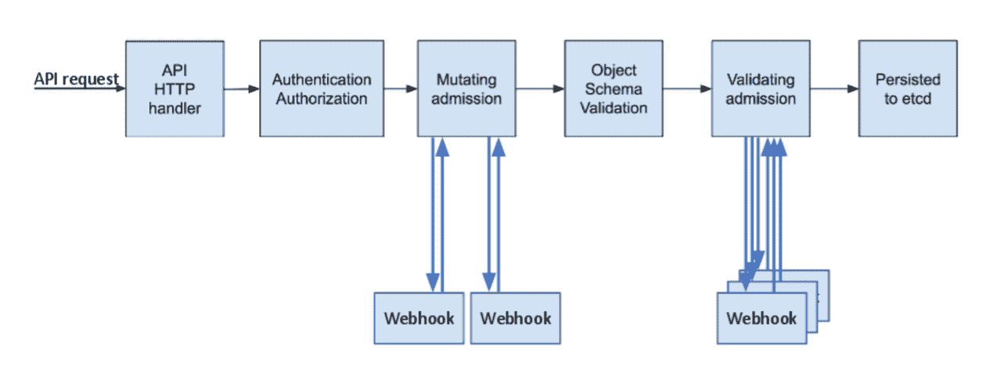
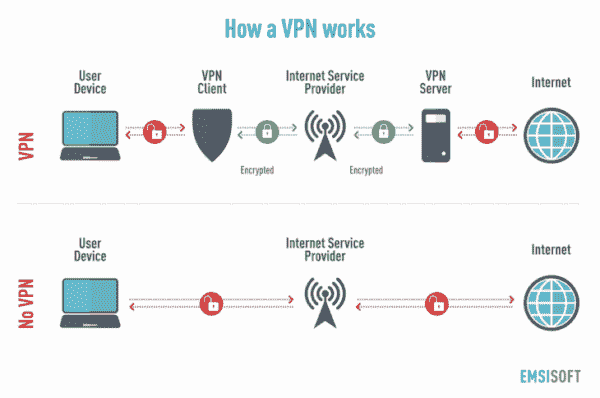

# Kubernetes 安全——如何使用动态准入控制来保护您的集装箱供应链

> 原文：<https://www.freecodecamp.org/news/kubernetes-security-dynamic-admission-control/>

近年来，集装箱越来越受欢迎。随着越来越多的开发人员使用这些容器，他们需要更多的工具来有效地管理它们以及它们之间的交互。

为了帮助管理这一切，许多开发人员使用 Kubernetes。它已经成为容器编排事实上的标准。

虽然容器有助于提高软件开发和部署生命周期的效率，但是它们也增加了黑客攻击组织的可能性。

虽然 Kubernetes 确实简化了管理容器的过程，但它也有安全漏洞。

鉴于 Kubernetes 的流行，网络罪犯已经投入了大量精力来利用这些漏洞。因此，对供应链的攻击[在过去一年里显著上升](https://www.darkreading.com/cloud/software-container-supply-chain-sees-spike-in-attacks/d/d-id/1341353)。

因此，确保 Kubernetes 供应链的安全是许多组织的当务之急。

如果您是 Kubernetes 用户，您应该密切关注的一个重要安全特性是动态准入控制。

在本文中，我们将讨论 Kubernetes 供应链的漏洞，以及如何通过动态准入控制来解决这些漏洞。

## Kubernetes 供应链中的漏洞

最近，几乎所有的 Kubernetes 用户[都经历了由各种漏洞引起的安全事故](https://www.redhat.com/rhdc/managed-files/cl-state-kubernetes-security-report-ebook-f29117-202106-en.pdf)，从错误配置到审计失败。因此，安全问题已经开始影响部署实践。

超过一半使用 Kubernetes 的组织仅仅因为安全问题而推迟了应用程序的部署。

如果您想保护您的 Kubernetes 供应链，您应该了解容器化应用程序的供应链组件及其相关的漏洞。

供应链远远超出了 Kubernetes 本身，[包括 Kubernetes 管理的容器](https://www.freecodecamp.org/news/a-simple-introduction-to-kubernetes-container-orchestration/)的内容以及容器主机。

在容器中，通常会有一堆来自不同来源(内部和外部)的代码。这给了攻击者许多发挥创造力的机会。

为了抵御这些威胁，您需要适当地保护所有的代码集，而不管它们的来源——这可能是一个挑战。

例如，保护源自 Linux 发行版(如 openssl 库或 glibc)的代码可能只需要应用最新的补丁。

但是，来自其他外部来源的代码，如上游开源库或内部开发流程，可能更难保护。

内部开发可能是最大的组织威胁，特别是当开发人员优先考虑发布速度而不是安全性的时候。

许多组织已经分散了容器安全的责任，从开发人员到开发人员都参与其中。但是更多的组织[正在建立 DevSecOps 单位](https://devops.com/from-agile-to-devops-to-devsecops-the-next-evolution/)并将 Kubernetes 的安全交由他们负责。

## 如何通过动态准入控制保护 Kubernetes 供应链

在 Kubernetes 中，动态准入控制涉及用户定义或配置的准入控制器，而不是标准的内置控制器。

### 什么是准入控制器？

在 Kubernetes API 服务器收到请求的身份验证和授权之后，准入控制器接管工作。这些代码在容器被初始化并作为 pod 添加到 Kubernetes 集群之前拦截请求。

本质上，准入控制器试图验证图像是安全的。

[Image Source](https://kubernetes.io/blog/2019/03/21/a-guide-to-kubernetes-admission-controllers/)

准入控制器[执行各种功能](https://www.openpolicyagent.org/docs/v0.11.0/kubernetes-admission-control/)，从强制执行资源配额到运行集群关键任务。你需要有正确配置的准入控制器来正确操作 Kubernetes 的许多高级功能。

### 什么是入学网钩？

动态准入控制器依赖于准入 webhooks，这是用户定义的处理准入请求的 HTTP 回调。

在 Kubernetes 中，有两种类型的准入挂钩:验证准入挂钩和变异准入挂钩。

在准入控制过程中，变异准入控制在验证控制之前运行。这两种类型的 webhooks 在原理上都是不言自明的，尽管它们的具体操作需要一些解释。

#### 正在验证准入网页挂钩

验证准入 webhooks 使用外部 webhook 拦截并验证对 Kubernetes API 的请求。然而，重要的是，它们不能改变请求。

所有匹配请求的验证 webhook 并行运行(因为不可能发生潜在的修改)，并且控制器在任何匹配 web hook 失败时拒绝该请求。

验证准入网络挂钩是全有或全无的——如果请求不能精确匹配，控制将拒绝它。

#### 变异入学网钩

相比之下，变异的准入网络挂钩能够修改请求，允许仅稍微不符合规则的请求被处理。

如果多个 webhooks 匹配一个请求，它们会连续运行，并且每个都可以修改请求。因为变异的控制器首先运行，变异的请求仍然可以通过验证 webhooks 来拒绝。

变异和验证准入 webhooks 的联合操作允许 Kubernetes 开发人员[确保请求在容器实例化之前是兼容的](https://www.freecodecamp.org/news/how-to-become-a-certified-kubernetes-application-developer/)和有效的。

## Kubernetes Pod 安全策略

Pod 安全策略(或 PSP)是 Kubernetes 的一个安全特性，它依赖于准入控制的实现。

PSP 设置 Kubernetes pods 必须满足的条件和默认值，以便被容器系统接受。

PSP 可以强制执行诸如禁用特权容器、防止特权提升和防止容器作为根用户运行之类的策略。

PSP 允许管理员轻松地在整个命名空间中实施组织安全策略。虽然 PSP 需要启用准入控制器，但它们必须单独启用。

根据 Kubernetes Pod 安全标准，有三种类型的策略:

*   尽管基线策略不允许权限提升，但它有最低限度的限制。
*   对于最低信任级别的用户，有一个受限策略，根据 pod 强化最佳实践禁用某些功能。
*   最高级别是特权策略，它是最广泛的，允许最多的权限和特权升级。

随着 1.21 版本的发布，Kubernetes 开始贬低 PSP。随着 1.25 版本的发布，PSP 将在 2022 年被完全移除。因此，如果您使用 Kubernetes，您应该仔细考虑所有未来容器应用程序的替代安全选项。

## 不要忽视标准的 Kubernetes 安全工具

如果您使用容器，您应该了解 Kubernetes 环境中的常见漏洞。

为了实现最大的安全性，开发者和用户都必须应用 Kubernetes 特有的安全特性，比如动态准入控制和标准网络安全特性[，比如 VPN](https://www.freecodecamp.org/news/what-does-a-vpn-do-and-how-does-it-work-a-guide-to-virtual-private-networks/)。

[Image Source](https://securityboulevard.com/2020/03/vpn-a-key-to-securing-an-online-work-environment/)

最近的一个 Kubernetes 漏洞涉及攻击者，他们可以访问 API，并可以获得对 Kubernetes 集群和所有相关资源的完全管理员访问权限。

VPN 可以帮助避免暴露 API 服务器的这种和其他类似的漏洞。但是根据您的需求选择合适的 VPN 是很重要的。

### 如何选择 VPN

据加拿大隐私组织的网络安全专家 Ludovic Rembert 称，加密协议是 VPN 中最重要的因素。

> “VPN 协议决定了您的数据如何在您的机器和服务器之间路由。不同的协议有不同的成本和收益，这取决于您的需求。例如，一些人优先考虑隐私和安全，而另一些人优先考虑速度…PE 提供商边缘设备是位于提供商网络边缘的单个设备或多个设备。然后，该设备通过消费者边缘设备进行连接。在这种设置中，用户可以查看网站，而提供商设备只能识别 VPN 设备。”-伦伯特

## 结论

容器化的应用程序在未来几年将会继续得到更广泛的应用，像 Kubernetes 这样的容器管理资源[也是如此。](https://www.freecodecamp.org/news/learn-kubernetes-in-under-3-hours-a-detailed-guide-to-orchestrating-containers-114ff420e882/)

随着这些工具越来越受欢迎，供应链中所有节点的攻击数量也会增加。

因此，如果您使用 Kubernetes，您需要利用所有可用的安全资源来确保最大的应用程序安全性和可靠性。

应用动态应用程序控制来验证请求是否符合安全策略是这个过程中的一个重要步骤。