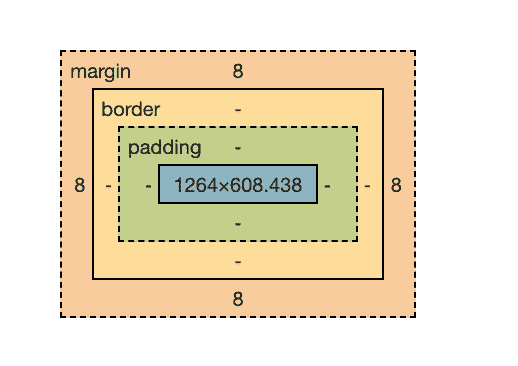

# HTML 填充–CSS 填充顺序

> 原文：<https://www.freecodecamp.org/news/html-padding-css-padding-order/>

在这篇文章中，我们将学习 CSS 填充属性，速记属性，以及填充与边距有何不同。

## CSS 中的填充是什么？

CSS 填充在元素内容周围创建空间。该空间位于元素的边框和边距内。

让我们看一下 CSS box 模型，以便更好地理解填充的工作原理。每个 HTML 元素周围都有一个框，由四部分组成:内容、填充、边框和边距。



蓝色部分是元素的内容，而绿色部分表示填充。请注意边框和边距属性中的填充。

让我们更详细地看看 CSS 的填充属性。

### 填充顶部属性

这是一个 CSS 属性，在元素顶部增加空间。

```
 padding-top: 20px;
```

[https://codepen.io/jessica-wilkins/embed/preview/poPOjjw?default-tabs=css%2Cresult&height=300&host=https%3A%2F%2Fcodepen.io&slug-hash=poPOjjw](https://codepen.io/jessica-wilkins/embed/preview/poPOjjw?default-tabs=css%2Cresult&height=300&host=https%3A%2F%2Fcodepen.io&slug-hash=poPOjjw)

### 右填充属性

这是一个 CSS 属性，在元素的右边添加空格。

```
 padding-right: 40px; 
```

[https://codepen.io/jessica-wilkins/embed/preview/ExmeVKp?default-tabs=css%2Cresult&height=300&host=https%3A%2F%2Fcodepen.io&slug-hash=ExmeVKp](https://codepen.io/jessica-wilkins/embed/preview/ExmeVKp?default-tabs=css%2Cresult&height=300&host=https%3A%2F%2Fcodepen.io&slug-hash=ExmeVKp)

### 底部填充属性

这是一个 CSS 属性，在元素底部增加空间。

```
 padding-bottom: 20px; 
```

[https://codepen.io/jessica-wilkins/embed/preview/QWvVjKv?default-tabs=css%2Cresult&height=300&host=https%3A%2F%2Fcodepen.io&slug-hash=QWvVjKv](https://codepen.io/jessica-wilkins/embed/preview/QWvVjKv?default-tabs=css%2Cresult&height=300&host=https%3A%2F%2Fcodepen.io&slug-hash=QWvVjKv)

### 左填充属性

这是一个 CSS 属性，在元素的左边添加空格。

```
 padding-left: 40px; 
```

[https://codepen.io/jessica-wilkins/embed/preview/GRmXprJ?default-tabs=css%2Cresult&height=300&host=https%3A%2F%2Fcodepen.io&slug-hash=GRmXprJ](https://codepen.io/jessica-wilkins/embed/preview/GRmXprJ?default-tabs=css%2Cresult&height=300&host=https%3A%2F%2Fcodepen.io&slug-hash=GRmXprJ)

## CSS 中填充和边距的区别

边距在元素周围及其边框之外创建空间。


本示例向`h1`元素添加 50px 的下边距。这在`h1`和`p`元素之间创造了额外的空间。

```
margin-bottom: 50px;
```

[https://codepen.io/jessica-wilkins/embed/preview/XWRBVRJ?default-tabs=html%2Cresult&height=300&host=https%3A%2F%2Fcodepen.io&slug-hash=XWRBVRJ](https://codepen.io/jessica-wilkins/embed/preview/XWRBVRJ?default-tabs=html%2Cresult&height=300&host=https%3A%2F%2Fcodepen.io&slug-hash=XWRBVRJ)

## 填充速记属性

填充速记属性允许我们一次设置所有四边的填充，而不是写出`padding-top`、`padding-right`、`padding-bottom`、`padding-left`。

当您只使用一个值时，将在所有边上应用等量的填充。

```
 padding: 10px;
```

下面是没有速记属性的代码:

```
 padding-top: 10px;
  padding-right: 10px;
  padding-bottom: 10px;
  padding-left: 10px;
```

这是浏览器中的结果。

[https://codepen.io/jessica-wilkins/embed/preview/YzVjrBb?default-tabs=css%2Cresult&height=300&host=https%3A%2F%2Fcodepen.io&slug-hash=YzVjrBb](https://codepen.io/jessica-wilkins/embed/preview/YzVjrBb?default-tabs=css%2Cresult&height=300&host=https%3A%2F%2Fcodepen.io&slug-hash=YzVjrBb)

当使用两个值时，第一个值向顶部和底部添加填充，而第二个值向左侧和右侧添加填充。

```
 padding: 10px 30px; 
```

下面是没有速记属性的代码:

```
 padding-top: 10px;
  padding-right: 30px;
  padding-bottom: 10px;
  padding-left: 30px;
```

[https://codepen.io/jessica-wilkins/embed/preview/xxdJPgB?default-tabs=css%2Cresult&height=300&host=https%3A%2F%2Fcodepen.io&slug-hash=xxdJPgB](https://codepen.io/jessica-wilkins/embed/preview/xxdJPgB?default-tabs=css%2Cresult&height=300&host=https%3A%2F%2Fcodepen.io&slug-hash=xxdJPgB)

当使用三个值时，第一个值向顶部添加填充，第二个值向左右添加填充，第三个值向底部添加填充。

```
 padding: 10px 30px 50px; 
```

下面是没有速记属性的代码:

```
 padding-top: 10px;
  padding-right: 30px;
  padding-bottom: 50px;
  padding-left: 30px;
```

[https://codepen.io/jessica-wilkins/embed/preview/vYmaWjG?default-tabs=css%2Cresult&height=300&host=https%3A%2F%2Fcodepen.io&slug-hash=vYmaWjG](https://codepen.io/jessica-wilkins/embed/preview/vYmaWjG?default-tabs=css%2Cresult&height=300&host=https%3A%2F%2Fcodepen.io&slug-hash=vYmaWjG)

当您使用四个值时，第一个值向顶部添加填充，第二个值向右侧添加填充，第三个值向底部添加填充，第四个值向左侧添加填充。

记住所有四个值的顺序的最好方法是顺时针思考(上、右、下、左)。

```
 padding: 10px 20px 30px 40px;
```

下面是没有速记属性的代码:

```
 padding-top: 10px;
  padding-right: 20px;
  padding-bottom: 30px;
  padding-left: 40px;
```

[https://codepen.io/jessica-wilkins/embed/preview/jOmpaRp?default-tabs=css%2Cresult&height=300&host=https%3A%2F%2Fcodepen.io&slug-hash=jOmpaRp](https://codepen.io/jessica-wilkins/embed/preview/jOmpaRp?default-tabs=css%2Cresult&height=300&host=https%3A%2F%2Fcodepen.io&slug-hash=jOmpaRp)

您可以选择使用像素、em、rem 或百分比作为值。但是不允许使用负值。

## 结论

当你想在 HTML 元素的内容周围增加空间时，你可以使用填充属性。

填充速记属性允许我们一次设置所有四边的填充，而不是写出`padding-top`、`padding-right`、`padding-bottom`、`padding-left`。

如果您想要在元素之间创建空间，那么您可以使用边距属性。对于边距，您可以使用负值，而对于填充，这是不允许的。