# CSS Vertical Align——如何将一个 Div、文本或图像居中

> 原文：<https://www.freecodecamp.org/news/css-vertical-align-how-to-center-a-div-text-or-an-image-example-code/>

即使有 CSS Grid 和 Flexbox 这样有用的工具，在 CSS 中居中元素仍然是众所周知的挑战。

这是许多笑话和迷因的主题，当你成功地将某件事置于中心位置时，你会想要吹嘘它。

## 为什么将 CSS 元素居中如此困难？

CSS 可能很难处理。例如，如果你试图水平或垂直对齐某样东西，这并不困难。

对于内联元素，您可以将 text-align 设置为居中，而`margin: 0 auto`会为块级元素这样做。

但是，如果您试图将垂直对齐和水平对齐结合起来，就会出现多方面的问题。

在本教程中，我将向您介绍三种不同的方法来正确地将一个 div、文本或图像在 CSS 中居中。

## 如何使用 CSS 位置属性将元素居中

CSS position 属性将相对、绝对、固定和静态(默认值)作为值。设置后，您将能够对元素应用顶部、右侧、底部和左侧属性。

相对值和绝对值的组合可以做很多事情，所以你可以用它来确定任何事情的中心。

看看下面的片段，看看一些例子。

### 如何使用 CSS 定位将文本居中

```
<div class="container">
    <div class="centered-element">
      <p>I'm a Camper, and I'm vertically centered</p>
    </div>
</div> 
```

```
* {
  margin: 0;
  padding: 0;
  box-sizing: border-box;
} 

.container {
  position: relative;
  height: 400px;
  border: 2px solid #006100;
}

.centered-element {
  margin: 0;
  position: absolute;
  top: 50%;
  transform: translateY(-50%);
} 
```

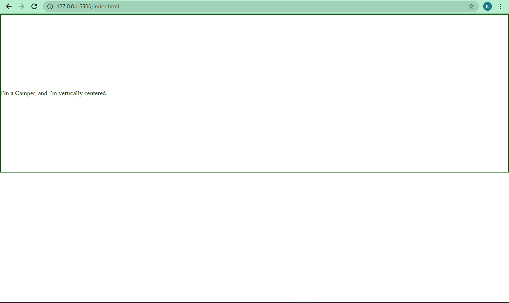

### 如何使用 CSS 定位将图像居中

```
<div class="container">
    <div class="centered-element">
      
    </div>
</div> 
```

```
* {
  margin: 0;
  padding: 0;
  box-sizing: border-box;
}

.container {
  position: relative;
  height: 400px;
  border: 2px solid #006100;
}

.centered-element {
  margin: 0;
  position: absolute;
  top: 50%;
  transform: translateY(-50%);
} 
```

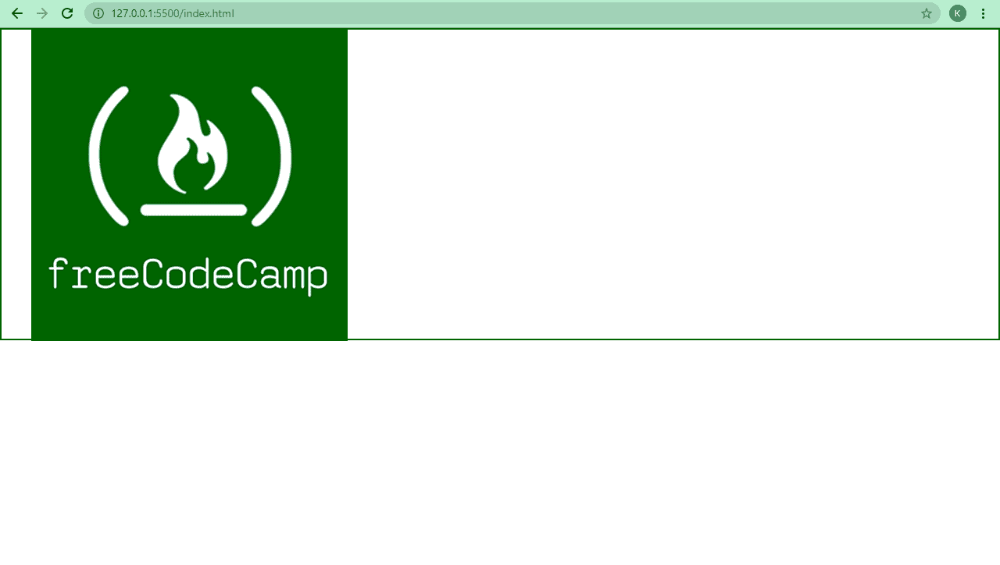

上面的代码使文本和图像垂直居中。为了兼顾垂直和水平居中，我们需要在 CSS 中做一点调整。我们将 top 属性设置为 50%，并在 X 轴和 Y 轴上添加一个变换。

```
* {
  margin: 0;
  padding: 0;
  box-sizing: border-box;
}

.container {
  position: relative;
  height: 400px;
  border: 2px solid #006100;
}

.centered-element {
  margin: 0;
  position: absolute;
  top: 50%;
  left: 50%;
  transform: translate(-50%, -50%);
} 
```

文本现在看起来是这样的:
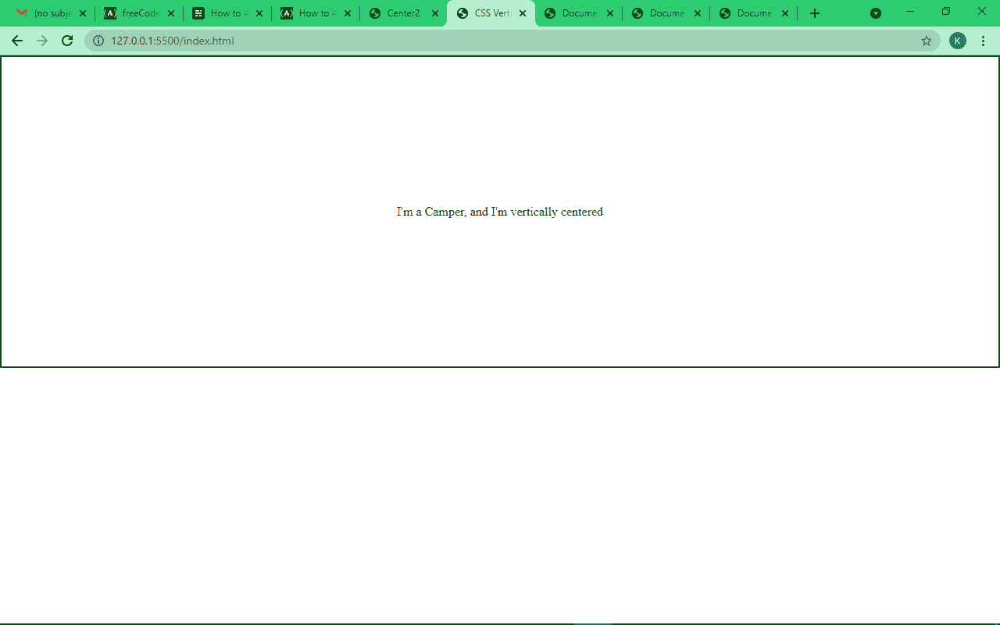

而图像是这样的:
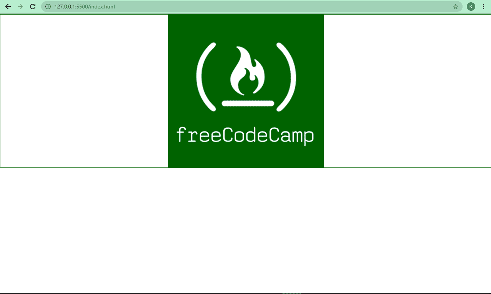

请注意，我应用了 transform 属性，因为子元素(带有 centered-element 类)稍微偏离了中心。`translateY()`将其垂直推至中心，并在 X 和 Y 轴上平移(`translate()`)将其垂直和水平推至中心。

## 如何在 CSS 中使用 Flexbox 将元素居中

CSS Flexbox 处理一维布局(行或列)。使用 Flexbox，只需三行代码就可以轻松地将 div、文本或图像居中。

查看下面的示例片段。

### 如何使用 Flexbox 使文本居中

```
<div class="container">
    <div class="centered-element">
      <p>I'm a Camper, and I'm vertically centered</p>
    </div>
</div> 
```

```
.container {
    display: flex;
    align-items: center;
    height: 600px;
    border: 2px solid #006100; 
} 
```

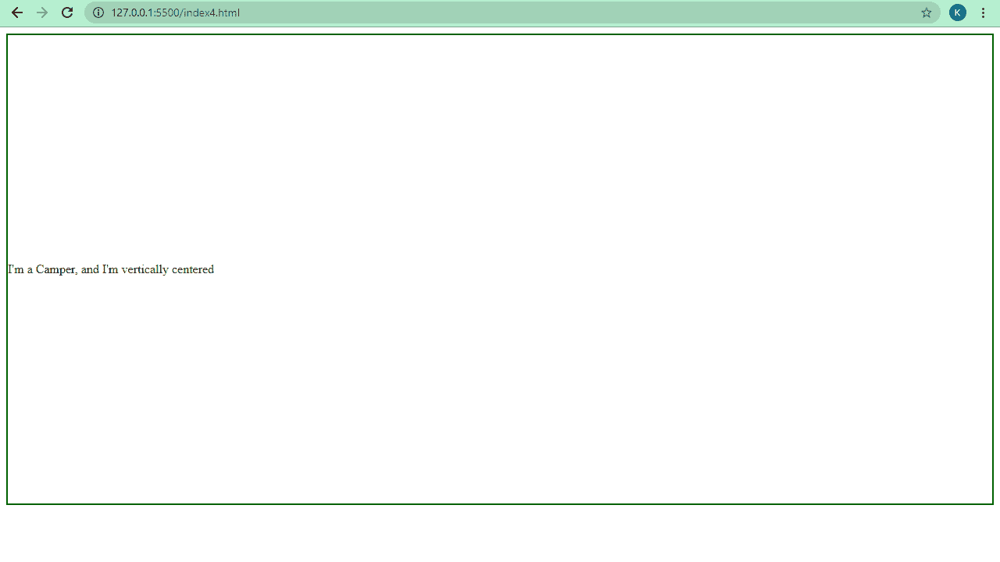

### 如何使用 Flexbox 使图像居中

```
<div class="container">
    <div class="centered-element">
      
    </div>
</div> 
```

```
.container {
    display: flex;
    align-items: center;
    height: 600px;
    border: 2px solid #006100; 
} 
```

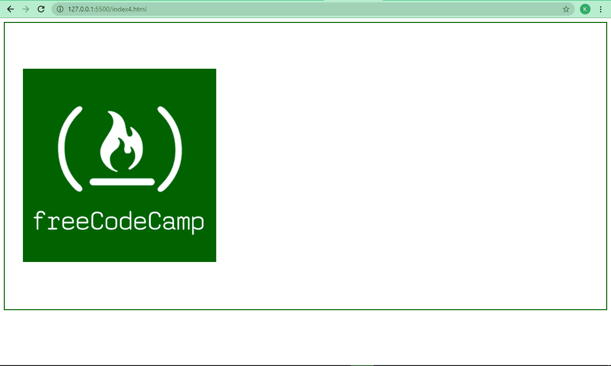

我们只用两行代码就解决了垂直对齐的问题。要使图像和文本水平居中，添加 justify-content: center。

```
<div class="container">
    <div class="centered-element">
      <p>I'm a Camper, I'm now vertically and horizontally centered</p>
    </div>
</div> 
```

```
<div class="container">
    <div class="centered-element">
      
    </div>
</div> 
```

```
.container {
    display: flex;
    align-items: center;
    justify-content: center;
    height: 600px;
    border: 2px solid #006100;
} 
```

文本现在看起来是这样的:
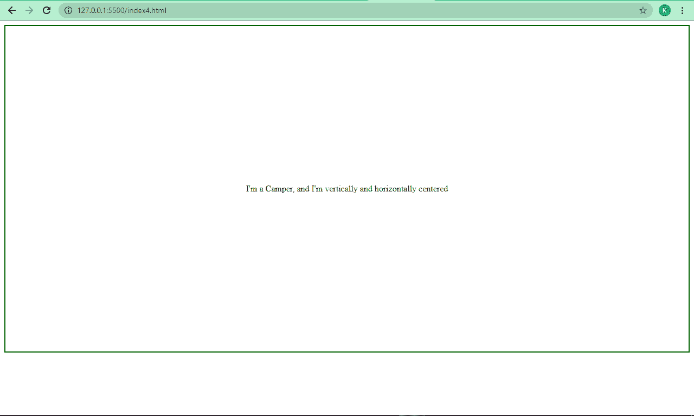

而图像是这样的: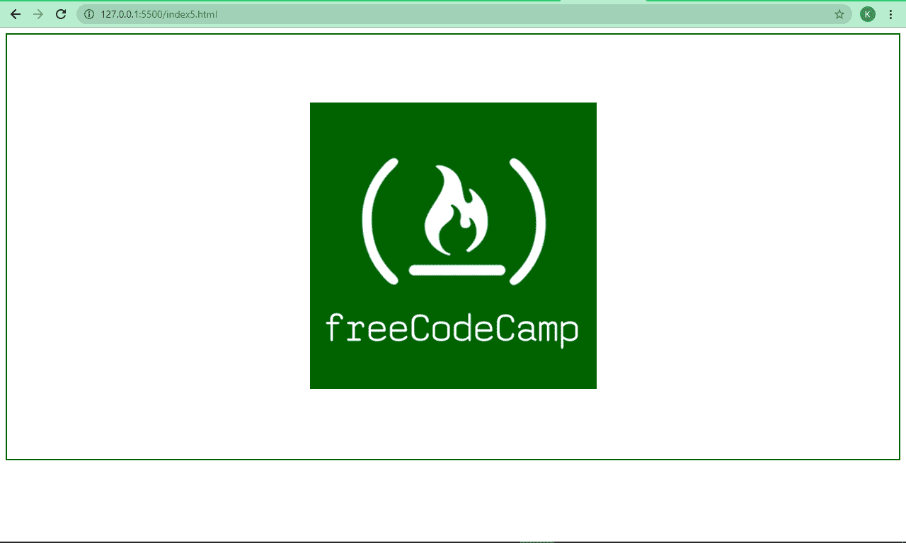

## 如何使用 CSS 网格将元素居中

有了 Flexbox，任何东西都很容易居中，对吗？但是使用 CSS Grid，将任何内容居中真的很容易，因为两行代码就足够了。

### 如何用 CSS 网格居中文本

```
<div class="container">
    <div class="centered-element">
      <p>I'm a Camper, and I'm vertically centered</p>
    </div>
</div> 
```

```
.container {
    display: grid;
    align-items: center;
    height: 600px;
    border: 2px solid #006100;
} 
```

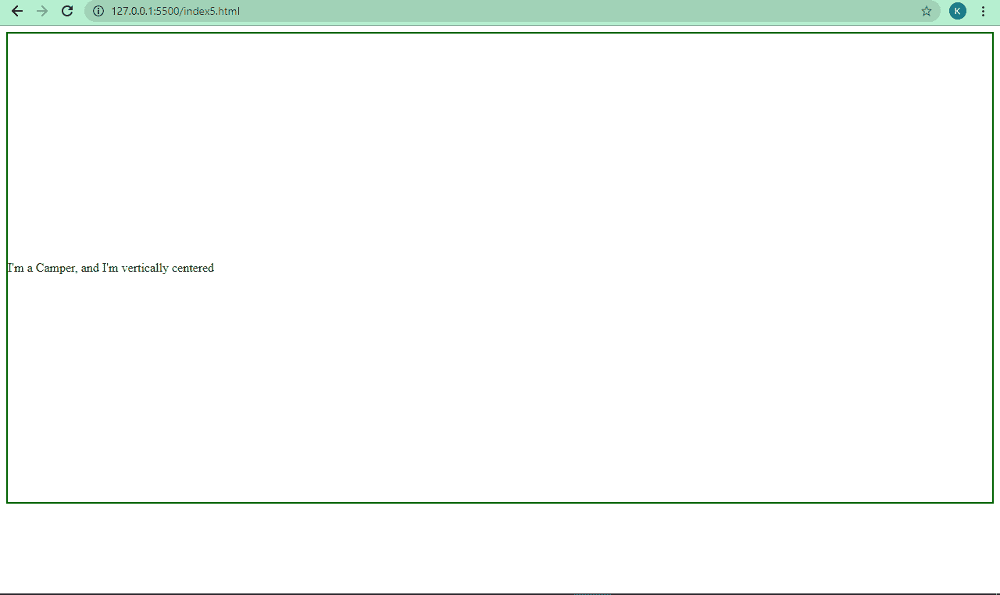

### 如何使用 CSS 网格将图像居中

```
<div class="container">
    <div class="centered-element">
      
    </div>
</div> 
```

```
.container {
    display: grid;
    align-items: center;
    height: 600px;
    border: 2px solid #006100;
} 
```

上面的例子为你解决了垂直居中的问题。为了让文本和图像也水平居中，用`place items`—`align-items`和`justify-content`的组合替换对齐项:

```
.container {
    display: grid;
    place-items: center;
    height: 600px;
    border: 2px solid #006100;
} 
```

文本现在看起来像这样:


而图像是这样的:


## 如何在 CSS 中将独立的 Div、文本或图像居中

上面的三种方法让您可以将 div、文本或图像放在容器的中心。您也可以将独立的 div、文本或图像居中。

让我们看看现在该如何做。

### 如何在 CSS 中将一个独立的 div 居中

```
<div class="container"></div> 
```

```
div.container {
    height: 300px;
    width: 300px;
    border: 2px solid #006100;
    margin: 0 auto;
  } 
```

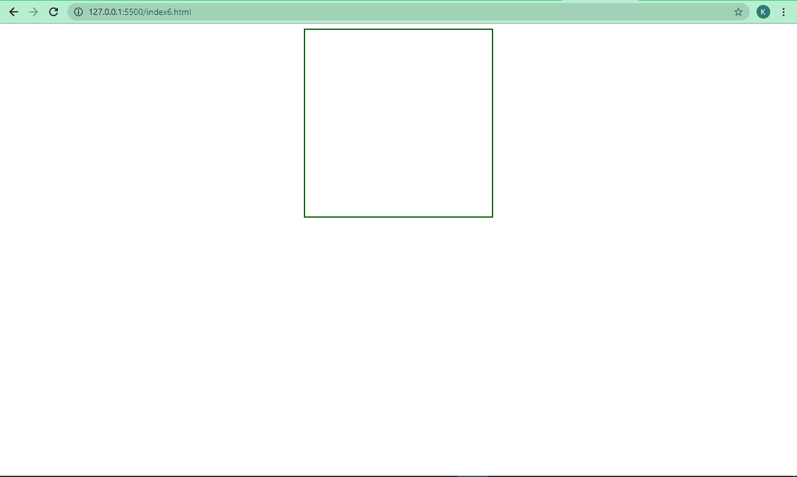

### 如何在 CSS 中将独立文本居中

```
<p>I'm a Camper, and I'm centered</p> 
```

```
 p {
         text-align: center;
     } 
```


### 如何在 CSS 中将独立图像居中

```
 
```

```
img {
      display: block;
      margin: 0 auto;
 }
 /* Applies a display of block, a margin 0f 0 at the top and bootom, 
 and auto on the left and right */ 
```

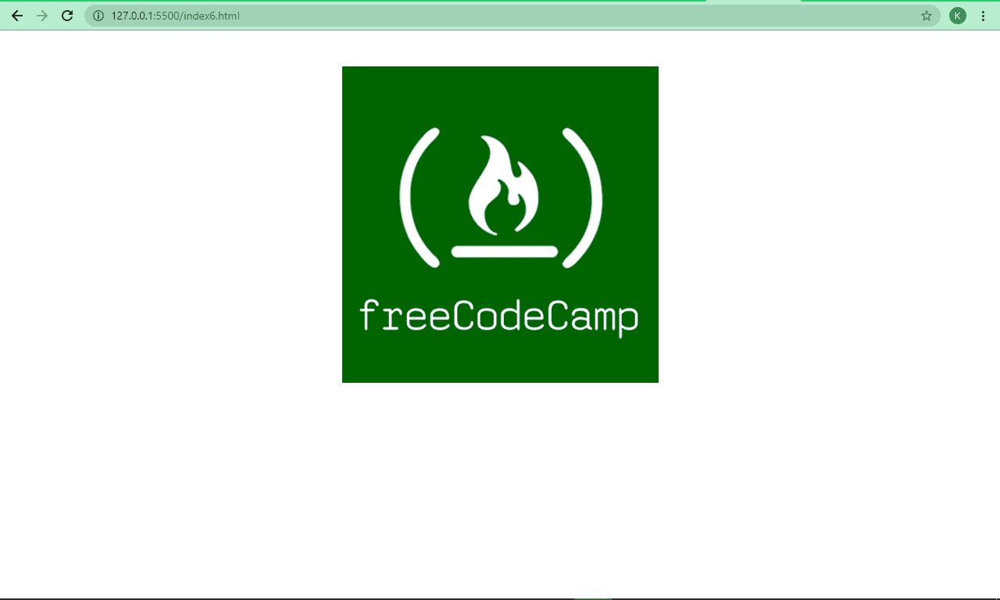

## 结论

我希望这篇教程能给你足够的关于垂直对齐和如何在 CSS 中居中元素的知识，这样在你的下一个项目中就不会那么麻烦了。

感谢阅读，继续编码。