# CSS 背景颜色——如何在 HTML 中改变背景颜色

> 原文：<https://www.freecodecamp.org/news/css-background-color-how-to-change-the-background-color-in-html/>

你已经开始创建你的 HTML 页面，你想给它一些颜色——也许改变文本的颜色或设置一个漂亮的背景。那你是怎么做到的呢？

在这篇文章中，我将向你展示如何用几种不同的方法改变页面的背景颜色。

# 如何改变 HTML 元素的背景颜色

您可以使用`background-color` CSS 属性改变 HTML 元素的背景颜色，并赋予它一个颜色值。

```
p {
  background-color: pink;
}
```

With this code, the paragraphs are given a pink background.

例如，这段代码将使 HTML 文件中的所有段落元素都具有粉色背景，因为`background-color`属性的值为`pink`。

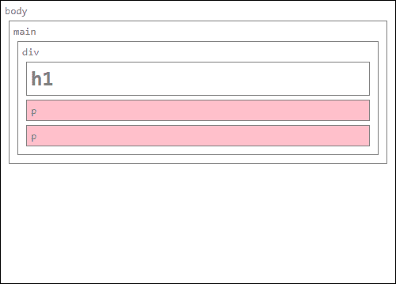

你可以使用大约 140 种颜色名称，比如`teal`、`hotpink`、`indigo`等等。

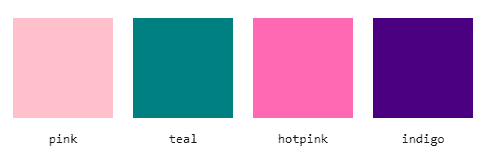

A few of the possible color names you can use

注意:如果你给了一个元素一个背景颜色，但没有看到它的变化，这可能是一个语法错误，或者也可能是元素没有宽度或高度。尝试在其中放一些内容，或者使用 CSS 属性`width`和`height`给它一个宽度和高度。

实际上有差不多 1680 万种颜色可供你使用。您可以使用 RGB 值来使用所有这些颜色。还有 HSL 颜色，你有大约 370 万种颜色可供选择。在下一节中，你将学习所有这些不同的创造颜色的方法。

# 不同的颜色符号

属性接受颜色作为可能的值。这里你会看到四种不同的颜色值符号。

首先是颜色名称，大约有 140 个关键词可以使用。这是选择颜色最简单的方法，因为它不需要理解特殊的符号，但它的选择范围有限。

命名或选择颜色的第二种和第三种方法是 RGB 值和十六进制值。在这些符号中，颜色由它们所包含的红色、绿色和蓝色的数量来识别。

这来自于屏幕产生颜色的方式。屏幕由像素组成，每个像素由三种不同颜色的 led 点亮，绿色，蓝色和红色，可以以不同的强度发光。

第四个符号是 HSL 颜色，或色调-饱和度-亮度。这种符号来自平面设计，因为它反映了人类思考颜色的一种更自然的方式:一种纯色(色调)，其饱和度和亮度可以变化。

您可以使用这些颜色符号中的任何一种来给背景添加颜色，但是让我们更详细地看看它们，这样您就可以选择您喜欢的颜色。

## HTML 颜色名称

在 HTML 的第一个版本中有 16 种基本颜色被识别。现在有 140 多种命名的颜色可以使用。

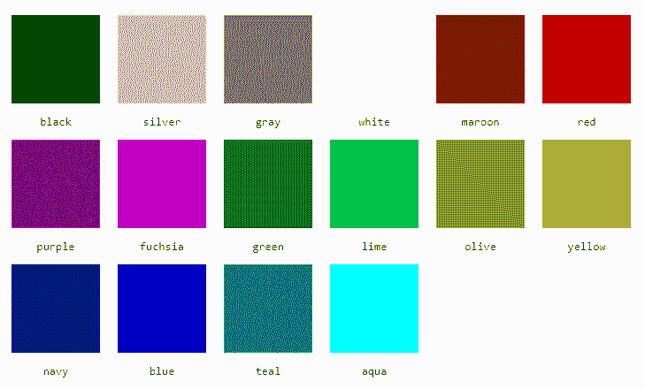

The 16 basic colors

```
body {
  background-color: black;
}
```

WIth this CSS, the `body` is given a black background

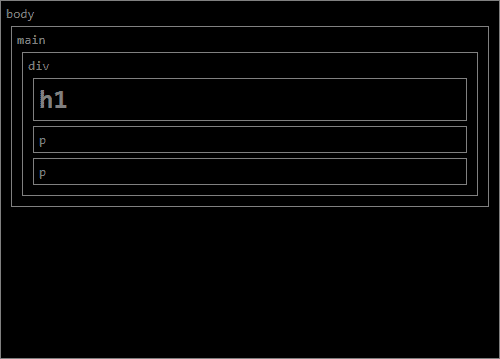

An example of an HTML page with the `body` being given a `background-color` of `black`

你可以在文章最后的附录中看到所有命名的颜色。

## RGB Colors

RGB 代表红绿蓝。这种格式的颜色被写成`rgb(0,0,0)`，其中每个值都是一个介于`0`和`255`之间的数字，分别代表用于制作每种颜色的红色、绿色和蓝色的数量。

例如，如果你有`rgb(0,0,0)`，你会得到黑色。

要得到红色，你写`rgb(255,0,0)`，这里有尽可能多的红色和`255`，`0`代表蓝色，`0`代表绿色。

你可以得到红色的其他变体，带有少量的绿色和/或蓝色，以及一点点红色。例如，你可以用`rgb(255,69,0)`得到橘红色，或者用`rgb(139,0,0)`得到深红色。

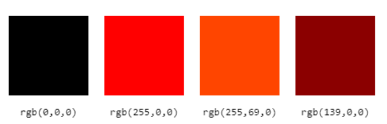

The colors of the rgb values presented above.

```
div {
  background-color: rgb(139,0,0);
}
```

The `div` elements are given a dark red background.

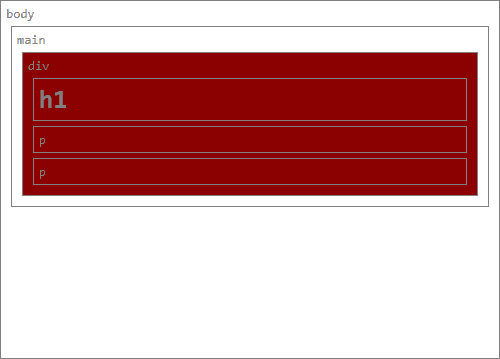

An example of an HTML page with the `div` element being given a `background-color` of `rgb(139,0,0)`

下面是调整两个 RGB 值时颜色如何变化的例子:彩色方块的左上角等于`rgb(0,0,0)`，右上角等于`rgb(0,0,255)`，左下角等于`rgb(0,255,0)`，右下角等于`rgb(0,255,255)`。

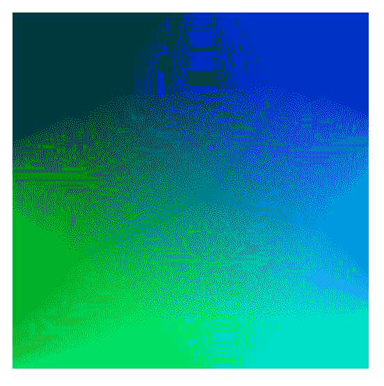

幸运的是，你不需要猜数字就能得到你想要的颜色。您可以在网上找到各种颜色选择器，让您使用滑块(或其他方法)选择颜色，并给出您想要使用的 RGB 颜色值。

## Hexadecimal Colors

十六进制颜色是书写 RGB 颜色的另一种方式。十六进制也有三个数字，每种颜色一个，有 256 个可能的值。

不过，在这种情况下，每种颜色都有两个数字，从`0`到`F`(即`0`、`1`、`2`、`3`、`4`、`5`、`6`、`7`、`8`、`9`和`A`、`B`、`C`、`D`、`E`、`F`)。一位数有 16 个可能值，两位数有 256 个可能值，从`00`到`FF` (255)。

十六进制颜色在数值前面加上一个`#`。比如红色写成`#FF0000`，深红色写成`#8B0000`，橘红色写成`#FF4500`。

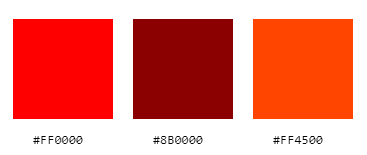

The colors mentioned in the section above.

```
h1 {
  background-color: #FF4500;
}
```

The `h1` elements are given a background of orange red.

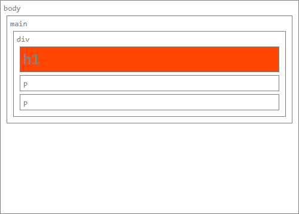

An example of an HTML page with the `h1` element being given a `background-color` of `#FF4500`

您还可以使用颜色选择器来生成十六进制值。

### 十六进制速记

你可以用速记形式写十六进制数，只用三位数而不是六位数。比如可以像`#F00`一样写红色。这将可能的颜色数量减少到 4000 多种，但书写起来更短，有时这是很重要的。

每个数字代替两个相同的数字，所以我们不能用速记形式写`#8B0000`，因为`8`和`B`是不相同的。但是我们可以把`#800`写成等于`#880000`，和另一种深红色非常相似。而橘红色可以是`#F40`(等于`#FF4400`)。

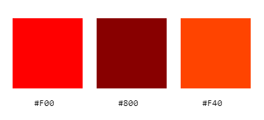

The colors mentioned in the section above.

## HSL 颜色

HSL 的意思是色相-饱和度-明度，是一种和我们目前所见完全不同的书写颜色的方式。

HSL 颜色用三个数字表示:色调从`0`到`360`，饱和度和亮度从`0`到`100`。

色调决定了基色，它的值是一个角度，色轮上的度数。在这种情况下，红色是`0`，绿色是`120`，蓝色是`240`，而`360`又是红色。


All possible colors changing only the hue, with hue of 0 to the left and hue of 360 on the right.

饱和度从使颜色变成灰色的`0`到显示全色的`100`。


Variation of saturation for red, 0% on the left, 100% on the right.

明度是添加到颜色中的黑色或白色的数量。`0`是黑色，`50`是颜色本身，`100`是白色。

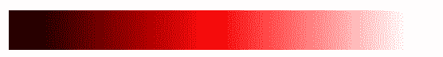

Variation of lightness, with 0% on the left, and 100% on the right.

例如，你可以把红色写成`hsl(0,100%,50%)`，橘红色写成`hsl(16,100%,50%)`，深红色写成`hsl(0,100%,27%)`。

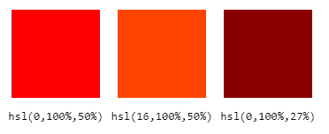

使用 HSL 比使用其他配色方案更容易找到相似的颜色。对于红色及其变体，你已经看到，要获得更暗的红色，你只需改变亮度百分比，将红色与其他颜色混合就足以稍微改变其色调值。

让我们看看它在十六进制中的混合颜色，比如橙色(`#FFA500`或`rgb(255,166,0)`)，在 HSL 中写成`hsl(39,100%,50%)`。只要增加明度就可以得到更浅的橙色。

例如，你可以写`hsl(39,100%,65%)`来得到这个浅橙色。用其他的符号，你可能需要写`rgb(255,193,77)`或者`#FFC14D`。

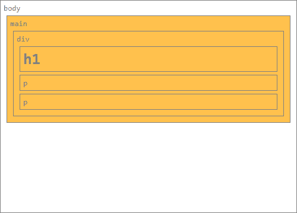

An example of an HTML page with the `main` element being given a `background-color` of `hsl(39, 100%, 65%)`

你也可以在网上找到 HSL 颜色的颜色选择器。

# 物业名称简写

您也可以使用速记`background`属性设置背景颜色。

```
p {
  background: pink;
}

body {
  background: black;
}

div {
  background: rgb(139,0,0);
}

h1 {
  background: #FF4500;
}

main {
  background: hsl(39,100%,65%);
}
```

The same CSS properties seen before, but with the `background` shorthand property.

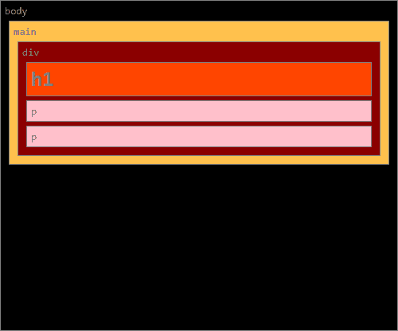

An example of an HTML page with all the elements being given a background color.

这是一个更加通用的属性，[，因为它是各种`background`属性](https://www.freecodecamp.org/news/learn-css-background-properties/)的简写，像`background-image`和`background-position`。当您将它与颜色值一起使用时，它与`background-color`完全一样。

# 结论

你已经学会了如何使用`background-color`属性和它的简写`background`，以及使用不同的颜色符号，为你的 HTML 元素赋予背景颜色。

现在你已经有了所有你需要的工具来给你的网页添加你想要的颜色。尽情享受吧！

# 附录

## 所有 140 多种命名颜色

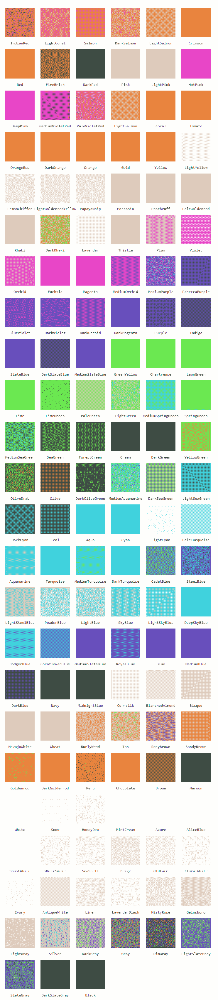

## 拼写变化

包含单词“灰色”的颜色名称也可以用拼写“灰色”来书写，如下所示。

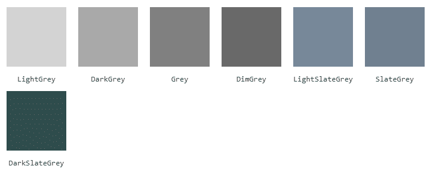