# 12 个免费的编码游戏，适合初学者学习编程

> 原文：<https://www.freecodecamp.org/news/12-free-coding-games-to-learn-programming-for-beginners/>

许多初学者在学习如何编码时会感到害怕。但是通过编码游戏学习可以是有趣的，有教育意义的。

据[True Education Partnerships](https://www.trueeducationpartnerships.com/schools/gamification-in-education/)，

> ****学习中的游戏化**** 涉及使用基于游戏的元素，如计分、同伴竞争、团队合作和评分表，以推动参与，帮助学生吸收新信息并测试他们的知识。

我为初学者策划了 12 个编码游戏。

这是完整的清单。一旦你找到一个你感兴趣的网站，点击那个链接，它会跳转到那个网站更详细的描述。

1.  [编码名称](#codingame)
2.  [CSS 餐车](#css-diner)
3.  [Flexbox Froggy](#flexbox-froggy)
4.  [Flexbox 防御](#flexbox-defense)
5.  [格子花园](#grid-garden)
6.  [代码战斗](#codecombat)
7.  [划痕](#scratch)
8.  [Tynker](#tynker)
9.  [SQL 谋杀之谜](#sql-murder-mystery)
10.  [不可信](#untrusted)
11.  [电梯传奇](#elevator-saga)
12.  [CheckiO](#checkio)

## 编码游戏

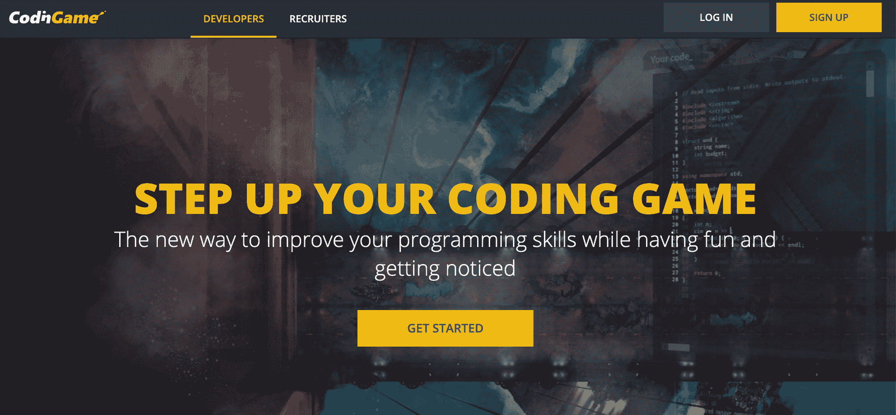

CodinGame 是一个帮助你通过回合制游戏解决问题和学习编程基础的网站。

该平台支持超过 25 种不同的编程语言，并为玩家提供了练习、学习和在编码竞赛中竞争的机会。

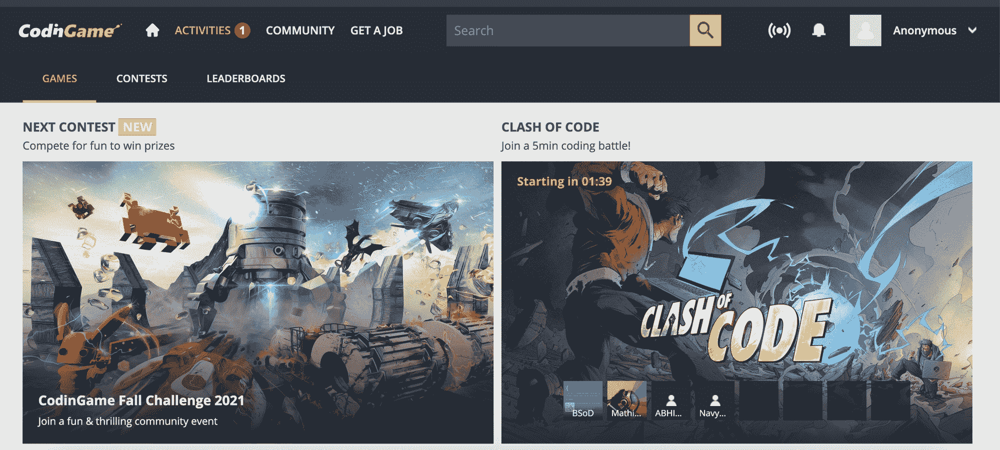

创建帐户后，您可以从初级入门部分开始。您将了解标准编程概念，并解决一些小问题。

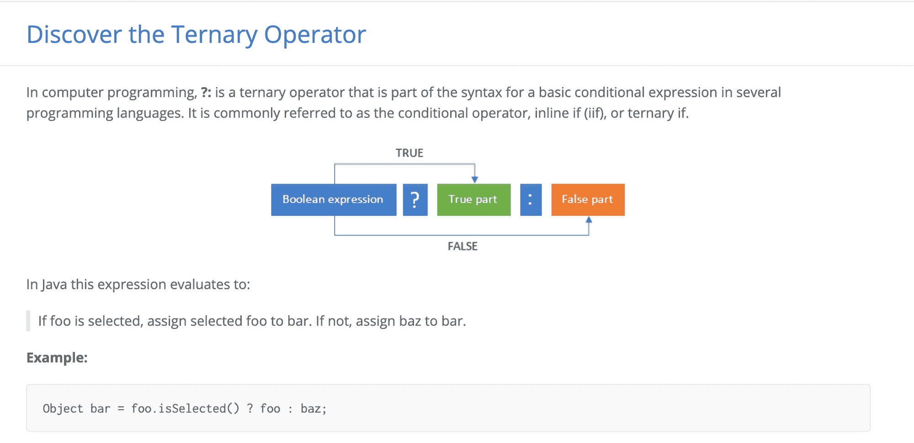

## CSS 餐厅

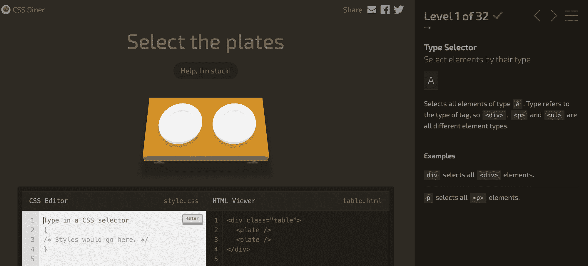

在 [CSS Diner](https://flukeout.github.io/) 中，你可以通过一系列 32 个挑战练习 CSS 的基础知识。这是一个让你更熟悉这门语言并享受学习乐趣的好方法。

最初的几个挑战很短，重点是处理类和 id。但是随着您在各个级别的进展，您将会被介绍到伪选择器，首先是类型选择器，最后是类型选择器，以及通用选择器。

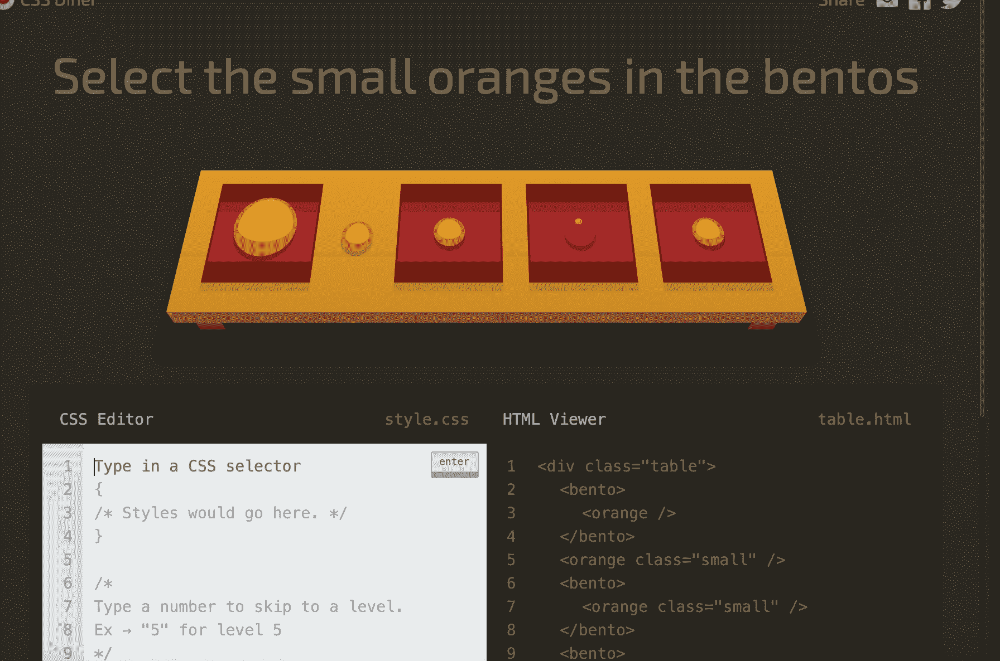

## Flexbox 青蛙

在 [Flexbox Froggy](https://flexboxfroggy.com/) 中，你将通过将青蛙放在正确的 lillypads 上来学习 CSS Flexbox。当你学完第 24 级时，你应该能在下一个项目中自如地使用 Flexbox。

每个挑战都提供了对 Flexbox 属性的描述。最初的几个挑战开始时很容易，但随着你在游戏中的进展，事情变得越来越复杂。

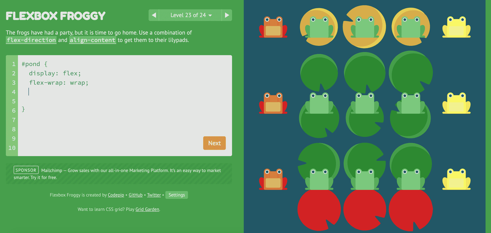

## Flexbox 防御

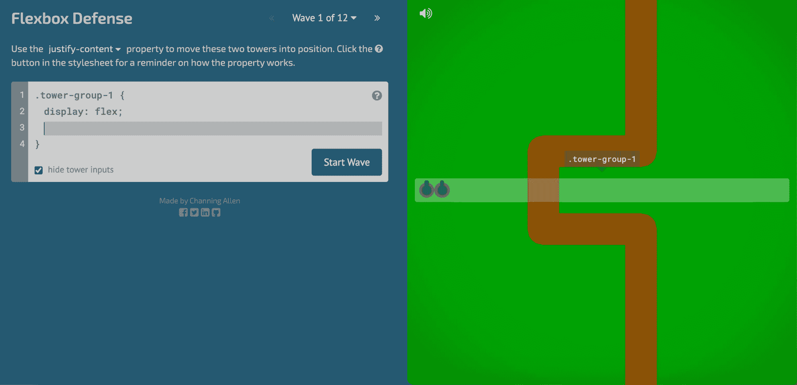

[Flexbox Defense](http://www.flexboxdefense.com/) 是一款塔防游戏，帮助你强化 CSS 技能。使用 CSS Flexbox 定位塔以阻挡敌人。

这些挑战将为您提供 Flexbox 属性的定义。一旦你写好代码，按下启动按钮，看看你是否成功地阻止了你的敌人。

## 网格花园

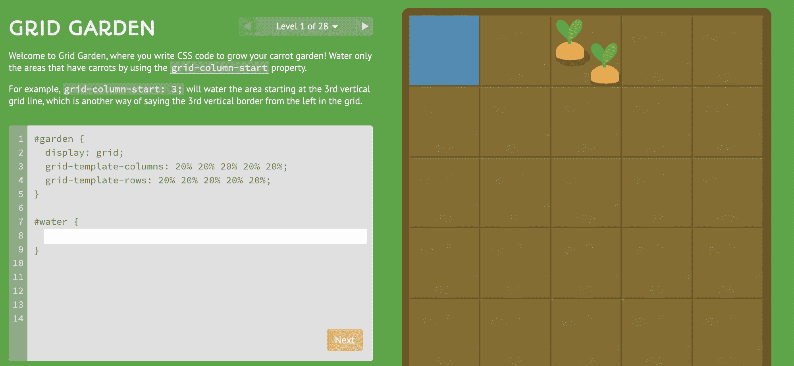

通过经历[网格花园](https://cssgridgarden.com/)的 28 关学习 CSS 网格。鼓励对 CSS 网格有所了解，但这并不是游戏入门的必要条件。

每个挑战都提供了 CSS 网格属性的描述。最初的几个挑战开始时很容易，但随着你在游戏中的进展，事情变得越来越复杂。

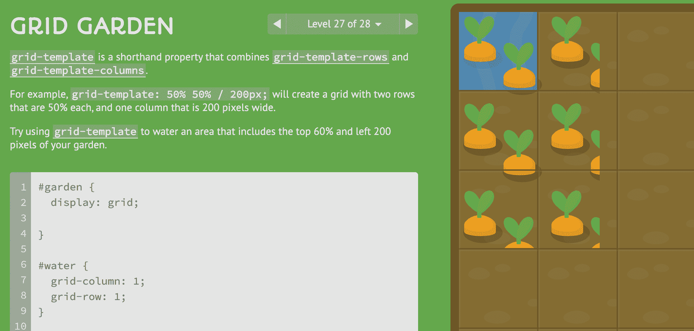

## 协同作战

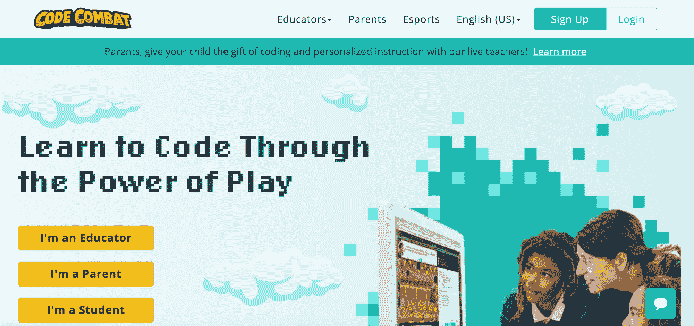

CodeCombat 对孩子和成人学习者都很有效。你可以创建一个免费账户，学习编程的基础知识，比如循环、函数、条件和变量。

你可以选择从哪种编程语言开始，并在游戏中按自己的方式进行。

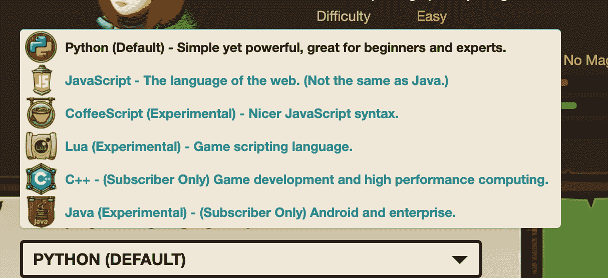

如果您有兴趣进入更多级别，您还可以选择升级到高级帐户。

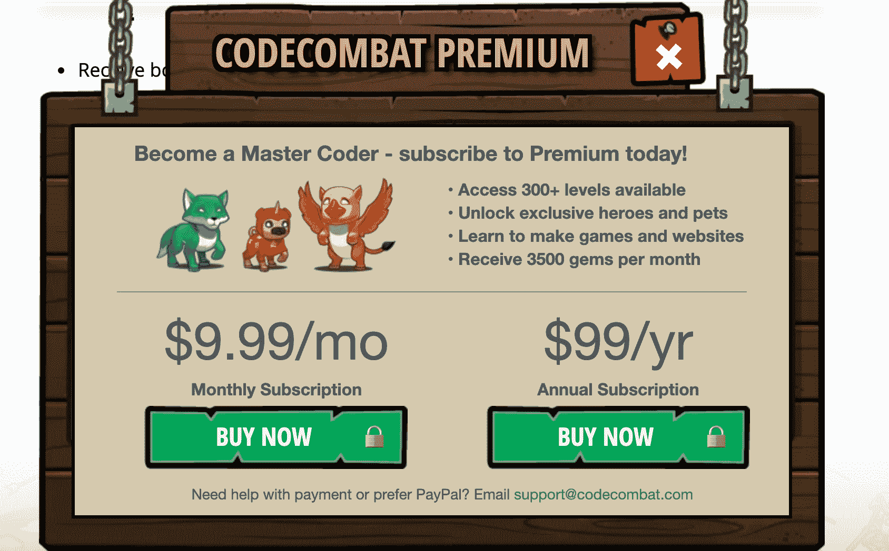

## 擦

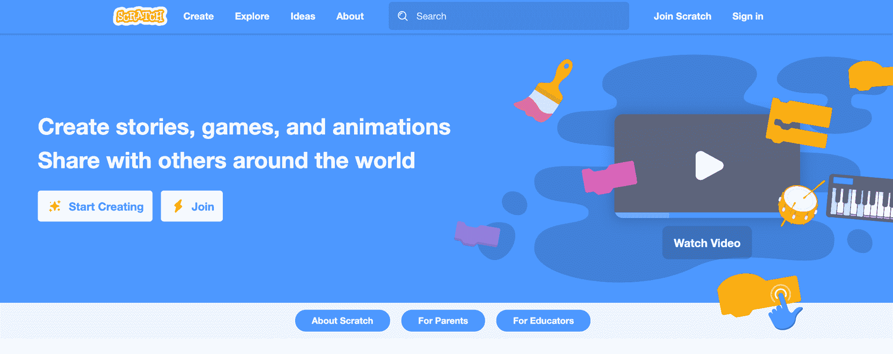

麻省理工学院的 [Scratch](https://scratch.mit.edu/) 是一种基于块的编程语言，你可以通过构建自己的游戏和动画来学习事件、条件、变量等。

从几十个精灵，声音和背景中选择编码你自己的作品，并开始了解编程基础。

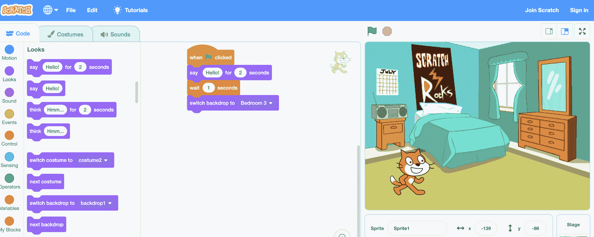

Scratch 也用于哈佛的 CS50:计算机科学导论课程的第一周。

## 廷克

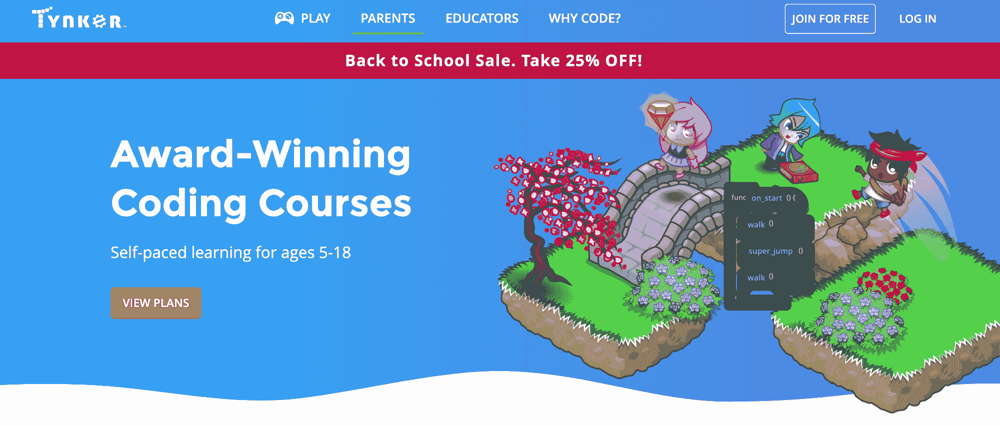

Tynker 是一个你可以使用 HTML、CSS、JavaScript、Python 和 Java 构建项目和玩游戏的网站。他们有大量的项目、算法和数据结构挑战。

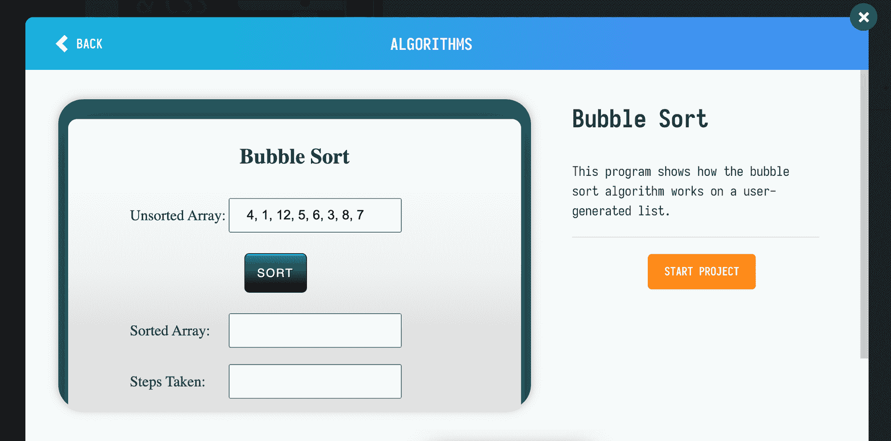

您可以在在线编辑器中构建这些项目，并在社区中共享您的创作。这个网站的目标是 5-18 岁的孩子。

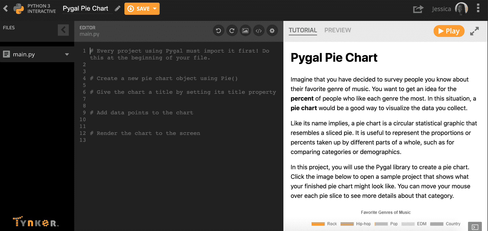

## SQL 谋杀之谜

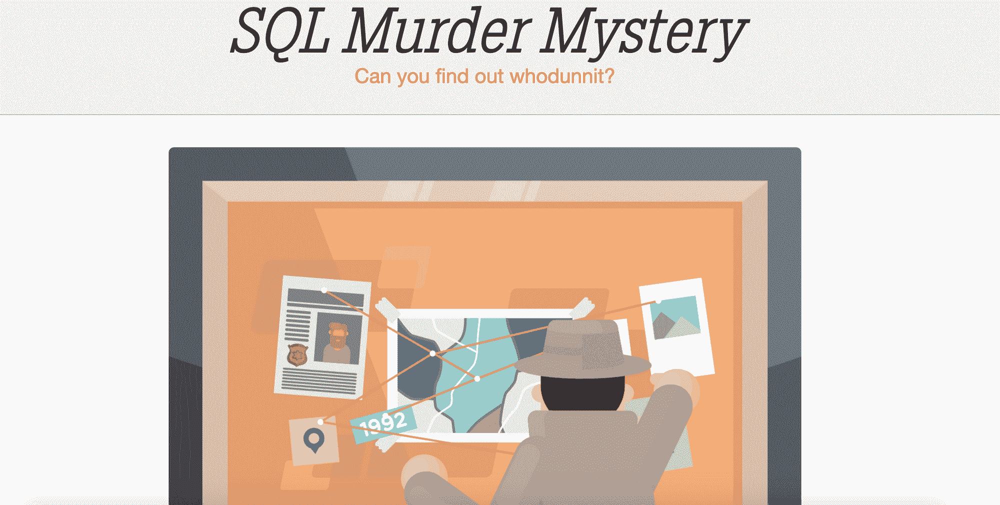

[SQL 谋杀之谜](https://mystery.knightlab.com/)对于初学者和有经验的 SQL 开发人员来说都很棒。加强您的 SQL 和解决问题的技能，试图追查凶手在这个谋杀之谜。

游戏使用 SQLite，在开始游戏之前，你必须先熟悉数据库结构。

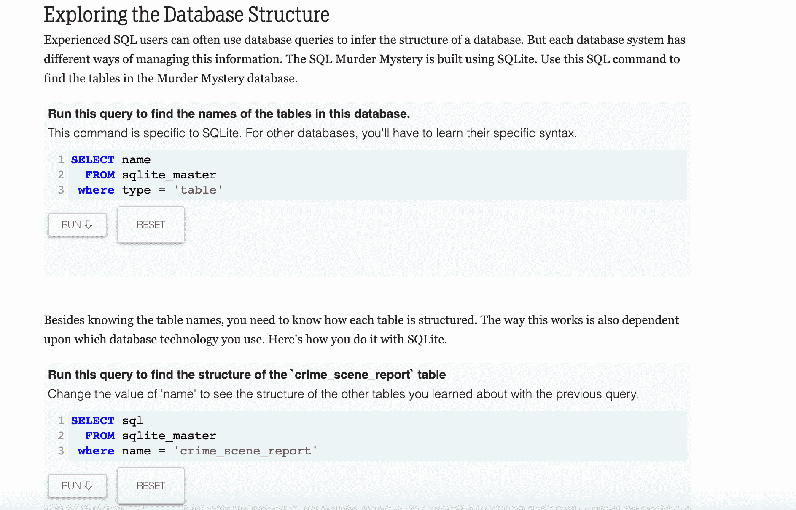

如果您是 SQL 新手，有一个针对初学者的[详细介绍。否则，如果你是一个经验丰富的 SQL 用户，那么你可以直接进入游戏。](https://mystery.knightlab.com/walkthrough.html)

## 不可信

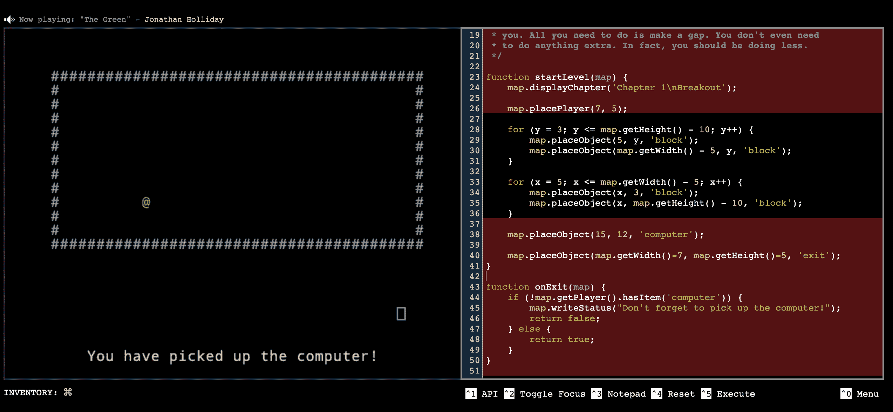

[不可信](https://alexnisnevich.github.io/untrusted/)是一个冒险游戏，在这里你可以测试你的 JavaScript 和解决问题的技巧。通过解决 JavaScript 挑战，帮助指导 Eval 博士通过一系列关卡。

如果你是 JavaScript 新手，那么这个游戏对你来说可能有点高级。但是如果你花了一些时间用 JavaScript 编程，那么这些挑战是可行的。

## 电梯传奇

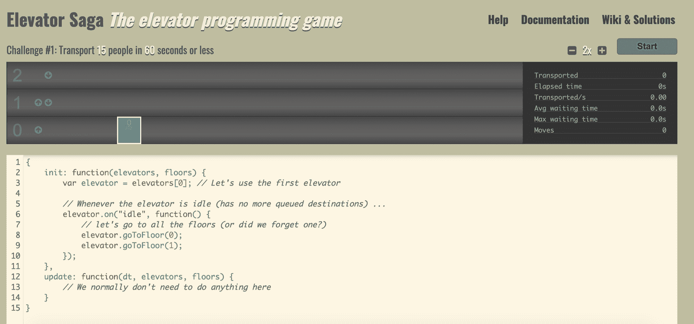

[电梯传奇](http://play.elevatorsaga.com/)是一个 JavaScript 游戏，你将经历一系列挑战，试图在给定的时间内以最有效的方式运送电梯中的人。

一旦您修改了代码，您就可以通过点击右上角的 start 按钮来测试您的解决方案的效率。当程序运行时，你可以检查统计数据，看看你是否通过了挑战。

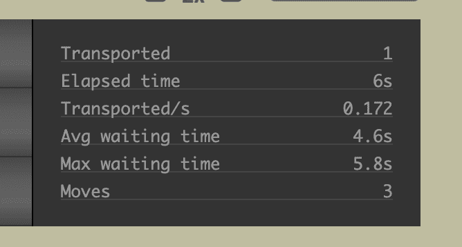

## 切克奥

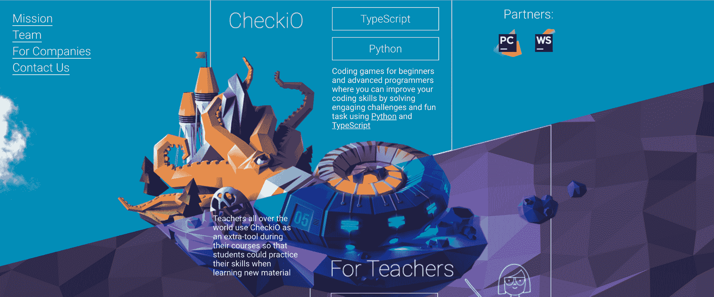

[CheckiO](https://checkio.org/) 是一款策略游戏，通过一系列的挑战，你可以学习 TypeScript 或者 Python。一旦你创建了一个免费帐户，你将从初级挑战开始，并通过你的方式进入高级挑战。

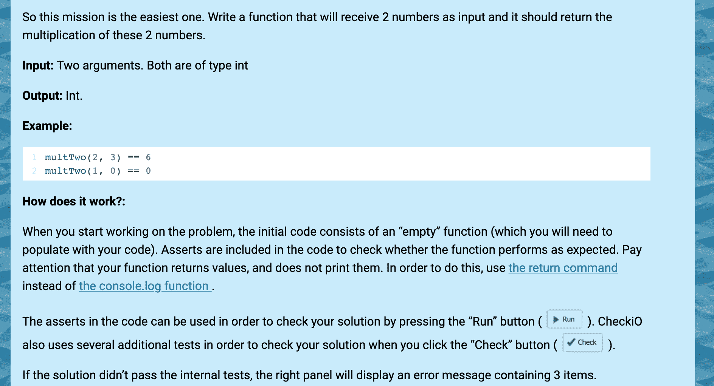

如果你需要帮助，游戏会给你提示和其他玩家的解决方案。您将在在线编辑器中解决每个挑战，并在任务解决后继续下一个任务。

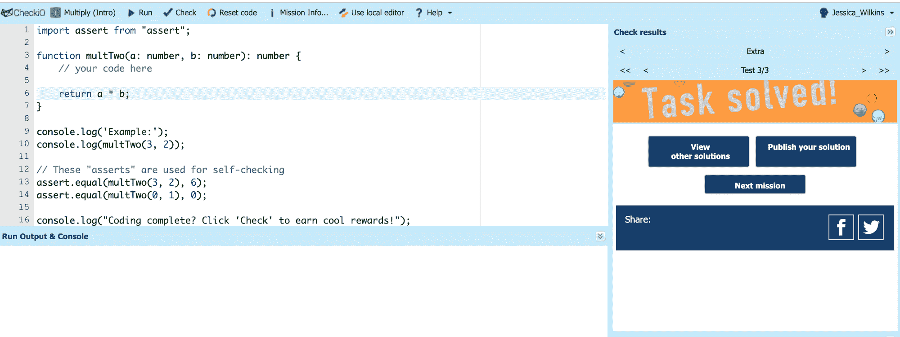