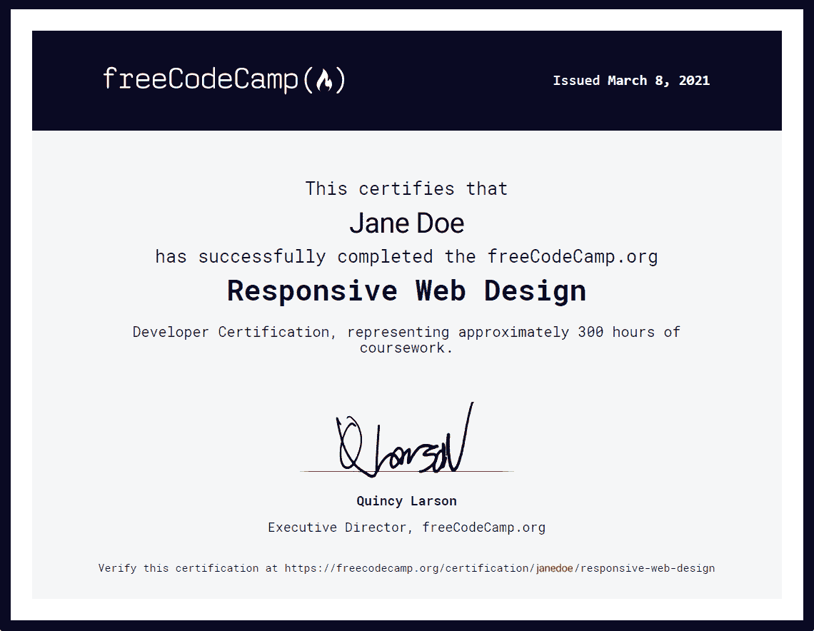
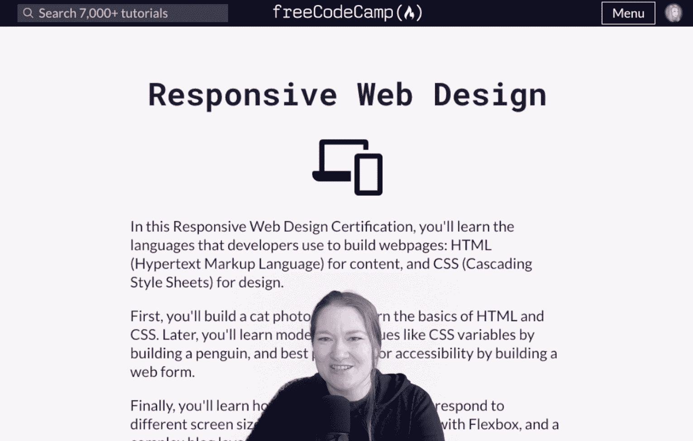

# 基于 freeCodeCamp 课程的免费编码训练营

> 原文：<https://www.freecodecamp.org/news/free-coding-bootcamp-based-on-freecodecamp/>

现在你可以加入一个免费的兼职远程编码训练营。你将与世界各地友好的人们一起学习 freeCodeCamp 的整个响应式网页设计认证。

👋你好，我是杰西。很久以前，我是一名从事特殊教育和语言教育的教育工作者。

当我想进入技术领域时，我有了编程训练营的想法。这些在当时都是较新的概念:私人教育项目向你承诺技能，让你以低廉的价格……嗯，太多的钱找到一份高薪工作。

因此，我自学进入这个行业，但一直密切关注这些项目，想知道如何利用现有的高质量免费资源为学习者提供类似训练营的支持。

现在，我正与 [Class Central](https://www.classcentral.com/) 合作，围绕 freeCodeCamp 的[响应式网页设计认证](https://www.freecodecamp.org/learn/responsive-web-design/)，教授一个免费的、兼职的远程网页开发训练营。8 月 23 号开始。如果你想直接进入注册，你可以[在这里](https://www.classcentral.com/study-group/webdev-bootcamp-fall-2021)注册。

## 为什么我们要开始这个训练营

我对昂贵的、剥削性的编程训练营非常恼火。一些质量参差不齐的课程可能要花费数万美元。

这就是 freeCodeCamp 如此特别的原因:他们免费为自我驱动的学习者提供高质量的技术教育。

但是一些付费训练营确实为学习者提供了一些价值。例如，许多新兵训练营的毕业生报告说，与教官的现场接触、让他们保持正轨的固定时间表以及同伴之间的友谊帮助他们实现了学习目标。

我开始思考我们可以在 freeCodeCamp 的课程中加入多少这样的支持来帮助尽可能多的免费学习者。

我坐下来思考我想从一个项目中得到什么。它必须:

*   以群体为基础，寻求同伴支持。
*   要灵活，要兼职。
*   低风险，也就是说，休息一段时间的学习者仍然可以回来并取得成功。
*   提供现场讲师联系方式。
*   即使对于不选择与我们一起学习的学习者，也能增加价值。
*   当然，完全免费。

幸运的是，几个月前，Class Central 开始在网上免费运行符合这种模式的学习小组。我们在同一页上！

所以我们决定合作设计一个基于群组的训练营，围绕 freeCodeCamp 的[响应式网页设计认证](https://www.freecodecamp.org/learn/responsive-web-design/)。

## 训练营支持和灵活性

新兵训练营将以队列为基础。这意味着学习者将同时开始，允许他们在课程的相同阶段互相支持。

他们还将共享一个专门的论坛，在公开场合一起学习。我们预计他们将需要每周花 10-20 个小时在课程上，以跟上他们的同学。因为它导致认证，这是一个紧张的程序。

freeCodeCamp’s Responsive Web Design Certification

虽然基于群组的方法和共享的课程表有助于激励学习者并促进支持，但这些压力可能会对需要灵活性的学习者产生负面影响。如何才能确保那些需要休息或暂停学业的人仍然得到支持？

通过使用 freeCodeCamp 平台和课程，学习者可以休息一下或离开我们的团队，而不会失去他们的任何进步。我们希望学习者成功，不管他们是否和我们一起学习。

## 课程和实时流

这个训练营将涵盖基本的 HTML，CSS 的基础，应用视觉设计，可访问性，负责任的网页设计，CSS flexbox 和 CSS grid。

我们的项目非常适合刚开始 web 开发的人。它也可能非常适合那些已经休息了一段时间，并希望以一种受支持的方式重新开始学习的人。

虽然本课程将为你提供许多入门级网页设计和开发角色所需的技能，但许多学习者在申请角色之前会继续学习 JavaScript。

[My Twitch channel](https://www.twitch.tv/jesslynnrose), where we’ll have our bootcamp stream

传统的训练营通常包括与教练的现场接触。我们还想添加一个现场的、由教师指导的组件来复制这一点。但是我们想以一种对我们的学习者和 freeCodeCamp 更广泛的学习者群体公开的方式来做这件事。

为了实现这一目标，我们在每周一增加了每周直播流，涵盖关键概念，回顾一些课程材料，并为学生提供实时提问的机会。

为了确保即使来自训练营以外的学员也能受益，这些流媒体课程将在 [Twitch](https://www.twitch.tv/jesslynnrose) 和 [YouTube](https://www.youtube.com/c/ClassCentral) 上开放。过去的流媒体课程也可以通过视频点播获得，这样如果学习者错过了一节课，他们可以补上。

## 训练营是完全免费的

最重要的是，所有这些都需要免费。freeCodeCamp 非常友好，允许我们根据他们高质量的学习材料来设计我们的项目。班级中心提供内部资源和预算。我正在努力降低日费率，以确保我们能够免费向学习者提供这种服务。

我们将探索一些方法来制作这个节目(以及未来的节目？)可持续，包括引入科技赞助商的可能性。但我们不会向学员收取入行支持费。当你学习的时候，你应该得到帮助和支持。

想加入我们吗？[您可以在这里找到更多详细信息以及如何注册](https://www.classcentral.com/report/webdev-bootcamp/)。我们很乐意和你一起学习。