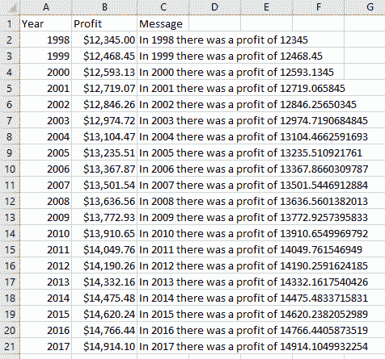
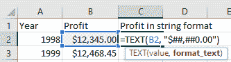
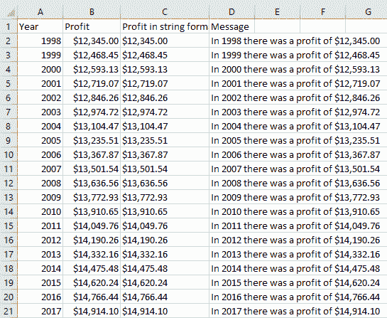
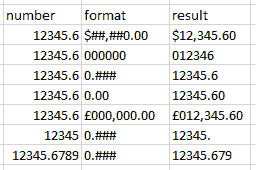
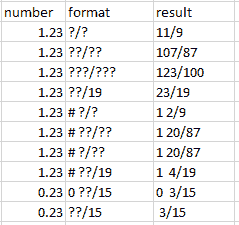

# Excel 文本函数–如何将数字转换为文本格式

> 原文：<https://www.freecodecamp.org/news/excel-text-function-how-to-convert-a-number-to-text-format/>

如果你想给一个文本串添加一个数字，你不能直接这样做，因为它的格式没有被维护。此外，添加到文本字符串的数字没有任何格式或其所有的小数位。

`TEXT`函数在这里派上了用场，因为它允许您将一个数字转换成具有特定格式的文本格式。然后你可以把它添加到另一个字符串中，它就会变成你想要的格式。

## 如何使用 Excel 中的`TEXT`函数

假设你有一系列的数字，你想写一个包含这些数字的消息。

让我们先看看不使用文本函数会发生什么。首先，我们将尝试使用`CONCAT`函数作为`=CONCAT("In ", A2, " there was a profit of ", B2)`，然后用相同的公式填充列的其余部分。

看起来不太好，数字都不一样。这是因为当我们将一个数字连接到一个字符串时，格式会丢失。

所以相反，我们用`TEXT`做一个数字的字符串，然后加到字符串上。

`TEXT`有两个参数:第一个是我们要转换成字符串的数字，第二个是格式。在这种情况下，我们将使用的格式是`$##,##0.00`(我们将在后面看到如何创建我们想要的格式)。

我们把 C 栏的内容全部删掉，标题改为`Profit in string format`。我们将在 C2 写`=TEXT(B2, "`$##,##0.00`”`，然后扩展到本专栏的其余部分。

如果您使用字符串格式的数字再次创建字符串，这一次数字将保持您想要的格式。

## 如何在 Excel 中使用不同的数字格式

我们刚刚看到了如何使用一种特定的格式，`$##,##0.00`。现在让我们看看这些字符的意思，这样你就可以使用你想要的数字格式了。另请注意，当格式显示的小数位数少于数字位数时，十进制数字会被四舍五入。

### 如何将数字格式化为小数

`0`是一个必须存在的数字——如果转换后的数字没有足够的位置，就会有一个`0`。您可以使用它来决定要显示多少个小数位，尾随`0`还是前导`0`。

例如，带有格式`000000`的数字`12345.6`将显示为带有前导`0`的`012345`。但是如果它被格式化为`0.00`，它将被显示为`12345.60`，并带有一个尾随的`0`。

`#`代表一个可能存在也可能不存在的数字。例如，您可以使用它来显示 max 要显示多少个小数。

例如，格式化为`0.###`的`12345.6`将显示为`12345.6`。但是`12345`将显示为`12345.`，而`12345.6789`将显示为`12345.679`，因为格式是最多 3 位小数。

您可以在开头、中间或结尾添加其他字符。您可以添加除`,`、`.`、`?`、`0`、`#`之外的任何字符。逗号充当千位分隔符，点是小数点分隔符，最后三个符号在格式中有特殊的含义(例如，`?`用于分数，见下文)。

这里有几个例子:

### 如何将数字格式化为分数

您也可以将数字格式化为分数。在分数格式中，您可以指定分母应该有多少位数(或指定一个分母)。您还可以指定整个部分是否必须写在分数内或分开。

要指定分数分母的位数，可以使用`?`字符。您可以在分母中使用您想要的位数。

例如，`?/?`代表分母中的一位数字，`??/??`代表两位数字，以此类推(注意，使用`?/??`或`??/??`会得到相同的结果)。

要指定哪个数字必须是分母，您可以将其写入格式。所以如果你想要十九分之一的分数，你可以写`??/19`。

为了把整个部分和分数分开，你可以在它前面写一个`#`，用一个空格隔开，所以是`# ??/19`或`# ???/???`。如果你希望整个部分总是可见的，即使它是零，你可以写`0 ??/19`或`0 ???/???`。

## 结论

在字符串中添加数字在编写报告时通常很有用。但是如果想保持数字的特定格式，就需要使用`TEXT`函数。

在本文中，您已经学习了如何将数字格式化为整数、带小数位的数字或分数。