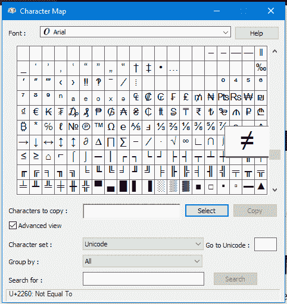
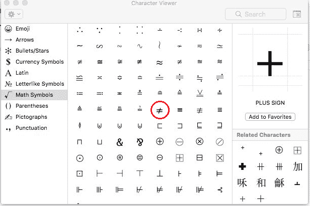
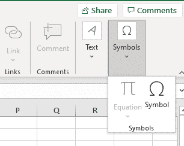
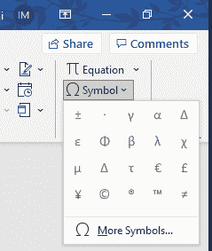
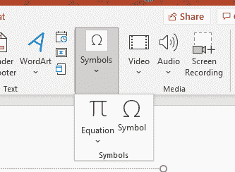
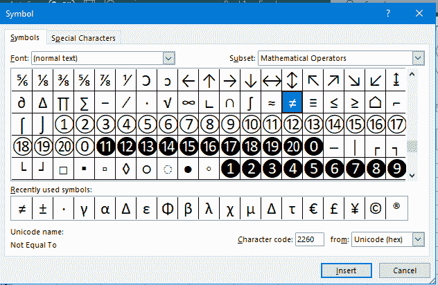
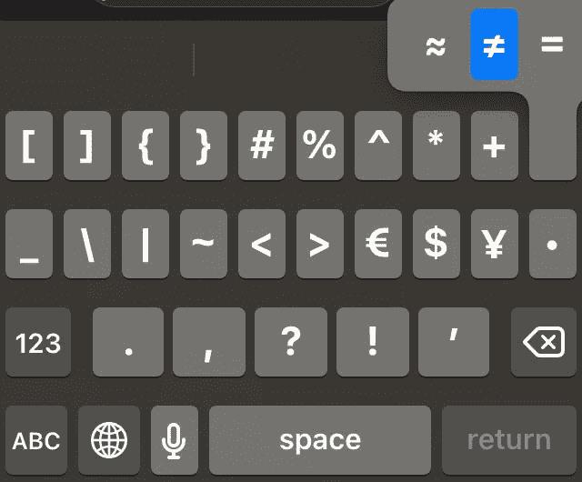
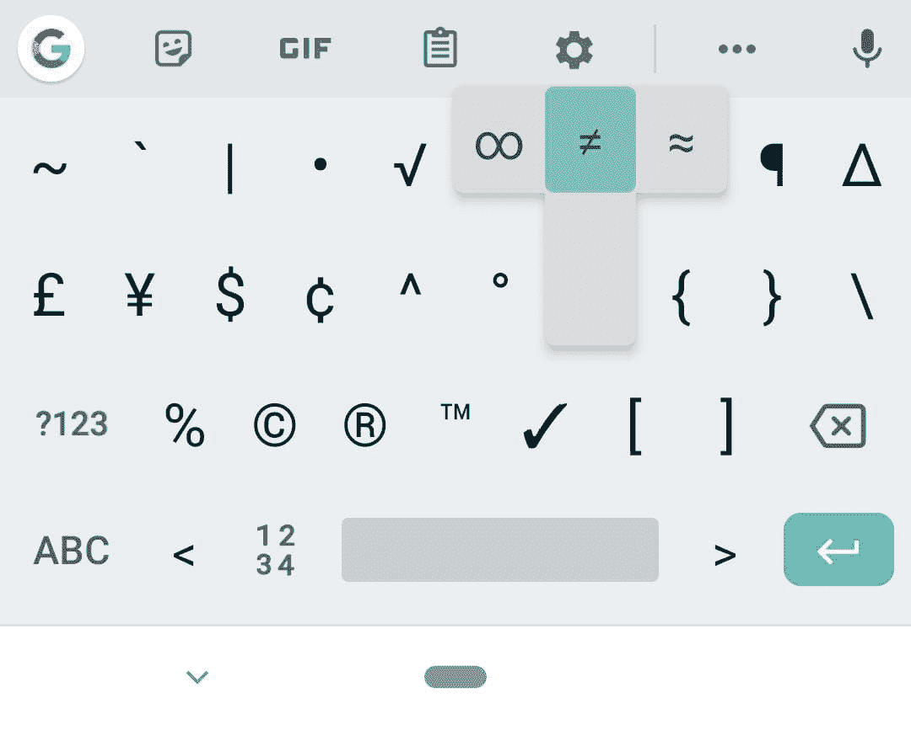

# 不等于符号–如何键入不等于符号

> 原文：<https://www.freecodecamp.org/news/not-equal-sign-how-to-type-the-does-not-equal-symbol/>

不等于符号，或≦，通常不是标准键盘设置的一部分，或者它隐藏得很好。那么如果需要写，怎么做呢？

# 如何在桌面设备上写不等于号

## 在 Windows 上:使用字符映射表

字符映射表是一个有用的工具，你可以从中选择所有可能的字符。

要进入角色图，点击开始，然后导航到程序->附件->系统工具，最后点击角色图。

你可以在数学符号中找到不等于号。然后你可以从字符映射表中复制并粘贴到你需要的地方。

## Mac 上的非等号快捷键

如果您使用的是 Mac，键入不等于符号就像键入`Option+=`一样简单(这可能因语言和位置而异)。

或者，您可以按`Control+Command+Space bar`打开字符查看器。然后，您可以滚动浏览可用的表情符号和符号，直到找到数学符号部分。在那里，您将找到不等于符号(或者您可以使用搜索栏)。

The Character Viewer. The Does Not Equal sign can be found in the Math Symbols section.

# 如何在微软办公套件中编写不等于号

## 使用插入符号工具

在 Microsoft Office 套件中，您可以使用“插入”选项卡中的“符号”工具将“不等于”符号添加到文档中。

The Symbol tool in Excel

The Symbol tool in Word

The Symbol tool in PowerPoint

点击符号(或更多符号...(对于 Word)打开一个窗口，您可以从中选择符号。在数学运算符的子集中，你可以在末尾找到不等于符号。

您可以从允许您选择子集的下拉菜单中更快地找到它。一旦选中，插入按钮将在您的文档中插入该符号。

## 使用键盘快捷键

您也可以键入`Alt+8800`，这将在任何套件 Office 应用程序中键入不等于号。

## Microsoft Word Only 键盘快捷键

只有在 Microsoft Word 中有一个额外的快捷方式，可以让您键入不等于号——只需键入 2260，然后按下`Alt+x`,≠号将代替数字。

# 如何在手机上输入不等于号

大多数移动键盘有不同的面板，一个用于字母，一个或多个附加的符号面板。等号通常包含在非字母面板中。试着长按等号，不等号可能会包含在内。

上面的截图是针对 iPhone 键盘的。在它上面，你可以在第二个符号面板里找到等号。

对于 Android 键盘，您需要再执行几个步骤才能到达包含等号和不等号的符号面板。您通常可以使用带有多个符号的按钮在面板之间导航，如`ABC`或`123`。

# 如何在 HTML 中写不等于号

在 HTML 中，您可以使用下列代码之一来编写≠符号:

*   `&#8800;`
*   `&ne;`
*   `&NotEqual;`

最好使用呈现特殊字符的代码来包含这些字符，而不是直接键入符号。

# 结论

您可能不需要经常键入不等于符号。但是当你需要它的时候，知道如何在你的笔记本电脑或智能手机上使用键盘或其他方法输入它是很有用的。