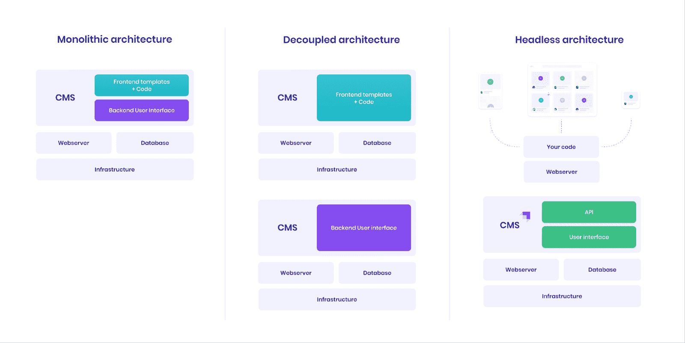

# Headless CMS 解释了它是什么以及何时应该使用它

> 原文：<https://www.freecodecamp.org/news/what-is-headless-cms-explained/>

CMS 很难被忽视，因为它们在互联网上无处不在。例如，WordPress 现在占据了互联网 40%的份额。

在本文中，我们将介绍什么是 CMS 以及为什么您应该关注它们。我还将向您介绍一种目前似乎无处不在的新型 CMS——无头 CMS。我们将用一个故事来完成这一切！

生活有一种有趣的方式让你去尝试。在多年忽视 CMSs 技术之后，2020 年中期，我在一个无头 CMS 工具公司 [Strapi](https://strapi.io) 找到了一份工作。从那以后，我对这些东西的作用有了很好的理解——所以让我们开始吧。

## 什么是 CMS？

内容管理系统(CMS)是一种帮助用户创建、管理和修改数字内容的工具。

然而，在本文中，我不会深入探讨它的本质。相反，如果你想了解更多，你可以看看[我写的一篇文章](https://strapi.io/blog/frontend-developers-headless-cms)，这篇文章深入探讨了各种类型的 CMS。

## 什么是无头 CMS？

无头 CMS 有一个准备内容的后端，仅此而已。内容及其数据只能通过调用 API 来访问，无论是 REST 还是 GraphQL。

我喜欢用这个图来说明 Headless 是如何工作的，所以希望它能描绘出一个更清晰的画面。

Monolithic vs decoupled vs headless architectures

除了为多个平台提供内容之外，还有一些其他的原因让你想使用一个无头的 CMS。

### 您不想放弃开发人员的灵活性

默认情况下采用无头架构意味着您可以灵活地选择前端工具。对于许多开发者来说，这是一个至关重要的优势。

### 您需要一个安全的内容解决方案

将前端与后端分离会使有针对性的攻击更加困难。这是一些传统 CMS 至今仍在努力解决的问题。

### 您想让您的技术堆栈经得起未来考验吗

走向无头化还意味着您更少依赖单一的前端解决方案。如果您需要升级到更现代的前端或添加一个新的前端，headless 使这变得更加容易。

### 你需要创造定制和个性化的体验

对于许多组织来说，这已经成为 headless CMSs 的一个非常重要的优势。

有了 headless，您就有机会从一个内容源为不同的平台定制不同的体验。

## 我是如何进入无头 CMS 的

所以我真的很喜欢 GraphQL，我就是这样开始使用 Strapi 的。为 CMS 工作就像一头扎进这个生态系统。我认为我理解无头 CMS，因为对我来说它们是“数据、API、前端”,这就是我对它的看法。

嗯，我们使用这些东西来构建我们的前端，但是当我们考虑构建这样的前端时，我们经常会忽略内容管理这一方面。直到我开始和 Strapi 一起工作，我才意识到我的假设。

“内容管理”听起来有点无聊，对吧？还有 CMS？“唉，我为什么要使用这样的工具？”我知道！我也是，但是听我说完。CMSs 实际上非常有用。因此，让我们来谈谈如何和为什么 CMS 可以帮助你。

## 为什么需要无头 CMS？

首先，内容在当今世界的作用不容小觑。内容无处不在，并通过文本、音频、视频等多种形式表现出来。

很长一段时间，电脑和浏览器是内容消费的主要工具。我们在个人电脑上阅读博客，观看 YouTube 视频，听播客。

渐渐地，我们的电脑变得越来越小，越来越不显眼。各种形状和形式的内容开始在我们周围出现。它在手机、智能电视、汽车、虚拟助手和可穿戴设备中得到了体现。

人们消费内容的方式变了，我们构建内容消费体验的方式也变了。

### 那么 Headless CMS 有什么帮助呢？

传统上，CMS 是前端和后端紧密耦合的整体。你在 CMS 后端添加的内容只出现在它所耦合的前端——想想 WordPress 和 Drupal。

这被证明是低效的，因为开发人员需要一种更好的方式来构建和适应这种新的消费者行为。

解决办法？撕掉传统 CMS 的头，让你的后端向多个平台交付内容成为可能。无头就是这样诞生的。

## 为什么您可能不需要无头 CMS

不过，Headless 不一定是所有用例的正确解决方案。可能不适合你，如果...

### 你有一个小团队

采用和构建一个无头架构需要相当多的努力。为了获得它的所有好处，你必须有一个专门的开发团队来构建你的前端，以及你的团队中的人来为你的 CMS 添加内容。

### 您非常依赖简单的实时预览实现

在 Headless 上的实时预览并不是最直观的设置(在我写这篇文章的时候),需要开发人员付出一些努力来实现。

### 您只需要简单的发布功能

正如我们刚刚了解到的，headless 需要付出合理的努力才能让它高效地工作。

如果您只需要简单的发布功能，而没有国际化或基于角色的访问控制等功能，那么最好等到您需要这些附加功能时再使用无头 CMS。

## 无头 CMS 的用例

我早期的很多 CMS 项目都围绕着公司网站和个人博客，它们都是 headless 的可靠用例。但是我不是全职做网站的，所以我不会经常发布代码。

就我个人而言，我用 CMS 帮助建立了一个[餐厅目录](https://foodadvisor.strapi.io/)、一个[活动网站](https://conf.strapi.io/speakers)和一个[在线测验](https://conf.strapi.io/quizz)。有人使用无头 CMS 来构建电子商务网站、Covid 跟踪项目、医院管理系统、库存管理应用程序、移动目录、虚拟现实游戏，有些人甚至用它们来运行电子邮件活动。这么多可能性。

## 结论

看到人们用 CMSs 构建的东西非常鼓舞人心。作为一项技术，我对 CMSs 非常欣赏。我曾经认为是一个无聊的工具，实际上却为我周围的世界提供了如此多的动力。

现在有很多关于无头 CMS 的用例。虽然目前有一个巨大的焦点放在为开发者服务(许多 CMS 做得很好)，我们仍然有一段路要走，以使内容编辑器的体验更好。

参与这场竞赛是令人兴奋的，我能告诉你的是，总体来说，未来几年将是无头技术令人惊叹的几年。

所以希望这篇文章能帮助你跟上潮流，更好地理解这项技术能做什么和不能做什么。

毕竟，归根结底，选择权在你！

### 资源

*   无头不育系| Jamstack.org
*   [什么是无头 CMS](https://strapi.io/what-is-headless-cms)
*   [什么是无头 CMS，为什么要关注它](https://www.stackbit.com/blog/what-is-a-headless-cms/)
*   [CMS 比较](https://cms-comparison.io/#/card)