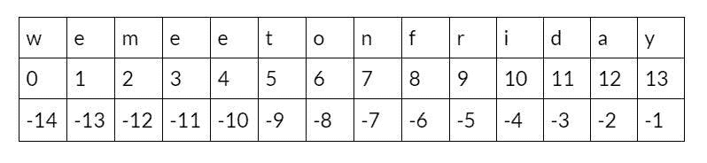

# python Substring——如何分割字符串

> 原文：<https://www.freecodecamp.org/news/python-substring-how-to-slice-a-string/>

在 Python 中，字符串是可能包含特殊字符或字母数字字符的字符序列。

字符串的一个例子是*“我们在星期五上午 8:00*见面”。您可以访问字符串的特定子部分，通常称为子字符串。

我们可以将子串定义为字符串中的一系列字符。在前面的例子中，Python 子字符串可以是例如“Friday”、“at”和“meet”。

## 如何在 Python 中生成子串

Python 提供了不同的方式和方法来生成子串、检查子串是否存在、获取子串的索引等等。

通过使用索引进行切片，可以从字符串中提取子字符串，如下所示:

`string[start:stop:step]`

*   **start** -子串的起始索引。
*   **stop**——子串的最后一个索引。
*   **步骤** -指定切片步骤的数字。默认值为 1。



指数可以是正数，也可以是负数。正索引从字符串的开头开始，一直到字符串的结尾，负索引从字符串的结尾开始，一直到字符串的开头。

在本文中，您将学习如何在 Python 中执行与子字符串相关的各种操作。

## 如何在 Python 中获取一个字符串的前 n 个字符

这个例子将向你展示如何从字符串中截取前 5 个字符。

```
string = "hello world"
print(string[:5]) 
```

在这里，您定义停止指数为 5。默认情况下，起始索引为 0。

输出为`‘hello’`。

## 如何通过 Python 子字符串获得字符串的中间字符

这个例子将向你展示如何从字符串中切分出从索引 3 到索引 5 的字符。

```
string = "hello world"
print(string[3:5]) 
```

输出为`'lo’`。

## 如何在 Python 中获取字符串的最后一个字符

要获得最后一个字符，请使用-1 索引(负索引)。看看下面的例子:

```
string = "freecodecamp"
print(string[-1]) 
```

输出将是`‘p’`。

## 如何在 Python 中获取一个字符串的最后 n 个字符

在本例中，您将从字符串中截取最后 4 个字符。这里使用负索引从字符串的末尾开始切片。

```
string = "freecodecamp"
print(string[-4:]) 
```

输出将是`‘camp’`。

## 如何通过 Python 子字符串用步骤分割字符串

您可以在指示开始索引和停止索引后，用步长对字符串进行切片。默认情况下，步长为 1，但在以下示例中，步长为 2。

```
string = "welcome to freecodecamp"
print(string[::2]) 
```

输出将是`‘wloet fecdcm’`。

## 如何在 Python 中检查字符串中是否存在子串

有时你想检查一个子串是否存在于一个字符串中。以下示例将验证子字符串“code”是否在字符串中:

```
substring = "code"
string = "welcome to freecodecamp"
print(substring in string) 
```

如果存在，它将返回 True，否则返回 False。

在这里，输出将是`True`。

## 检查字符串中是否存在 Python 子串的另一种方法

您可以使用`find()`方法来检查字符串中是否存在子字符串。

让我们看看下面的例子:

```
substring = "zz"
string = "hello world"
print(string.find(substring)) 
```

如果它可用，它返回子串最左边的索引，否则返回-1(这意味着它不可用)。

这里的输出是`-1`，这意味着**【ZZ】**不存在于“hello world”中。

## 如何在 Python 中获取字符串中给定索引的字符

您可以选择根据索引号对特定字符进行切片。

```
string ="hello world"
print(string[4]) 
```

输出将是`‘O’`。

## 如何在 Python 中从一个字符串创建一个子字符串列表

你可以使用 **`split()`** 方法创建一个子字符串列表。让我们看看下面的例子:

```
string = "welcome to freecodecamp platform"
print(string.split()) 
```

输出将是`['welcome', 'to', 'freecodecamp', 'platform']`

## 如何用负步在 Python 中反转一个字符串

要反转字符串，步长必须是负值，例如-1。

```
string = "welcome to freecodecamp"
print(string[::-1]) 
```

输出为`‘pmacedoceerf ot emoclew’`。

## 如何在 Python 中计算一个子串在一个字符串中出现的次数

您可以使用`count()`方法来知道一个特定的子串在一个字符串中出现了多少次。

```
string = "we will have a quick coding lesson this afternoon"
print(string.count('noon')) 
```

输出为 1。

## 关于 Python 子字符串的最终想法

恭喜👏👏，你已经做到这篇文章的结尾了！我希望您已经了解了一些关于 Python 子字符串的新知识。

如果你学到了新的东西或者喜欢阅读这篇文章，请分享给其他人看。在那之前，下期帖子再见！

你也可以在 Twitter 上找到我 [@Davis_McDavid](https://twitter.com/Davis_McDavid?ref=hackernoon.com) 。

你可以在这里阅读更多类似的文章