# 谷歌涂鸦游戏——棒球、吃豆人等等

> 原文：<https://www.freecodecamp.org/news/google-doodle-games-baseball-pacman-and-more/>

谷歌搜索引擎的主页是世界上访问量最大的网页。人们每天进行数十亿次搜索。

当你登陆这个页面，在搜索框的正上方，你会看到谷歌的标志。在许多情况下，标志会有所不同，并伴随着所谓的涂鸦。

这些涂鸦从小的、简单的和临时的改变到传统的标志。但更多的时候，它们是非常有创意和艺术表现力的。

它们突出了世界问题、重大历史事件、全球假日、地方庆典、周年纪念和重要人物的生日(包括先驱、艺术家和科学家)以及他们对社会的贡献。

当你点击涂鸦动画时，你可以找到更多关于特定主题的信息，有时涂鸦还会附带一些小游戏或互动。

## 第一个谷歌涂鸦

1998 年 8 月 30 日，谷歌联合创始人拉里·佩奇和谢尔盖·布林在美国内华达州沙漠参加一年一度的火人节时创作了第一个涂鸦。

他们在第二个“O”后面放了一个类似燃烧的人标志的简笔画图标，作为“不在办公室”的信息，以一种有趣和有创意的方式让用户知道他们不在。

谷歌当时非常年轻——这两个斯坦福学生创建搜索引擎才几年时间。这离它正式注册成为公司还不到一周。

你也可以看到标志是不同的，在结尾有一个感叹号。

## 谷歌涂鸦的发展

从那以后，这种在庆祝重大事件时改变标志的新想法诞生了，涂鸦也随之发展。

将近两年后，佩奇和布林请当时还是实习生的丹尼斯·黄创作一幅涂鸦，纪念 2000 年 7 月 14 日的巴士底日。它很受欢迎，丹尼斯·黄被任命为首席涂鸦手。

涂鸦开始更经常地出现在主页上。

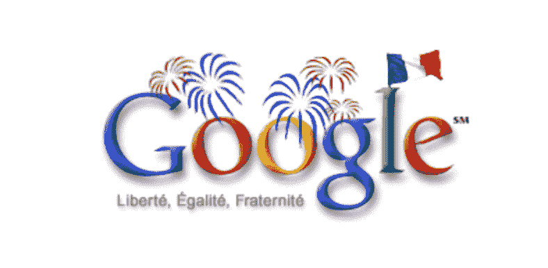

从那时起，谷歌就有了一个由才华横溢的插图画家组成的专门团队(称为涂鸦者),负责出现在谷歌全球主页上的涂鸦。

早期的涂鸦相当简单。当你将鼠标悬停在涂鸦上时，会出现一个小小的弹出文本，说明纪念的是什么。

2000 年的万圣节，客座艺术家萝莉·佩斯特·勒布创作了第一幅动画涂鸦。它以两个南瓜灯代替了“O”字，一只蜘蛛悬挂在“L”字上。

另一个值得注意的与技术相关的怀旧涂鸦是 2019 年 3 月 12 日，谷歌纪念万维网 30 周年。

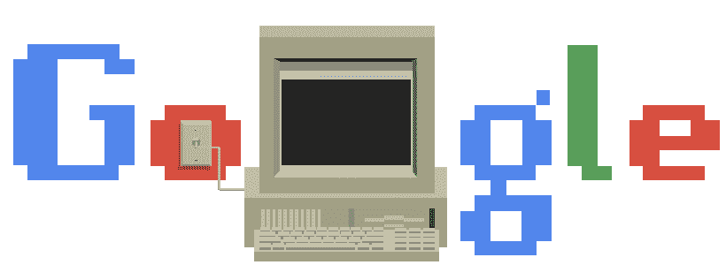

你可以查看所有出现在主页上的谷歌涂鸦的历史档案，让你重温任何涂鸦，并发现你可能还没有见过的新涂鸦。

## 第一个谷歌涂鸦游戏

涂鸦技术一直在进步，2010 年 5 月 21 日，谷歌发布了第一款互动游戏——第一款可玩的涂鸦谷歌游戏。

这次发行是为了庆祝 1980 年发行的最受欢迎、最经典的街机游戏之一《吃豆人》的 30 周年纪念。

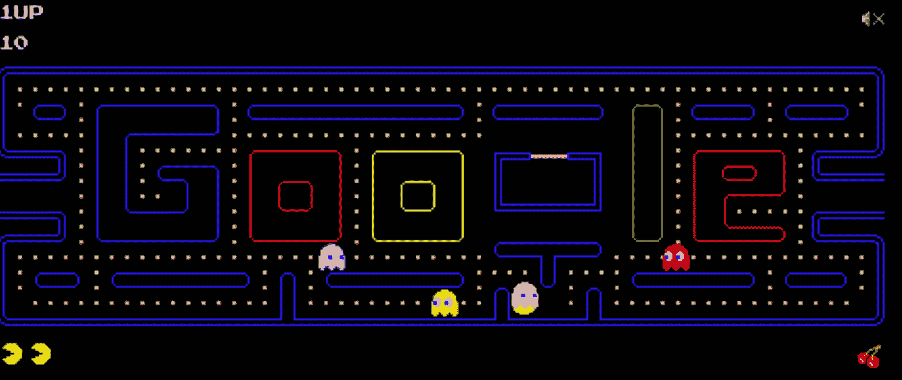

这对谷歌来说是一个巨大的发展，它一定会通过带回这样一个有趣和令人上瘾的回归游戏而给许多人带来快乐。据估计，在游戏发布的前三天，超过 10 亿人玩了这个游戏。

PacMan doodle 游戏带来了 8 位的怀旧记忆，因为它使用了相同的图形，相同的原始颜色，声音和标志性的人物。它甚至包括相同的原始游戏逻辑和 bug(！).

如果你想进行一次回忆之旅，或者第一次接触这个游戏，你可以在这里玩这个游戏。

只需按“插入硬币”并使用键盘上的箭头键。你是一个黄色的英雄，目标是吃掉所有的点，而不会被不同颜色的鬼抓住。

准备在这上面花太多的时间。

## 如何玩涂鸦谷歌游戏

从那以后，出现了更多有趣的互动游戏和谜题。

涂鸦和游戏通常会持续一天，以纪念某个特定的事件。但是谷歌将其所有的旧涂鸦和涂鸦游戏存档在专用存档页面上，而不仅仅是处理掉它们。

因此，你可以玩搜索引擎主页上的任何游戏。

玩这些游戏很容易，也不会大惊小怪。

它们都是基于网络的，可以在桌面和手机上玩，不需要下载任何东西或设置控制台。你不需要任何设备，只需要一个浏览器和互联网连接。

点击链接进入特定游戏的页面，然后点击开始游戏。

大多数情况下，您会使用鼠标或触控板和键盘。如果你用手机玩游戏，你将会点击或轻敲。

## 流行的涂鸦谷歌游戏

以下是一些最著名和最受欢迎的涂鸦游戏列表，根据不同的类别分组。

### 涂鸦脑筋急转弯游戏

#### 魔方

[魔方](https://www.google.com/doodles/rubiks-cube)于 2014 年 5 月 19 日出现在主页上，是最大、最迷人的智力挑战之一。

颜色是水平移动的，但是你可以通过点击立方体上的任何地方来移动它的各个部分。

#### 纵横拼字谜

2013 年 12 月 21 日，谷歌推出了向[填字游戏](https://www.google.com/logos/2013/crossword/crossword13.html)致敬的产品，以纪念填字游戏 100 年。

在 Merl Reagle 的帮助下，他是最好的也是最著名的填字游戏指导之一，Google 创建了他们自己版本的填字游戏。它还分享了整个谜题的历史。
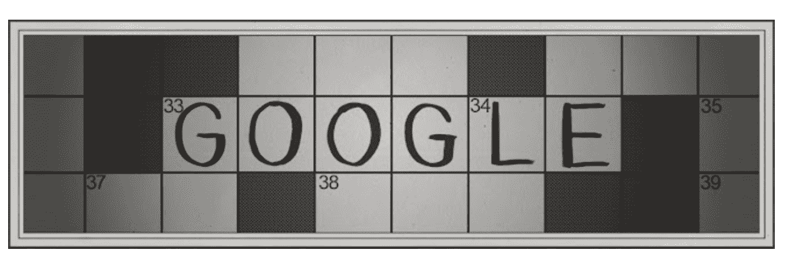

### 涂鸦编码游戏

#### 胡萝卜编码

[给胡萝卜编码](https://www.google.com/doodles/celebrating-50-years-of-kids-coding)介绍 childern(或者你！)通过连接表示编码概念的块，连接到编程的世界。这有助于引导兔子跨越 6 个关卡，找到它最喜欢的食物——胡萝卜——并收集它。

该游戏于 2017 年 12 月 4 日在计算机科学教育周期间与麻省理工学院合作发布，以庆祝儿童编码和儿童编码语言 50 周年。它基于 Scratch 编程语言。
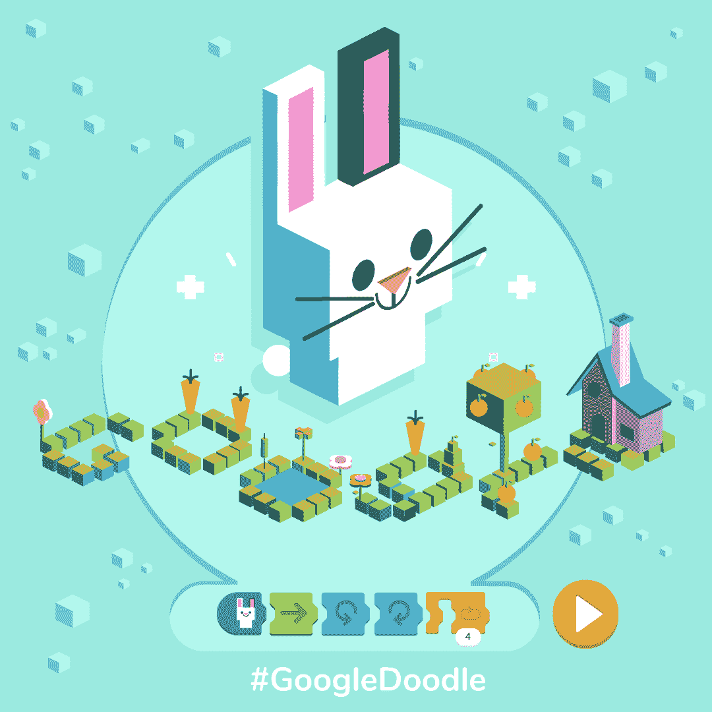

### 体育迷的涂鸦游戏

#### 板球

[板球](https://www.google.com/doodles/icc-champions-trophy-2017-begins)是为了庆祝 2017 年 ICC 冠军奖杯而推出的，你可以像一只动画蟋蟀一样玩板球。

当你看到球向你飞来，想击球得分时，只需点击球棒，挥动它。这是对这项运动的巧妙再现。
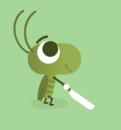

#### 棒球

[棒球](https://www.google.com/doodles/fourth-of-july-2019)是为了纪念 2019 年 7 月 4 日美国独立日而推出的。球员是典型的美国小吃，如热狗、薯条和番茄酱。

点击挥动球棒，如果你像我一样，准备好听到太多次“你出局了”(否则你会看到很多烟火)。
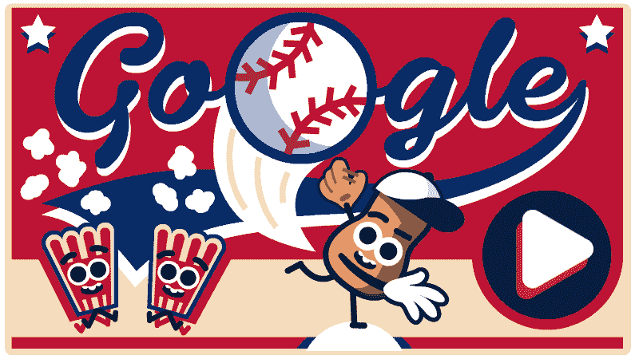

#### 篮球

[篮球](https://www.google.com/doodles/basketball-2012)于 2012 年问世，以这款互动篮球游戏向 2012 年夏季奥运会致敬。你试着在 24 秒内投进尽可能多的球。

除了这款游戏，谷歌在那段时间还发布了另外三款独立的互动体育游戏，比如[足球](https://www.google.com/doodles/soccer-2012)。在这个游戏中，你是一个守门员，使用空格键来阻止球进入球网，使用箭头键来改变你的位置。

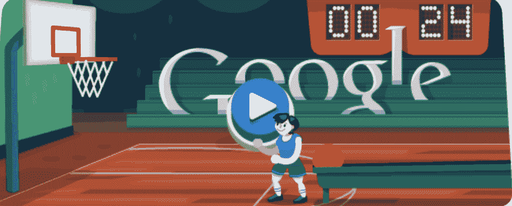

#### 2020 年东京奥运会

为了庆祝 2020 年东京奥运会，谷歌发布了迄今为止最雄心勃勃、最精致、最复杂的游戏——一款名为涂鸦冠军岛游戏的全动漫体育游戏。

这是对复古 16 位日本视频游戏的致敬，有 7 个迷你奥运会体育赛事主题可供选择(包括乒乓球、滑板和艺术游泳等)。这是谷歌发布的最大的游戏。

你扮演一只名叫幸运的印花布忍者战士猫，它来到了正在举行节日的岛上。你可以从四支队伍中选择一支——蓝队、红队、黄队或绿队——由宇治队、卡拉苏队、伊那里队或卡帕队代表。

玩游戏时，使用箭头键和空格键，并通过庆祝日本的历史，文化和体育运动来表达敬意。它是与日本动画工作室 4 C.
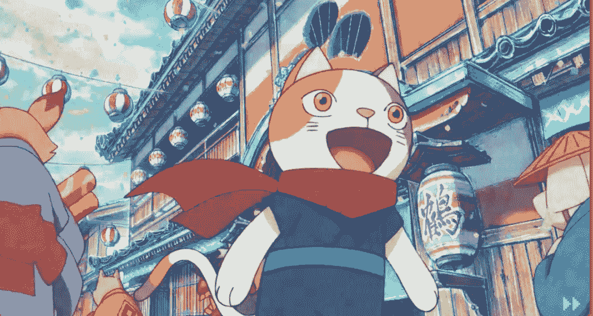合作制作的

### 音乐爱好者的涂鸦游戏

#### 庆祝奥斯卡·费钦格

[Fischinger](https://www.google.com/doodles/oskar-fischingers-117th-birthday) 于 2017 年 6 月 17 日诞生，以庆祝奥斯卡·费钦格的 117 岁生日。

为了向这位电影制作人和视觉艺术家致敬，谷歌发布了一个带有视觉音乐创作工具的互动设计，让用户点击并创建自己的视觉音乐作品，您可以更改各种设置。
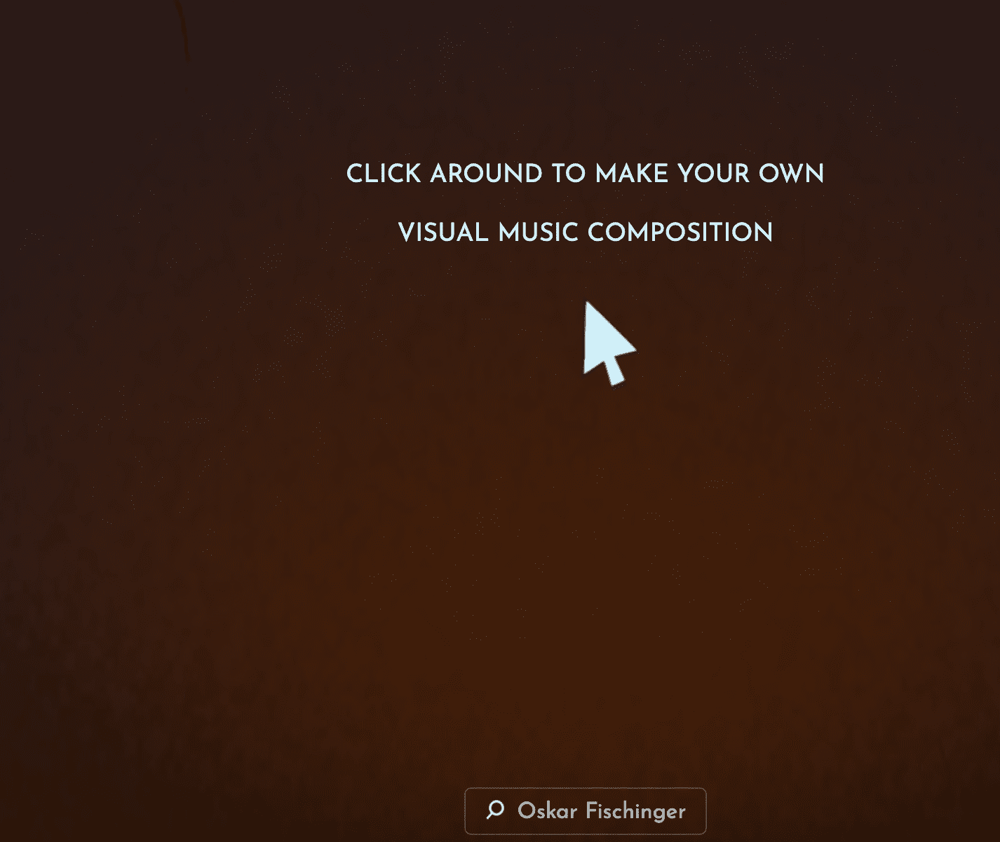

#### 庆祝嘻哈音乐的诞生

[Hip Hop](https://www.google.com/doodles/44th-anniversary-of-the-birth-of-hip-hop) 发布于 2017 年 8 月 11 日，纪念 Hip Hop 诞生 44 周年。

使用 crossfader，您可以将传奇的节拍混合在一起，更改播放速度的音量和强度，以及选择曲目。经典的 DJ 互动转盘将让你剪切和刮擦曲目，重温嘻哈历史。

涂鸦是由艺术家塞·亚当斯创作的，由嘻哈偶像 Fab Five Freddy 解说。它向嘻哈音乐的两位创始人酷海格和可乐·拉·洛克致敬。
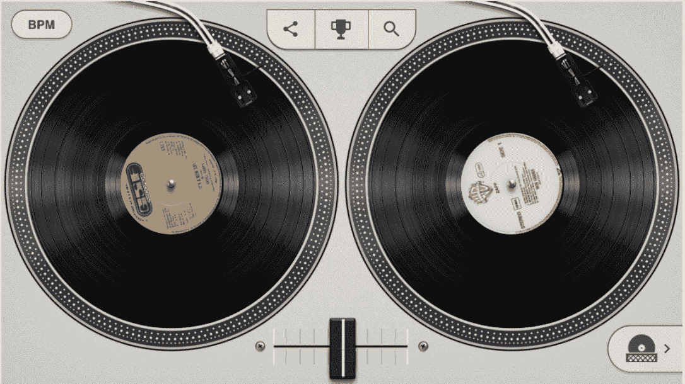

#### 洛克摩

[洛克莫尔](https://www.google.com/doodles/clara-rockmores-105th-birthday)模拟特雷门琴的体验。这是一种没有身体接触的电子乐器——仅通过手势控制。

该游戏庆祝 2016 年 3 月 9 日 Clara Rockmore 的 105 岁生日，他是该乐器的发明者和最知名的表演者。

它可以让你创作音乐，尝试不同的设置，复制不同的音符。将光标或鼠标移到屏幕上的音符上，使用虚拟特雷门琴创作音乐。
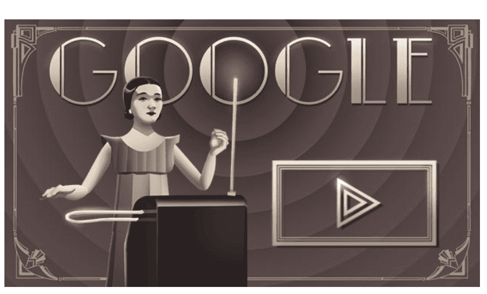

### 创意涂鸦游戏

#### 快速绘制

[快画！](https://quickdraw.withgoogle.com/)是一款有自己网站的游戏。屏幕上会给你一个指示，告诉你要画什么，并给你 20 秒的时间来画。谷歌的神经网络然后进行猜测，并告诉你你的画像什么。

该游戏采用机器学习构建，是最受欢迎的涂鸦游戏之一。
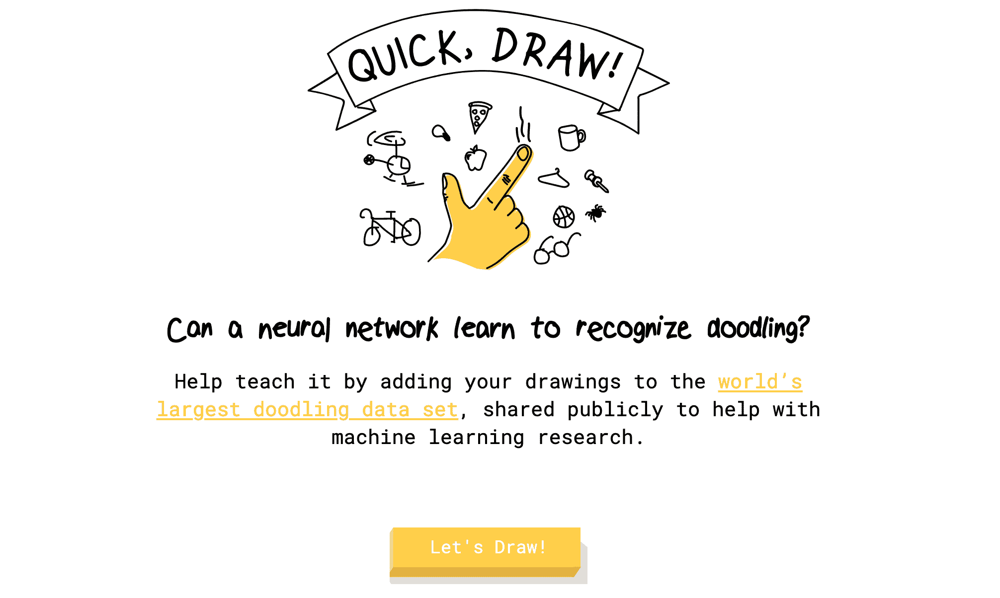

### 科幻爱好者的涂鸦游戏

#### 神秘博士

2013 年 11 月 23 日发布的[神秘博士](https://www.google.com/doodles/doctor-whos-50th-anniversary)涂鸦游戏是为了纪念经典而受欢迎的英国电视节目《神秘博士》50 周年而创作的。

这是一个简单但令人印象深刻的冒险益智游戏，以当时的 13 位医生为特色。

目标是通过游戏的 6 个关卡，取回达雷克斯从医生那里偷走的所有 6 个字母。

### 涂鸦食物小游戏

[斯科维尔](https://www.google.com/doodles/wilbur-scovilles-151st-birthday)于 2016 年 1 月 22 日发布，庆祝威尔伯·斯科维尔 151 岁生日。

斯科维尔标度是一种测量辣椒辣度的系统。在这个游戏中，你是一个冰淇淋，通过向辣椒投掷勺子来对抗辣椒。辣椒每次都变得越来越辣。
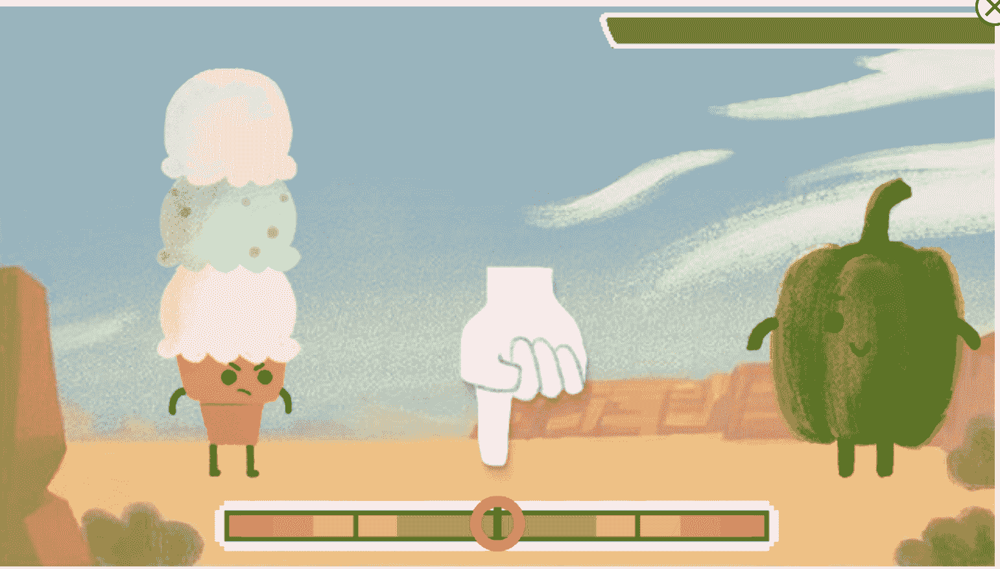

### 给喜欢万圣节的人的涂鸦游戏

#### 魔法猫学院

魔法猫学院 2016 年庆祝万圣节，一只名叫 Momo 的猫想要在魔法猫学院恢复和平，她是一名学生，所以她可以拯救学校。

这个游戏的灵感来自于一只黑猫，它属于设计这个游戏的涂鸦者陈智玲。

Momo 在她的学校里必须通过 5 关——图书馆、自助餐厅、教室、健身房和楼顶。一路上，她不得不挥动魔杖来追踪出现的鬼魂头上的符号！这样，莫莫可以施法，并且不会被潜伏的鬼魂夺走她的魔法书。

使用你的键盘在鬼魂的头上滑动，把他们变成稀薄的空气。
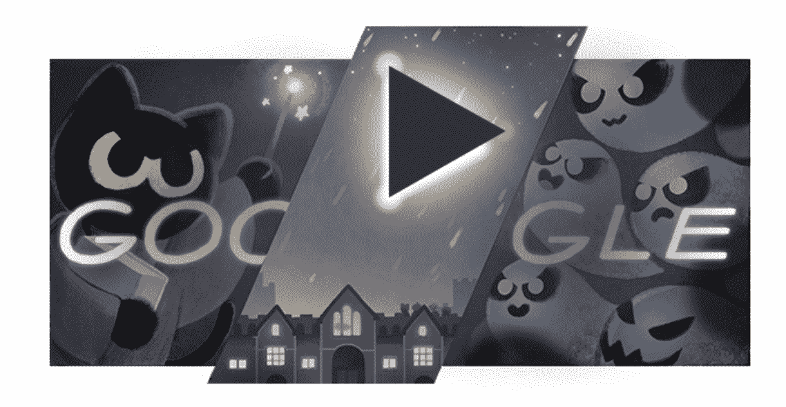

### 为喜欢纸牌游戏的人设计的涂鸦游戏

#### 洛特里亚

[Loteria](https://www.google.com/doodles/celebrating-loteria) 是一种传统的墨西哥纸牌游戏。你可以和你的朋友或世界各地的人开始一场比赛。

它于 2019 年 12 月 9 日发布，以虚拟版本庆祝这款传统游戏。如果你以前从未玩过 Lotería，在你的第一轮试玩之前会有一个教程。

## 结论

我希望你喜欢这篇关于谷歌最受欢迎的涂鸦游戏的文章。

在专用的[存档页面](https://www.google.com/doodles?q=interactive)上还有更多，所以去看看你感兴趣的吧。

感谢阅读！

版权:所有图片属于谷歌