# 如何使用 React、React 钩子和 Axios 执行 CRUD 操作

> 原文：<https://www.freecodecamp.org/news/how-to-perform-crud-operations-using-react/>

如果您正在使用 React，理解和实现 API 请求可能会非常困难。

因此在本文中，我们将通过使用 React、React Hooks、React Router 和 Axios 实现 CRUD 操作来了解它是如何工作的。

让我们开始吧。

## **如何安装节点和 npm**

首先，让我们在系统中安装节点。我们将主要使用它来执行我们的 JavaScript 代码。

要下载节点，请转到[https://nodejs.org/en/](https://nodejs.org/en/)。

您还需要**节点包管理器**，或 npm，它构建在 node 上。您可以使用它来为您的 JavaScript 应用程序安装软件包。好在它自带 Node，所以不需要单独下载。

一旦这两个都完成了，打开你的终端或命令提示符并输入`node -v`。这将检查您拥有的节点版本。

## **如何创建您的 React 应用程序**

要创建 React 应用程序，请在终端中键入 ****`npx create-react-app <Your app name>`**** ，或者在本例中键入 **`**npx create-react-app**react-crud`** 。

您将看到软件包正在安装。

包完成后，进入项目文件夹，输入 ****`npm start`**** 。

您将看到默认的 React 模板，如下所示:

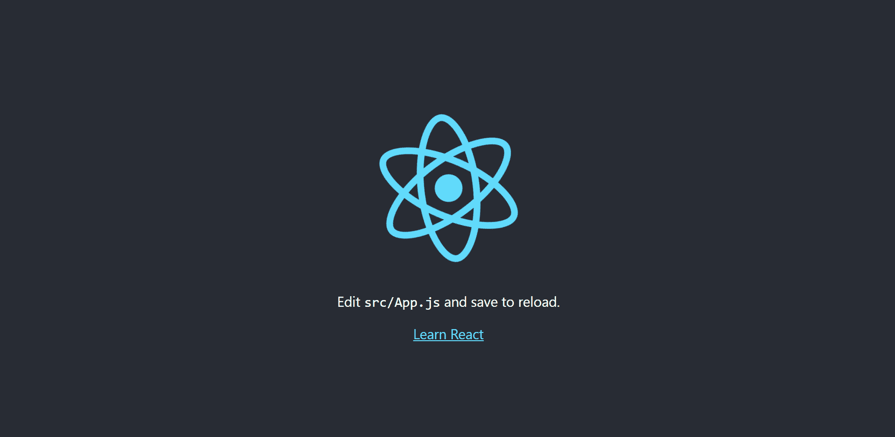

The default React Boilerplate Template

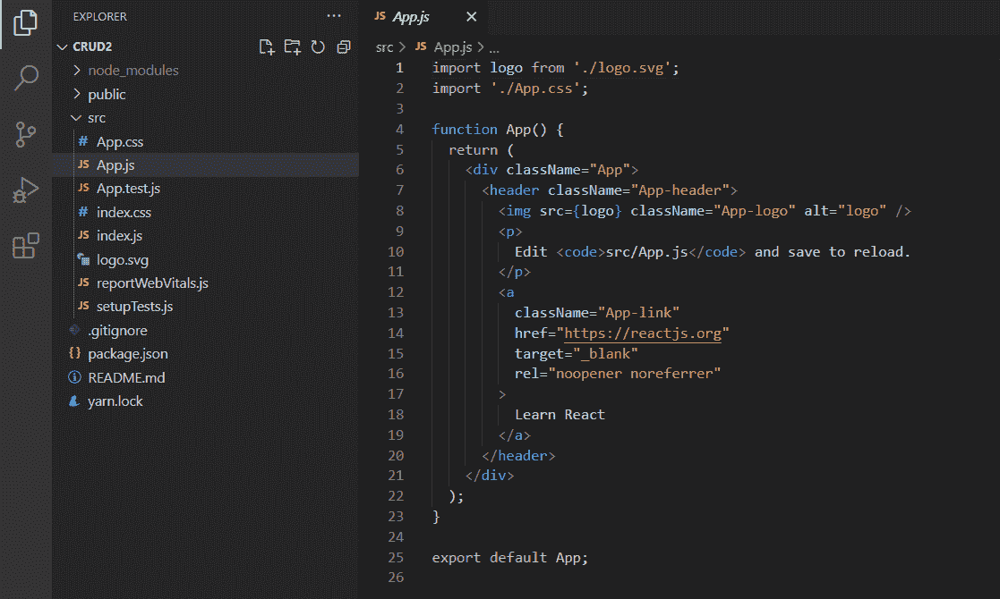

Our App.js file

## **如何安装 React 的语义 UI 包**

让我们在项目中安装语义 UI React 包。语义 UI 是一个为 React 开发的 UI 库，它有预构建的 UI 组件，如表格、按钮和许多特性。

您可以使用下面的命令之一来安装它，这取决于您的软件包管理器。

```
yarn add semantic-ui-react semantic-ui-css
```

For Yarn Package Manager

```
npm install semantic-ui-react semantic-ui-css
```

For NPM package Manager

此外，将库导入到应用程序的主入口文件 index.js 中。

```
import 'semantic-ui-css/semantic.min.css'
```

Paste this in your index.js file

## **如何构建您的 CRUD 应用程序**

现在，让我们开始使用 React 构建 CRUD 应用程序。

首先，我们将在应用程序中添加一个标题。

在我们的 app.js 文件中，添加一个标题，如下所示:

```
import './App.css';

function App() {
  return (
    <div>
      React Crud Operations
    </div>
  );
}

export default App; 
```

Adding a heading to our application

现在，让我们确保它在中心。

给父 div 一个 main 类名。在 App.css 文件中，我们将使用 Flexbox 使标题居中。

```
import './App.css';

function App() {
  return (
    <div className="main">
      React Crud Operations
    </div>
  );
}

export default App; 
```

app.js with className of main in the parent div

```
.main{
  display: flex;
  justify-content: center;
  align-items: center;
  height: 100vh;
}
```

Our app.css file

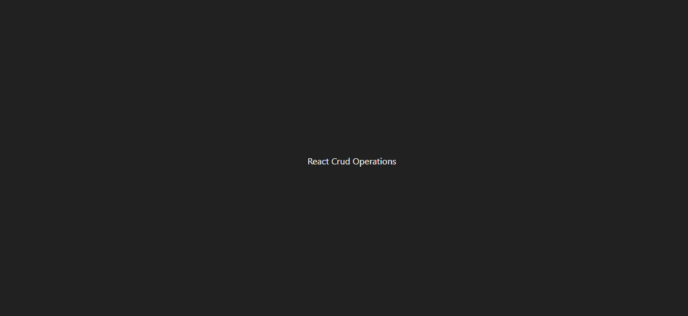

现在我们的航向完全居中。

所以它看起来更好一点，我们需要让它更大胆，并添加一些很酷的字体。为此，我们将在标题周围使用标题标签，如下所示:

```
import './App.css';

function App() {
  return (
    <div className="main">
      <h2 className="main-header">React Crud Operations</h2>
    </div>
  );
}

export default App; 
```

让我们从谷歌字体导入一个字体。前往[https://fonts.google.com/](https://fonts.google.com/)挑选一个。

选择你喜欢的任何字体，但我会使用蒙特塞拉特字体家族。

在 App.css 文件中导入您选择的字体，如下所示:

```
@import url('https://fonts.googleapis.com/css2?family=Montserrat&display=swap'); 
```

现在，让我们改变标题的字体。

```
<div className="main">
      <h2 className="main-header">React Crud Operations</h2>
    </div>
```

给标题标签一个`main-header`的`className`，就这样。

然后，在 App.css 中添加字体系列:

```
.main-header{
  font-family: 'Montserrat', sans-serif;
}
```

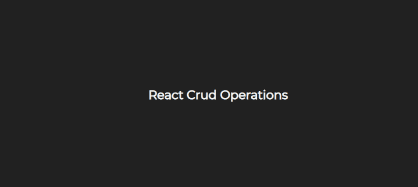

现在，您将看到更改后的标题。

## 如何创建你的 CRUD 组件

让我们创建四个 CRUD 组件，它们是创建、读取、更新和删除。

在我们的 src 文件夹中，创建一个名为 components 的文件夹。在这个文件夹中，创建三个文件——创建、读取和更新。对于删除，我们不需要任何额外的组件。

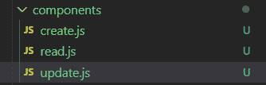

现在，让我们实现创建操作。

但是为此，我们需要使用模拟 API。这些 API 会将数据发送到我们将创建的假服务器，这只是为了学习。

所以，去[https://mockapi.io/](https://mockapi.io/)创建你的账户吧。

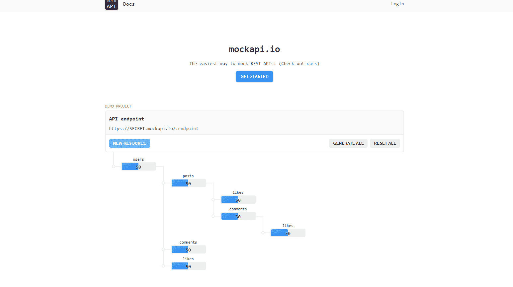

MockAPI

单击加号按钮创建一个项目。

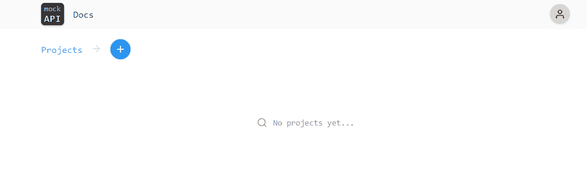

Click the plus button to create a new project

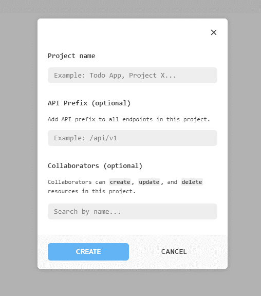

添加您的项目名称，然后单击“创建”按钮。

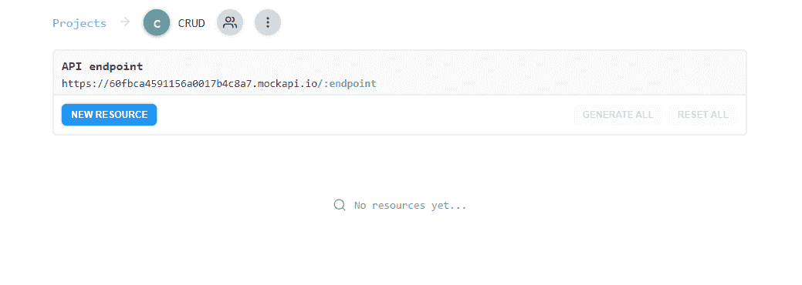

现在，通过单击 new resource 按钮创建一个新资源。

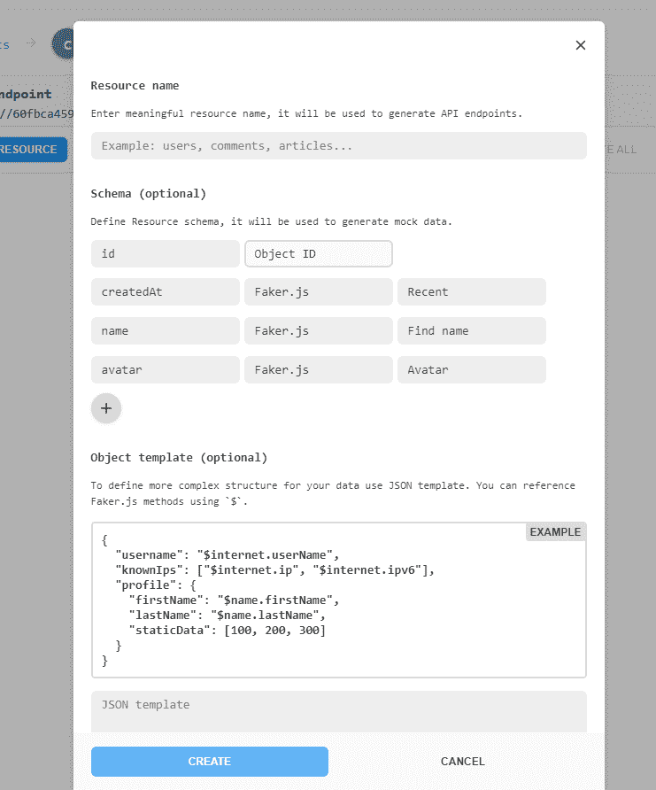

它会要求您输入资源名称，所以请输入您想要使用的名称。

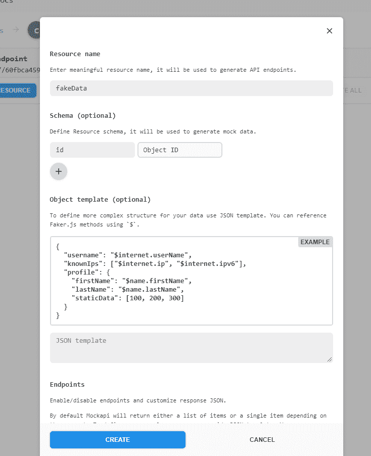

删除额外的字段，如姓名、头像或创建日期，因为我们不需要这些。然后，单击创建。

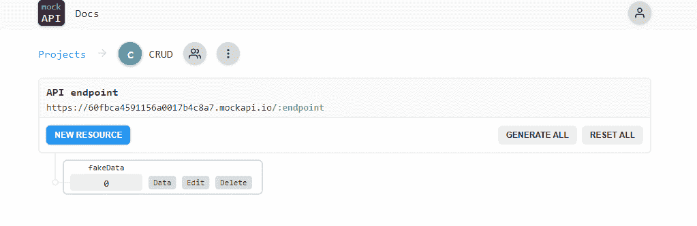

现在，我们已经创建了我们的假 API，我将其命名为 fakeData。

单击 fakeData，您将看到 API 在一个新的选项卡中打开。数据库现在是空的。

## 如何为创建组件创建表单

让我们使用语义 UI 库中的一个表单。

前往 Semantic React，在左边的搜索栏中搜索 Form。


你会看到一个这样的表单，所以点击右上角的“尝试”来获取代码。

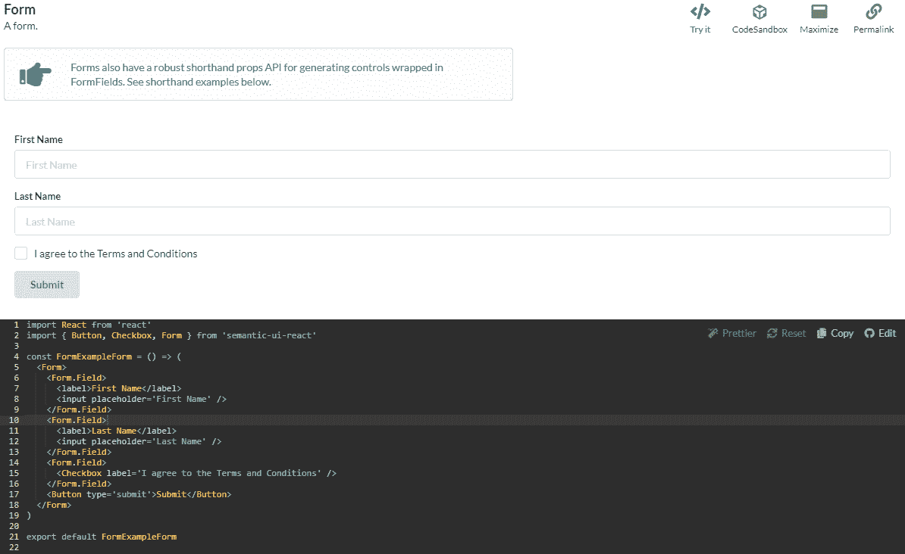

复制这段代码并将其粘贴到 Create.js 文件中，如下所示:

```
import React from 'react'
import { Button, Checkbox, Form } from 'semantic-ui-react'

const Create = () => (
    <Form>
        <Form.Field>
            <label>First Name</label>
            <input placeholder='First Name' />
        </Form.Field>
        <Form.Field>
            <label>Last Name</label>
            <input placeholder='Last Name' />
        </Form.Field>
        <Form.Field>
            <Checkbox label='I agree to the Terms and Conditions' />
        </Form.Field>
        <Button type='submit'>Submit</Button>
    </Form>
)

export default Create;
```

在 app.js 文件中导入 Create 组件。

```
import './App.css';
import Create from './components/create';

function App() {
  return (
    <div className="main">
      <h2 className="main-header">React Crud Operations</h2>
      <div>
        <Create/>
      </div>
    </div>
  );
}

export default App; 
```

就像这样:

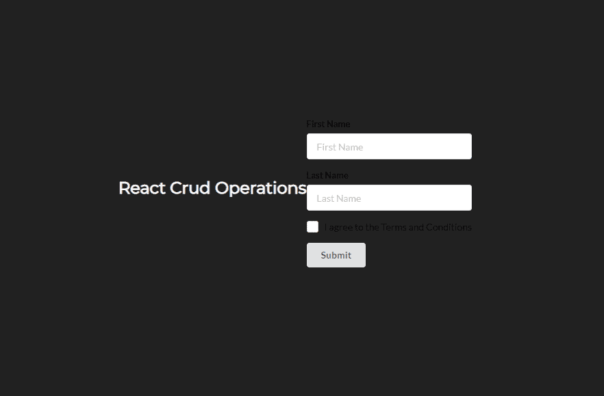

但是这里有一个问题——项目没有正确对齐，文本输入标签颜色是黑色的。所以，我们换一个吧。

在 create.js 文件中，给**表单**一个类名`create-form`。

```
import React from 'react'
import { Button, Checkbox, Form } from 'semantic-ui-react'

const Create = () => (
    <Form className="create-form">
        <Form.Field>
            <label>First Name</label>
            <input placeholder='First Name' />
        </Form.Field>
        <Form.Field>
            <label>Last Name</label>
            <input placeholder='Last Name' />
        </Form.Field>
        <Form.Field>
            <Checkbox label='I agree to the Terms and Conditions' />
        </Form.Field>
        <Button type='submit'>Submit</Button>
    </Form>
)

export default Create;
```

app.js

并将以下类添加到 App.css 文件中:

```
.create-form label{
  color: whitesmoke !important;
  font-family: 'Montserrat', sans-serif;
  font-size: 12px !important;
}
```

App.css

这个类将针对所有的表单字段标签并应用白色烟雾。它还会改变字体并增加字体大小。

现在，在我们的`main`类中，添加一个 flex-direction 属性。该属性将方向设置为 column，因此主`className`中的每个元素将垂直对齐。

```
.main{
  display: flex;
  justify-content: center;
  align-items: center;
  height: 100vh;
  background-color: #212121;
  color: whitesmoke;
  flex-direction: column;
}
```

App.css

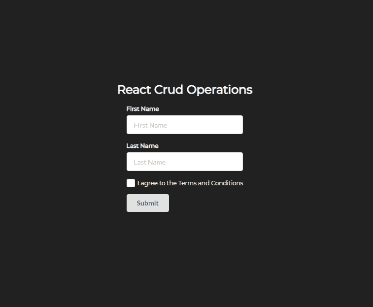

你可以看到我们的形式现在看起来好多了。

接下来，让我们将表单字段中的数据放入控制台。为此，我们将在 React 中使用`useState`钩子。

在我们的 create.js 文件中，从 React 导入`useState`。

```
import React, { useState } from 'react';
```

然后，为名字、姓氏和复选框创建状态。我们将状态初始化为空或假。

```
import React, { useState } from 'react';
import { Button, Checkbox, Form } from 'semantic-ui-react'

export default function Create() {
    const [firstName, setFirstName] = useState('');
    const [lastName, setLastName] = useState('');
    const [checkbox, setCheckbox] = useState(false);
    return (
        <div>
            <Form className="create-form">
                <Form.Field>
                    <label>First Name</label>
                    <input placeholder='First Name' />
                </Form.Field>
                <Form.Field>
                    <label>Last Name</label>
                    <input placeholder='Last Name' />
                </Form.Field>
                <Form.Field>
                    <Checkbox label='I agree to the Terms and Conditions' />
                </Form.Field>
                <Button type='submit'>Submit</Button>
            </Form>
        </div>
    )
} 
```

你可以看到这是一个功能组件。所以，我们需要把组件改成功能组件。这是因为我们只能在功能组件中使用钩子。

现在，让我们分别使用`setFirstName`、`setLastName`和`setCheckbox`属性来设置名字、姓氏和复选框。

```
<input placeholder='First Name' onChange={(e) => setFirstName(e.target.value)}/>

<input placeholder='Last Name' onChange={(e) => setLastName(e.target.value)}/>

<Checkbox label='I agree to the Terms and Conditions' onChange={(e) => setCheckbox(!checkbox)}/>
```

我们正在捕获名、姓和复选框的状态。

创建一个名为`postData`的函数，我们将使用它向 API 发送数据。在函数内部，编写以下代码:

```
const postData = () => {
        console.log(firstName);
        console.log(lastName);
        console.log(checkbox);
}
```

我们在控制台中记录名字、姓氏和复选框值。

在 Submit 按钮上，使用 onClick 事件分配这个函数，这样每当我们按 Submit 按钮时，这个函数都会被调用。

```
<Button onClick={postData} type='submit'>Submit</Button>
```

以下是*创建*文件的完整代码:

```
import React, { useState } from 'react';
import { Button, Checkbox, Form } from 'semantic-ui-react'

export default function Create() {
    const [firstName, setFirstName] = useState('');
    const [lastName, setLastName] = useState('');
    const [checkbox, setCheckbox] = useState(false);
    const postData = () => {
        console.log(firstName);
        console.log(lastName);
        console.log(checkbox);
    }
    return (
        <div>
            <Form className="create-form">
                <Form.Field>
                    <label>First Name</label>
                    <input placeholder='First Name' onChange={(e) => setFirstName(e.target.value)}/>
                </Form.Field>
                <Form.Field>
                    <label>Last Name</label>
                    <input placeholder='Last Name' onChange={(e) => setLastName(e.target.value)}/>
                </Form.Field>
                <Form.Field>
                    <Checkbox label='I agree to the Terms and Conditions' onChange={(e) => setCheckbox(!checkbox)}/>
                </Form.Field>
                <Button onClick={postData} type='submit'>Submit</Button>
            </Form>
        </div>
    )
} 
```

在名字和姓氏中键入一些值，然后选中复选框。然后，单击提交按钮。您将看到控制台中弹出的数据，如下所示:

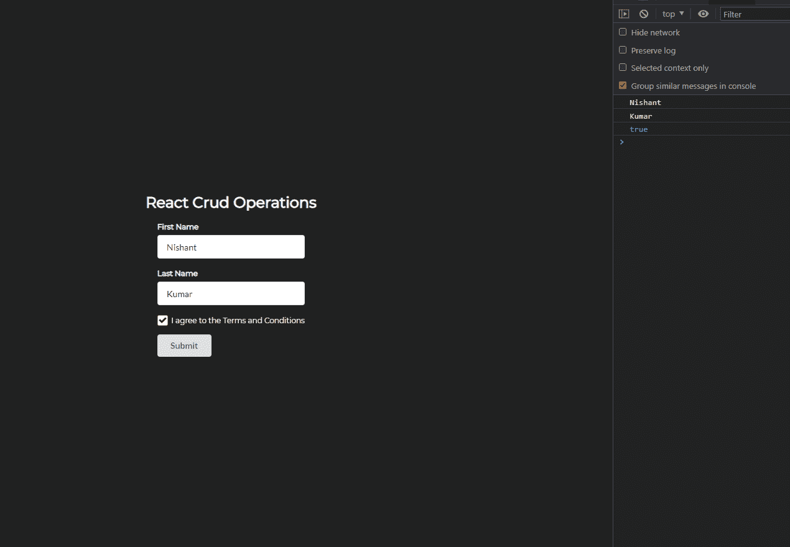

## 如何使用 Axios 向模拟 API 发送 API 请求

让我们使用 Axios 将表单数据发送到模拟服务器。

但首先，我们需要安装它。

只需输入`npm i axios`来安装这个软件包。

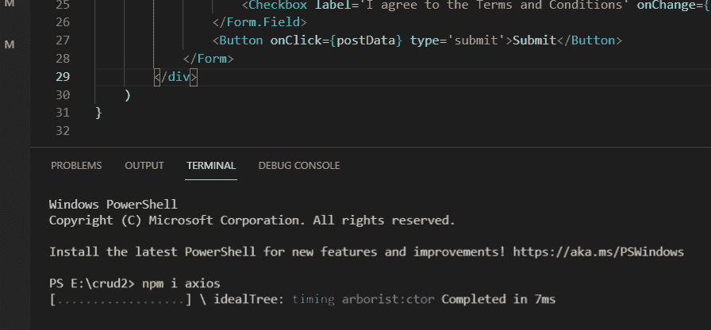

安装完软件包后，让我们开始创建操作。

在文件顶部导入 Axios。

```
import axios from 'axios';
```

Importing Axios

在`postData`函数中，我们将使用 Axios 发送 POST 请求。

```
const postData = () => {
        axios.post(`https://60fbca4591156a0017b4c8a7.mockapi.io/fakeData`, {
            firstName,
            lastName,
            checkbox
        })
    }
```

Sending Post Request

如您所见，我们使用的是 axios.post。在 axios.post 中，我们有我们之前创建的 API 端点。然后，我们将表单字段放在花括号中。

当我们单击 Submit 时，这个函数将被调用，它将把数据发送到 API 服务器。

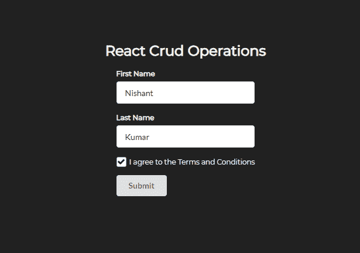

输入您的名字和姓氏，然后选中复选框。单击提交。

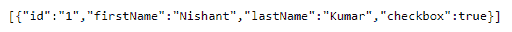

然后，如果您检查 API，您将获得您的名字、姓氏和复选框为真，包装在一个对象中。

## 如何实现读取和更新操作

要开始读操作，我们需要创建一个读页面。我们还需要 React 路由器包来导航到不同的页面。

转到[https://reactrouter.com/web/guides/quick-start](https://reactrouter.com/web/guides/quick-start)并使用`npm i react-router-dom`安装软件包。

安装完成后，从 React 路由器导入一些东西:

```
import { BrowserRouter as Router, Route } from 'react-router-dom'
```

Importing Router and Route from React Router

在我们的 App.js 中，将整个返回包到路由器中。这基本上意味着该路由器内部的任何东西都能够在 React 中使用路由。

```
import './App.css';
import Create from './components/create';
import { BrowserRouter as Router, Route } from 'react-router-dom'

function App() {
  return (
    <Router>
      <div className="main">
        <h2 className="main-header">React Crud Operations</h2>
        <div>
          <Create />
        </div>
      </div>
    </Router>
  );
}

export default App; 
```

我们的 App.js 现在看起来会像上面这样。

替换 return 中的 Create，并添加以下代码:

```
import './App.css';
import Create from './components/create';
import { BrowserRouter as Router, Route } from 'react-router-dom'

function App() {
  return (
    <Router>
      <div className="main">
        <h2 className="main-header">React Crud Operations</h2>
        <div>
          <Route exact path='/create' component={Create} />
        </div>
      </div>
    </Router>
  );
}

export default App; 
```

这里，我们使用 Route 组件作为 Create。我们已经将创建的路径设置为“/create”。因此，如果我们进入[http://localhost:3000/create](http://localhost:3000/create)，我们将看到创建页面。

类似地，我们需要读取和更新的路径。

```
import './App.css';
import Create from './components/create';
import Read from './components/read';
import Update from './components/update';
import { BrowserRouter as Router, Route } from 'react-router-dom'

function App() {
  return (
    <Router>
      <div className="main">
        <h2 className="main-header">React Crud Operations</h2>
        <div>
          <Route exact path='/create' component={Create} />
        </div>
        <div style={{ marginTop: 20 }}>
          <Route exact path='/read' component={Read} />
        </div>

        <Route path='/update' component={Update} />
      </div>
    </Router>
  );
}

export default App; 
```

因此，就像上面看到的那样，创建读取和更新路由。

如果你去[http://localhost:3000/read](http://localhost:3000/read)，你会看到以下内容:

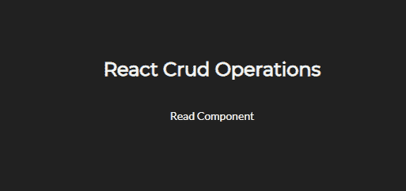

Read Route

而在[http://localhost:3000/Update](http://localhost:3000/update)上，我们会看到这样的更新组件:

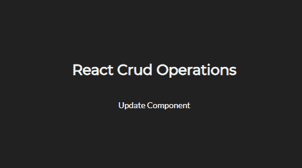

### 读取操作

对于读操作，我们需要一个表组件。因此，请使用 React 语义用户界面并使用库中的表格。

```
import React from 'react';
import { Table } from 'semantic-ui-react'
export default function Read() {
    return (
        <div>
            <Table singleLine>
                <Table.Header>
                    <Table.Row>
                        <Table.HeaderCell>Name</Table.HeaderCell>
                        <Table.HeaderCell>Registration Date</Table.HeaderCell>
                        <Table.HeaderCell>E-mail address</Table.HeaderCell>
                        <Table.HeaderCell>Premium Plan</Table.HeaderCell>
                    </Table.Row>
                </Table.Header>

                <Table.Body>
                    <Table.Row>
                        <Table.Cell>John Lilki</Table.Cell>
                        <Table.Cell>September 14, 2013</Table.Cell>
                        <Table.Cell>jhlilk22@yahoo.com</Table.Cell>
                        <Table.Cell>No</Table.Cell>
                    </Table.Row>
                    <Table.Row>
                        <Table.Cell>Jamie Harington</Table.Cell>
                        <Table.Cell>January 11, 2014</Table.Cell>
                        <Table.Cell>jamieharingonton@yahoo.com</Table.Cell>
                        <Table.Cell>Yes</Table.Cell>
                    </Table.Row>
                    <Table.Row>
                        <Table.Cell>Jill Lewis</Table.Cell>
                        <Table.Cell>May 11, 2014</Table.Cell>
                        <Table.Cell>jilsewris22@yahoo.com</Table.Cell>
                        <Table.Cell>Yes</Table.Cell>
                    </Table.Row>
                </Table.Body>
            </Table>
        </div>
    )
} 
```

Read.js

在这里，您可以看到我们有一个包含一些虚拟数据的表格。但是我们只需要一行表格。所以，我们把剩下的去掉吧。

```
import React from 'react';
import { Table } from 'semantic-ui-react'
export default function Read() {
    return (
        <div>
            <Table singleLine>
                <Table.Header>
                    <Table.Row>
                        <Table.HeaderCell>Name</Table.HeaderCell>
                        <Table.HeaderCell>Registration Date</Table.HeaderCell>
                        <Table.HeaderCell>E-mail address</Table.HeaderCell>
                        <Table.HeaderCell>Premium Plan</Table.HeaderCell>
                    </Table.Row>
                </Table.Header>

                <Table.Body>
                    <Table.Row>
                        <Table.Cell>John Lilki</Table.Cell>
                        <Table.Cell>September 14, 2013</Table.Cell>
                        <Table.Cell>jhlilk22@yahoo.com</Table.Cell>
                        <Table.Cell>No</Table.Cell>
                    </Table.Row>
                </Table.Body>
            </Table>
        </div>
    )
} 
```

Read.js

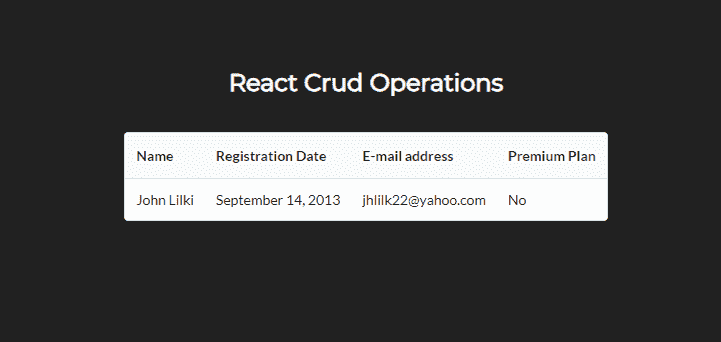

这是所读页面的输出。我们有一个有四列的表，但我们只需要三列。

删除多余的字段列，并按如下方式重命名字段:

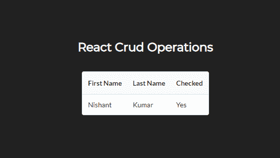

这是我们的阅读页面现在的样子:

```
import React from 'react';
import { Table } from 'semantic-ui-react'
export default function Read() {
    return (
        <div>
            <Table singleLine>
                <Table.Header>
                    <Table.Row>
                        <Table.HeaderCell>First Name</Table.HeaderCell>
                        <Table.HeaderCell>Last Name</Table.HeaderCell>
                        <Table.HeaderCell>Checked</Table.HeaderCell>
                    </Table.Row>
                </Table.Header>

                <Table.Body>
                    <Table.Row>
                        <Table.Cell>Nishant</Table.Cell>
                        <Table.Cell>Kumar</Table.Cell>
                        <Table.Cell>Yes</Table.Cell>
                    </Table.Row>
                </Table.Body>
            </Table>
        </div>
    )
} 
```

Read.js

现在，让我们发送 GET 请求从 API 获取数据。

当应用程序加载时，我们需要这些数据。因此，我们将使用`useEffect`钩子。

```
import React, { useEffect } from 'react';

 useEffect(() => {

 }, [])
```

The useEffect Hook

创建一个包含传入数据的状态。这将是一个数组。

```
import React, { useEffect, useState } from 'react';

const [APIData, setAPIData] = useState([]);
useEffect(() => {

}, [])
```

APIData state to store API incoming data

在`useEffect`钩子中，让我们发送 GET 请求。

```
 useEffect(() => {
        axios.get(`https://60fbca4591156a0017b4c8a7.mockapi.io/fakeData`)
            .then((response) => {
                setAPIData(response.data);
            })
    }, [])
```

因此，我们使用 axios.get 向 API 发送 get 请求。然后，如果请求被满足，我们就在我们的 *APIData* 状态中设置响应数据。

现在，让我们根据 API 数据映射我们的表行。

我们将使用地图功能来做到这一点。它将遍历数组并在输出中显示数据。

```
<Table.Body>
  {APIData.map((data) => {
     return (
       <Table.Row>
          <Table.Cell>{data.firstName}</Table.Cell>
           <Table.Cell>{data.lastName}</Table.Cell>
           <Table.Cell>{data.checkbox ? 'Checked' : 'Unchecked'}</Table.Cell>
        </Table.Row>
   )})}
</Table.Body>
```

我们根据 API 中的数据映射我们的名字、姓氏和复选框。但是我们的复选框有点不同。我使用了三元运算符('？'))这里。如果 data.checkbox 为真，则检查输出，否则不检查输出。

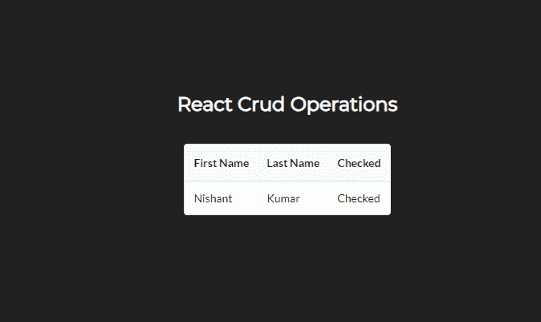

Read.js Output

### 更新操作

为 update 再创建一个标题，并在表行中为 Update 按钮创建一个列。使用语义 UI 中的按钮 React。

```
<Table.HeaderCell>Update</Table.HeaderCell>

<Table.Cell> 
  <Button>Update</Button>
</Table.Cell>
```

Creating Update Button

现在，当我们单击这个按钮时，我们应该被重定向到更新页面。为此，我们需要来自 React 路由器的链接。

从 React 路由器导入链接。并将更新按钮的表格单元格包装到链接标签中。

```
import { Link } from 'react-router-dom';

<Link to='/update'>
  <Table.Cell> 
     <Button>Update</Button>
   </Table.Cell>
</Link>
```

Link for Update Button

因此，如果我们单击更新按钮，我们将被重定向到更新页面。

为了更新列数据，我们需要它们各自的 ID，这些 ID 来自 API。

创建一个名为`setData`的函数。将其绑定到更新按钮。

```
 <Button onClick={() => setData()}>Update</Button>
```

现在，我们需要将数据作为参数传递给 top 函数。

```
 <Button onClick={() => setData(data)}>Update</Button>
```

在顶部的函数中，将这些数据记录在控制台中:

```
const setData = (data) => {
   console.log(data);
}
```

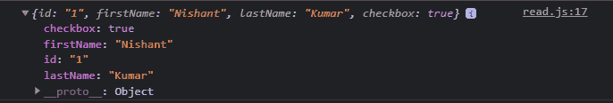

Data in the console

单击表格中的更新按钮，并检查控制台。您将获得相应表字段的数据。

让我们将这些数据设置到本地存储中。

```
const setData = (data) => {
        let { id, firstName, lastName, checkbox } = data;
        localStorage.setItem('ID', id);
        localStorage.setItem('First Name', firstName);
        localStorage.setItem('Last Name', lastName);
        localStorage.setItem('Checkbox Value', checkbox)
}
```

Setting data in the Local Storage

我们将数据分解为 id、firstName、lastName 和 checkbox，然后将这些数据设置到本地存储中。您可以使用本地存储在浏览器中本地存储数据。

现在，在更新组件中，我们需要一个用于更新操作的表单。让我们重用 Create 组件中的表单。只需将函数的名称从 Create 改为 Update。

```
import React, { useState } from 'react';
import { Button, Checkbox, Form } from 'semantic-ui-react'
import axios from 'axios';

export default function Update() {
    const [firstName, setFirstName] = useState('');
    const [lastName, setLastName] = useState('');
    const [checkbox, setCheckbox] = useState(false);

    return (
        <div>
            <Form className="create-form">
                <Form.Field>
                    <label>First Name</label>
                    <input placeholder='First Name' onChange={(e) => setFirstName(e.target.value)}/>
                </Form.Field>
                <Form.Field>
                    <label>Last Name</label>
                    <input placeholder='Last Name' onChange={(e) => setLastName(e.target.value)}/>
                </Form.Field>
                <Form.Field>
                    <Checkbox label='I agree to the Terms and Conditions' onChange={(e) => setCheckbox(!checkbox)}/>
                </Form.Field>
                <Button type='submit'>Update</Button>
            </Form>
        </div>
    )
} 
```

Our update Page

在更新组件中创建一个`useEffect`钩子。我们将使用它来获取以前存储在本地存储中的数据。此外，为 ID 字段再创建一个状态。

```
const [id, setID] = useState(null);

useEffect(() => {
        setID(localStorage.getItem('ID'))
        setFirstName(localStorage.getItem('First Name'));
        setLastName(localStorage.getItem('Last Name'));
        setCheckbox(localStorage.getItem('Checkbox Value'))
}, []);
```

根据本地存储器中的密钥设置相应的数据。我们需要在表单字段中设置这些值。当更新页面加载时，它将自动填充字段。

```
<Form className="create-form">
                <Form.Field>
                    <label>First Name</label>
                    <input placeholder='First Name' value={firstName} onChange={(e) => setFirstName(e.target.value)}/>
                </Form.Field>
                <Form.Field>
                    <label>Last Name</label>
                    <input placeholder='Last Name' value={lastName} onChange={(e) => setLastName(e.target.value)}/>
                </Form.Field>
                <Form.Field>
                    <Checkbox label='I agree to the Terms and Conditions' checked={checkbox} onChange={(e) => setCheckbox(!checkbox)}/>
                </Form.Field>
                <Button type='submit'>Update</Button>
            </Form>
```

Setting the values in Form fields

现在，如果我们单击阅读页面中的更新按钮，我们将被重定向到更新页面，在那里我们将看到所有自动填充的表单数据。

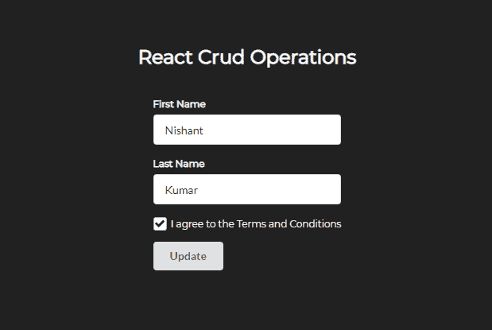

Update Page

现在，让我们创建更新请求来更新数据。

创建一个名为`updateAPIData`的函数。在这个函数中，我们将使用 axios.put 来发送一个更新数据的 put 请求。

```
const updateAPIData = () => {
    axios.put(`https://60fbca4591156a0017b4c8a7.mockapi.io/fakeData/${id}`, {
        firstName,
         lastName,
         checkbox
	})
}
```

在这里，您可以看到我们在 API 端点上附加了一个 id 字段。

当我们单击表中的字段时，它的 ID 被存储到本地存储中。在更新页面中，我们正在检索它。然后，我们将该 ID 存储在 *`id`* 状态中。

之后，我们将 id 传递给端点。这允许我们更新我们正在传递 ID 的字段。

将`updateAPIData`函数绑定到更新按钮。

```
<Button type='submit' onClick={updateAPIData}>Update</Button>
```

Binding the updateAPIData to Update Button

单击“阅读”页面表格中的“更新”按钮，更改您的姓氏，然后单击“更新”页面中的“更新”按钮。

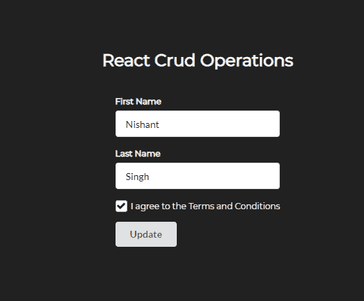

Updating the fields

返回阅读页面，或检查 API。您将看到您的姓氏已被更改。

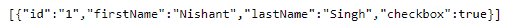

The Mock API

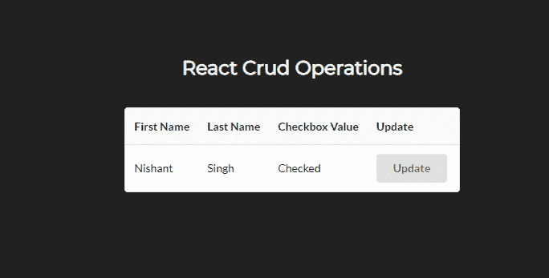

Our Read Table

### 删除操作

在 Read 表中再添加一个按钮，我们将用它来执行删除操作。

```
<Table.Cell>
   <Button onClick={() => onDelete(data.id)}>Delete</Button>
</Table.Cell>
```

Delete Button in Read Table

创建一个名为`onDelete`的函数，并将这个函数绑定到删除按钮。该函数将在单击删除按钮时接收一个 ID 参数。

```
const onDelete = (id) => {

}
```

The Delete Function

我们将使用 axios.delete 删除相应的列。

```
const onDelete = (id) => {
  axios.delete(`https://60fbca4591156a0017b4c8a7.mockapi.io/fakeData/${id}`)
}
```

Deleting fields from the API

单击删除按钮并检查 API。您将看到数据已被删除。

我们需要在表数据被删除后加载它。

因此，创建一个函数来加载 API 数据。

```
const getData = () => {
    axios.get(`https://60fbca4591156a0017b4c8a7.mockapi.io/fakeData`)
        .then((getData) => {
             setAPIData(getData.data);
         })
}
```

Getting the API data

现在，在`onDelete`函数中，我们需要在删除一个字段后加载更新的数据。

```
const onDelete = (id) => {
        axios.delete(`https://60fbca4591156a0017b4c8a7.mockapi.io/fakeData/${id}`)
     .then(() => {
        getData();
    })
}
```

Loading Updated Data after Delete a field

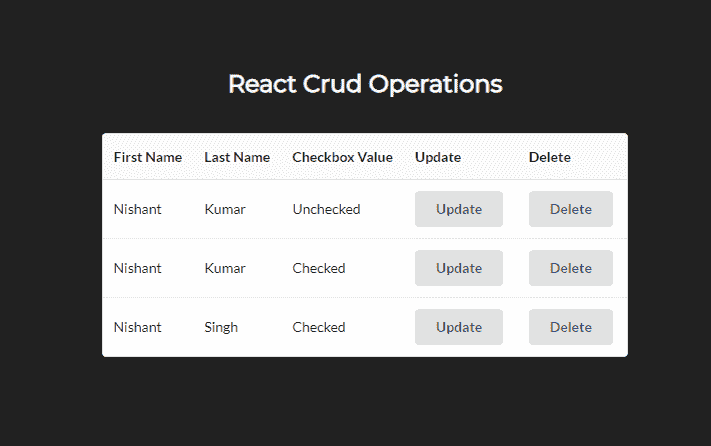

Read table

因此，现在如果我们在任何字段上单击 Delete，它将删除该字段并自动刷新表格。


Read table after deleting one field

## 让我们对 CRUD 应用程序做一些改进

因此，当我们在创建页面中提交数据时，我们只是在模拟数据库中获取数据。当在创建页面中创建数据时，我们需要重定向到读取页面。

从 React 路由器导入`useHistory`。

```
import { useHistory } from 'react-router';
```

Importing useHistory from React Router

用`let`创建一个名为`history`的变量，并将其设置为`useHistory`:

```
let history = useHistory();
```

然后，在调用 post API 之后，使用 history.push 函数推送到 Read 页面。

```
const postData = () => {
        axios.post(`https://60fbca4591156a0017b4c8a7.mockapi.io/fakeData`, {
            firstName,
            lastName,
            checkbox
        }).then(() => {
            history.push('/read')
        })
    }
```

Pushing to the Read page after Post API is successful

它将使用`useHistory`钩子推到被阅读的页面。

对更新页面进行同样的操作。

```
import React, { useState, useEffect } from 'react';
import { Button, Checkbox, Form } from 'semantic-ui-react'
import axios from 'axios';
import { useHistory } from 'react-router';

export default function Update() {
    let history = useHistory();
    const [id, setID] = useState(null);
    const [firstName, setFirstName] = useState('');
    const [lastName, setLastName] = useState('');
    const [checkbox, setCheckbox] = useState(false);

    useEffect(() => {
        setID(localStorage.getItem('ID'))
        setFirstName(localStorage.getItem('First Name'));
        setLastName(localStorage.getItem('Last Name'));
        setCheckbox(localStorage.getItem('Checkbox Value'));
    }, []);

    const updateAPIData = () => {
        axios.put(`https://60fbca4591156a0017b4c8a7.mockapi.io/fakeData/${id}`, {
            firstName,
            lastName,
            checkbox
        }).then(() => {
            history.push('/read')
        })
    }
    return (
        <div>
            <Form className="create-form">
                <Form.Field>
                    <label>First Name</label>
                    <input placeholder='First Name' value={firstName} onChange={(e) => setFirstName(e.target.value)}/>
                </Form.Field>
                <Form.Field>
                    <label>Last Name</label>
                    <input placeholder='Last Name' value={lastName} onChange={(e) => setLastName(e.target.value)}/>
                </Form.Field>
                <Form.Field>
                    <Checkbox label='I agree to the Terms and Conditions' checked={checkbox} onChange={() => setCheckbox(!checkbox)}/>
                </Form.Field>
                <Button type='submit' onClick={updateAPIData}>Update</Button>
            </Form>
        </div>
    )
} 
```

Update.js

现在您知道如何使用 React 和 React 挂钩执行 CRUD 操作了！

或者，如果你想补充你的学习，你可以在 [React CRUD Operations](https://youtu.be/-ZMP8ZladIQ) 上观看我的 Youtube 视频。

如果你想进一步试验，你可以在 GitHub 上找到代码。

> **快乐学习。**