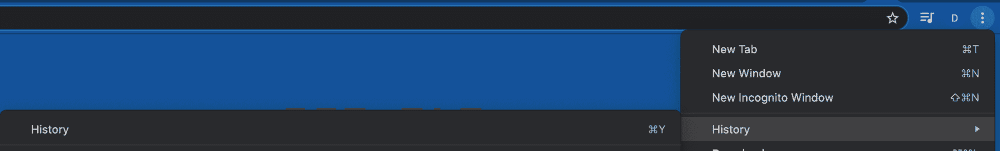
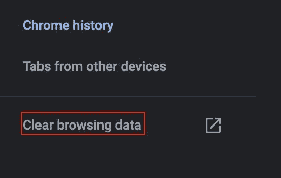
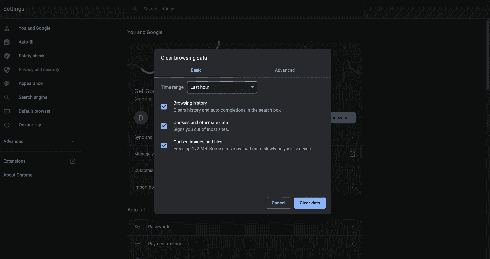
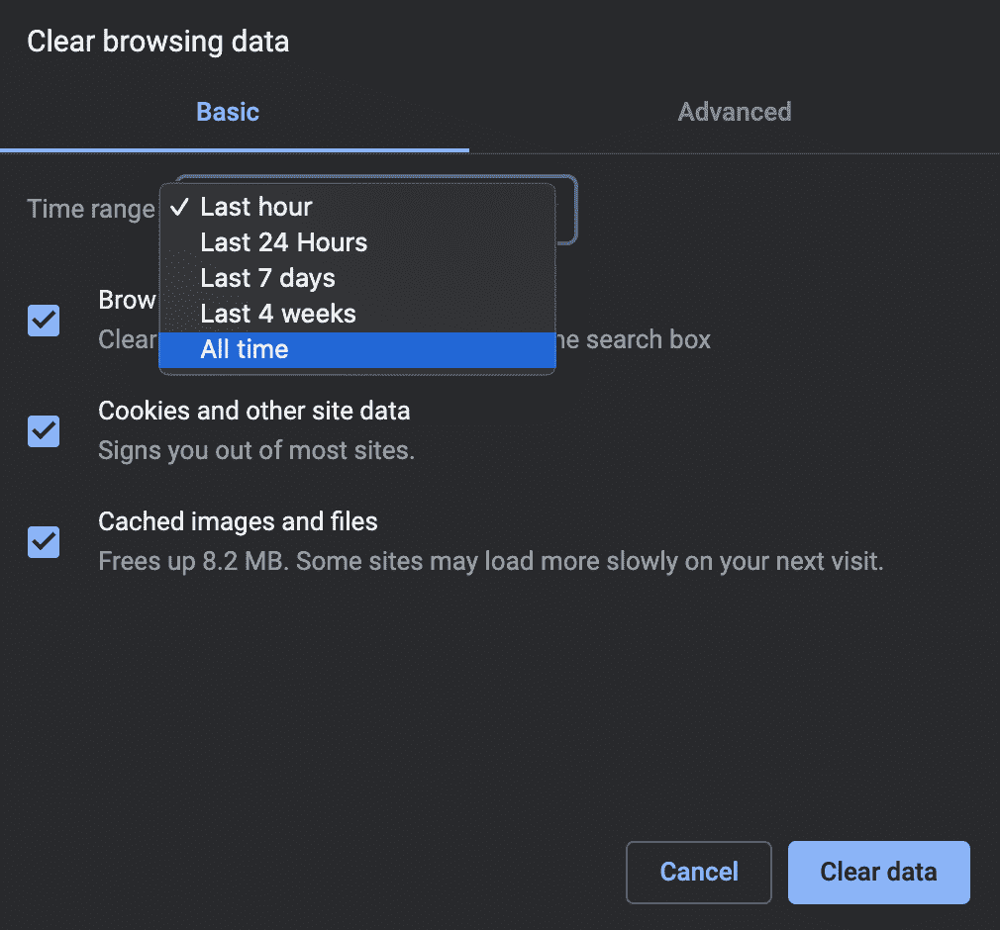
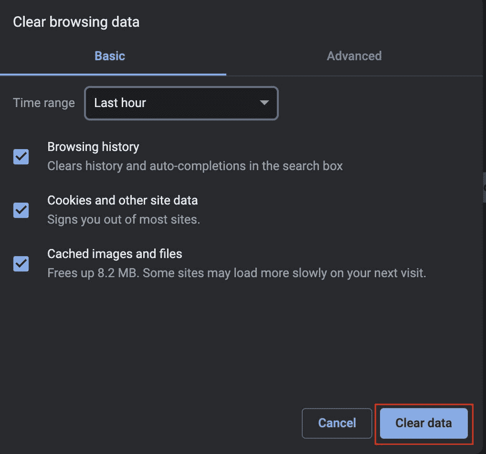
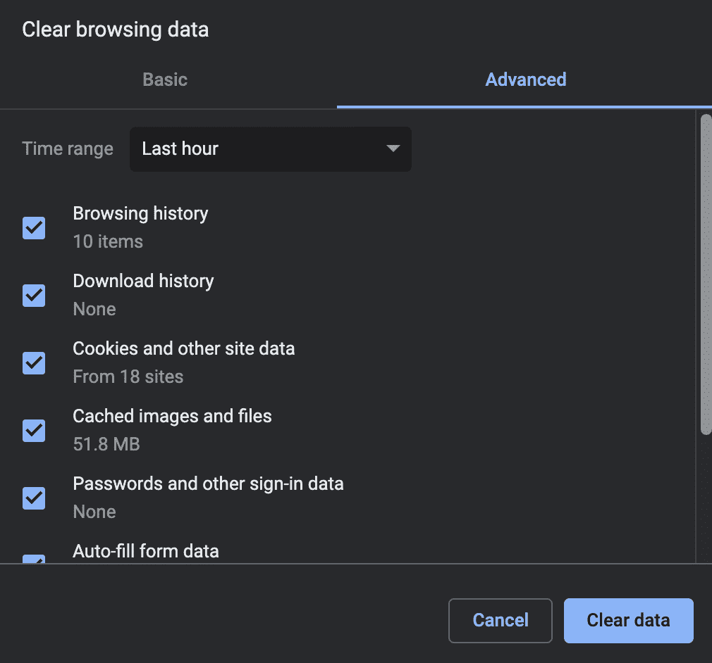
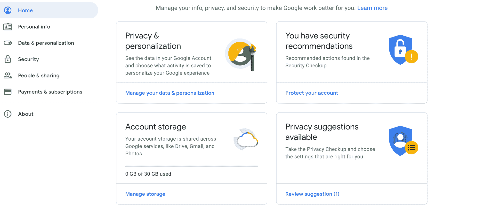
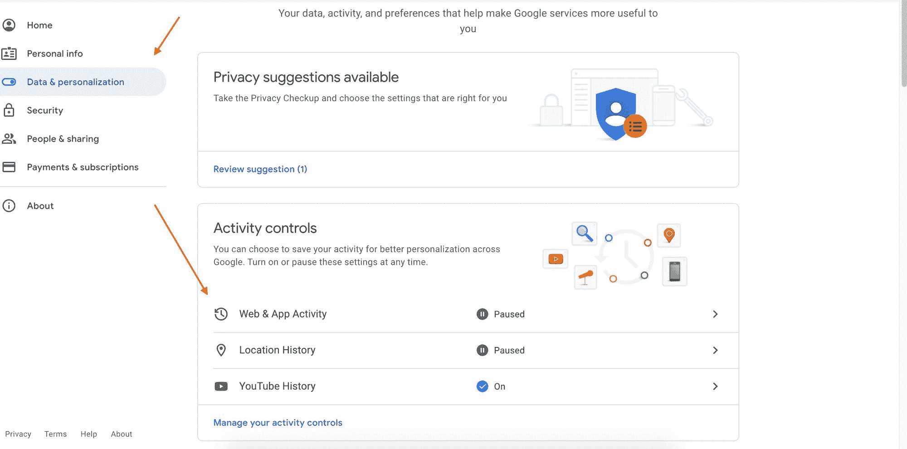
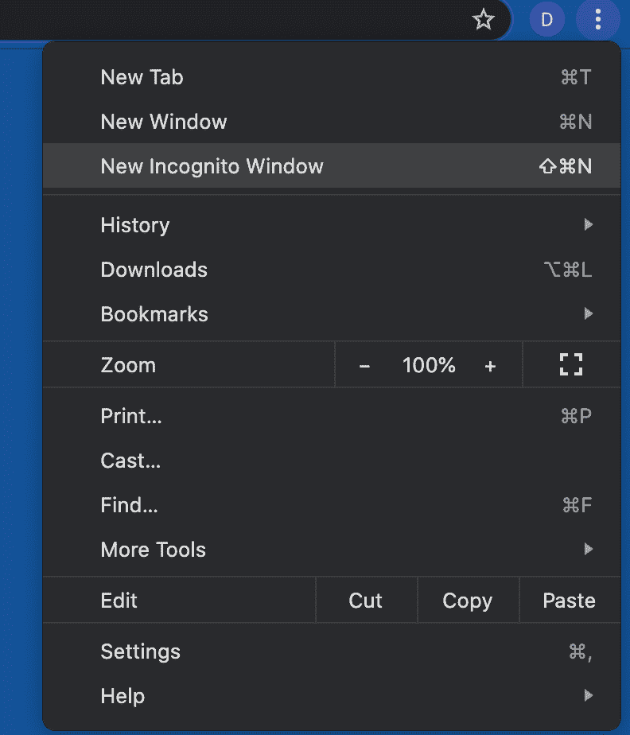
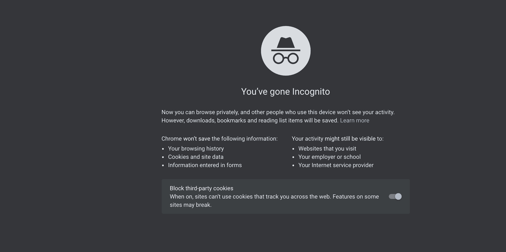

# 如何清除搜索历史——删除 Chrome 中的所有浏览数据

> 原文：<https://www.freecodecamp.org/news/how-to-clear-search-history-delete-all-browsing-data-in-chrome/>

当你想在网上查找你已经浏览过的内容时，你的浏览历史会非常有用。

也许你在网上看了一篇有趣的文章，想再参考一下，但是忘记加书签了。好吧，你可以看看你的 Chrome 历史，你会在那里找到它。

## 浏览器历史是如何工作的？

在网上冲浪时，Chrome(像所有其他现代浏览器一样)会跟踪你的数字足迹。这意味着它会收集您的偏好、搜索和历史记录等数据。

在 Chrome 中使用谷歌搜索时，你的搜索查询会被保存下来。下次你寻找类似的东西时，谷歌会给出相关的建议。

它这样做是为了通过加快页面加载时间来增强您的浏览器体验，实现直观的 web 导航，并自动填充表单(这也节省了时间)。

或者 Chrome 可以利用你所有的信息和你点击的链接，向你投放个性化的谷歌广告。

### 浏览器历史隐私问题

这可能会引起隐私和安全问题。您可能不想在您的计算机上留下您以前的搜索、访问过的网站以及所有包含敏感数据的网络活动的痕迹。

不时清理你的搜索历史和浏览数据总是一个好主意。这也包括缓存和 cookies，以获得最佳的浏览体验和更安全的网上冲浪。

这篇文章向你展示了如何删除你的 Chrome 搜索历史和浏览你正在使用的任何操作系统的数据。

只需几次点击和一些简单的步骤，你就可以清除你的 Chrome 账户中的互联网历史记录。

值得一提的是，如果你已经将你的 Chrome 帐户设置为与你所有的其他设备(无论是笔记本电脑、手机、平板电脑等)同步，你还必须删除这些设备上的历史记录。

## 如何删除你的铬历史

只需几个简单的步骤，你就可以一次删除所有内容。

首先，打开你的 Chrome 浏览器应用。

在右上角，您的个人资料图片旁边有三个小圆点:

点击它们后，会出现一个菜单。

从菜单中，选择“历史”，然后再次选择“历史”。

您也可以使用键盘快捷键:

*   **对于 Mac 用户** : `Command Y`
*   **对于 Windows 用户** : `Ctrl H`

这将打开一个新的标签页，上面有你所有的浏览历史，最近的在最上面。

接下来，要删除所有数据，请在左侧选择“清除浏览数据”。

然后你会被带到屏幕中央的另一个菜单，看起来像这样:

有两个选项卡“基本”和“高级”。

在弹出窗口顶部的基本选项卡中，您可以选择时间和日期范围。您可以清除过去一小时、24 小时、7 天、4 周或任何时间的数据。

要删除整个浏览器数据历史，请确保所有三个复选框都已选中——“浏览历史”、“Cookies 和其他网站数据”和“缓存的图像和文件”。

点击时间范围下拉菜单，选择“**所有时间**”。

最后，选择“清除数据”。

所有历史记录、cookies 和缓存现在都从您的机器上消失了。

Chrome 现在不会显示你以前访问过的页面，因为所有的痕迹都消失了。在搜索过程中，它也不会自动完成地址栏中的 URL 或关键字。

要更进一步，更具体一点，您可以选择“高级选项卡”,然后根据需要选中/取消选中。如果你想要一个干净的石板，重新开始，确保选中所有的复选框。

再次选择你想要的时间范围。如果你想摆脱一切，选择“所有时间”，然后“清除数据”。

Chrome now 不会显示你下载的文件(它不会删除实际下载的文件——它们存在于你的电脑硬盘上)。它没有自动填写表格的数据。它不会保存密码和登录信息。它不会知道你的语言设置，你的位置信息或者不同的网站设置。

### 什么是 cookies 和缓存？

Chrome 存储来自已访问网站和缓存文件的 cookies。

Cookies 可以识别您的身份。

例如，当你查找今天的温度时，cookies 知道显示你居住的城市。其他 cookies 负责不断弹出的个性化广告。如果你继续搜索鞋子，你会从不同的网上鞋店得到广告。

他们还保留登录凭证、首选项和敏感的自动填充表单信息(如姓名、地址和电话号码)。

缓存通过下载本地副本来存储您反复访问的网站中的图像和图形。这有助于更快的访问和浏览器加载速度超快。

一旦缓存被删除，页面可能需要更长的时间来加载，因为浏览器必须从网上而不是本地获取图像。但是这可以修复页面加载错误，并且是修复浏览器问题的第一步。

## 如何避免不断删除自己的历史

你不需要一直重复上面提到的过程——你可以限制谷歌可以从你那里收集什么数据。

你可以在谷歌设置中禁用你的搜索和定位历史。当您与他人共享电脑时，如果您使用的是公共电脑，或者如果您特别注意自己的隐私，这一点尤其有用。

1.  点击你的用户账户图标，在 Chrome 的右上角显示你的个人资料图片。
2.  选择“管理您的 Google 帐户”。这会带你去[https://myaccount.google.com/](https://myaccount.google.com/)

3.  在左侧，选择“数据和个性化”。这个页面让你知道谷歌正在收集什么信息。
4.  在“活动和控制”中，单击“Web 和应用程序活动”，您可以通过单击蓝色滑块按钮来关闭它。系统会提示您进行确认。在“活动和控制”面板中，您还可以控制是否保存您的位置。

## 如何使用匿名模式安全浏览网页

Chrome 有一个更安全、更私密的网络浏览选项。隐姓埋名是许多现代浏览器提供的一种私密模式。

使用匿名模式，Chrome 不会将您访问过的网站存储在您的浏览历史中，您的活动将被保密。

当窗口关闭时，该会话的所有浏览历史活动、搜索、cookies 和缓存都将被自动删除，并且不会保存。浏览器不会知道你做了什么。

但是，请记住，如果您使用登录信息登录网站，该网站会识别您并记录您的活动。

要在隐姓埋名中打开一个新窗口，在 Chrome 中找到你的个人资料图片旁边的三个小点，点击它们，从下拉菜单中选择“新隐名窗口”:

还有哒哒！Chrome 打开了一个新窗口，它不会跟踪你的浏览活动，也不会从你以前的搜索或填写的表格中加载信息。

## 结论

在本文中，我们学习了如何通过几个简单的步骤从 Chrome 中删除所有的博客数据。我还分享了一些让你的浏览活动更安全的建议。

感谢阅读！