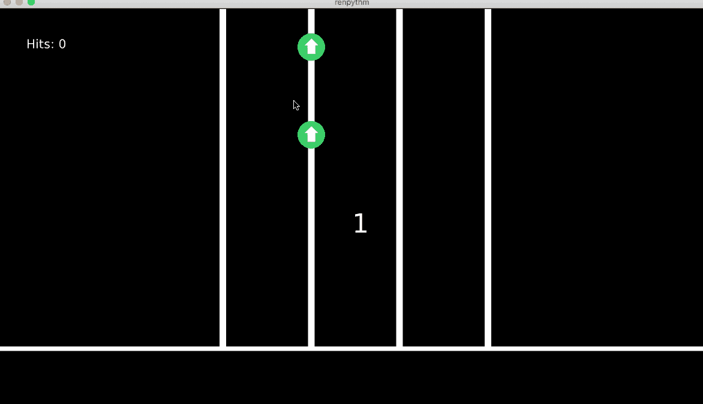
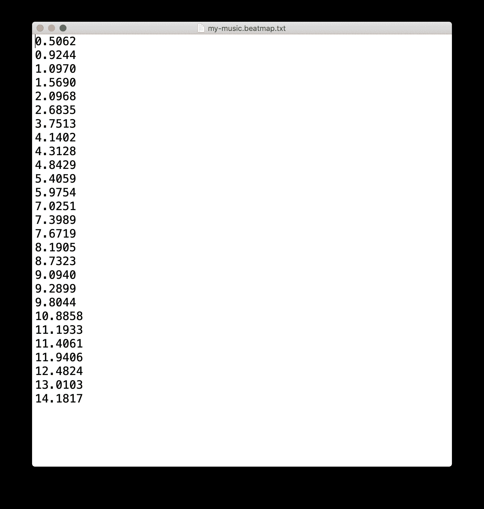

# 如何使用 Python 来检测音乐开始

> 原文：<https://www.freecodecamp.org/news/use-python-to-detect-music-onsets/>

在音乐术语中，**开始**指的是**音符或其他声音的开始。**在这篇文章中，我们将看看如何用 Python 的音频信号处理库 [Aubio](https://aubio.org/) 和 [librosa](https://librosa.org/doc/latest/index.html) 来检测音乐开始。

即使您的应用程序不使用 Python，本教程也是相关的——例如，您正在用 Unity 和 C#构建一个游戏，它没有健壮的开始检测库。

如果是这种情况，您可以将检测到的开始时间戳导出到一个文本文件，以读入您选择的引擎。

如果你更喜欢视频教程而不是文章，这里有这个教程的视频版本。

[https://www.youtube.com/embed/aMMI0nAKgI0?feature=oembed](https://www.youtube.com/embed/aMMI0nAKgI0?feature=oembed)

## 音乐开始检测的应用

我在制作节奏游戏时遇到了这种音乐开始检测技术，我想让 T2 自动为任何歌曲生成节拍图。

查看本文结尾我的[开源节奏游戏](https://github.com/RuolinZheng08/renpy-rhythm)和[我如何构建它的一步一步的过程。](https://www.udemy.com/course/renpy-minigames/?referralCode=46F88E557D14A0FDD973)



My rhythm game showcase

除了构建一个节奏游戏，这项技术还有很多其他的应用。

例如，检测开始通常是**音乐信息检索和分析**的第一步。

另一个例子是，我们正在开发一个有战斗场景的游戏。我们可以探测到 BGM 的发作，并在每次发作时产生一个敌人。这可以在我们的比赛中创造一个独特的节奏。

我将演示如何使用两个不同的 Python 包来检测音乐开始，分别用于**音频信号处理**、 [Aubio](https://aubio.org/) 和 [librosa](https://librosa.org/doc/latest/index.html) 。这两个软件包都能非常准确地检测到发病。微小的区别是 librosa 支持 OGG 格式，而 Aubio 不支持。

## 如何设置开发环境

我们将在虚拟环境中安装我们的软件包。

在命令行中，我们创建一个名为`python-aubio-librosa`的虚拟环境，如下所示。`-m`代表`module`。

```
$ python3 -m venv python-aubio-librosa
```

然后我们激活虚拟环境:

```
$ . python-aubio-librosa/bin/activate
```

请注意，如果您尝试使用以下命令激活环境，将会出现错误:

```
$ ./python-aubio-librosa/bin/activate
-bash: ./python-aubio-librosa/bin/activate: Permission denied
```

一旦您的环境被激活，环境的名称将显示在括号中:

```
(python-aubio-librosa) $ ...
```

我们可以检查，如果我们调用`python`或`pip`，被调用的程序将是我们的虚拟环境中的程序，而不是系统级的程序。

如果我们没有激活我们的环境，输出将指向系统级程序。

```
$ which python
/usr/bin/python
$ which pip
/usr/local/bin/pip
```

一旦我们激活了我们的环境，输出将指向本地环境。

```
(python-aubio-librosa) $ which python
/Users/USERNAME/Desktop/python-aubio-librosa/bin/python
(python-aubio-librosa) $ which pip
/Users/USERNAME/Desktop/python-aubio-librosa/bin/pip
```

## 如何安装和使用 Aubio

我们将通过`pip`安装 Aubio:

```
(python-aubio-librosa) $ pip install aubio
```

我们将用来生成以秒为单位的浮点数形式的开始时间戳列表的函数如下。该函数来自 Aubio 的[官方文档](https://github.com/aubio/aubio/blob/master/python/demos/demo_onset.py)，因此我们可以直接使用它，而无需了解音频信号处理中的具体细节(如 FFT、快速傅立叶变换)。

```
from aubio import source, onset

def get_onset_times(file_path):
    window_size = 1024 # FFT size
    hop_size = window_size // 4

    sample_rate = 0
    src_func = source(file_path, sample_rate, hop_size)
    sample_rate = src_func.samplerate
    onset_func = onset('default', window_size, hop_size)

    duration = float(src_func.duration) / src_func.samplerate

    onset_times = [] # seconds
    while True: # read frames
        samples, num_frames_read = src_func()
        if onset_func(samples):
            onset_time = onset_func.get_last_s()
            if onset_time < duration:
                onset_times.append(onset_time)
            else:
                break
        if num_frames_read < hop_size:
            break

    return onset_times
```

然后，我们编写一个`main`函数，它接受音频文件的路径，并将开始时间戳输出到一个文件，在每个浮点中保留前四个小数位，每行一个浮点。

```
def main():
    file_path = '../game/audio/my-music.mp3'
    onset_times = get_onset_times(file_path)
    # remove extension, .mp3, .wav etc.
    file_name_no_extension, _ = os.path.splitext(file_path)
    output_name = file_name_no_extension + '.beatmap.txt'
    with open(output_name, 'wt') as f:
        f.write('\n'.join(['%.4f' % onset_time for onset_time in onset_times])) 
```

让我们从命令行调用这个脚本。Aubio 可能会对准确性提出警告，但我的实验表明，Aubio 仍然非常准确。

```
(python-aubio-librosa) $ python generate_beatmap_aubio.py 
[mp3 @ 0x7fe671031e00] Estimating duration from bitrate, this may be inaccurate
```

示例输出文件如下所示。对于一段 15 秒的音乐片段，Aubio 检测到了 26 次发作。这些是我们可以在应用程序中使用的时间戳。



An example output file consisting of onset timestamps

奥比奥就这样了。

## 如何安装和使用 libros

与 Aubio 类似，我们也将通过`pip`安装 librosa:

```
(python-aubio-librosa) $ pip install librosa
```

与 Aubio 相比，librosa 的库方法更容易使用。`librosa.load`返回一个 NumPy 数组`x`和一个采样率`sr`，我们将其传递给`librosa.onset.onset_detect`以获得开始帧的列表。

最后，我们将开始帧转换为开始时间戳，并将每个时间戳写入输出文件，就像我们对 Aubio 所做的那样。

```
import librosa

def main():
    file_path = '../game/audio/my-music.ogg'
    x, sr = librosa.load(file_path)
    onset_frames = librosa.onset.onset_detect(x, sr=sr, wait=1, pre_avg=1, post_avg=1, pre_max=1, post_max=1)
    onset_times = librosa.frames_to_time(onset_frames)
    # remove extension, .mp3, .wav etc.
    file_name_no_extension, _ = os.path.splitext(file_path)
    output_name = file_name_no_extension + '.beatmap.txt'
    with open(output_name, 'wt') as f:
        f.write('\n'.join(['%.4f' % onset_time for onset_time in onset_times]))
```

输出文件的格式与上述 Aubio 的格式相同。

## 结论

感谢您的阅读，我希望您准备好将这种发作检测技术应用到您的下一个项目中。🎶

根据我的实验，Aubio 和 Librosa 之间的区别是，两者都能非常准确地检测到发作。

Aubio 在音频文件格式方面更受限制:它对 MP3 文件的准确性提出了警告，并且不处理 OGG 文件。

另一方面，Librosa 能够处理最常见的音频文件格式:MP3、OGG、FLAC 和 M4A。Librosa 的库接口也比 Aubio 的更容易使用，特别是对于我们这些不是信号处理专家的人来说。

如果你想了解更多或者为你的下一个项目获得灵感，请查看下面的资源！

## 资源

你可以在我的 GitHub 上查看本教程使用的代码[或者在 YouTube 上观看本教程的视频版本](https://github.com/RuolinZheng08/renpy-minigames101/tree/master/generate_beatmap)[。](https://youtu.be/aMMI0nAKgI0)

如果你对构建节奏游戏感兴趣，请查看我在 GitHub 上用 Python 构建的开源游戏和我的 Udemy 课程，我们将从头开始构建游戏。

[Ren’Py Minigames 101Learn to build minigames in Ren’Py & Python by building a Rhythm Game from scratchUdemy](https://www.udemy.com/course/renpy-minigames/?referralCode=46F88E557D14A0FDD973)

如果你想知道这门课程是否适合你，可以看看我在 YouTube 上的课程宣传视频和 Udemy 上的免费试听讲座。

[https://www.youtube.com/embed/_AaUKSjTNY8?feature=oembed](https://www.youtube.com/embed/_AaUKSjTNY8?feature=oembed)

我的 YouTube 频道还提供了其他有趣的项目教程，如[构建一个不和谐的人工智能聊天机器人](https://youtu.be/UBwvFuTC1ZE)，以及[我正在开发的一系列编码面试速成班](https://youtu.be/H2gnD7Ixeao)。希望在那里见到你！

[Lynn’s DevLabHi, I’m Lynn. I’m a Software Engineer and hobbyist Game Developer. I completed my joint BS/MS degree in Computer Science in four years at the University of Chicago, graduating in 2021.Here at my channel, you can expect to enjoy monthly updates of fun technical project tutorials, my game dev demos, …YouTube](https://www.youtube.com/channel/UCZ2MeG5jTIqgzEMiByrIzsw)