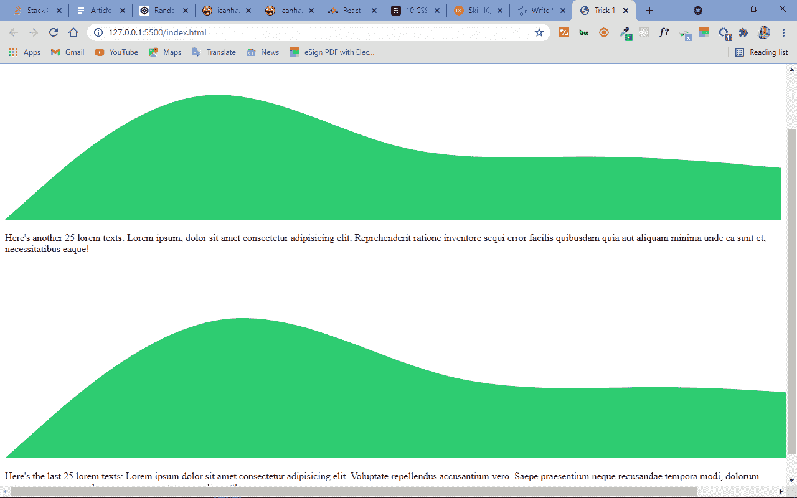
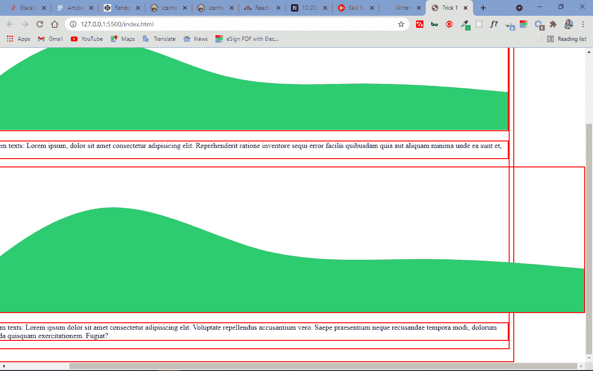
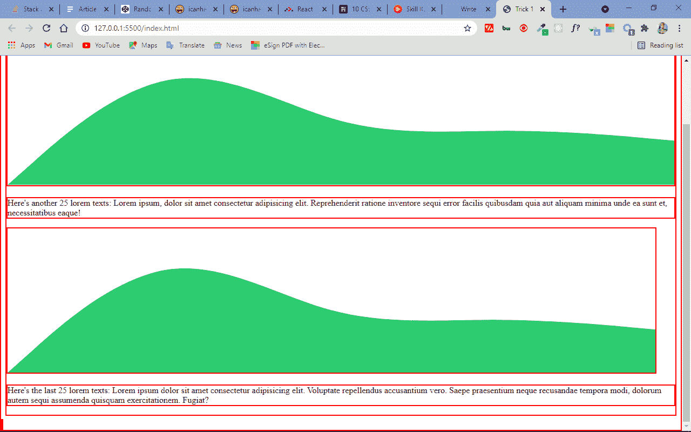
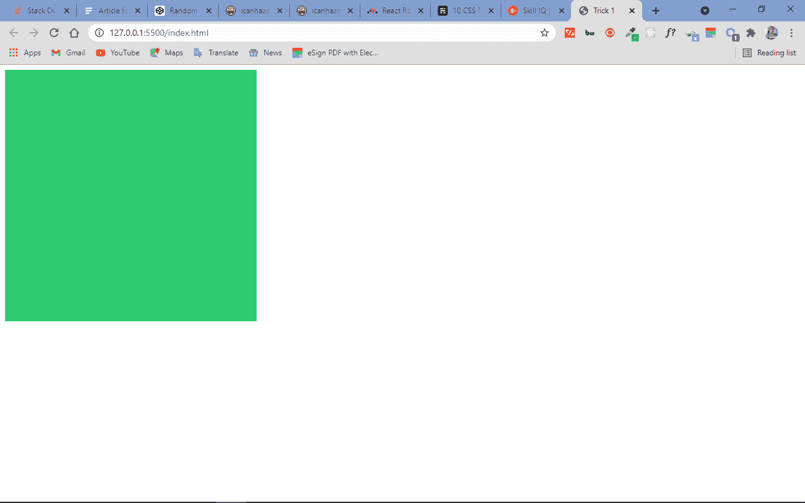
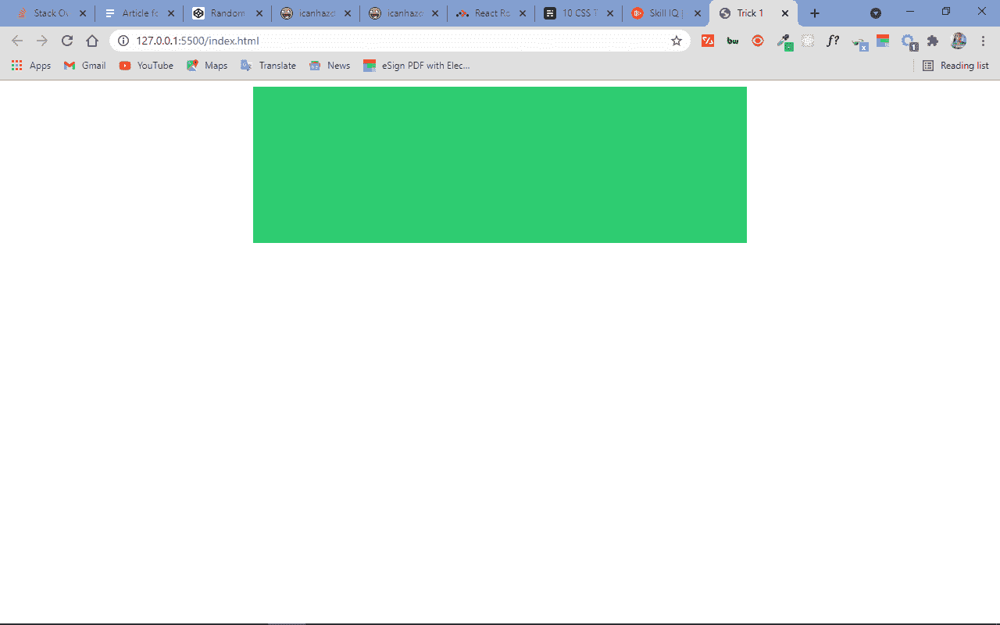
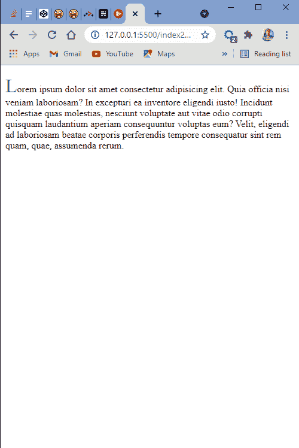
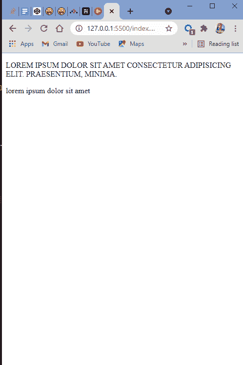
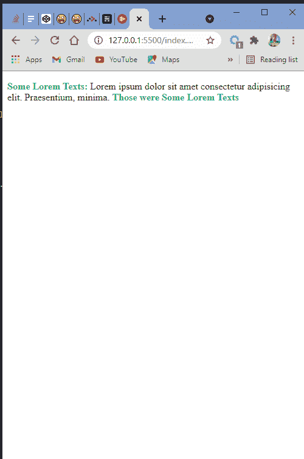

# CSS 备忘单——改进下一个编码项目的 10 个技巧

> 原文：<https://www.freecodecamp.org/news/10-css-tricks-for-your-next-coding-project/>

CSS 的层叠性质有时使其难以理解和使用。各种水平的开发人员经常在试图弄清楚如何使用某些特性的时候遇到困难，你会经常发现自己在谷歌上搜索或者向同事寻求帮助。

所以当你在处理 CSS 问题时，不要苛责自己——每个人都会遇到这种情况。

因为 CSS 可能是神秘而棘手的，所以如果你希望揭开它的神秘面纱，你也必须是棘手的。这就是为什么，在这篇文章中，我给你带来了 10 个很棒的 CSS 技巧，这将使你作为一个开发者更容易，尤其是如果你是一个初学者。

## 1.如何在 CSS 中修复网页上的水平滚动

如果您正在设计您的 web 页面，并且在底部看到一个水平滚动条，您需要找到宽度大于可用屏幕宽度的元素。

例如，在下面的截图中，您可以看到有一个水平滚动:



通过应用以下规则，您可以使用通用选择器(*)来查找问题元素:

```
* { 
     border: 2px solid red;
}
```

这将对页面上的每个元素应用一个 2 像素的红色边框，因此您可以很容易地确定需要调整哪个元素。

应用上述样式后，结果如下:



你可以看到第二个绿波导致了水平滚动。这是因为宽度被设置为 1400 像素，比 1200 像素的可用屏幕宽度要宽。

```
.wave2 {
  width: 1400px;
} 
```

将宽度设置回 1200 像素或将其完全移除将解决这个问题，这样就不再有水平滚动了。



## 2.如何在 CSS 中重写样式

在某些特定情况下，您可能希望覆盖已存在的特定样式(如来自库中的样式)。或者，您可能有一个包含大型样式表的模板，您需要定制它的特定部分。

在这些情况下，您可以[应用 CSS 特异性](https://www.freecodecamp.org/news/what-is-css-specificity/)的规则，或者您可以在您的规则前面使用`!important`异常。

在下面的例子中，`!important`赋予每个 h1 元素一种翠绿色的变体#2ecc71(我最喜欢的颜色):

```
h1 {
    color: #2ecc71 !important;
}
```

但是要注意——使用这个异常被认为是不好的做法，应该尽可能避免。

为什么？好吧，`!important`实际上打破了 CSS 的级联性质，它可以使调试更加困难。

`!important`的最佳用例是在处理大型模板样式表或旧代码时，用它来识别代码库中的问题。然后，您可以快速修复问题并移除异常。

而不是用！重要的是要应用样式，你可以[学习更多关于 CSS 特性的知识](https://www.freecodecamp.org/news/what-is-css-specificity/)并应用那些规则。

## 3.如何用 CSS 做一个正方形

如果您想创建一个正方形，而不需要过多地改变宽度和高度，您可以通过设置背景颜色、所需的宽度以及相等图形的纵横比来设置 div 的样式。第一个数字是顶部和底部尺寸，第二个是左侧和右侧尺寸。

你可以进一步玩这两个图形来制作矩形和任何你想要的正方形。

```
<div class="square"></div> 
```

```
.square {
  background: #2ecc71;
  width: 25rem;
  aspect-ratio: 1/1;
}
```



## 4.如何用 CSS 将 div 居中

随着样式表变大，将 div 居中会变得非常困难。要设置任何 div 的样式，给它一个块显示、自动边距和 100%以下的宽度。

```
<div class="center"></div> 
```

```
.center {
    background-color: #2ecc71;
    display: block;
    margin: auto;
    width: 50%;
    height: 200px;
}
```



## 5.如何在 CSS 中移除盒子中多余的填充

使用`box-sizing: border-box`将确保当你为它设置宽度和填充时，没有额外的填充被添加到一个框中。这将有助于你的布局看起来更好。

```
* {
  margin: 0;
  padding: 0;
  box-sizing: border-box;
}
```

## 6.如何用 CSS 制作首字下沉

您可以使用首字母伪元素制作首字下沉。是啊！你在报纸上看到的首字下沉。

选择适当的 HTML 元素并应用样式，如下所示:

```
 <p class="texts">
      Lorem ipsum dolor sit amet consectetur adipisicing elit. Quia officia nisi
      veniam laboriosam? In excepturi ea inventore eligendi iusto! Incidunt
      molestiae quas molestias, nesciunt voluptate aut vitae odio corrupti
      quisquam laudantium aperiam consequuntur voluptas eum? Velit, eligendi ad
      laboriosam beatae corporis perferendis tempore consequatur sint rem quam,
      quae, assumenda rerum.
 </p> 
```

```
p.texts::first-letter {
  font-size: 200%;
  color: #2ecc71;
}
```



## 7.如何在 CSS 中使文本大写或小写

大写或小写字母不必直接来自你的 HTML。您可以强制 CSS 中的任何文本为大写或小写。

希望以后有 SentenceCase 和 tOGGLEcASE 的选项。但是你为什么要做一个文本手提箱呢？

```
<p class="upper">
      Lorem ipsum dolor sit amet consectetur adipisicing elit. Praesentium,
      minima.
</p>
<p class="lower">LOREM IPSUM DOLOR SIT AMET</p> 
```

```
.upper {
  text-transform: uppercase;
}

.lower {
  text-transform: lowercase;
} 
```



## 8.如何声明变量来保持你的 CSS 干爽

变量？是的。你可以在 CSS 中声明变量。

当您声明变量时，您可以在许多其他样式中使用它们。如果您有什么需要更改的，您只需更改该变量，结果将会反映在任何使用它们的地方。这将有助于保持你的 CSS 代码干燥(不要重复自己)。

可以通过将变量放在根范围来声明它，这样它在样式表中就是全局的。要使用您的变量，您需要将属性放在“var”关键字旁边的花括号中。

通常在样式表的顶部声明变量——也就是在重置之前。

```
:root {
  --text-color: hsl(145, 63%, 49%);
}

p {
  color: var(--text-color);
} 
```

## 9.如何使用`:before`和`:after`选择器向你的 CSS 添加额外的内容

CSS 中的`:before`选择器帮助您在元素前插入内容:

```
<p class="texts">
  Lorem ipsum dolor sit amet consectetur adipisicing elit. Praesentium,
  minima.
</p> 
```

```
p.texts::before {
  content: "Some Lorem Texts: ";
  color: #2ecc71;
  font-weight: bolder;
}
```

`:after`选择器做同样的事情，但是它在元素后面插入内容:

```
p.texts::after {
  content: " Those were Some Lorem Texts";
  color: #2ecc71;
  font-weight: bolder;
}
```



## 10.如何用纯 CSS 获得平滑滚动

您可以在网页上应用平滑滚动，而不必编写复杂的 JavaScript 或使用插件。因此，如果你有链接到网页上几个部分的锚定标签，当你点击它们时，滚动是平滑的。

```
html {
  scroll-behavior: smooth;
}
```

就是这样！

感谢您的阅读。通过我的[作品集](https://ksound22.github.io)和[推特](https://twitter.com/koladechris)与我联系，在那里我大部分时间都在发推特，参与编码和网络开发相关的话题。