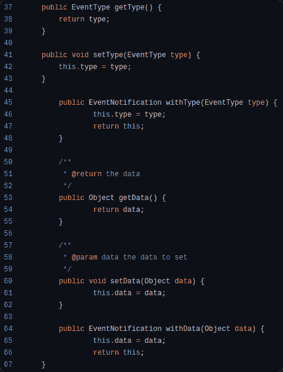
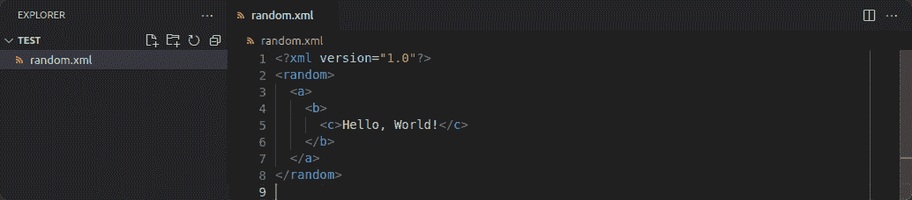
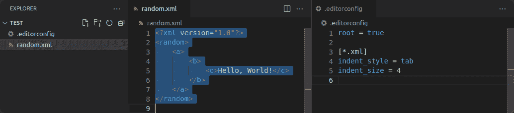

# 为什么应该使用 EditorConfig 来标准化代码样式

> 原文：<https://www.freecodecamp.org/news/how-to-use-editorconfig-to-standardize-code-styles/>

您使用 [EditorConfig](https://editorconfig.org/) 为项目中的文本文件定义格式约定。它很棒，因为它得到了广泛的支持，并且它不依赖于任何特定的语言、框架或代码编辑器。

EditorConfig 本身只是一个独立于供应商的配置文件。它依赖第三方工具或集成来实现对文件中声明的规则的支持。

它们可以被 ide(集成开发环境)、代码编辑器或构建工具读取，以实施或应用格式约定。

## EditorConfig 解决什么？

用户通常在编辑器中配置代码风格设置来*他们的*偏好。不幸的是，他们的偏好可能与你的不一致。

当他们为一个共享项目做贡献时会发生什么？这可能是一个工作中的项目，或者是 GitLab 或 GitHub 上的开源项目。

用户的样式设置将应用于他们修改的文件。这可能会导致项目感觉不一致或混乱，出现以下部分或全部问题:

*   制表符和空格的混合使用。
*   混合使用行尾。(通常对于 [Git](https://git-scm.com/) 来说不是一个大问题。)
*   文件可能没有所需的字符编码。
*   文件中不同的缩进大小。

如果没有一致性，代码会显得凌乱不堪，读起来很痛苦，这取决于用户的开发环境。



[eclipse.jdt.ls](https://github.com/eclipse/eclipse.jdt.ls/blob/master/org.eclipse.jdt.ls.core/src/org/eclipse/jdt/ls/core/internal/EventNotification.java?ts=8) mixes tabs and spaces, here's how it looks on GitHub with a tab size of 8.

一个常见的解决方案是共享编辑器设置作为项目的一部分，但是这假设所有提交者都使用与您相同的编辑器，这可能不是事实。

仅就 Java 开发而言，以下是所有流行的选择:

*   [Visual Studio 代码](https://code.visualstudio.com/)(我用什么！)
*   [月食](https://www.eclipse.org/)
*   [智能 J](https://www.jetbrains.com/idea/)
*   [NetBeans](https://netbeans.apache.org/)

如果您为每个人可能使用的编辑器添加配置，您的项目将会因不相关的文件而膨胀。

那么，一个独立于供应商的解决方案怎么样呢？在这个方案中，编辑负责使用共享配置。

## EditorConfig 如何帮助

在项目的整个生命周期中，定义约定对每个人都有帮助。也就是说，有三种方法可以节省时间。

### EditorConfig 使代码更具可读性

让代码更易读是使用它的最重要的原因。这提高了项目的可维护性，以及人们工作的速度。

> “的确，花在阅读和写作上的时间比远远超过 10 比 1。作为编写新代码工作的一部分，我们一直在阅读旧代码……因此，让旧代码易于阅读也就更容易编写。”罗伯特·马丁

除了开发之外，还有许多其他原因可能会导致有人阅读这些代码:

*   研究人员需要更好地了解这个项目是如何运作的。
*   正在检查漏洞的安全分析师。
*   记录应用程序行为的技术作者。

如果您的代码保持整洁、一致和可读，人们将能够更有效地履行他们的职责。

### EditorConfig 使代码审查更容易

作为一个项目维护者，你不可避免地要审查其他人贡献的代码。他们可能是团队成员，或者是发现你的项目的开源贡献者。

强制格式化应该委托给软件。这将使阅读和检查代码更加有效，并避免了基于格式请求更改的需要。

减少反馈循环最终会节省每个人的时间。

### EditorConfig 使开发更容易

开发人员可以通过编辑器自动应用约定来省去很多麻烦。

没有它，他们必须找到一个贡献指南，风格指南，或者手动检查其他代码来学习项目约定。

即使约定是已知的，它们也可能与开发人员的设置相冲突。然后，他们将不得不根据编辑器的自动格式进行编码，或者频繁地在项目之间改变设置。

这对经常在项目间跳跃的开发人员尤其有用。例如，开源贡献者经常为遵循不同编码约定的跨组织项目编写代码。

## EditorConfig 如何工作

EditorConfig 使用一个名为`.editorconfig`的简单的类似于 [INI](https://en.wikipedia.org/wiki/INI_file) 的文件。该文件声明将被转换为编辑器中的设置的规则，或者在您的工作区上执行格式化。

例如，在我的编辑器中，我对 XML 文件使用 2 个空格的缩进，但是我参与的项目可能更喜欢 4 个空格的缩进。

```
[*.xml]
indent_size = 4
```

An `.editorconfig` section that indicates XML files should have an indentation size of 4.

当我打开项目时，我的编辑器会看到`.editorconfig`文件，并覆盖设置以适应项目的约定。



Writing an XML file with my default editor settings. I use spaces for indentation with a size of 2.



Automatically reformatting the file after overriding the XML formatting settings.

## 如何使用编辑器配置

根据您选择的编辑器，它可能已经对 EditorConfig 提供了本地支持。网站上有一个“[无插件必要的](https://editorconfig.org/#pre-installed)”编辑器列表，其中包括 JetBrains IDEs 和 Visual Studio。

如果你的编辑器没有本地支持，你可以用插件来添加。像 Visual Studio Code 和 Eclipse 这样的编辑器都是这样支持的，也可以在 EditorConfig 网站的“[下载一个插件](https://editorconfig.org/#download)”下找到。

安装完成后，您的编辑器应该会自动找到项目中的 EditorConfig 文件(如果存在)，并开始应用规则。

## 如何在 EditorConfig 中定义规则

你可以在 [EditorConfig Wiki](https://github.com/editorconfig/editorconfig/wiki/EditorConfig-Properties) 上找到规则列表。它包含所有官方支持的规则，以及某些实现可能支持的特定领域规则的建议。

不是所有的实现都支持每一个规则。对于像`curly_bracket_next_line`这样的特定领域规则来说尤其如此。无论如何，为可以利用这些属性的用户声明这些属性还是值得的，或者至少记录下首选项。

您必须为项目中的顶级 EditorConfig 设置`root`到`true`，它通常位于您的项目目录的根目录中。

额外的 EditorConfig 文件可以在嵌套目录中定义，但是不应该将`root`设置为`true`。

然后，您可以定义一个用于选择文件的头，其中包含适用于匹配文件的规则。

```
# Declares that this is the top-level configuration
root = true

# Applies to all files
[*]
indent_style = space
indent_size = 2

# Applies to all Markdown files
[*.md]
trim_trailing_whitespace = false

# Applies to all C# and Java files, overriding rules declared before
[*.{cs,java}]
indent_size = 4
```

对于如何编写一个`.editorconfig`文件没有标准的约定，但是有两种值得注意的方法可以采用。

### 为每个项目定义规则

你需要的话就添加进去。这意味着只需定义规则，或者随着项目的增长添加文件格式。

您可以从使用编辑器生成文件开始，或者手动创建一个名为`.editorconfig`的文件。可以从官网复制粘贴[例子](https://editorconfig.org/#example-file)。

### 为所有项目定义规则

或者，您可以将您所有的偏好放在一起，为您可能与之交互的所有文件规划理想的配置。

您可以从头开始工作，或者从我的开始并做必要的调整。

```
root = true

[*]
indent_style = space
indent_size = 2
end_of_line = lf
charset = utf-8
trim_trailing_whitespace = true
insert_final_newline = true
curly_bracket_next_line = false
spaces_around_operators = true

[*.bat]
end_of_line = crlf

[*.cs]
curly_bracket_next_line = true

[*.{cpp,cs,gradle,java,kt,py,rs}]
indent_size = 4

[*.{js,ts}]
quote_type = single

[*.md]
trim_trailing_whitespace = false

[*.tsv]
indent_style = tab
```

The `.editorconfig` file that I use across all projects I maintain.

## EditorConfig 规则建议

如果您的项目包含相应的文件格式，我客观地推荐声明这些规则。它将帮助您避免由于用户的开发环境而可能出现的繁琐问题。

### 一批

行尾在存储时需要有一个文本表示。这通常是你看不到或不必担心的事情。

然而，不同的系统使用不同的字符来表示行尾。([更多信息](https://en.wikipedia.org/wiki/Newline#Representation))

*   Unix 系统使用换行符。(`lf`或`\n`)
*   Windows 使用回车和换行符。(`crlf`或`\r\n`)

[批处理](https://en.wikipedia.org/wiki/Batch_file)文件如果以 Unix 行尾结尾，可能会出现意外行为。您可以通过将`end_of_line`设置为`crlf`来避免这种情况，以确保它们具有 Windows 行尾。([更多信息](https://serverfault.com/questions/429594/is-it-safe-to-write-batch-files-with-unix-line-endings))

```
[*.bat]
end_of_line = crlf
```

### 降价

在 [Markdown](https://en.wikipedia.org/wiki/Markdown) 中，可以通过在行尾添加 2 个空格，在当前段落中写入一个换行符。([更多信息](https://en.wikipedia.org/wiki/Markdown#Example)

你需要将`trim_trailing_whitespace`设置为`false`,以避免在你保存的时候让你的编辑器删除那些空格。

```
[*.md]
trim_trailing_whitespace = false
```

### 制表符分隔的值

[TSV](https://en.wikipedia.org/wiki/Tab-separated_values) (制表符分隔值)文件非常类似于 [CSV](https://en.wikipedia.org/wiki/Comma-separated_values) (逗号分隔值)，但是使用制表符而不是逗号作为列分隔符。

开发人员让制表符自动转换成空格是很常见的。您应该将`indent_style`设置为`tab`以避免分隔符被替换，否则整个表格可能会变成一列。

```
[*.tsv]
indent_style = tab
```

## 结论

如果您是一名维护人员，无论是在协作环境中工作还是在开源环境中工作，我都强烈建议在您的存储库的根目录下添加一个定义项目约定的`.editorconfig`文件。

这样，维护人员就可以花更多的时间来审查符合样式指南的干净的拉取请求，因为编辑器会自动开始执行或应用约定。

提交者获得了更好的体验，因为项目将覆盖他们的工作区设置。这减少了重新格式化代码或根据预配置的编辑器设置工作的需要。

而且项目将会更干净，因为约定将会在一个独立于供应商的文件中，而不是只有某些贡献者可以使用的特定于编辑器的文件。