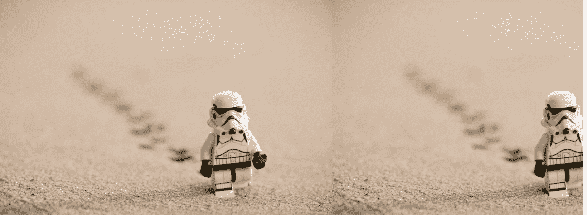
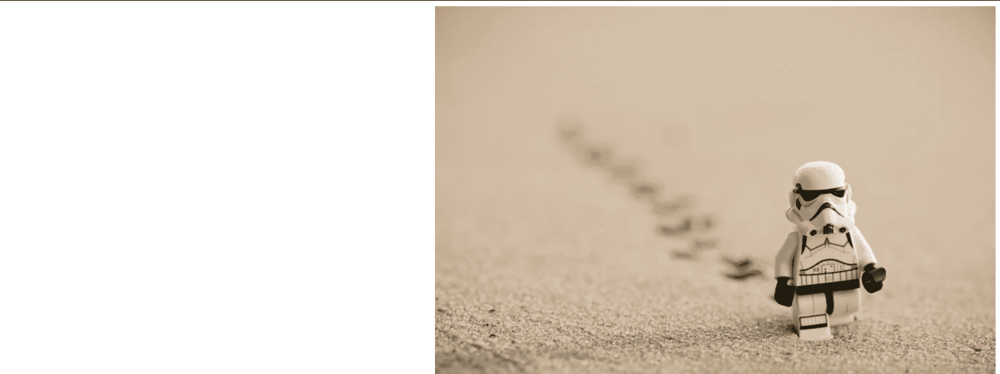
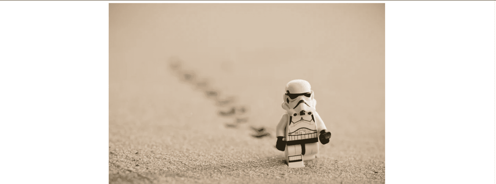
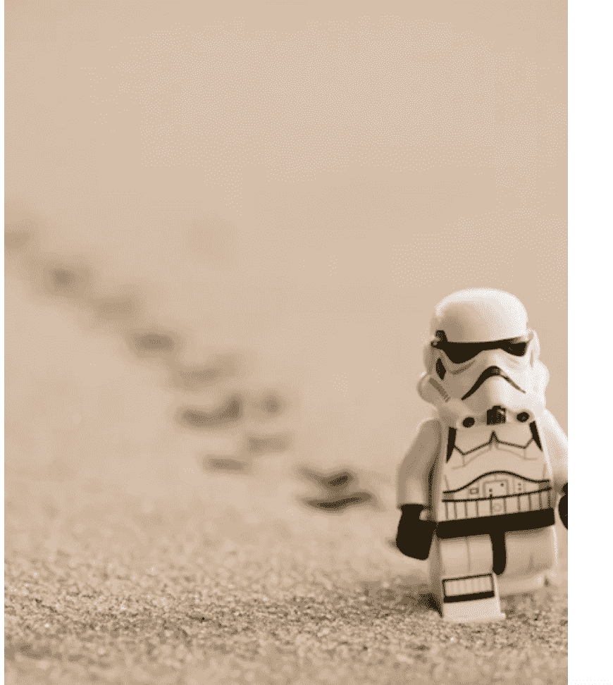
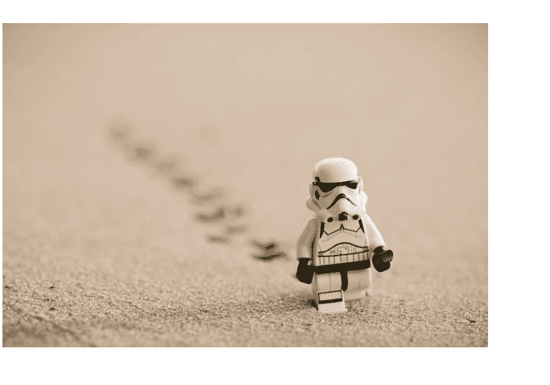

# CSS 背景图片–带有 HTML 示例代码

> 原文：<https://www.freecodecamp.org/news/css-background-image-with-html-example-code/>

用户在网站上看到的内容会影响他们的用户体验。这也将影响他们使用整个网站的难易程度。

在网站特定部分的背景上添加图片通常比仅仅改变背景颜色更具视觉吸引力和趣味性。

现代浏览器支持多种图像文件类型，如`.jpg`、`.png`、`.gif`和`.svg`。

本文解释了如何向 HTML 代码中添加图像，以及如何对它们进行微调以使其看起来更好。

## 背景图像语法

第一步是确保创建一个资源目录(文件夹)来保存要在项目中使用的图像。

例如，我们可以在我们正在处理的项目中创建一个`images`文件夹，并添加一个我们想要使用的名为`sunset.png`的图像。

CSS 属性允许你将图片放在任何你想要的 HTML 元素后面。

这可以是整个页面(通过使用 CSS 中的`body`选择器，它的目标是我们的 HTML 中的`<body>`元素)，也可以只是页面的一个独立的特定部分，比如下面例子中的`section`元素。

要将`background-image`添加到`.css`文件中的节标签，请编写以下代码:

```
section {
     background-image: url("images/sunset.png");
        } 
```

我们来详细讨论一下这里发生了什么:

*   `section`指定要添加图像的标签。
*   `url()`用来告诉 CSS 我们的图像所在的位置。
*   在括号内，`"images/sunset.png"`是图像的路径。这让浏览器知道要拉什么 URL。
*   这个例子中的路径叫做`relative`路径，这意味着它是一个本地文件，相对于我们的项目和我们当前的工作目录，而不是一个网址。要添加图像，我们也可以使用一个`absolute`路径，这是一个完整的网址，以域名 URL ( `http://www.`)开头。
*   使用引号是一个好习惯，但是我们可以省略它们，所以`background-image: url(images/sunset.png)`也一样。
*   别忘了分号！

## 如何停止背景重复

当您将背景图像应用到元素时，默认情况下，它会自动重复。

如果图像比作为背景的标签小，它将重复以填充标签。

我们如何阻止这种情况发生？

属性接受 4 个值，我们可以改变图像重复的方向，或者阻止图像重复出现。

```
section {
    background-repeat: repeat;
        } 
```

如果我们不给`background-repeat`属性赋值，这就是默认值。在这种情况下，图像在水平方向和垂直方向分别重复**，因此在 x 方向和 y 方向分别重复**，直到它填满空间。****

 ****

```
section {
    background-repeat: no-repeat;
        } 
```


`no-repeat`值阻止图像从各个方向重复出现。图像只显示一次。

```
section {
    background-repeat: repeat-y;
        } 
```

该值仅在页面上水平重复图像*。在`x-direction`中，图像在页面上重复出现。数学中的`x-direction`是从左到右。*

```
section {
    background-repeat: repeat-y;
        } 
```

该值仅在页面上垂直重复图像*。在`y-direction`中，图像沿着页面向下重复。数学中的`y-direction`是从上到下。*

 *## 如何设置背景位置

在添加背景图像并阻止它重复之后，我们能够通过改进它的位置来进一步控制它在标签背景中的外观。

我们将使用`background-position`属性来做到这一点。

选择器接受两个值。第一个是水平位置，或 x 方向(跨越标签多远)。第二个是垂直位置，或 y 方向(标签下多远)。

这些值可以是单位，比如一对像素**:**

```
section {
    background-position: 20px 30px;
        } 
```

这将使图像在包含的标签上横向移动 20px，向下移动 30px。

代替像素，我们可以使用一组关键字，如**右、左、上、下或中心**将图像放置在标签的右、左、上、下或中心。

```
section {
    background-position: right center;
        } 
```

这将图像放置在标签中心的右侧。



如果我们想让它水平和垂直居中，我们可以这样做:

```
section {
    background-position: center center;
        } 
```



为了给图像定位更精细的细节，值得一提的是我们可以使用百分比。

```
section {
    background-position: 20% 40%;
        } 
```

这将图像放置在标签上方 20%,标签下方 40%。

到目前为止，我们已经看到了组合使用的值，但我们也可以只指定一个值，如`background-position: 20px;`或`background-position: center;` 或`background-position: 20%;`，将它应用于两个方向。

## 如何调整背景图像的大小

为了控制背景图像的大小，我们可以使用 background-size 属性。

同样，与前面提到的属性一样，它接受两个值。一个用于水平(x)尺寸，一个用于垂直(y)尺寸。

我们可以使用像素，就像这样:

```
section {
    background-size: 20px 40px;
    /* sizes the image 20px across and 40px down the page */
        } 
```

如果我们不知道存储图像的容器的确切宽度，我们可以给这个属性一组特定的值。

*   调整背景图像的大小，使其覆盖整个标签的背景空间，而不管标签的宽度如何。如果图像太大，并且与标签的比例较大，这意味着图像会被拉伸，因此边缘会被裁剪。
*   `background-size: contain;` *包含*这个形象，顾名思义。它将确保整个图像显示在背景中，而不会裁剪掉任何一部分。如果图像比标签小得多，就会留下空白，这将使它重复填充，所以我们可以使用我们前面提到的`background-repeat: no-repeat;`规则。

规则`background-size:cover;`在这种情况下将裁剪部分图像


当我们将其更改为`background-size:contain;`时，我们看到图像缩小以适合 section 标签。



## 如何使用后台附件属性

使用`background-attachment`属性，我们可以控制背景图片的位置，也就是说图片是否固定在浏览器上。

默认值是`background-attachment: scroll;`，其中背景图像和它的标签在一起，并且随着我们的上下滚动而上下滚动，从而跟随页面的自然流动。

属性可以拥有的第二个值是`background-attachement: fixed;`。这使得背景图像停留在相同的位置，固定在页面和浏览器的视窗上。这就产生了视差效果，你可以在这里看到一个例子:

见 [CodePen](https://codepen.io) 上 Dionysia Lemonaki([@ deniselemonaki](https://codepen.io/deniselemonaki))的笔 [](https://codepen.io/deniselemonaki/pen/ZEKyRpp) 。******