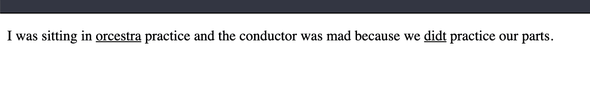
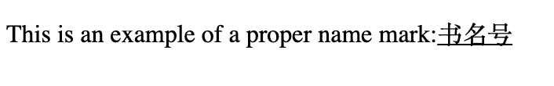
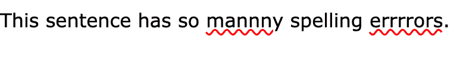
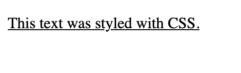
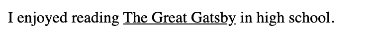

# HTML 下划线文本–如何在示例代码中使用标签

> 原文：<https://www.freecodecamp.org/news/html-underline-text-how-to-use-the-u-tag-with-example-code/>

在这篇文章中，我们将学习`<u>`标签，以及什么时候在 HTML 5 中使用它是合适的。

在旧版本的 HTML 中，你可以用这个标签来给文本加下划线。我们将学习新的 HTML 5 定义和使用 CSS 给文本加下划线的方法。

## 什么是标签？

`<u>`标签代表未连接的注释元素。这个元素是一段内联文本，在风格上看起来与其周围的文本不同，但具有非文本注释。

此元素的默认样式是单下划线。

让我们看一些何时使用`<u>`标签的例子。

### 如何对拼错的单词使用标签

该标签的一个常见用途是指出拼写错误的单词。

```
<p>I was sitting in <u>orcestra</u> practice and the conductor was mad because we <u>didt</u> practice our parts.</p>
```



如果您想将中文文本标记为适当的名称标记，也可以使用`<u>`标签。根据维基百科，

> 一个**专名标志** ( [简体中文](https://en.wikipedia.org/wiki/Simplified_Chinese)):专名号，Zhuāníngào；[繁体中文](https://en.wikipedia.org/wiki/Traditional_Chinese):專名號)是一条[下划线](https://en.wikipedia.org/wiki/Underline)用来标注[专名](https://en.wikipedia.org/wiki/Proper_name)，比如[人物](https://en.wikipedia.org/wiki/Chinese_name)、[地名](https://en.wikipedia.org/wiki/Place_name)、[朝代](https://en.wikipedia.org/wiki/Chinese_dynasties)、组织机构的名称。

```
<p> This is an example of a proper name mark:<u>书名号</u></p>
```



## 如何使用 CSS 改变标签的样式

如果你想指出拼写错误的文本，你可以在标签下面加一条红色波浪线。

```
<p>This sentence has so <u class="spelling">mannny</u> spelling <u class="spelling">errrrors</u>.</p>
```

```
body {
  font-family: Verdana, sans-serif;
}
u.spelling {
  text-decoration: red wavy underline;
}
```



## 避免出于样式目的使用标签

在 HTML 的早期版本中，严格使用`<u>`标签来设计带下划线的文本是合适的。但是在 HTML 5 中，`<u>`标签包含语义，你应该使用 CSS 给你的文本加下划线。

```
<span class="underline">This text was styled with CSS.</span>
```

```
.underline {
  text-decoration: underline;
}
```



## 不要在书名中使用标签

如果你指的是书名，你应该使用`<cite>`标签。默认样式是斜体，但是您可以使用 CSS 覆盖这些样式。

```
<p>I enjoyed reading <cite>The Great Gatsby</cite> in high school.</p>
```

```
cite {
  font-style: normal;
  text-decoration: underline;
}
```



## 结论

标签是一个语义元素，应该只在非常特殊的情况下使用。如果您想指出文本中的拼写错误，那么您可以使用`<u>`标签。

一个不太常见的例子是在中文专有名称标记中使用标签。

你不应该使用`<u>`标签来设计样式。相反，你应该在你的 CSS 中使用`text-decoration:underline;`。

每当你在做一个项目时，学习 HTML 5 元素的正确用法是很重要的，这样你就能以正确的方式使用它们。