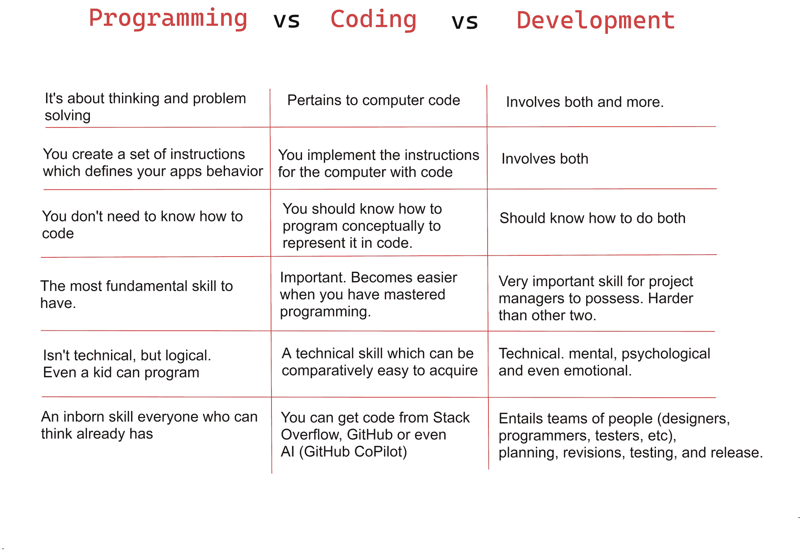

# 编程 VS 编码 VS 开发——有什么区别？

> 原文：<https://www.freecodecamp.org/news/programming-coding-developement-whats-the-difference/>

在我作为一名初露头角的 web 开发人员的早期，我犯了一个相当常见的错误。

在脸书，我给一位高级软件工程师发了一个好友请求(当时我不知道他的职位)，然后开始和他聊天。寒暄过后，我好奇地问他:“你是一名程序员吗？”

这激起了我没有预料到的反应，我得到了一个我非常乐意接受的学校教育。

很多人都做同样的事情——他们将术语**、【程序员】、**、【程序员】、**、【开发人员】、**作为同义词使用。但是这三个术语的意思是一样的吗？****

不完全是。

## 什么是编程？

编程就是逻辑。编程就是思考。

编程就是做决定，或者告诉计算机在不同的情况下做什么决定。一旦你点击了红色按钮，你就可以编程一台电脑/浏览器来访问数据并发出网络请求。

下面是一个程序的简单例子:

如果用户提供的电子邮件不符合常规格式(例如，它遗漏了“@”和“.”。com’)，显示一条错误消息。否则，获取电子邮件并检查它是否已经存在于数据库中。如果它已经存在，向用户显示一条定制的消息。否则，将电子邮件存储在数据库中，并显示一条成功消息。

这是简单的逻辑，与代码无关。当然，应用越复杂，需要做的思考就越多。

编程利用你的批判性思维技巧和能力来解决逻辑问题。这一切都是关于思考和创建计算机或浏览器应该做出的可能决定的网络([也称为算法](https://www.freecodecamp.org/news/algorithm-definition/))。

事实上，你可以用英语进行编程，因为它与任何特定的语言无关。

这就把我们带到了第二个术语:编码。

## 什么是编码？

我将把编码称为编程的子集。编码包括以下主题和活动:

*   编程语言
*   一种语言的语法以及它与其他语言的语法有何不同
*   代码排列
*   代码优化
*   排除故障
*   编写和运行测试
*   创建和使用库和框架

诸如此类。

> 不做程序员也可以做程序员，但不做程序员就不能做程序员。

虽然程序员只需为应用程序思考和构建决策的逻辑框架，但程序员必须用特定的编程语言以标准、高效的方式实现该逻辑。

编码人员必须熟悉代码语法，并掌握最新的和推荐的代码编写方法。

一个程序员必须擅长技术任务，比如测试、调试等等。

代码就是机器能够理解的语言。要实现一个应用程序，你必须采用程序员创建的指令集，并使它能被机器理解。这就是编码的行为。

使用相同的电子邮件验证和存储示例，让我们用 JavaScript 代码实现该逻辑:

```
let database = ['test1@gmail.com', 'test2@gmail.com', 'test3@gmail.com'];

function validateEmail() {
    let regexEmail = /^\w+([.-]?\w+)@\w+([.-]?\w+)(.\w{2,3})+$/;
    let emailAddress = document.getElementbyID('emailFld').value;
    if (!emailAddress.match(regexEmail)) {
        document.getElementbyID('myAlert').innerHTML = "Invalid Email!";
    } else if (database.includes(emailAddress)) {
        document.getElementbyID('myAlert').innerHTML = "Email exists!";
      else {
        database.push(emailAddress);
        document.getElementbyID('myAlert').innerHTML = "Successful!";
        return true;
      }
}

document.getElementById("myBtn").addEventListener("click", validateEmail); 
```

现在，我们已经为 web 浏览器编写了要执行的编程逻辑。换句话说，我们让**给**浏览器引擎编程，让**做出决定**。如果不写代码，这是不可能的。

并非所有类型的代码都可以用来编写程序/指令。HTML 就是这种代码的一个例子。

## 什么是软件开发？

所以现在你可能想知道，**什么是软件开发？**根据[维基百科](https://en.wikipedia.org/wiki/Software_development)，软件开发是:

> 在创建和维护应用程序、框架或其他软件组件的过程中，构思、说明、设计、编程、记录、测试和修复错误的过程。
> 
> 软件开发是一个编写和维护源代码的过程，但从更广泛的意义上来说，它包括从所需软件的构思到软件的最终表现之间所涉及的一切，有时是一个有计划、有结构的过程。
> 
> 因此，软件开发可能包括研究、新开发、原型制作、修改、重用、再工程、维护或任何其他产生软件产品的活动

从上面的广义定义可以看出，开发不仅仅是编程和编码。它是关于创建一个解决现实生活问题的解决方案，通过构建一个解决问题的应用程序，维护这个应用程序，营销它，研究优化它的方法，等等。

开发必须考虑最终用户、DevOps(开发和操作的组合)、团队管理和许多其他事情。

开发人员分析创建提议的应用程序所需的一切，并监督开发过程。

软件开发人员的一个很好的例子是技术创业公司的创始人。

他们将应用程序视为软件产品，对现实生活中的人们来说是一种有价值的服务。他们承担将这一概念变为现实的过程，包括应用程序的实际编程和编码。

然后他们监督应用程序的维护。他们甚至会资助研究以提高公司服务的性能和效率等等。

发展是一整套措施。

## 我对编程、编码和开发的看法

你的心态很重要。把软件开发想象成一个总是从编程开始的过程。在成为程序员之前，你最好先把自己训练成一名程序员。

诚然，有些人实际上是通过研究简单的循环和代码来学习如何编程的。这也很好。这就是为什么我建议新人去上[数据结构和算法课程](https://www.freecodecamp.org/news/data-structures-and-algorithms-in-javascript/)。

明确区分这三个术语可以帮助你更快的学习软件开发。它会帮助你知道在你的学习中应该优先考虑什么。它会让你从一个不同的角度看软件开发的整个过程。

从更轻松的角度来说，它可以帮助你避免与那些过于热爱自己头衔的开发人员之间的尴尬局面。:)

最近，我在 YouTube 上看到一个视频，很好地区分了这三个词的区别。我想你可能会从中受益:

[https://www.youtube.com/embed/CIRGjwYgdT4?feature=oembed](https://www.youtube.com/embed/CIRGjwYgdT4?feature=oembed)

## 结论

编程就是构思一个逻辑模式网络，它定义了应用程序的行为。

编码包括以机器能够理解的形式和最佳的方式实现指令集。

开发是关于交付一个合适的产品并维护它。开发包含了创建一个完整的包来满足最终用户的过程。



Quick summary note

我希望你能从这篇文章中获得一些启示。这个话题已经成为一个大辩论的主题，你可能不同意我的一些观点，这完全没问题。我只是分享我对这件事的看法。

你可以在我的个人博客上查看我的其他一些帖子。

感谢您的阅读。

> P/S:如果你正在学习 JavaScript，我创建了一本电子书，用手绘数字笔记教授 50 个 JavaScript 主题。[点击这里查看](https://ubahthebuilder.gumroad.com/l/js-50)。