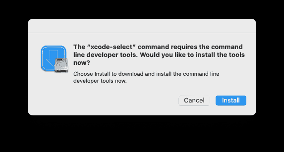
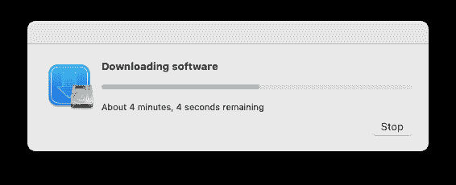
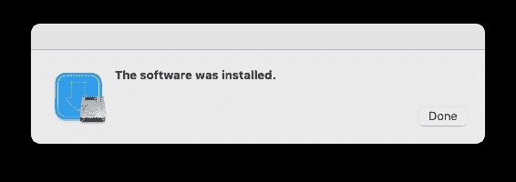
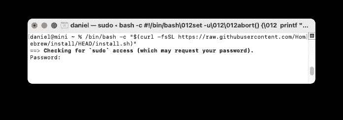
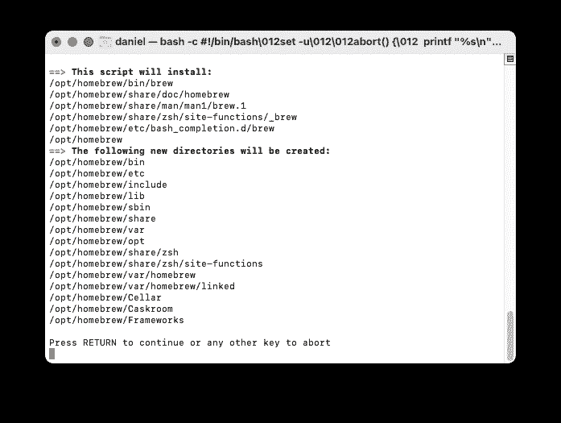
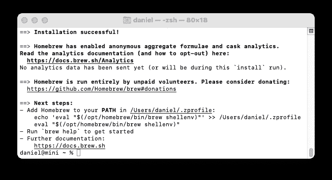

# 如何在 Mac 上安装 Xcode 命令行工具

> 原文：<https://www.freecodecamp.org/news/install-xcode-command-line-tools/>

开发人员需要安装 Xcode 命令行工具，然后才能在 Mac 上开发软件。

苹果为程序员提供了一个完整的开发环境，名为 Xcode。如果您正在为 macOS、iOS、tvOS 和 watchOS 开发软件，您必须安装完整的 Xcode 应用程序。

它不是预装的，但你可以从[苹果开发者网站](https://developer.apple.com/download/)或你 Mac 上的 App Store 安装。

## 什么是 Xcode 命令行工具？

如果你不是为苹果设备开发软件，你不需要完整的 Xcode 应用程序(它需要超过 40GB 的磁盘空间！).

相反，您将安装 Xcode 命令行工具。它是一个较小的软件包，供软件开发人员使用，其工具在命令行上运行，即在终端应用程序中运行。

自从计算开始以来，程序员就在 Unix 操作系统上使用这些工具，它们是几乎所有软件开发的基础。

幸运的是，Xcode 命令行工具包只需要 1.2GB 的磁盘空间。

在 Mac 上安装 Xcode 命令行工具有三种选择:

*   安装完整的 Xcode 软件包
*   被命令触发时安装 Xcode 命令行工具
*   作为自制软件安装的一部分安装 Xcode 命令行工具。

我不建议安装完整的 Xcode 包，除非你是在为苹果设备开发软件。下载时间太长，会消耗不必要的磁盘空间。相反，尝试两种更快的方法。

## 如何从命令提示符安装 Xcode 命令行工具

Apple 已经使安装 Xcode 命令行工具变得很容易，因为某些命令会提示您开始安装。

以下是将触发安装 Xcode 命令行工具提示的命令示例:

*   `clang`–将源代码转换成可执行程序的编译器
*   `gcc`–GNU 编译器
*   `git`–随用随存的版本控制系统

在终端中运行这些命令将会显示安装 Xcode 命令行工具的提示。我在别处写过关于如何在 MacOS 上打开终端的文章，只需点击菜单栏中的 Spotlight 图标，输入“终端”

您也可以在终端中输入命令`xcode-select --install`开始安装过程。您会看到一个面板，要求您安装 Xcode 命令行工具。



单击“安装”开始下载和安装过程。



在 2021 Mac M1 Mini 上安装需要 8 分钟，互联网连接速度为 100Mbps。通过慢速互联网连接，它在 Mac Intel 上要慢得多。



安装完成后，您会看到一条确认消息。

验证您已成功安装 Xcode 命令行工具:

```
$ xcode-select -p 
```

您应该看到以下内容:

```
/Library/Developer/CommandLineTools 
```

## 如何使用自制软件安装 Xcode 命令行工具

使用命令提示符安装 Xcode 命令行工具很容易，我推荐一种更简单的方法:使用自制软件。

这个选项是最近才添加到 Homebrew 的，所以很多开发者并不知道。

家酿是流行的 Mac 软件包管理器。大多数开发人员需要的编程语言和实用程序并没有安装在 macOS 上，也没有包含在 Xcode 命令行工具包中。家酿几乎可以为开发者安装任何开源工具。

既然你可能需要自制软件，你也可以让自制软件为你安装 Xcode 命令行工具。

首先，检查家酿是否已经安装。

```
$ brew 
```

如果未安装 Homebrew，您将看到:

```
zsh: command not found: brew 
```

家酿提供了一个安装脚本，你可以用一个命令运行它(检查它在[家酿网站](https://brew.sh/)没有改变)。

```
$ /bin/bash -c "$(curl -fsSL https://raw.githubusercontent.com/Homebrew/install/HEAD/install.sh)" 
```

家酿安装脚本将要求您输入您的 Mac 用户密码。这是您用来登录 Mac 的密码。

```
Password: 
```

您将看不到键入的字符。完成后按 enter 键。



如果您尚未安装 Xcode 命令行工具，您会看到一条信息“将安装 Xcode 命令行工具”当出现 Homebrew 安装脚本提示时，请按 return 键继续。



您将看到诊断和进度消息。在 2021 Mac M1 Mini 上安装自制软件需要 2 到 15 分钟，互联网连接速度为 100Mbps。通过慢速互联网连接，它在 Mac Intel 上要慢得多。



在 Mac Intel 机器上，这就是你需要做的一切——家酿就可以使用。在 Mac Intel 上，Homebrew 将自己安装到`/usr/local/bin`目录中，该目录已经配置为由 shell 使用 macOS 默认的`$PATH`进行访问。

在苹果硅机器上，还有一个步骤。自制文件被安装到`/opt/homebrew`文件夹中。但是这个文件夹不是默认的`$PATH`的一部分。遵循自制软件的建议，创建一个包含设置自制软件命令的`~/.zprofile`文件。Homebrew 在安装过程结束时显示说明:

```
- Add Homebrew to your PATH in ~/.zprofile:
echo 'eval "$(/opt/homebrew/bin/brew shellenv)"' >> ~/.zprofile
eval "$(/opt/homebrew/bin/brew shellenv)" 
```

安装家酿后，检查家酿是否安装正确。

```
$ brew doctor 
```

您应该看到这个:

```
Your system is ready to brew. 
```

如果家酿成功安装，在`/usr/local`(MAC OS Intel)或`/opt/homebrew`(Apple Silicon)中会有家酿文件。

现在你已经安装了 Xcode 命令行工具和 Homebrew。如果您想了解更多关于添加自制软件包来设置您的开发环境的信息，请参见[安装自制软件包](https://mac.install.guide/homebrew/6.html)。

## 更多信息

我已经写了一个深入的指南来指导[安装 Xcode 命令行工具](https://mac.install.guide/commandlinetools/index.html)，它超越了这些基础知识。

在指南中，我解释了如何检查 [Xcode 命令行工具是否已经安装](https://mac.install.guide/commandlinetools/2.html)。我将更详细地介绍如何[用自制软件](https://mac.install.guide/commandlinetools/3.html)安装 Xcode 命令行工具。最后，我解释一下如何[卸载 Xcode 命令行工具](https://mac.install.guide/commandlinetools/6.html)，[重装 Xcode 命令行工具](https://mac.install.guide/commandlinetools/7.html)，并提供一个[列表，列出你可以使用的 Xcode 命令行工具](https://mac.install.guide/commandlinetools/8.html)。

还有一个完整的指南[为 Mac](https://mac.install.guide/homebrew/index.html) 安装家酿软件，解释了如何[更新家酿软件](https://mac.install.guide/homebrew/4.html)、[卸载家酿软件](https://mac.install.guide/homebrew/5.html)，以及跟上其他[家酿软件的日常工作](https://mac.install.guide/homebrew/8.html)。

## 您的开发环境

MacOS 是最流行的软件开发平台，因为该操作系统是基于 Unix 的，Unix 是软件开发的长期标准。

安装 Xcode 命令行工具后，您将拥有添加几乎任何开源开发工具的坚实基础。

添加 Homebrew，你就有了一个包管理器，可以安装版本管理器、编程语言和几乎任何你可能需要的工具。

结合一个文本编辑器和终端应用程序，您将为在 freeCodeCamp 上找到的任何教程做好准备。