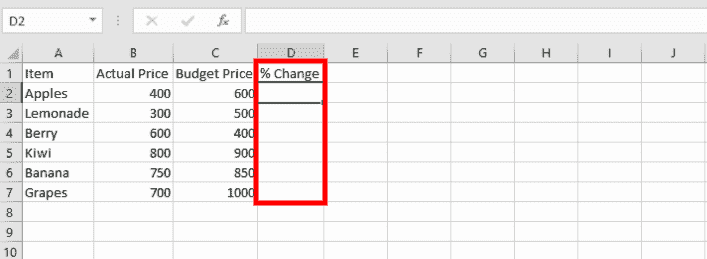
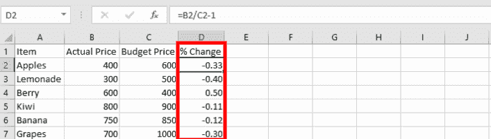
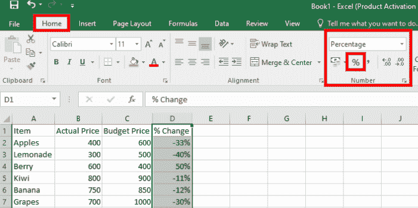
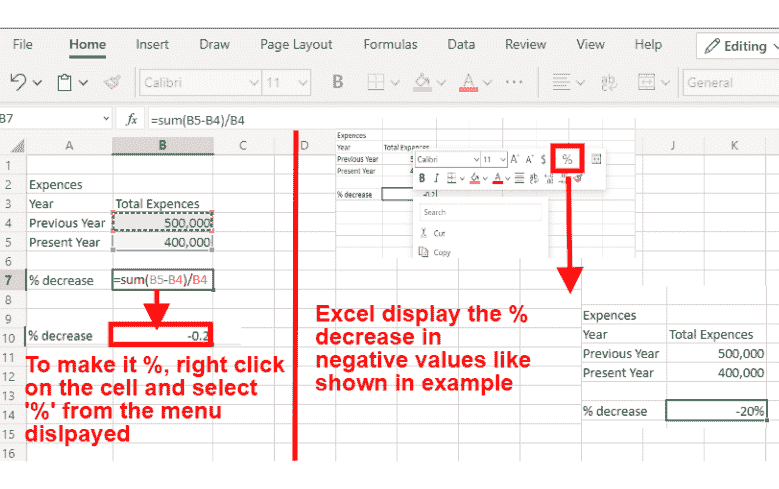

# 如何在 Excel 中计算百分比变化–查找增加和减少的百分比

> 原文：<https://www.freecodecamp.org/news/how-to-calculate-percent-change-in-excel-find-increase-and-decrease-percentage/>

在本文中，您将学习如何使用 Excel 计算百分比变化，以及如何找到百分比值的增加和减少。

当进行计算时，微软的 Excel 是最常用的软件。许多企业的各个部门都使用它，如会计、库存跟踪、时间记录等等。

它有许多有用的内置功能，如公式，它可以帮助你做精确的计算。

在本文中，我们将介绍如何使用 Excel 计算百分比变化，以及如何找到百分比值的增加和减少。

让我们开始吧。

## 什么是百分比变化？

百分比变化是数学中的一个概念，表示随着时间发生的变化。它主要适用于会计领域比较新旧变化。

为了在 Excel 中计算百分比变化，您需要使用一个公式。它是一个公式，用来记录不同的数据，比如资产负债表、产品价格等等。

**公式语法**

```
percentage change = (NEW - ORIGINAL) / ORIGINAL 
```

## 如何在 Excel 中计算百分比

让我们来看一个例子，以了解工作中的公式。

**例 1**
如果你 5 月份的收入是 1250 美元，6 月份是 1750 美元，百分比变化是多少？

**解决方案**
在这个问题中，我们要寻找的是从五月到六月的收益变化。

使用我们的公式:

```
percentage change = (NEW - ORIGINAL) / ORIGINAL

hence:
(1,750 - 1,250) / 1250 = 0.4 or 40% 
```

**例 2**
现在让我们看看如何在 excel 中使用少量的数据条目来完成这项工作，以便更好地理解 Excel 函数的工作原理:

*第一步:数据输入*。
下面我们将看到包含一些数据的 n 个 excel 工作区，我们需要计算`D`栏中显示的百分比变化。


*第二步:公式*。
在这种情况下，我们将让 **A =实际价格**和 **B =预算价格**，因此我们的公式将为: **A/B-1** 。该公式将被输入到单元格 **D2** 中。


要执行该公式，我们只需按下*键，输入*即可。我们将得到十进制数值的百分比变化，如下所示:

> 如果你得到的数字是正数，比如 **0.2** ，那么百分比增加。如果数字是负数，如 **-0.2** ，那么百分比下降。



*第三步:分配%* 。
为了给我们的值分配`%`符号，我们有几个选项。我们可以:

*   右键单击这些值并选择“%”，然后向下拖动光标将更改应用到其他值。或者
*   突出显示整个列“% Change ”,并从主页菜单中选择工作表中数字下的%符号。
    

在 excel 中计算百分比变化时，我们有两个选项可以使用，即:我们正在计算增加或减少的百分比。让我们来看看如何解决这个问题:

## 如何计算加薪百分比

为了计算增加的百分比，你需要计算出你比较的两个数字之间的差异，这意味着你需要原始的细节和新增加的细节。

在这种情况下，我们的公式将分为两步:

```
increase = (NEW - ORIGINAL) 
```

下一步将是用增加数除以原始数，然后乘以 100，得到百分比值。

```
percentage increase = Increase ÷ Original Number × 100. 
```

如果你得到的数字是负数，比如 **-0.10** ，那么这个百分比实际上是减少了而不是增加了。

**例子**
你的家庭账单在 9 月份是 100 美元，但在 10 月份增加到了 125 美元。从 9 月到 10 月的百分比增长是多少？

**解决方案**
参考上面的公式，首先我们需要得到增加的值，然后将其转换成百分比。

```
increase = (NEW - ORIGINAL)

hence:
increase = (125 - 100 = 25)

then:
percentage increase = Increase ÷ Original Number × 100.
% increase = 25 ÷ 100 × 100 
    = 25% 
```

如前所述，在 excel 中计算百分比变化时，在计算百分比变化时将遵循相同的步骤。

## 如何计算减少百分比

我们在计算百分比增长时应用的相同程序将应用于此处，唯一的不同是这一次我们将从新值中减去原始值。

**公式**

```
 Decrease = Original Number - New Number 
```

下一步，您将得到的减少值除以原始数字，然后乘以 100，得到%值。

```
Percentage Decrease = Decrease ÷ Original Number × 100 
```

如果你得到的数字是负数，比如 **-0.10** ，那么这个百分比实际上是增加了而不是减少了。

**例**
前一年，你的支出是 50 万美元。今年，你的花费是 40 万美元。与去年相比，你今年的开支减少了百分之几？

**解决方案**
第一步是我们得到减少的值，这将很容易引导我们得到相同的百分比值。

```
 Decrease = Original Number - New Number

 therefore:
 Decrease = (500,000 - 400,000)
             = 100,000

 hence:
 Percentage Decrease = Decrease ÷ Original Number × 100
 % Decrease = 100,000 ÷ 500,000 × 100
             = 20% 
```

也许你可能想知道我如何在 excel 工作表上做同样的事情？这里有一个和工作 f 相同的图示:


现在你知道了，不管你手头有多少数据，上面举例说明的方法都会起作用。

现在，当你使用软件时，并不总是能保证成功，你肯定会遇到一些错误。下面是一些你最有可能遇到的问题以及如何解决它们。

## 使用公式时常见的 Excel 错误

*   **#DIV/0！**:试图将一个数除以零时出现。要解决这个问题，请将除数改为一个非零数字。
*   **#VALUE** :当单元格留空时，或者当一个函数需要一个数字，但您传递给它的是文本时，就会出现这种情况。
*   **NUM！**:公式包含无效数值时出现。
*   **####** :当值太多而无法在分配的列中显示时发生。解决方案是展开相应的列。
*   **#姓名？**:如果你在公式中输入了错误的值，比如函数拼写错误。要解决这个问题，请写出正确的公式名称。
*   **#REF！**:引用无效单元格或删除已被公式引用的单元格时发生。要解决此问题，请正确引用单元格。

## 包裹

现在，有了这些知识，你应该能够计算百分比变化。你有没有想到谁会从这里获得的知识中受益，请与他们分享这篇文章。

下面是我们讨论内容的快速回顾:

*   在百分比变化计算中，我们至少需要两个值。
*   百分比变化可以是正数，也可以是负数。
*   如果你得到的下降百分比是负数，那么这个百分比实际上是增加了而不是减少了。
*   如果你得到的增长百分比是负数，那么这个百分比实际上是减少了而不是增加了。

这里有一些资源可以帮助您更好地理解如何使用 Excel。

*   [微软 Excel 初学者教程-全程](https://www.youtube.com/watch?v=Vl0H-qTclOg) ( *视频教程*)
*   [百分比变化练习题](https://corbettmaths.com/wp-content/uploads/2013/02/percentage-change-pdf.pdf)

快乐编码❤