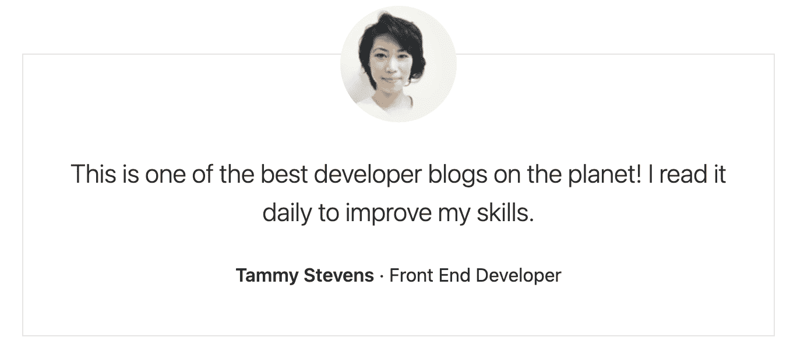
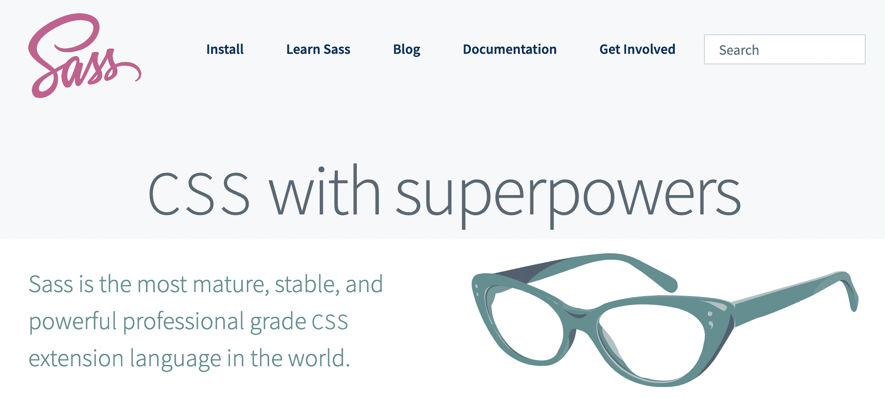
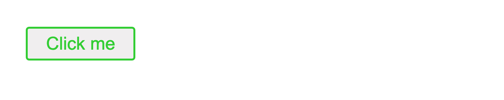

# 如何设计你的 React 应用——2021 年编写 CSS 的 5 种方法

> 原文：<https://www.freecodecamp.org/news/how-to-style-react-apps-with-css/>

在设计 React 应用程序时，您有大量不同的选择。你选择哪个？

当你在 React 应用中写 CSS 时，我已经分解了你必须选择的 5 种主要方式。

在 React 中，对于每个项目来说，没有第一种处理写作风格的方法。每个项目都不一样，都有不同的需求。

这就是为什么在每一节的最后，我将介绍每种方法的优缺点，以帮助您选择最适合您项目的方法。

我们开始吧！

> 想要成为一名专业的 React 开发人员，同时构建令人惊叹的项目吗？查看 [**反应训练营**](https://reactbootcamp.com) 。

## 我们将编码什么

为了查看每种样式方法的代码是如何相互比较的，我们将创建同一个示例:一个简单但干净的证明卡。



> 想和这些例子一起编码吗？前往 [react.new](https://react.new) 立即创建一个新的 react 应用程序✨

## 内嵌样式

内联样式是设计任何 React 应用程序最直接的方式。

内联样式化元素不需要创建单独的样式表。

与样式表中的样式相比，直接应用于元素的样式也具有更高的优先级。这意味着它们“覆盖”可能应用于元素的其他样式规则。

这是我们的内联式推荐卡:

```
export default function App() {
  return (
    <section
      style={{
        fontFamily: '-apple-system',
        fontSize: "1rem",
        fontWeight: 1.5,
        lineHeight: 1.5,
        color: "#292b2c",
        backgroundColor: "#fff",
        padding: "0 2em"
      }}
    >
      <div
        style={{
          textAlign: "center",
          maxWidth: "950px",
          margin: "0 auto",
          border: "1px solid #e6e6e6",
          padding: "40px 25px",
          marginTop: "50px"
        }}
      >
        
        <div>
          <p
            style={{
              lineHeight: 1.5,
              fontWeight: 300,
              marginBottom: "25px",
              fontSize: "1.375rem"
            }}
          >
            This is one of the best developer blogs on the planet! I read it daily to improve my skills.
          </p>
        </div>
        <p
          style={{
            marginBottom: "0",
            fontWeight: 600,
            fontSize: "1rem"
          }}
        >
          Tammy Stevens
          <span style={{ fontWeight: 400 }}> · Front End Developer</span>
        </p>
      </div>
    </section>
  );
}
```

尽管有一些立竿见影的好处，内联样式只是非常小的应用程序可以接受的选择。当您的代码库稍微增长时，内联样式的困难就变得很明显。

如上面的代码示例所示，如果所有的样式都是内联的，即使像这样的小组件也会变得非常庞大。

不过，一个快速的技巧是将内联样式放入可重用的变量中，这些变量可以存储在一个单独的文件中:

```
const styles = {
  section: {
    fontFamily: "-apple-system",
    fontSize: "1rem",
    fontWeight: 1.5,
    lineHeight: 1.5,
    color: "#292b2c",
    backgroundColor: "#fff",
    padding: "0 2em"
  },
  wrapper: {
    textAlign: "center",
    maxWidth: "950px",
    margin: "0 auto",
    border: "1px solid #e6e6e6",
    padding: "40px 25px",
    marginTop: "50px"
  },
  avatar: {
    margin: "-90px auto 30px",
    width: "100px",
    borderRadius: "50%",
    objectFit: "cover",
    marginBottom: "0"
  },
  quote: {
    lineHeight: 1.5,
    fontWeight: 300,
    marginBottom: "25px",
    fontSize: "1.375rem"
  },
  name: {
    marginBottom: "0",
    fontWeight: 600,
    fontSize: "1rem"
  },
  position: { fontWeight: 400 }
};

export default function App() {
  return (
    <section style={styles.section}>
      <div style={styles.wrapper}>
        
        <div>
          <p style={styles.quote}>
            This is one of the best developer blogs on the planet! I read it
            daily to improve my skills.
          </p>
        </div>
        <p style={styles.name}>
          Tammy Stevens
          <span style={styles.position}> · Front End Developer</span>
        </p>
      </div>
    </section>
  );
}
```

尽管有了这种改进，内联样式并没有任何简单的 CSS 样式表所能提供的许多基本特性。

例如，您不能编写动画、嵌套元素的样式(即所有子元素、第一个子元素、最后一个子元素)、伪类(即:hover)和伪元素(::first-line)等等。

如果你正在构建一个应用程序的原型，内联样式是非常好的。然而，随着你进一步深入，你将需要切换到另一个 CSS 样式选项来给你基本的 CSS 特性。

👍优点:

*   编写样式的最快方法
*   适用于原型制作(编写内联样式，然后移至样式表)
*   有很大的偏好(可以覆盖样式表中的样式)

👎缺点:

*   将普通 CSS 转换为内联样式很繁琐
*   大量的内嵌样式使得 JSX 难以阅读
*   你不能使用基本的 CSS 功能，如动画，选择器等。
*   扩展性不好

## 普通 CSS

通常不使用内联样式，而是导入 CSS 样式表来样式化组件的元素。

在样式表中编写 CSS 可能是对 React 应用程序进行样式化的最常见和最基本的方法，但是不应该这么容易就放弃它。

由于 CSS 标准中可用的功能越来越多，用“简单”CSS 样式表编写样式一直在变得越来越好。

这包括存储动态值的 CSS 变量、精确选择子元素的各种高级选择器，以及像`:is`和`:where`这样的新伪类。

这是我们用普通 CSS 编写的推荐卡，导入到 React 应用程序的顶部:

```
/* src/styles.css */

body {
  font-family: -apple-system, system-ui, BlinkMacSystemFont, "Segoe UI", Roboto, "Helvetica Neue", Arial, sans-serif;
  margin: 0;
  font-size: 1rem;
  font-weight: 1.5;
  line-height: 1.5;
  color: #292b2c;
  background-color: #fff;
}
.testimonial {
  margin: 0 auto;
  padding: 0 2em;
}
.testimonial-wrapper {
  text-align: center;
  max-width: 950px;
  margin: 0 auto;
  border: 1px solid #e6e6e6;
  padding: 40px 25px;
  margin-top: 50px;
}
.testimonial-quote p {
  line-height: 1.5;
  font-weight: 300;
  margin-bottom: 25px;
  font-size: 1.375rem;
}
.testimonial-avatar {
  margin: -90px auto 30px;
  width: 100px;
  border-radius: 50%;
  object-fit: cover;
  margin-bottom: 0;
}
.testimonial-name {
  margin-bottom: 0;
  font-weight: 600;
  font-size: 1rem;
}
.testimonial-name span {
  font-weight: 400;
}
```

```
// src/App.js

import "./styles.css";

export default function App() {
  return (
    <section className="testimonial">
      <div className="testimonial-wrapper">
        
        <div className="testimonial-quote">
          <p>
            This is one of the best developer blogs on the planet! I read it daily to improve my skills.
          </p>
        </div>
        <p className="testimonial-name">
          Tammy Stevens<span> · Front End Developer</span>
        </p>
      </div>
    </section>
  );
}
```

对于我们的证明卡，请注意我们正在创建应用于每个单独元素的类。这些类都以同一个名字`testimonial-`开始。

用样式表编写的 CSS 是应用程序的首选。与内联样式不同，它可以按照您需要的任何方式来设计您的应用程序。

一个小问题可能是您的命名约定。一旦你有了一个开发得非常好的应用程序，就很难为你的元素想出唯一的类名，特别是当你有 5 个 div 互相包装在一起的时候。

如果您没有一个您确信的命名约定(即 BEM)，那么很容易出错，而且会创建多个同名的类，这会导致冲突。

此外，编写普通的 CSS 可能比像 SASS/SCSS 这样的新工具更加冗长和重复。因此，与 SCSS 或 CSS-in-JS 库之类的工具相比，用 CSS 编写你的样式要花更多的时间。

另外，值得注意的是，由于 CSS 级联到所有子元素，如果您将 CSS 样式表应用于组件，它的作用范围不仅仅是该组件。它的所有声明的规则将被转移到你的样式组件的任何子元素中。

如果你对 CSS 有信心，它绝对是你设计任何 React 应用程序的一个可行的选择。

也就是说，有许多 CSS 库用更少的代码为我们提供了 CSS 的所有功能，并包含了许多 CSS 本身永远不会拥有的附加功能(如作用域样式和自动供应商前缀)。

👍优点:

*   为我们提供了现代 CSS 的所有工具(变量、高级选择器、新的伪类等等。)
*   帮助我们从内联样式中清理组件文件

👎缺点:

*   需要设置供应商前缀，以确保最新功能适用于所有用户
*   比其他 CSS 库(如 SASS)需要更多的输入和样板文件
*   任何样式表级联到组件和所有子组件；未限定范围
*   必须使用可靠的命名约定来确保样式不冲突

## 萨斯/ SCSS

什么是萨斯？SASS 是一个首字母缩写，代表:语法上令人敬畏的样式表。

SASS 给了我们一些强大的工具，其中许多是普通 CSS 样式表中不存在的。它包括变量、扩展样式和嵌套等特性。



SASS 允许我们用两种不同的样式表编写样式，并带有扩展。scss 和. sass。

SCSS 样式是以类似于普通 CSS 的语法编写的，然而 SASS 样式不要求我们在编写样式规则时使用开括号和闭括号。

下面是一个带有一些嵌套样式的 SCSS 样式表的快速示例:

```
/* styles.scss */

nav {
  ul {
    margin: 0;
    padding: 0;
    list-style: none;
  }

  li { display: inline-block; }

  a {
    display: block;
    padding: 6px 12px;
    text-decoration: none;
  }
}
```

将它与用 SASS 样式表编写的相同代码进行比较:

```
/* styles.sass */

nav
  ul
    margin: 0
    padding: 0
    list-style: none

  li
    display: inline-block

  a
    display: block
    padding: 6px 12px
    text-decoration: none 
```

由于这不是常规的 CSS，所以需要从 SASS 编译成普通的 CSS。在我们的 React 项目中，可以使用 node-sass 这样的库。

如果您正在使用 Create React App 项目，要开始使用。scss 和。sass 文件，您可以使用 npm 安装 node-sass:

```
npm install node-sass
```

这是我们的 SCSS 风格的推荐卡:

```
/* src/styles.scss */

$font-stack: -apple-system, system-ui, BlinkMacSystemFont, "Segoe UI", Roboto, "Helvetica Neue", Arial, sans-serif;
$text-color: #292b2c;

%font-basic {
  font-size: 1rem;
}

body {
  @extend %font-basic;
  font-family: $font-stack;
  color: $text-color;
  margin: 0;
  font-size: 1rem;
  font-weight: 1.5;
  line-height: 1.5;
  background-color: #fff;
}

/* unchanged rules skipped */

.testimonial-name {
  @extend %font-basic;
  margin-bottom: 0;
  font-weight: 600;

  span {
    font-weight: 400;
  }
}
```

这些样式给了我们以下特征:变量、扩展样式和嵌套样式。

**变量**:您可以通过编写变量来使用动态值，就像在 JavaScript 中一样，通过在开头用`$`来声明它们。

有两个变量可以在多个规则中使用:`$font-stack`、`$text-color`。

**扩展/继承**:您可以通过扩展来添加样式规则。要扩展规则，您可以创建自己的选择器，它可以像变量一样重用。您想要扩展的规则名称以`%`开头。

变量`%font-basic`由规则`body`和`.testimonial-name`继承。

**嵌套**:您可以嵌套它们，而不是编写多个以同一个选择器开始的规则。

在`.testimonial-name`中，我们使用嵌套的选择器来定位其中的`span`元素。

你可以在这里找到 SCSS 的 React 应用程序的工作版本。

👍优点:

*   包括许多动态 CSS 特性，如扩展、嵌套和混合
*   CSS 样式可以用比普通 CSS 更少的样板文件来编写

👎缺点:

*   像普通 CSS 一样，样式是全局的，不局限于任何一个组件
*   CSS 样式表开始包含一些 SASS 独有的特性，比如 CSS 变量(不一定是缺点，但值得注意)
*   萨斯/ SCSS 经常需要设置，比如安装节点库`node-sass`

## CSS 模块

CSS 模块是 CSS 或 SASS 之类的东西的另一个微小的替代物。

CSS 模块的伟大之处在于它们可以与普通的 CSS 或 SASS 一起使用。此外，如果你正在使用 Create React 应用程序，你可以开始使用 CSS 模块，无需任何设置。

下面是我们用 CSS 模块编写的应用程序:

```
/* src/styles.module.css */

body {
  font-family: -apple-system, system-ui, BlinkMacSystemFont, "Segoe UI", Roboto, "Helvetica Neue", Arial, sans-serif;
  margin: 0;
  font-size: 1rem;
  font-weight: 1.5;
  line-height: 1.5;
  color: #292b2c;
  background-color: #fff;
}

/* styles skipped */

.testimonial-name span {
  font-weight: 400;
}
```

```
import styles from './styles.module.css';

export default function App() {
  return (
    <section className={styles.testimonial}>
      <div className={styles['testimonial-wrapper']}>
        
        <div>
          <p className={styles['testimonial-quote']}>
            This is one of the best developer blogs on the planet! I read it
            daily to improve my skills.
          </p>
        </div>
        <p className={styles['testimonial-name']}>
          Tammy Stevens
          <span> · Front End Developer</span>
        </p>
      </div>
    </section>
  );
}
```

我们的 CSS 文件在扩展名`.css`前有名称`.module`。任何 CSS 模块文件都必须包含“模块”这个名称，并以适当的扩展名结尾(如果我们使用的是 CSS 或 SASS/SCSS)。

如果我们看上面的代码，有趣的是 CSS 模块就像普通的 CSS 一样编写，但是被导入和使用，就像它是作为对象(内联样式)创建的一样。

CSS 模块的好处是它有助于避免我们与普通 CSS 的类冲突问题。我们引用的属性变成了惟一的类名，在我们的项目构建时，这些类名不会相互冲突。

我们生成的 HTML 元素将如下所示:

```
<p class="_styles__testimonial-name_309571057">
  Tammy Stevens
</p>
```

另外，CSS 模块解决了 CSS 中的全局范围问题。与普通的 CSS 样式表相比，使用模块声明到单个组件的 CSS 不会级联到子组件。

因此，最好使用 CSS 模块，而不是 CSS 和 SASS，以确保类不会冲突，并编写仅适用于一个或另一个组件的可预测样式。

👍优点:

*   样式的作用域是一个或另一个组件(不像 CSS / SASS)
*   唯一的、生成的类名确保没有样式冲突
*   无需在 CRA 项目中设置，即可立即使用它们
*   可以与 SASS / CSS 一起使用

👎缺点:

*   引用类名可能很棘手
*   使用 CSS 样式(如对象属性)可能需要一个学习过程

## CSS-in-JS

类似于 React 允许我们用 JSX 将 HTML 写成 JavaScript，CSS-in-JS 也对 CSS 做了类似的事情。

CSS-in-JS 允许我们直接在组件的 javascript(。js)文件。

它不仅允许您编写 CSS 样式的规则，而不必创建一个。css 文件，但是这些样式的范围仅限于单个组件。

换句话说，你可以毫无意外地添加、更改或删除 CSS。更改一个组件的样式不会影响应用程序其余部分的样式。

CSS-in-JS 经常使用一种特殊类型的 JavaScript 函数，称为标记模板文字。最棒的是，我们仍然可以直接在 JS 中编写普通的 CSS 样式规则！

下面是一个流行的 CSS-in-JS 库 Styled Components 的快速示例:

```
import styled from "styled-components";

const Button = styled.button`
  color: limegreen;
  border: 2px solid limegreen;
  font-size: 1em;
  margin: 1em;
  padding: 0.25em 1em;
  border-radius: 3px;

  &:hover {
    opacity: 0.9;
  }
`;

export default function App() {
  return (
    <div>
      <Button>Click me</Button>
    </div>
  );
}
```



请注意以下几点:

1.  您可以编写普通的 CSS 样式，但可以包含嵌套样式和伪类(如 hover)。
2.  您可以将样式与任何有效的 HTML 元素相关联，例如上面的按钮元素(见`styled.button`)。
3.  您可以创建具有这些关联样式的新组件。了解如何在我们的应用程序组件中使用`Button`。

既然这是一个组件，那么可以传道具吗？是啊！我们可以导出这个组件，在我们喜欢的应用程序中的任何地方使用它，并通过 props 赋予它动态特性。

比方说，你想要上面的`Button`的一个倒置的变体，有一个倒置的背景和文本。没问题。

将`inverted`属性传递给我们的第二个按钮，在`Button`中，您可以使用带有内部函数的`${}`语法来访问传递给组件的所有属性。

```
import styled from "styled-components";

const Button = styled.button`
  background: ${props => props.inverted ? "limegreen" : "white"};
  color: ${props => props.inverted ? "white" : "limegreen"};
  border: 2px solid limegreen;
  font-size: 1em;
  margin: 1em;
  padding: 0.25em 1em;
  border-radius: 3px;

  &:hover {
    opacity: 0.9;
  }
`;

export default function App() {
  return (
    <div>
      <Button>Click me</Button>
      <Button inverted>Click me</Button>
    </div>
  );
} 
```

在函数的返回中，可以选择`inverted`道具，用一个三元来有条件地确定背景和文字的颜色。

结果如下:


使用 CSS-in-JS 库来设计 React 应用程序还有很多好处(太多了，这里不一一介绍)，我将在下面列出其中一些。

一定要看看 React 最流行的两个 CSS-in-JS 库:Emotion 和 Styled Components。

使用 CSS-in-JS 库的一个缺点是向项目中添加了一个额外的库。然而，我认为，与普通的 CSS 相比，在设计 React 应用程序时，这种改进的开发人员体验是值得的。

👍优点:

*   CSS-in-JS 是可预测的——样式的范围是单个组件
*   由于我们的 CSS 现在是 JS，我们可以通过道具导出、重用甚至扩展我们的样式
*   CSS-in-JS 库通过为您编写的样式生成唯一的类名来确保没有样式冲突
*   无需关注类的命名约定，只需编写样式即可！

👎缺点:

*   与普通 CSS 不同，您需要安装一个或多个第三方 JavaScript 库，这将增加您构建的项目的重量

## 结论

注意，在这个比较中，我没有包括组件库。我想主要关注自己创作风格的不同方式。

请注意，选择带有预制组件和样式的库，如 Material UI 或 Ant Design(仅举几个例子)对于您的项目来说是完全有效的选择。

我希望这篇指南能让你很好地理解如何设计你的 React 应用，以及为你的下一个项目选择哪种方法。

## 想要剩下的吗？加入 React 训练营

**[React 训练营](http://bit.ly/join-react-bootcamp)** 将你应该知道的关于学习 React 的一切打包成一个全面的包，包括视频、备忘单，外加特殊奖励。

获取开发人员已经掌握的内幕信息**100 条【React，找到他们梦想的工作，掌控他们的未来:**

[](http://bit.ly/join-react-bootcamp) 
*打开时点击此处通知*